#Motivations

> We live at a time when emotions and feelings count more than truth,
> and there is a vast ignorance of science.James Lovelock

I recently read two books, one by a physicist, and one by an economist. In *Out
of Gas*, Caltech physicist David Goodstein describes an impending energy crisis
brought on by The End of the Age of Oil. This crisis is coming soon, he
predicts: the crisis will bite, not when the last drop of oil is extracted, but
when oil extraction can’t meet demand – perhaps as soon as 2015 or 2025.
Moreover, even if we magically switched all our energy-guzzling to nuclear
power right away, Goodstein says, the oil crisis would simply be replaced by a
*nuclear* crisis in just twenty years or so, as uranium reserves also became
depleted.

In *The Skeptical Environmentalist*, Bjørn Lomborg paints a completely
different picture. “Everything is fine.” Indeed, “everything is getting
better.” Furthermore, “we are not headed for a major energy crisis,” and “there
is plenty of energy.”

How could two smart people come to such different conclusions? I had to get to
the bottom of this.

Energy made it into the British news in 2006. Kindled by tidings of great
climate change and a tripling in the price of natural gas in just six years,
the flames of debate are raging. How should Britain handle its energy needs?
And how should the world?

“Wind or nuclear?”, for example. Greater polarization of views among smart
people is hard to imagine. During a discussion of the proposed expansion of
nuclear power, Michael Meacher, former environment minister,said “if we’re
going to cut greenhouse gases by 60% ... by 2050 there is no other possible way
of doing that except through renewables;” Sir Bernard Ingham, former civil
servant, speaking in favour of nuclear expansion, said“ anybody who is relying
upon renewables to fill the [energy] gap is living in an utter dream world and
is, in my view, an enemy of the people.”

Similar disagreement can be heard within the ecological movement.All agree that
*something* must be done urgently, but *what?* Jonathon Porritt, chair of the
Sustainable Development Commission, writes: “there is no justification for
bringing forward plans for a new nuclear power pro-gramme at this time, and ...
any such proposal would be incompatible with [the Government’s] sustainable
development strategy;” and “a non-nuclear strategy could and should be
sufficient to deliver all the carbon savings we shall need up to 2050 and
beyond, and to ensure secure access to reliable sources of energy.” In
contrast, environmentalist James Lovelock writes in his book, *The Revenge of
Gaia*: “Now is much too late to establish sustainable development.” In his
view, power from nuclear fission, while not recommended as the long-term
panacea for our ailing planet, is “the only effective medicine we have now.”
Onshore wind turbines are “merely ... a gesture to prove [our leaders’]
environmental credentials.”

```{r Out-of-Gas, fig.width=100, fig.cap="David Goodstein’s *Out of Gas* (2004)."}
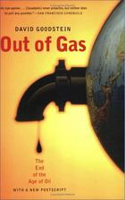
```

```{r The-Skeptical-Environmentalist, fig.width=100, fig.cap="Bjørn Lomborg’s *The Skeptical Environmentalist* (2001)."}
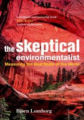
```

```{r James-Lovelock, fig.width=100, fig.cap="*The Revenge of Gaia: Why the earth is fighting back – and how we can still save humanity.* James Lovelock (2006). © Allen Lane."}
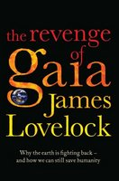
```

This heated debate is fundamentally about numbers. How much energy could each
source deliver, at what economic and social cost, and with what risks? But
actual numbers are rarely mentioned. In public debates,people just say “Nuclear
is a money pit” or “We have a *huge* amount of wave and wind.” The trouble with
this sort of language is that it’s not sufficient to know that something is
huge: we need to know how the one “huge” compares with another “huge,” namely
*our huge energy consumption*. To make this comparison, we need numbers, not
adjectives.

Where numbers are used, their meaning is often obfuscated by enormousness.
Numbers are chosen to impress, to score points in arguments,rather than to
inform. “Los Angeles residents drive 142 million miles – the distance from
Earth to Mars – every single day.” “Each year, 27 million acres of tropical
rainforest are destroyed.” “14 billion pounds of trash are dumped into the sea
every year.” “British people throw away 2.6 billion slices of bread per year.”
“The waste paper buried each year in the UK could fill 103448 double-decker
buses.”

If all the ineffective ideas for solving the energy crisis were laid end to
end, they would reach to the moon and back... I digress.

The result of this lack of meaningful numbers and facts? We are inundated with
a flood of crazy innumerate codswallop. The BBC doles out advice on how we can
do our bit to save the planet – for example “switch off your mobile phone
charger when it’s not in use;” if anyone objects that mobile phone chargers are
not *actually* our number one form of energy consumption, the mantra “every
little helps”^[For the benefit of readers who speak American, rather than
English, the translation of “every little helps” into American is “every little
bit helps.”] is wheeled out.  Every little helps? A more realistic mantra is:

> if everyone does a little, we’ll achieve only a little.

Companies also contribute to the daily codswallop as they tell us how wonderful
they are, or how they can help us “do our bit.” BP’s website, for example,
celebrates the reductions in carbon dioxide (CO~2~) pollution they hope to
achieve by changing the paint used for painting BP’s ships. Does anyone fall
for this? Surely everyone will guess that it’s not the exterior paint job, it’s
the stuff *inside* the tanker that deserves attention, if society’s CO~2~
emissions are to be significantly cut? BP also created a web-based carbon
absolution service, “targetneutral.com,” which claims that they can“neutralize”
all your carbon emissions, and that it “doesn’t cost the earth”– indeed, that
your CO~2~ pollution can be cleaned up for just £40 per year. How can this add
up? – if the true cost of fixing climate change were £40per person then the
government could fix it with the loose change in the Chancellor’s pocket!

Even more reprehensible are companies that exploit the current
concern for the environment by offering “water-powered batteries,”
“biodegradable mobile phones,” “portable arm-mounted wind-turbines,” and
other pointless tat.

Campaigners also mislead. People who want to promote renewables over nuclear,
for example, say “offshore wind power could power all UK homes;” then they say
“new nuclear power stations will do little to tackle climate change” because 10
new nuclear stations would “reduce emissions only by about 4%.” This argument
is misleading because the playing field is switched half-way through, from the
“number of homes powered” to “reduction of emissions.” The truth is that the
amount of electrical power generated by the wonderful windmills that “could
power all UK homes” is *exactly the same* as the amount that would be generated
by the 10 nuclear power stations! “Powering all UK homes” accounts for just 4%
of UK emissions.

Perhaps the worst offenders in the kingdom of codswallop are the people who
really should know better – the media publishers who promote the codswallop –
for example, New Scientist with their article about the “water-powered
car.”^[See this chapter’s notes (p19) for the awful details. (Every chapter has
endnotes giving references, sources, and details of arguments.]

In a climate where people don’t understand the numbers, newspapers,
campaigners, companies, and politicians can get away with murder.

We need simple numbers, and we need the numbers to be comprehensible,
comparable, and memorable.

With numbers in place, we will be better placed to answer questions such
as these:

1.  Can a country like Britain conceivably live on its own renewable energy
    sources?
2.  If everyone turns their thermostats one degree closer to the outside
    temperature, drives a smaller car, and switches off phone chargers when not
    in use, will an energy crisis be averted?
3.  Should the tax on transportation fuels be significantly increased? Should
    speed-limits on roads be halved?
4.  Is someone who advocates windmills over nuclear power stations “an enemy of
    the people”?
5.  If climate change is “a greater threat than terrorism,” should governments
    criminalize “the glorification of travel” and pass laws against “advocating
    acts of consumption”?
6.  Will a switch to “advanced technologies” allow us to eliminate carbon
    dioxide pollution without changing our lifestyle?
7.  Should people be encouraged to eat more vegetarian food?
8.  Is the population of the earth six times too big?

```{r Greenpeace-leaflet, fig.cap="This Greenpeace leaflet arrived with my junk mail in May 2006. Do beloved windmills have the capacity to displace hated cooling towers?"}
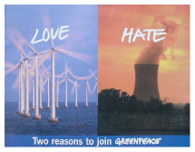
```

Why are we discussing energy policy?
------------------------------------

Three different motivations drive today’s energy discussions.

First, fossil fuels are a finite resource. It seems possible that cheap oil (on
which our cars and lorries run) and cheap gas (with which we heat many of our
buildings) will run out in our lifetime. So we seek alternative energy sources.
Indeed given that fossil fuels are a valuable resource, useful for manufacture
of plastics and all sorts of other creative stuff, perhaps we should save them
for better uses than simply setting fire to them.

Second, we’re interested in security of energy supply. Even if fossil fuels are
still available somewhere in the world, perhaps we don’t want to depend on them
if that would make our economy vulnerable to the whims of untrustworthy
foreigners. (I hope you can hear my tongue in my cheek.) Going by figure 1.2,
it certainly looks as if “our” fossil fuels have peaked. The UK has a
particular security-of-supply problem looming, known as the “energy gap.” A
substantial number of old coal power stations and nuclear power stations will
be closing down during the next decade (images/figure 1.3), so there is a risk that
electricity demand will sometimes exceed electricity supply, if adequate plans
are not implemented.

Third, it’s very probable that using fossil fuels changes the climate.Climate
change is blamed on several human activities, but the biggest contributor to
climate change is the increase in greenhouse effect produced by carbon dioxide
(CO~2~). Most of the carbon dioxide emissions come from fossil-fuel burning.
And the main reason we burn fossil fuels is for energy.So to fix climate
change, we need to sort out a new way of getting energy.The climate problem is
mostly an energy problem.

Whichever of these three concerns motivates you, we need energy numbers, and
policies that add up.

The first two concerns are straightforward selfish motivations for drastically
reducing fossil fuel use. The third concern, climate change, is a more
altruistic motivation – the brunt of climate change will be borne not by us but
by future generations over many hundreds of years. Some people feel that
climate change is not their responsibility.  They say things like “What’s the
point in my doing anything? China’s out of control!” So I’m going to discuss
climate change a bit more now, because while writing this book I learned some
interesting facts that shed light on these ethical questions. If you have no
interest in climate change, feel free to fast-forward to the next section on
page 16.

The climate-change motivation
-----------------------------

The climate-change motivation is argued in three steps: one: human fossil-fuel
burning causes carbon dioxide concentrations to rise; two: carbon dioxide is a
greenhouse gas; three: increasing the greenhouse effect in-creases average
global temperatures (and has many other effects).

```{r North-Sea-Oil-production, fig.cap='Are “our” fossil fuels running out? Total crude oil production from the North Sea, and oil price in 2006 dollars per barrel.'}
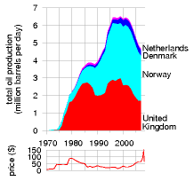
```

```{r UK-energy-gap, fig.cap='The energy gap created by UK power station closures, as projected by energy company EdF. This graph shows the predicted capacity of nuclear, coal, and oil power stations, in kilowatt-hours per day per person. The capacity is the maximum deliverable power of a source.'}
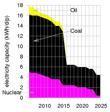
```

```{r CO2-concentrations, fig.cap='Carbon dioxide (CO~2~) concentrations (in parts per million) for the last 1100 years, measured from air trapped in ice cores (up to 1977) and directly in Hawaii (from 1958 onwards).'}
knitr::include_graphics('images/figure6.png')
```

We start with the fact that carbon dioxide concentrations are rising. Figure
1.4 shows measurements of the CO~2~ concentration in the air from the year
1000AD to the present. Some “sceptics” have asserted that the re-cent increase
in CO~2~ concentration is a natural phenomenon. Does “sceptic” mean “a person
who has not even glanced at the data”? Don’t you think, just possibly,
*something* may have happened between 1800AD and 2000AD? Something that was not
part of the natural processes present in the preceding thousand years?

Something did happen, and it was called the Industrial Revolution. I’ve marked
on the graph the year 1769, in which James Watt patented his steam engine.
While the first practical steam engine was invented in 1698, Watt’s more
efficient steam engine really got the Industrial Revolution going. One of the
steam engine’s main applications was the pumping of water out of coal mines.
Figure 1.5 shows what happened to British coal production from 1769 onwards.
The figure displays coal production in units of billions of tons of CO~2~
released when the coal was burned.In 1800, coal was used to make iron, to make
ships, to heat buildings,to power locomotives and other machinery, and of
course to power the pumps that enabled still more coal to be scraped up from
inside the hills of England and Wales. Britain was terribly well endowed with
coal: when the Revolution started, the amount of carbon sitting in coal under
Britain was roughly the same as the amount sitting in oil under Saudi Arabia.

In the 30 years from 1769 to 1800, Britain’s annual coal production doubled.
After another 30 years (1830), it had doubled again.  The next doubling of
production-rate happened within *20* years (1850), and another doubling within
20 years of that (1870). This coal allowed Britain to turn the globe pink. The
prosperity that came to England and Wales was reflected in a century of
unprecedented population growth:

I think something new may have happened between 1800 AD and 2000 AD. I’ve
marked the year 1769,in which James Watt patented his steam engine. (The first
practical steam engine was invented 70 years earlier in 1698, but Watt’s was
much more efficient.)

```{r UK-Coal, fig.cap='The history of UK coal production and world coal production from 1600 to 1910. Production rates are shown in billions of tons of CO~2~ – an incomprehensible unit, yes, but don’t worry: we’ll personalize it shortly.'}
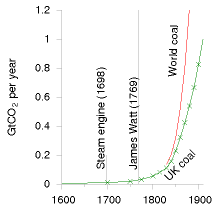
```

```{r Ppoulation-of-England}
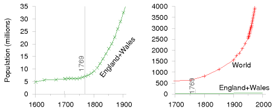
```

Eventually other countries got in on the act too as the Revolution spread.
Figure \@ref(fig:UK-and-world-coal-production) shows British coal production and world coal production on the same scale as figure 1.5, sliding the window of history 50 years later.  British
coal production peaked in 1910, but meanwhile world coal production continued
to double every 20 years. It’s difficult to show the history of coal production
on a single graph. To show what happened in the *next* 50 years on the same
scale, the book would need to be one metre tall! To cope with this difficulty,
we can either scale down the vertical axis:

```{r population-world}
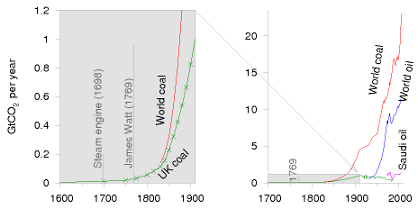
```

or we can squish the vertical axis in a non-uniform way, so that small
quantities and large quantities can be seen at the same time on a single graph.
A good way to squish the axis is called a logarithmic scale, and that’s what
I’ve used in the bottom two graphs of figure 1.7 (p9). On a logarithmic scale,
all ten-fold increases (from 1 to 10, from 10 to 100, from 100 to 1000)are
represented by equal distances on the page. On a logarithmic scale, a quantity
that grows at a constant percentage per year (which is called “exponential
growth”) looks like a straight line. Logarithmic graphs are great for
understanding growth. Whereas the ordinary graphs in the figures on pages 6 and
7 convey the messages that British and world coal production grew remarkably,
and that British and world population grew remarkably,the relative growth rates
are not evident in these ordinary graphs. The logarithmic graphs allow us to
compare growth rates.  Looking at the slopes of the population curves, for
example, we can see that the world population’s growth rate in the last 50
years was a little bigger than the growth rate of England and Wales in 1800.

```{r UK-and-world-coal-production, fig.cap='What happened next. The history of UK coal production and world coal production from 1650 to 1960, on the same scale as figure 1.5.'}
knitr::include_graphics('images/figure16.png')
```

From 1769 to 2006, world annual coal production increased 800-fold. Coal
production is still increasing today. Other fossil fuels are being extracted
too – the middle graph of figure 1.7 shows oil production for example – but in
terms of CO~2~ emissions, coal is still king.

The burning of fossil fuels is the principal reason why CO~2~ concentrations
have gone up. This is a fact, but, hang on: I hear a persistent buzzing noise
coming from a bunch of climate-change inactivists. What are they saying? Here’s
Dominic Lawson, a columnist from the *Independent*:

> “The burning of fossil fuels sends about seven gigatons of CO~2~per year into
> the atmosphere, which sounds like a lot. Yet the biosphere and the oceans
> send about 1900 gigatons and 36000 gigatons of CO~2~ per year into the
> atmosphere – ... one reason why some of us are sceptical about the emphasis
> put on the role of human fuel-burning in the greenhouse gas effect. Reducing
> man-made CO 2 emissions is megalomania, exaggerating man’s significance.
> Politicians can’t change the weather.”

Now I have a lot of time for scepticism, and not everything that sceptics say
is a crock of manure – but irresponsible journalism like Dominic Lawson’s
deserves a good flushing.

The first problem with Lawson’s offering is that *all three numbers* that he
mentions (seven, 1900, and 36000) are *wrong!* The correct numbers are 26, 440,
and 330. Leaving these errors to one side, let’s address Lawson’s main point,
the relative smallness of man-made emissions.

Yes, natural flows of CO~2~ *are* larger than the additional flow we switched
on 200 years ago when we started burning fossil fuels in earnest. But it is
terribly misleading to quantify only the large natural flows *into* the
atmosphere, failing to mention the almost exactly equal flows *out* of the
atmosphere back into the biosphere and the oceans. The point is that
these*natural* flows in and out of the atmosphere have been almost exactly in
balance for millennia. So it’s not relevant at all that these natural flows are
larger than human emissions. The natural flows *cancelled themselves out*.So
the natural flows, large though they were, left the concentration of CO~2~in
the atmosphere and ocean *constant*, over the last few thousand years.Burning
fossil fuels, in contrast, creates a *new* flow of carbon that, though small,
is *not cancelled*.  Here’s a simple analogy, set in the passport-control
arrivals area of an airport. One thousand passengers arrive per hour, and there
are exactly enough clockwork officials to process one thousand passengers per
hour. There’s a modest queue, but because of the match of arrival rate to
service rate, the queue isn’t getting any longer. Now imagine that owing to fog
an extra stream of flights is diverted here from a smaller airport. This stream
adds an extra 50 passengers per hour to the arrivals lobby – a small addition
compared to the original arrival rate of one thousand per hour. Initially at
least, the authorities don’t increase the number of officials, and the
officials carry on processing just one thousand passengers per hour. So what
happens? Slowly but surely, *the queue grows*.Burning fossil fuels is
undeniably increasing the CO~2~ concentration in the atmosphere and in the
surface oceans. No climate scientist disputes this fact. When it comes to CO~2~
concentrations, man *is* significant.

```{r CO2-concentrations-industrial-revolution, fig.cap='The upper graph shows carbon dioxide CO~2~ concentrations(in parts per million) for the last 1100 years – the same data that was shown in figure 1.4.'}
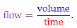
```

Here’s a portrait of James Watt and his 1769 steam engine.


The middle graph shows (on a logarithmic scale) the history of UK coal
production, Saudi oil production,world coal production, world oil production,
and (by the top right point) the total of all greenhouse gas emissions in the
year 2000. All production rates are expressed in units of the associated CO~2~
emissions.

The bottom graph shows (on a logarithmic scale) some consequences of the
Industrial Revolution: sharp increases in the population of England, and, in
due course, the world; and remarkable growth in British pig-iron production (in
thousand tons per year); and growth In the tonnage of British ships (in
thousand tons).

In contrast to the ordinary graphs on the previous pages, the logarithmic scale
allows us to show both the population of England and the population of the
World on a single diagram, and to see interesting features in both.

OK. Fossil fuel burning increases CO~2~ concentrations significantly.  But does
it matter? “Carbon is nature!”, the oil spinners remind us, “Carbon is life!”
If CO~2~ had no harmful effects, then indeed carbon emissions would not matter.
However, carbon dioxide is a greenhouse gas.  Not the strongest greenhouse gas,
but a significant one nonetheless. Put more of it in the atmosphere, and it
does what greenhouse gases do: it absorbs infrared radiation (heat) heading out
from the earth and re-emits it in a random direction; the effect of this random
redirection of the atmospheric heat traffic is to impede the flow of heat from
the planet, just like a quilt. So carbon dioxide has a warming effect. This
fact is based not on complex historical records of global temperatures but on
the simple physical properties of CO~2~ molecules. Greenhouse gases are a
quilt, and CO~2~ is one layer of the quilt.

So, if humanity succeeds in doubling or tripling CO~2~ concentrations(which is
where we are certainly heading, under business as usual), what happens? Here,
there is a lot of uncertainty. Climate science is difficult.The climate is a
complex, twitchy beast, and exactly how much warming CO~2~ -doubling would
produce is uncertain. The consensus of the best climate models seems to be that
doubling the CO~2~ concentration would have roughly the same effect as
increasing the intensity of the sun by 2%, and would bump up the global mean
temperature by something like 3°C. This would be what historians call a Bad
Thing. I won’t recite the whole litany of probable drastic effects, as I am
sure you’ve heard it before. The litany begins “the Greenland icecap would
gradually melt, and, over a period of a few 100 years, sea-level would rise by
about 7 metres.” The brunt of the litany falls on future generations. Such
temperatures have not been seen on earth for at least 100000 years, and it’s
conceivable that the ecosystem would be so significantly altered that the earth
would stop supplying some of the goods and services that we currently take for
granted.

Climate modelling is difficult and is dogged by uncertainties. But uncertainty
about exactly how the climate will respond to extra greenhouse gases is no
justification for inaction. If you were riding a fast-moving motorcycle in fog
near a cliff-edge, and you didn’t have a good map of the cliff, would the lack
of a map justify *not* slowing the bike down?

So, who should slow the bike down? Who should clean up carbon emissions?  Who
is responsible for climate change? This is an ethical question, of course, not
a scientific one, but ethical discussions must be founded on facts. Let’s now
explore the facts about greenhouse gas emissions.  First,a word about the units
in which they are measured. Greenhouse gases include carbon dioxide, methane,
and nitrous oxide; each gas has different physical properties; it’s
conventional to express all gas emissions in “equivalent amounts of carbon
dioxide,” where “equivalent” means“having the same warming effect over a period
of 100 years.” One ton of carbon-dioxide-equivalent may be abbreviated as “1 t
CO~2~e,” and one billion tons (one thousand million tons) as “1 Gt CO~2~e” (one
gigaton). In this book 1 t means one metric ton (1000 kg). I’m not going to
distinguish imperial tons, because they differ by less than 10% from the metric
ton or tonne.

In the year 2000, the world’s greenhouse gas emissions were about 34 billion
tons of CO~2~-equivalent per year. An incomprehensible number.But we can render
it more comprehensible and more personal by dividing by the number of people on
the planet, 6 billion, so as to obtain the greenhouse-gas pollution *per
person*, which is about 5½ tons CO~2~e per year per person. We can thus
represent the world emissions by a rectangle whose width is the population (6
billion) and whose height is the per-capita emissions.

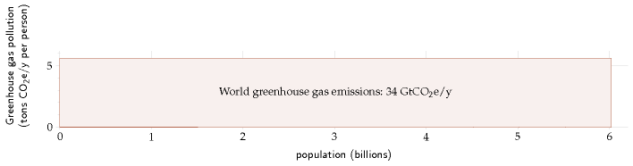

Now, all people are created equal, but we don’t all emit 5½ tons of CO~2~per
year. We can break down the emissions of the year 2000, showing how the
34-billion-ton rectangle is shared between the regions of the world:

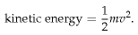

This picture, which is on the same scale as the previous one, divides the world
into eight regions. Each rectangle’s area represents the greenhouse gas
emissions of one region. The width of the rectangle is the population of the
region, and the height is the average per-capita emissions in that region.

In the year 2000, Europe’s per-capita greenhouse gas emissions were twice the
world average; and North America’s were four times the world average.

We can continue subdividing, splitting each of the regions into countries. This
is where it gets really interesting:

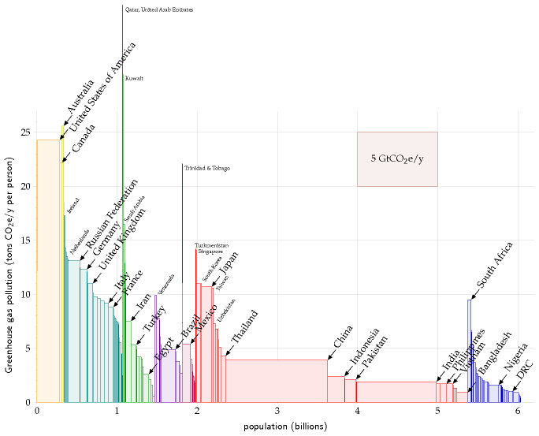

The major countries with the biggest per-capita emissions are Australia,the
USA, and Canada. European countries, Japan, and South Africa are notable
runners up. Among European countries, the United Kingdom is resolutely average.
What about China, that naughty “out of control”country? Yes, the area of
China’s rectangle is about the same as the USA’s,but the fact is that their
per-capita emissions are *below* the world average.India’s per-capita emissions
are less than *half* the world average. Moreover,it’s worth bearing in mind
that much of the industrial emissions of China and India are associated with
the manufacture of *stuff for rich countries.*

So, assuming that “something needs to be done” to reduce greenhouse gas
emissions, who has a special responsibility to do something? As I said, that’s
an ethical question. But I find it hard to imagine any system of ethics that
denies that the responsibility falls especially on the countries to the left
hand side of this diagram – the countries whose emissions are two, three, or
four times the world average. Countries that are most able to pay.  Countries
like Britain and the USA, for example.

### Historical responsibility for climate impact

If we assume that the climate has been damaged by human activity, and that
someone needs to fix it, who should pay? Some people say “the polluter should
pay.” The preceding pictures showed who’s doing the polluting today. But it
isn’t the *rate* of CO~2~ pollution that matters, it’s the cumulative *total*
emissions; much of the emitted carbon dioxide (about one third of it) will hang
around in the atmosphere for at least 50 or 100 years. If we accept the ethical
idea that “the polluter should pay” then we should ask how big is each
country’s historical footprint. The next picture shows each country’s
cumulative emissions of CO~2~, expressed as an average emission rate over the
period 1880–2004.


Congratulations, Britain! The UK has made it onto the winners’ podium. We may
be only an average European country today, but in the table of historical
emitters, per capita, we are second only to the USA.

OK, that’s enough ethics. What do scientists reckon needs to be done,to avoid a
risk of giving the earth a 2°C temperature rise (2°C being the rise above which
they predict lots of bad consequences)? The consensus is clear. We need to get
off our fossil fuel habit, and we need to do so fast. Some countries, including
Britain, have committed to at least a 60% reduction in greenhouse-gas emissions
by 2050, but it must be emphasized that 60% cuts, radical though they are, are
unlikely to cut the mustard. If the world’s emissions were gradually reduced by
60% by 2050, climate scientists reckon it’s more likely than not that global
temperatures will rise by more than 2°C. The sort of cuts we need to aim for
are shown in figure 1.8. This figure shows two possibly-safe emissions
scenarios presented by Baer and Mastrandrea (2006) in a report from the
Institute for Public Policy Research. The lower curve assumes that a decline in
emissions started in 2007, with total global emissions falling at roughly 5%
per year.The upper curve assumes a brief delay in the start of the decline, and
a 4%drop per year in global emissions. Both scenarios are believed to offer a
modest chance of avoiding a 2°C temperature rise above the pre-industrial
level. In the lower scenario, the chance that the temperature rise will
*exceed* 2°C is estimated to be 9–26%. In the upper scenario, the chance of
exceeding 2°C is estimated to be 16–43%. These possibly-safe emissions
trajectories, by the way, involve significantly sharper reductions in emissions
than any of the scenarios presented by the Intergovernmental Panelon Climate
Change (IPCC), or by the Stern Review (2007).

These possibly-safe trajectories require global emissions to fall by 70% or 85%
by 2050. What would this mean for a country like Britain? If we subscribe to
the idea of “contraction and convergence,” which means that all countries aim
eventually to have equal per-capita emissions, then Britain needs to aim for
cuts greater than 85%: it should get down from its current 11 tons of CO~2~e
per year per person to roughly 1 ton per year per person by 2050. This is such
a deep cut, I suggest the best way to think about it is *no more fossil fuels.*

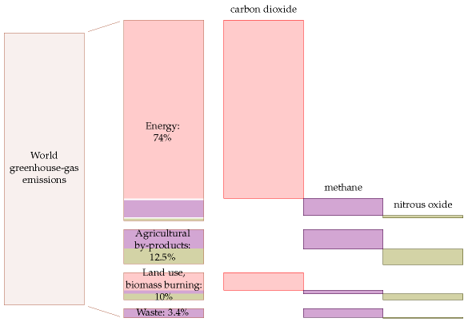

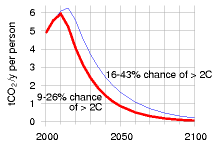

Figure 1.8. Global emissions for two scenarios considered by Baer and
Mastrandrea, expressed in tons of CO~2~ per year per person, using a world
population of six billion. Both scenarios are believed to offer a modest chance
of avoiding a 2°C temperature rise above the pre-industrial level.

Figure 1.9. Breakdown of world greenhouse-gas emissions (2000) by cause and by
gas. “Energy” includes power stations, industrial processes,transport, fossil
fuel processing, and energy-use in buildings.  “Land use,biomass burning” means
changes inland use, deforestation, and the burning of un-renewed biomass such
as peat. “Waste” includes waste disposal and treatment. The sizes indicate the
100-year global warming potential of each source. Source:Emission Database for
Global Atmospheric Research.

One last thing about the climate-change motivation: while a range of human
activities cause greenhouse-gas emissions, the biggest cause by far is **energy
use**. Some people justify not doing anything about their energy use by excuses
such as “methane from burping cows causes more warming than jet travel.” Yes,
agricultural by-products contributed one eighth of greenhouse-gas emissions in
the year 2000. But energy-use contributed three quarters (images/figure 1.9). The
climate change problem is principally an energy problem.

Warnings to the reader
----------------------

OK, enough about climate change. I’m going to assume we are motivated to get
off fossil fuels. Whatever your motivation, the aim of this book is to help you
figure out the numbers and do the arithmetic so that you can evaluate policies;
and to lay a factual foundation so that you can see *which proposals add up*.
I’m not claiming that the arithmetic and numbers in this book are new; the
books I’ve mentioned by Goodstein, Lomborg, and Lovelock, for example, are full
of interesting numbers and back-of-envelope calculations, and there are many
other helpful sources on the internet too (see the notes at the end of each
chapter).

What I’m aiming to do in this book is to make these numbers simple and
memorable; to show you how you can figure out the numbers for yourself; and to
make the situation so clear that any thinking reader will be able to draw
striking conclusions. I don’t want to feed you my own conclusions. Convictions
are stronger if they are self-generated, rather than taught. Understanding is a
creative process. When you’ve read this book I hope you’ll have reinforced the
confidence that you can figure anything out.

I’d like to emphasize that the calculations we will do are deliberately
imprecise. Simplification is a key to understanding. First, by rounding the
numbers, we can make them easier to remember. Second, rounded numbers allow
quick calculations. For example, in this book, the population of the United
Kingdom is 60 million, and the population of the world is 6 billion. I’m
perfectly capable of looking up more accurate figures, but accuracy would get
in the way of fluent thought. For example, if we learn that the world’s
greenhouse gas emissions in 2000 were 34 billion tons of CO~2~-equivalent per
year, then we can instantly note, without a calculator,that the average
emissions per person are 5 or 6 tons of CO~2~-equivalent per person per year.
This rough answer is not exact, but it’s accurate enough to inform interesting
conversations. For instance, if you learn that a round-trip intercontinental
flight emits nearly two tons of CO~2~ per passenger,then knowing the average
emissions yardstick (5-and-a-bit tons per year per person) helps you realize
that just one such plane-trip per year corresponds to over a third of the
average person’s carbon emissions.


*“Look – it’s Low Carbon EmissionMan”*

Figure 1.10. Reproduced by kindpermission of PRIVATE EYE / PeterDredge
www.private-eye.co.uk.


I like to base my calculations on everyday knowledge rather than on trawling
through impersonal national statistics. For example, if I want to estimate the
typical wind speeds in Cambridge, I ask “is my cycling speed usually faster
than the wind?” The answer is yes. So I can deduce that the wind speed in
Cambridge is only rarely faster than my typical cycling speed of 20km/h. I back
up these everyday estimates with other peoples’ calculations and with official
statistics. (Please look for these in each chapter’s end-notes.) This book
isn’t intended to be a definitive store of super-accurate numbers. Rather, it’s
intended to illustrate how to use approximate numbers as a part of constructive
consensual conversations.

In the calculations, I’ll mainly use the United Kingdom and occasion-ally
Europe, America, or the whole world, but you should find it easy to redo the
calculations for whatever country or region you are interested in.

Let me close this chapter with a few more warnings to the reader. Not only will
we make a habit of approximating the numbers we calculate; we’ll also neglect
all sorts of details that investors, managers, and economists have to attend
to, poor folks. If you’re trying to launch a renewable technology, just a 5%
increase in costs may make all the difference between success and failure, so
in business every detail must be tracked.But 5% is too small for this book’s
radar. This is a book about factors of 2 and factors of 10. It’s about physical
limits to sustainable energy, not current economic feasibility. While economics
is always changing, the fundamental limits won’t ever go away. We need to
understand these limits.

Debates about energy policy are often confusing and emotional because people
mix together *factual* assertions and *ethical* assertions.

Examples of **factual assertions** are “global fossil-fuel burning emits
34billion tons of carbon dioxide equivalent per year;” and “if CO~2~
concentrations are doubled then average temperatures will increase by 1.5–5.8°C
in the next 100 years;” and “a temperature rise of 2°C would cause the
Greenland ice cap to melt within 500 years;” and “the complete melting of the
Greenland ice cap would cause a 7-metre sea-level rise.”

A factual assertion is either true or false; figuring out *which* may be
difficult; it is a scientific question. For example, the assertions I just gave
are either true or false. But we don’t know whether they are all true. Some of
them are currently judged “very likely.” The difficulty of deciding which
factual assertions are true leads to debates in the scientific community. But
given sufficient scientific experiment and discussion, the truth or falsity of
most factual assertions can eventually be resolved, at least “beyond reasonable
doubt.”

Examples of **ethical assertions** are “it’s wrong to exploit global re-sources
in a way that imposes significant costs on future generations;” and“polluting
should not be free;” and “we should take steps to ensure that it’s unlikely
that CO~2~ concentrations will double;” and “politicians should agree a cap on
CO~2~ emissions;” and “countries with the biggest CO~2~ emissions over the last
century have a duty to lead action on climate change;” and “it is fair to share
CO~2~ emission rights equally across the world’s population.” Such assertions
are not “either true or false.” Whether we agree with them depends on our
ethical judgment, on our values. Ethical assertions may be incompatible with
each other; for example, Tony Blair’s government declared a radical policy on
CO~2~ emissions: “the United Kingdom should reduce its CO~2~ emissions by 60%
by 2050;” at the same time Gordon Brown, while Chancellor in that government,
repeatedly urged oil-producing countries to *increase* oil production.

This book is emphatically intended to be about facts, not ethics. I want the
facts to be clear, so that people can have a meaningful debate about ethical
decisions. I want everyone to understand how the facts constrain the options
that are open to us. Like a good scientist, I’ll try to keep my views on
ethical questions out of the way, though occasionally I’ll blurt something out
– please forgive me.

Whether it’s *fair* for Europe and North America to hog the energy cake is an
ethical question; I’m here to remind you of the *fact* that we can’t have our
cake and eat it too; to help you weed out the pointless and ineffective policy
proposals; and to help you identify energy policies that are compatible with
your personal values.

We need a plan that adds up!

Notes and further reading
-------------------------

At the end of each chapter I note details of ideas in that chapter, sources of
data and quotes, and pointers to further information.

2*“...no other possible way of doing that except through renewables”; “anybody
who is relying upon renewables to fillthe [energy] gap is living in an utter
dream world and is, in my view, an enemy of the people.”* The quotes are from
*Any Questions?*, 27 January 2006, BBC Radio 4 [ydoobr]. *Michael Meacher* was
UK environment minister from 1997 till 2003. *Sir Bernard Ingham* was an aide
to Margaret Thatcher when she was prime minister, and was Head of the
Government Information Service. He is secretary of Supporters of Nuclear
Energy.

–*Jonathon Porritt* (March 2006). *Is nuclear the answer?* Section 3.
Advice to Ministers. www.sd-commission.org.uk

3*“Nuclear is a money pit”, “We have a huge amount of wave and wind.”*
Ann Leslie, journalist. Speaking on *Any Questions?*, Radio 4, 10
February 2006.

–*Los Angeles residents drive ... from Earth to Mars* – (The Earthworks
Group, 1989, page 34).

–*targetneutral.com* charges just £4 per ton of CO~2~ for their
“neutralization.” (A significantly lower price than any other “offsetting”
company I have come across.) At this price, a typical Brit could have his 11
tons per year “neutralized” for just £44 per year! Evidence that BP’s
“neutralization” schemes don’t really add up comes from the fact that its
projects have not achieved the Gold Standard www.cdmgoldstandard.org (Michael
Schlup, personal communication).Many “carbon offset” projects have been exposed
as worthless by Fiona Harvey of the Financial Times [2jhve6].

4*People who want to promote renewables over nuclear, for example, say
“offshore wind power could power all UK homes.”* At the end of 2007, the UK
government announced that they would allow the building of offshore wind
turbines “enough to power all UK homes.” Friends of the Earth’s renewable
energy campaigner, Nick Rau, said the group welcomed the government’s
announcement. “The potential power that could be generated by this industry is
enormous,” he said. [25e59w]. From the Guardian [5o7mxk]: John Sauven, the
executive director of Greenpeace, said that the plans amounted to a “wind
energy revolution.” “And Labour needs to drop its obsession with nuclear
power,which could only ever reduce emissions by about 4% at some time in the
distant future.” Nick Rau said: “We are delighted the government is getting
serious about the potential for offshore wind, which could generate 25% of the
UK’s electricity by 2020.” A few weeks later, the government announced that it
would permit new nuclear stations to be built. “Today’s decision to give the
go-ahead to a new generation of nuclear power stations ... will do little to
tackle climate change,” Friends of the Earth warned [5c4olc].In fact, the two
proposed expansions – of offshore wind and of nuclear – would both deliver just
the same amount of electricity per year. The total permitted offshore wind
power of 33 GW would on average deliver 10 GW, which is 4 kWh per day per
person; and the replacement of all the retiring nuclear power stations would
deliver 10 GW, which is 4 kWh per day per person. Yet in the same breath,
anti-nuclear campaigners say that the nuclear option would “do little,” while
the wind option would “power all UK homes.” The fact is, “powering all UK
homes” and “only reducing emissions by about 4%” are the same thing.


*“Okay – it’s agreed; we announce– ‘to do nothing is not an option!’ then we
wait and see how things pan out...”*

Figure 1.11. Reproduced by kind permission of PRIVATE EYE / Paul Lowe
www.private-eye.co.uk.


4*“water-powered car”* *New Scientist*, 29th July 2006, p.35. This article,
headlined “Water-powered car might be available by 2009,” opened thus:“Forget
cars fuelled by alcohol and vegetable oil. Before long, you might be able to
run your car with nothing more than water in its fuel tank. It would be the
ultimate zero-emissions vehicle.“While water is not at first sight an obvious
power source, it has a key virtue: it is an abundant source of hydrogen,the
element widely touted as the green fuel of the future.”The work *New Scientist*
was describing was not ridiculous – it was actually about a car using *boron*
as a fuel, with a boron/water reaction as one of the first chemical steps. Why
did *New Scientist* feel the urge to turn this into a story suggesting that
water was the fuel? Water is not a fuel. It never has been, and it never will
be. It is already burned! The first law of thermodynamics says you can’t get
energy for nothing; you can only convert energy from one form to another. The
energy in any engine must come from somewhere. Fox News peddled an even more
absurd story[2fztd3].

–*Climate change is a far greater threat to the world than international
terrorism.* Sir David King, Chief Scientific Advisor to the UK government,
January, 2004. [26e8z]

–*the glorification of travel* – an allusion to the offence of
“glorification” defined in the UK’s Terrorism Act which came into force on
13 April, 2006. [ykhayj]

5*Figure 1.2.* This figure shows production of crude oil including lease
condensate, natural gas plant liquids, and other liquids, and refinery
processing gain. Sources: EIA, and BP statistical review of world
energy.

6*The first practical steam engine was invented in 1698.* In fact, Hero of
Alexandria described a steam engine, but given that Hero’s engine didn’t catch
on in the following 1600 years, I deem Savery’s 1698 invention the first
*practical* steam engine.

–*Figures 1.4 and 1.7: Graph of carbon dioxide concentration.* The data are
collated from Keeling and Whorf (2005)(measurements spanning 1958–2004); Neftel
et al. (1994) (1734–1983); Etheridge et al. (1998) (1000–1978); Siegenthaleret
al. (2005) (950–1888 AD); and Indermuhle et al. (1999) (from 11000 to 450 years
before present). This graph, by the way, should not be confused with the
“hockey stick graph”, which shows the history of global *temperatures* .
Attentive readers will have noticed that the climate-change argument I
presented makes no mention of *historical* temperatures.*Figures 1.5–1.7: Coal
production* numbers are from Jevons (1866), Malanima (2006), Netherlands
Environmental Assessment Agency (2006), National Bureau of Economic Research
(2001), Hatcher (1993), Flinn and Stoker (1984), Churchet al. (1986), Supple
(1987), Ashworth and Pegg (1986). Jevons was the first “Peak Oil” author.  In
1865, he estimated Britain’s easily-accessible coal reserves, looked at the
history of exponential growth in consumption, and predicted the end of the
exponential growth and the end of the British dominance of world industry. “We
cannot long maintain our present rate of increase of consumption. ... the check
to our progress must become perceptible within a century from the present time.
... the conclusion is inevitable, that our present happy progressive condition
is a thing of limited duration.” Jevons was right. Within a century British
coal production indeed peaked, and there were two world wars.

8*Dominic Lawson, a columnist from the Independent*. My quote is adapted from
Dominic Lawson’s column in the *Independent*, 8 June, 2007.It is not a verbatim
quote: I edited his words to make them briefer but took care not to correct any
of his errors. *All three numbers he mentions are in-**correct*. Here’s how he
screwed up. First, he says “carbon dioxide” but gives numbers for carbon: the
burning of fossil fuels sends *26* gigatonnes of CO~2~per year into the
atmosphere (not 7 gigatonnes). A common mistake. Second, he claims that the
oceans send 36000 gigatonnes of carbon per year into the atmosphere. This is a
far worse error: 36000 gigatonnes is the *totalamount* of carbon in the ocean!
The annual *flow* is much smaller – about 90 gigatonnes of carbon per year (330
GtCO~2~/y), according to standard diagrams of the carbon cycle [l6y5g] (I
believe this 90 GtC/y is the estimated flowrate, were the atmosphere suddenly
to have its CO~2~ concentration reducedto zero.) Similarly his “1900 gigatonne”
flow from biosphere to atmosphere is wrong.  The correct figure according to
the standard diagrams is about 120 gigatonnes of carbon per year (440 Gt
CO~2~/y).

Incidentally, the observed rise in CO~2~ concentration is nicely in line with
what you’d expect, assuming most of the human emissions of carbon remained in
the atmosphere. From 1715 to 2004, roughly 1160 GtCO~2~ have been released to
the atmosphere from the consumption of fossil fuels and cement production
(Marland et al., 2007). If *all* of this CO~2~had stayed in the atmosphere, the
concentration would have risen by 160ppm (from 280 to 440 ppm). The actual rise
has been about 100ppm (from 275 to 377ppm). So roughly 60% of what was emitted
is now in the atmosphere.

10*Carbon dioxide has a warming effect*. The over-emotional debate about this
topic is getting quite tiresome, isn’t it? “The science is now settled.” “No it
isn’t!” “Yes it is!” I think the most helpful thing I can do here is direct
anyone who wants a break from the shouting to a brief report written by Charney
et al. (1979). This report’s conclusions carry weight because the National
Academy of Sciences (the US equivalent of the Royal Society) commissioned the
report and selected its authors on the basis of their expertise, “and with
regard for appropriate balance.” The study group was convened “under the
auspices of the Climate Research Board of the National Research Council to
assess the scientific basis for projection of possible future climatic changes
resulting from man-made releases of carbon dioxide into the atmosphere.”
Specifically, they were asked: “to identify the principal premises on which our
current understanding of the question is based, to assess quantitatively the
adequacy and uncertainty of our knowledge of these factors and processes, and
to summarize in concise and objective terms our best present understanding of
the carbon dioxide/climate issue for the benefit of policy-makers.”The report
is just 33 pages long, it is free to download [5qfkaw], and I recommend it. It
makes clear which bits of the science were already settled in 1979, and which
bits still had uncertainty. Here are the main points I picked up from this
report.  First, doubling the atmospheric CO~2~ concentration would change the
net heating of the troposphere, oceans, and land by an average power per unit
area of roughly 4 W/m^2^,if all other properties of the atmosphere remained
unchanged. This heating effect can be compared with the average power absorbed
by the atmosphere, land, and oceans, which is 238 W/m^2^. So doubling CO~2~
concentrations would have a warming effect equivalent to increasing the
intensity of the sun by 4/238 = 1.7%.  Second, the consequences of this
CO~2~-induced heating are hard to predict, on account of the complexity of the
atmosphere/ocean system, but the authors predicted a global surface warming of
between 2°C and 3.5°C, with greater increases at high latitudes. Finally, the
authors summarize: “we have tried but have been unable to find any overlooked
or underestimated physical effects that could reduce the currently estimated
global warmings due to a doubling of atmospheric CO~2~ to negligible
proportions or reverse them altogether.” They warn that, thanks to the ocean,
“the great and ponderous flywheel of the global climate system,” it is quite
possible that the warming would occur sufficiently sluggishly that it would be
difficult to detect in the coming decades. Nevertheless “warming will
eventually occur, and the associated regional climatic changes ...  may well be
significant.” The foreword by the chairman of the Climate Research Board,
Verner E. Suomi, summarizes the conclusions with a famous cascade of double
negatives.  “If carbon dioxide continues to increase, the study group finds no
reason to doubt that climate changes will result and no reason to believe that
these changes will be negligible.”

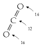

The weights of an atom of carbon and a molecule of CO~2~ are in the ratio 12 to
44, because the carbon atom weighs 12 units and the two oxygen atoms weigh 16
each. 12 + 16 + 16 = 44.

10*The litany of probable drastic effects of climate change – I’m sure you’ve
heard it before*. See [2z2xg7] if not.

12*Breakdown of world greenhouse gas emissions by region and by country*. Data
source: Climate Analysis Indicator stool (CAIT) Version 4.0. (Washington, DC:
World Resources Institute, 2007). The first three figures show national totals
of all six major greenhouse gases (CO~2~, CH~4~, N~2~O, PFC, HFC, SF~6~),
excluding contributions from land-use change and forestry. The figure on p14
shows cumulative emissions of CO~2~ only.

14*Congratulations, Britain! ...in the table of historical emissions, per
capita, we are second only to the USA.* Sincere apologies here to Luxembourg,
whose historical per-capita emissions actually exceed those of America and
Britain;but I felt the winners’ podium should really be reserved for countries
having both large per-capita and large total emissions. In total terms the
biggest historical emitters are, in order, USA (322 GtCO~2~), Russian
Federation (90 GtCO~2~),China (89 GtCO~2~), Germany (78 GtCO~2~), UK (62
GtCO~2~), Japan (43 GtCO~2~), France (30 GtCO~2~), India (25 GtCO~2~), and
Canada (24 GtCO~2~). The per-capita order is: Luxembourg, USA, United Kingdom,
Czech Republic, Belgium, Germany,Estonia, Qatar, and Canada.

–*Some countries, including Britain, have committed to at least a 60% reduction
in greenhouse-gas emissions by 2050*. Indeed, as I write, Britain’s commitment
is being increased to an 80% reduction relative to 1990 levels.

15*Figure 1.8*. In the lower scenario, the chance that the temperature rise
will exceed 2°C is estimated to be 9–26%; the cumulative carbon emissions from
2007 onwards are 309 GtC; CO~2~ concentrations reach a peak of 410ppm, CO~2~e
concentrations peak at 421ppm, and in 2100 CO~2~ concentrations fall back to
355ppm. In the upper scenario, the chance of exceeding 2°C is estimated to be
16–43%; the cumulative carbon emissions from 2007 onwards are 415 GtC;CO~2~
concentrations reach a peak of 425 ppm, CO~2~e concentrations peak at 435 ppm,
and in 2100 CO~2~ concentrations fall back to 380 ppm. See also
hdr.undp.org/en/reports/global/hdr2007-2008/.

16*there are many other helpful sources on the internet*. I recommend, for
example: BP’s *Statistical Review of World**Energy* [yyxq2m], the Sustainable
Development Commission www.sd-commission.org.uk, the Danish Wind Industry
Association www.windpower.org, Environmentalists For Nuclear Energy
www.ecolo.org, Wind Energy Department, Risø University www.risoe.dk/vea, DEFRA
www.defra.gov.uk/environment/statistics, especially the book *Avoid-**ing
Dangerous Climate Change* [dzcqq], the Pembina Institute
www.pembina.org/publications.asp, and the DTI (now known as BERR)
www.dti.gov.uk/publications/.

17*factual assertions and ethical assertions*... Ethical assertions are also
known as “normative claims” or “value judgments,” and factual assertions are
known as “positive claims.” Ethical assertions usually contain verbs like
“should”and “must,” or adjectives like “fair,” “right,” and “wrong.” For
helpful further reading see Dessler and Parson (2006).

18*Gordon Brown*. On 10th September, 2005, Gordon Brown said the high price of
fuel posed a significant risk to the European economy and to global growth, and
urged OPEC to raise oil production. Again, six months later, he said “we need
... more production, more drilling, more investment, more petrochemical
investment” (22nd April,2006) [y98ys5].  Let me temper this criticism of Gordon
Brown by praising one of his more recent initiatives, namely the promotion of
electric vehicles and plug-in hybrids. As you’ll see later, one of this book’s
conclusions is that electrification of most transport is a good part of a plan
for getting off fossil fuels.

