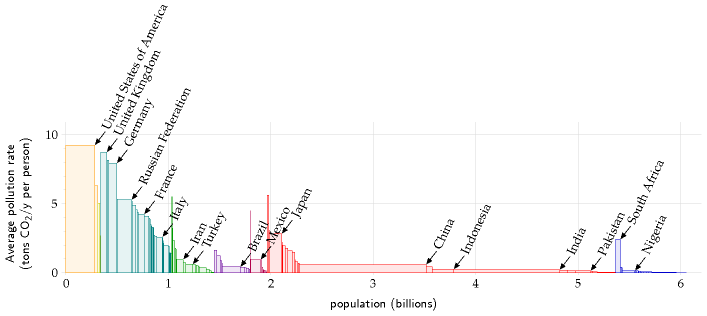
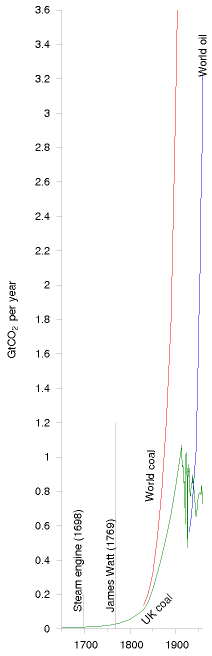
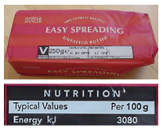
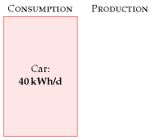
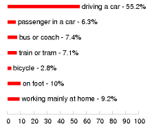
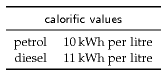

#Cars

For our first chapter on consumption, let’s study that icon of modern
civi-lization: the car with a lone person in it.

How much power does a regular car-user consume? Once we know
theconversion rates, it’s simple arithmetic:

For the **distance travelled per day**, let’s use 50 km (30 miles).

For the **distance per unit of fuel**, also known as the **economy** of
thecar, let’s use 33 miles per UK gallon (taken from an advertisement
for afamily car):

33 miles per imperial gallon ≈ 12 km per litre.

(The symbol ≈ means “is approximately equal to.”)

What about the **energy per unit of fuel** (also called the **calorific
value**or **energy density**)? Instead of looking it up, it’s fun to
estimate this sort ofquantity by a bit of lateral thinking. Automobile
fuels (whether diesel orpetrol) are all hydrocarbons; and hydrocarbons
can also be found on ourbreakfast table, with the calorific value
conveniently written on the side:roughly 8 kWh per kg (images/figure 3.2).
Since we’ve estimated the economy ofthe car in miles per unit *volume*
of fuel, we need to express the calorificvalue as an energy per unit
*volume*. To turn our fuel’s “8 kWh per kg” (anenergy per unit *mass*)
into an energy per unit volume, we need to knowthe density of the fuel.
What’s the density of butter? Well, butter just floatson water, as do
fuel-spills, so its density must be a little less than water’s,which is
1 kg per litre. If we guess a density of 0.8 kg per litre, we obtain
acalorific value of:

8 kWh per kg × 0.8 kg per litre ≈ 7 kWh per litre.

Rather than willfully perpetuate an inaccurate estimate, let’s switch to
theactual value, for petrol, of 10 kWh per litre.

Congratulations! We’ve made our first estimate of consumption. I’ve
dis-played this estimate in the left-hand stack in figure 3.3. The red
box’sheight represents 40 kWh per day per person.

Figure 3.1. Cars. A red BMW dwarfedby a spaceship from the planetDorkon.

Figure 3.2. Want to know the energyin car fuel? Look at the label on
apack of butter or margarine. Thecalorific value is 3000 kJ per 100 g,
orabout 8 kWh per kg.

Figure 3.3. Chapter 3’s conclusion: atypical car-driver uses about 40
kWhper day.

This is the estimate for a typical car-driver driving a typical car
today.Later chapters will discuss the *average* consumption of all the
people inBritain, taking into account the fact that not everyone drives.
We’ll alsodiscuss in Part II what the consumption *could* be, with the
help of othertechnologies such as electric cars.

Why does the car deliver 33 miles per gallon? Where’s that energygoing?
Could we manufacture cars that do 3300 miles per gallon? If we
areinterested in trying to reduce cars’ consumption, we need to
understandthe physics behind cars’ consumption. These questions are
answered inthe accompanying technical chapter A (p254), which provides a
cartoontheory of cars’ consumption. I encourage you to read the
technical chaptersif formulae like ^1^⁄~2~mv^2^ don’t give you medical
problems.

Chapter 3’s conclusion: a typical car-driver uses about 40 kWh per
day.Next we need to get the sustainable-production stack going, so we
havesomething to compare this estimate with.

Queries
-------

#### What about the energy-cost of producing the car’s fuel?

Good point. When I estimate the energy consumed by a particularactivity,
I tend to choose a fairly tight “boundary” around the activity.This
choice makes the estimation easier, but I agree that it’s a good ideato
try to estimate the full energy impact of an activity. It’s been
estimatedthat making each unit of petrol requires an input of 1.4 units
of oil andother primary fuels (Treloar et al., 2004).

#### What about the energy-cost of manufacturing the car?

Yes, that cost fell outside the boundary of this calculation too.
We’lltalk about car-making in Chapter 15.

Notes and further reading
-------------------------

page no.

29 *For the distance travelled per day, let’s use 50 km.* This
corresponds to18 000 km (11 000 miles) per year. Roughly half of the
British populationdrive to work. The total amount of car travel in the
UK is 686 billionpassenger-km per year, which corresponds to an “average
distance travelledby car per British person” of 30 km per day. Source:
Department for Trans-port [5647rh]. As I said on p22, I aim to estimate
the consumption of a“typical moderately-affluent person” – the
consumption that many peopleaspire to. Some people don’t drive much. In
this chapter, I want to estimatethe energy consumed by someone who
chooses to drive, rather than deper-sonalize the answer by reporting the
UK average, which mixes together thedrivers and non-drivers. If I said
“the average use of energy for car driving

Figure 3.4. How British people travelto work, according to the 2001
census.

in the UK is 24 kWh/d per person,” I bet some people would
misunderstandand say: “I’m a car driver so I guess I use 24
kWh/d.”[^**E**^](http://www.withouthotair.com/Errata.html#31)

29*... let’s use 33 miles per UK gallon.* In the European language, this
is 8.6 litresper 100 km. 33 miles per gallon was the average for UK cars
in 2005 [27jdc5].Petrol cars have an average fuel consumption of 31 mpg;
diesel cars, 39 mpg;new petrol cars (less than two years old), 32 mpg
(Dept. for Transport, 2007).Honda, “the most fuel-efficient auto company
in America,” records that itsfleet of new cars sold in 2005 has an
average top-level fuel economy of 35miles per UK gallon [28abpm].

29*Let’s guess a density of 0.8 kg per litre.* Petrol’s density is
0.737. Diesel’s is0.820–0.950 [nmn4l].

–*... the actual value of 10 kWh per litre.* ORNL [2hcgdh] provide the
followingcalorific values: diesel: 10.7 kWh/l; jet fuel: 10.4 kWh/l;
petrol: 9.7 kWh/l.When looking up calorific values, you’ll find “gross
calorific value” and“net calorific value” listed (also known as “high
heat value” and “low heatvalue”). These differ by only 6% for motor
fuels, so it’s not crucial to distinguishthem here, but let me explain
anyway. The gross calorific value is theactual chemical energy released
when the fuel is burned. One of the productsof combustion is water, and
in most engines and power stations, partof the energy goes into
vaporizing this water. The net calorific value measureshow much energy
is left over assuming this energy of vaporization isdiscarded and
wasted.When we ask “how much energy does my lifestyle consume?” the
grosscalorific value is the right quantity to use. The net calorific
value, on theother hand, is of interest to a power station engineer, who
needs to decidewhich fuel to burn in his power station. Throughout this
book I’ve tried touse gross calorific values.A final note for
party-pooping pedants who say “butter is not a hydrocarbon”:OK, butter
is not a pure hydrocarbon; but it’s a good approximation tosay that the
main component of butter is long hydrocarbon chains, just likepetrol.
The proof of the pudding is, this approximation got us within 30%of the
correct answer. Welcome to guerrilla physics.

