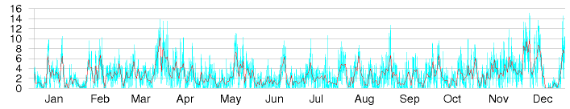
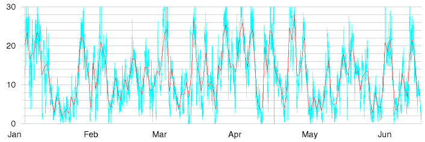
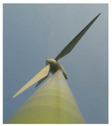
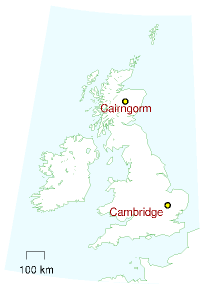
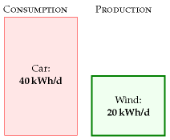
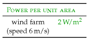
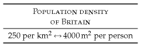
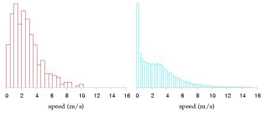

#Wind

> The UK has the best wind resources in Europe. Sustainable Development
> Commission

> Wind farms will devastate the countryside pointlessly. James Lovelock

How much wind power could we plausibly generate?

We can make an estimate of the potential of *on-shore* (land-based) wind in the
United Kingdom by multiplying the average power per unit land-area of a wind
farm by the area per person in the UK:

power per person = wind power per unit area × area per person.

Chapter B (p263) explains how to estimate the power per unit area of a wind
farm in the UK. If the typical wind speed is 6 m/s (13 miles per hour,or 22
km/h), the power per unit area of wind farm is about 2 W/m^2^.

This figure of 6 m/s is probably an over-estimate for many locations in
Britain. For example, figure 4.1 shows daily average wind speeds in Cam-bridge
during 2006. The daily average speed reached 6 m/s on only about30 days of the
year – see figure 4.6 for a histogram. But some spots do have wind speeds above
6 m/s – for example, the summit of Cairngorm in Scotland (images/figure 4.2).

Plugging in the British population density: 250 people per square kilo-metre,
or 4000 square metres per person, we find that wind power could generate if
wind turbines were packed across the *whole* country, and assuming2 W/m^2^ is
the correct power per unit area. Converting to our favourite power units,
that's 200 kWh/d per person.

Figure 4.1. Cambridge mean wind speed in metres per second, daily (red
line), and half-hourly (blue line) during 2006. See also figure 4.6.

Figure 4.2. Cairngorm mean wind speed in metres per second, during six
months of 2006.

2 W/m^2^ ×4000 m^2^/person = 8000 W per person,

Let's be realistic. What fraction of the country can we really imagine covering
with windmills? Maybe 10%? Then we conclude: if we covered the windiest 10% of
the country with windmills (delivering 2 W/m^2^), we would be able to generate
20 kWh/d per person, which is ***half*** of the power used by driving an
average fossil-fuel car 50 km per day.

Britain's onshore wind energy resource may be "huge," but it's evidently not as
huge as our huge consumption. We'll come to offshore wind later.

I should emphasize how generous an assumption I'm making. Let's compare this
estimate of British wind potential with current installed wind power worldwide.
The windmills that would be required to provide the UK with 20 kWh/d per person
amount to 50 times the entire wind hardware of Denmark; 7 times all the wind
farms of Germany; and double the entire fleet of all wind turbines in the
world.

Please don't misunderstand me. Am I saying that we shouldn't bother building
wind farms? Not at all. I'm simply trying to convey a helpful fact, namely that
if we want wind power to truly make a difference, the wind farms must cover a
very large area.

This conclusion – that the maximum contribution of onshore wind, albeit "huge,"
is much less than our consumption – is important, so let's check the key
figure, the assumed power per unit area of wind farm(2 W/m^2^), against a real
UK wind farm.

The Whitelee wind farm being built near Glasgow in Scotland has 140turbines
with a combined *peak* capacity of 322 MW in an area of 55 km^2^. That's 6
W/m^2^, *peak*. The average power produced is smaller because the turbines
don't run at peak output all the time. The ratio of the average power to the
peak power is called the "load factor" or "capacity factor," and it varies from
site to site, and with the choice of hardware plopped on the site; a typical
factor for a good site with modern turbines is 30%. If we assume Whitelee has a
load factor of 33% then the average power production per unit land area is 2
W/m^2^ – exactly the same as the power density we assumed above.

Figure 4.3. Chapter 4's conclusion: the maximum plausible production from
on-shore windmills in the United Kingdom is 20 kWh per day per person.

Table 4.4. Facts worth remembering:wind farms.

Table 4.5. Facts worth remembering:population density. See page 338
for more population densities.

Queries
-------

#### Wind turbines are getting bigger all the time. Do bigger wind
turbineschange this chapter's answer?

Chapter B explains. Bigger wind turbines deliver financial economies of scale,
but they don't greatly increase the total power per unit land area,because
bigger windmills have to be spaced further apart. A wind farm that's twice as
tall will deliver roughly 30% more power.

#### Wind power fluctuates all the time. Surely that makes wind less useful?

Maybe. We'll come back to this issue in Chapter 26, where we'll look at wind's
intermittency and discuss several possible solutions to this problem,including
energy storage and demand management.

Notes and further reading
-------------------------

page no.

32*Figure 4.1 and figure 4.6.* Cambridge wind data are from the Digital
Technology Group, Computer Laboratory, Cambridge[vxhhj]. The weather station is
on the roof of the Gates building, roughly 10 m high. Wind speeds at a height
of50 m are usually about 25% bigger. Cairngorm data (*figure 4.2*) are from
Heriot–Watt University Physics Department[tdvml].

33*The windmills required to provide the UK with 20 kWh/d per person are 50
times the entire wind power of Denmark.*Assuming a load factor of 33%, an
average power of 20 kWh/d per person requires an installed capacity of 150 GW.
At the end of 2006, Denmark had an installed capacity of 3.1 GW; Germany had
20.6 GW. The world total was 74 GW(wwindea.org).  Incidentally, the load factor
of the Danish wind fleet was 22% in 2006, and the average power it delivered
was 3 kWh/d per person.

Figure 4.6. Histogram of Cambridge average wind speed in metres per second:
daily averages (left), and half-hourly averages (right).
