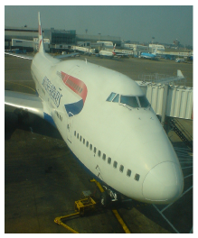
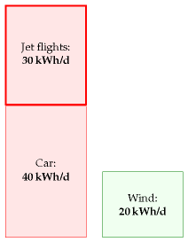
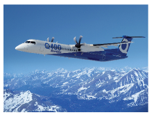
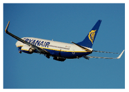
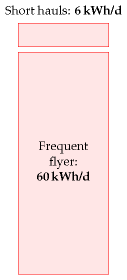

#Planes

Imagine that you make one intercontinental trip per year by plane.
How much energy does that cost?

A Boeing 747-400^[data is from [9ehws]. Planes today are not
completely full. Airlines are proud if their average fullness is 80%.
Easyjet planes are 85% full on average. (Source: the London paper, Tuesday
16th January, 2007.) An 80%-full 747 uses about 53 kWh per
100passenger-km. What about short-haul flights? In 2007, Ryanair,
"Europe's greenest airline," delivered transportation at a cost of 37 kWh
per 100 p-km [3exmgv]. This means that flying across Europe with Ryanair
has much the same energy cost as having all the passengers drive to their
destination in cars, two to a car. (For an indication of what other
airlines might be delivering, Ryanair's fuel burn rate in 2000, before
their environment-friendly investments, was above 73 kWh per 100 p-km.)
London to Rome is 1430 km; London to Malagais 1735 km. So a round-trip
to Rome with the greenest airline has an energy cost of 1050 kWh, and a
round-trip to Malaga costs 1270 kWh. If you popover to Rome and to
Malaga once per year, your average power consumption is 6.3 kWh/d with
the greenest airline, and perhaps 12 kWh/d with a less green one. What
about frequent flyers? To get a silver frequent flyer card from an
intercontinental airline, it seems one must fly around 25 000 miles per
year in economy class. That's about 60 kWh per day, if we scale up the
opening numbers from this chapter and assume planes are 80% full. Here are
some additional figures from the Intergovernmental Panel on Climate
Change [yrnmum]: a full 747-400 travelling 10 000 km with
low-density seating (262 seats) has an energy consumption of 50 kWh per
100 p-km. Ina high-density seating configuration (568 seats) and
travelling 4000 km, the same plane has an energy consumption of 22 kWh per 100 p-km. A
short-haul Tupolev-154 travelling 2235 km with 70% of its 164 seats
occupied consumes 80 kWh per 100 p-km.
] with 240 000 litres of fuel carries 416 passengers
about8 800 miles (14 200 km). And fuel's calorific value is 10 kWh per
litre. (We learned that in Chapter 3.) So the energy cost of one
full-distance round-trip on such a plane, if divided equally among the
passengers, is

$\frac{2 \times 240 000\space litre}{416\space passengers} \times 10 kWh/litre \approx 12 000 kWh\space per\space passenger$

If you make one such trip per year, then your average energy
consumption per day is

$\frac{12 000\space kWh}{365\space days} \approx 33\space kWh/day$

`r format(14200)` km is a little further than London to Cape Town (`r format(10000)` km)
and London to Los Angeles (`r format(9000)` km), so I think we've slightly
overestimated the distance of a typical long-range intercontinental trip;
but we've also overestimated the fullness of the plane, and the energy
cost per person is more if the plane's not full. Scaling down by ${10,000\space km} \div {14,200\space km}$ to get an estimate for Cape Town, then up again by $100 \div 80$ to
allow for the plane's being 80% full, we arrive at 29 kWh per day. For
ease of memorization, I'll round this up to 30 kWh per day.

Let's make clear what this means. Flying once per year has an energy cost
slightly bigger than leaving a 1 kW electric fire on, non-stop, 24
hours a day, all year.

Just as Chapter 3, in which we estimated consumption by cars,
was accompanied by Chapter A, offering a model of where the energy goes
in cars, this chapter's technical partner (Chapter C, p269), discusses
where the energy goes in planes. Chapter C allows us to answer questions
such as "would air travel consume significantly less energy if we
traveled in slower planes?"  The answer is **no**: in contrast to wheeled
vehicles, which can get more efficient the slower they go, planes are
already almost as energy-efficient as they could possibly be. Planes
unavoidably have to use energy for two reasons: they have to throw air
down in order to stay up, and they need energy to overcome air
resistance. No redesign of a plane is going to radically improve its
efficiency^[Actually,the Advisory Council for Aerospace Research in Europe (ACARE)
target is for an overall 50% reduction in fuel burned per passenger-km by
2020(relative to a 2000 baseline), with 15–20% improvement expected in
engine efficiency. As of 2006, Rolls Royce is half way to this engine
target [36w5gz]. Dennis Bushnell, chief scientist at NASA's Langley
Research Center, seems to agree with my overall assessment of prospects
for efficiency improvements in aviation. The aviation industry is mature.
"There is not much left to gain except by the glacial accretion of a per
cent here and there over long time periods."  (New Scientist, 24 February
2007, page 33.) The radically reshaped "Silent Aircraft" 
[silentaircraft.org/sax40], if it were built, is predicted to be 16% more
efficient than a conventional-shaped plane (Nickol, 2008). If the ACARE
target is reached, it's presumably going to be thanks mostly to having
fuller planes and better air-traffic management.
]. A 10% improvement? Yes, possible. A doubling of efficiency?
I'd eat my complimentary socks.

Queries
-------

#### Aren't turboprop aircraft far more energy-efficient?

No. The "comfortably greener"  Bombardier Q400 Next Gen, "the
most technologically advanced turboprop in the world,"  according to its
manufacturers [www.q400.com], uses 3.81 litres per 100 passenger-km (at a
cruise speed of 667 km/h), which is an energy cost of 38 kWh per 100
p-km. The full 747 has an energy cost of 42 kWh per 100 p-km. So both
planes are twice as fuel-efficient as a single-occupancy car. (The car
I'm assuming here is the average European car that we discussed in
Chapter 3.)





Figure 5.1. Taking one intercontinental trip per year uses about 30 kWh
per day.



Figure 5.2. Bombardier Q400 NextGen www.q400.com


#### Is flying extra-bad for climate change in some way?

Yes, that's the experts' view, though uncertainty remains about
this topic [3fbufz]. Flying creates other greenhouse gases in addition to
CO~2~,such as water and ozone, and indirect greenhouse gases, such as
nitrous oxides. If you want to estimate your carbon footprint in tons of
CO~2~-equivalent, then you should take the actual CO~2~ emissions of
your flights and bump them up two- or three-fold. This book's diagrams
don't include that multiplier because here we are focusing on our
*energy* balance sheet.

> The best thing we can do with environmentalists is shoot them. Michael
> O'Leary, CEO of Ryanair [3asmgy]

Notes and further reading
-------------------------
```{r ryan-air-737, fig.cap='Ryanair Boeing 737-800. Photograph by Adrian Pingstone.'}

```

```{r energy-per-distance}

modes <- c('Car (4 occupants)', "Ryanair's planes, year 2007", 'Bombardier Q400, full', '747, full', '747 80% full', "Ryanair's planes, year 2000", 'Car (1 occupant)')

energy_uses <- c(20,37,38,42,53,73,80)

energy_per_distance <- tibble::data_frame(mode = modes, `energy per distance (kWh per 100 p-km)` = energy_uses)
```

```{r energy-per-distance-table, fig.cap='Passenger transport efficiencies, expressed as energy required per 100 passenger-km.'}
pander::pander(energy_per_distance)
```


35*No redesign of a plane is going to radically improve its efficiency.*



Figure 5.5. Two short-haul trips on the greenest short-haul airline: 6.3
kWh/d. Flying enough to qualify for silver frequent flyer status: 60
kWh/d.
