#Solar

We are estimating how our consumption stacks up against conceivable sustainable
production. In the last three chapters we found car-driving and plane-flying to
be bigger than the plausible on-shore wind-power potential of the United
Kingdom. Could solar power put production back in the lead?

The power of raw sunshine at midday on a cloudless day is 1000W per square
metre. That's $1000\space W\space per\space m^2$ of area oriented towards the sun, not per $m^2$ of
land area. To get the power per $m^2$ of *land area* in Britain, we must make
several corrections. We need to compensate for the tilt between the sun and the
land^[The latitude of Cambridge is $\theta = 52°$; the intensity of midday sunlight is multiplied by
$cos\space \theta \approx 0.6$. The precise factor depends on the time of year, and varies between
$cos(θ + 23°) = 0.26$ and $cos(θ - 23°) = 0.87$.],
which reduces the intensity of midday sun to about 60% of its value at the
equator (figure \@ref(fig:sunlight-angle-cambridge)). We also lose out because it is not midday all the
time. On a cloud-free day in March or September, the ratio of the *average*
intensity to the midday intensity is about 32%. Finally, we lose power because
of cloud cover. In a typical UK location the sun-shines during just 34% of
daylight hours^[The Highlands get 1100 h sunshine per year – a sunniness of 25%.  The
bestspots in Scotland get 1400 h per year – 32%. Cambridge: 1500 ± 130 h peryear
– 34%. South coast of England (the sunniest part of the UK): 1700 h peryear –
39%. [2rqloc] Cambridge data from [2szckw]. See also figure \@ref(fig:average-sunshine).].

The combined effect of these three factors and the additional complication of
the wobble of the seasons is that the average raw power of sunshine per square
metre of south-facing roof in Britain is roughly $110\space W/m^2$, and the average
raw power of sunshine per square metre of flat ground is roughly $100\space W/m^2$.

We can turn this raw power into useful power in four ways:

1.  Solar thermal: using the sunshine for direct heating of buildings or water.
2.  Solar photo-voltaic: generating electricity.
3.  Solar biomass: using trees, bacteria, algae, corn, soy beans, or oildseed to
    make energy fuels, chemicals, or building materials.
4.  Food: the same as solar biomass, except we shovel the plants into humans or
    other animals.

(In a later chapter we'll also visit a couple of other solar power
techniques appropriate for use in deserts.)

Let's make quick rough estimates of the maximum plausible powers that each of
these routes could deliver. We'll neglect their economic costs, and the energy
costs of manufacturing and maintaining the power facilities.

Solar thermal
-------------

The simplest solar power technology is a panel making hot water.  Let's imagine 
we cover *all* south-facing roofs with solar thermal panels – that would be 
about $10\space m^2$ of panels per person^[I estimated the area of south-facing
roof per person by taking the area of land covered by buildings per person
($48\space m^2$ in England – table I.6), multiplying by $\frac{1}{4}$ to get the
south-facing fraction, and bumping the area up by 40% to allow for roof tilt.
This gives $16\space m^2$ per person. Panels usually come in inconvenient 
rectangles so some fraction of roof will be left showing; hence $10\space m^2$
of panels.] – and let's assume these are 50%-efficient at turning the sunlight's
$110\space W/m^2$ into hot water (figure \@ref(fig:solar-hot-water-generation)).

```{r sunlight-angle-cambridge, fig.cap='Sunlight hitting the earth at midday on a spring or autumn day. The density of sunlight per unit land area in Cambridge (latitude 52.) is about 60% of that at the equator.'}
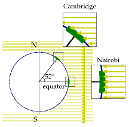
```

```{r incident-solar-flux, fig.cap='Average solar intensity in London and Edinburgh as a function of time of year. The average intensity, per unit land area, is 100 W/m^2^.', out.width="50%"}
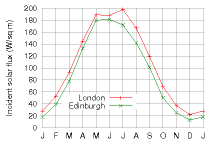
```

```{r solar-hot-water-generation, fig.cap="Solar power generated by a 3 m^2^ hot-water panel (green), and supplementary heat required (blue) to make hot water in the test house of Viridian Solar. (The photograph shows a house with the same model of panel on its roof.) The average solar power from 3 m^2^ was 3.8 kWh/d. The experiment simulated the hot-water consumption of an average European household – 100 litres of hot (60°C) water per day. The 1.5–2 kWh/d gap between the total heat generated (black line, top) and the hot water used (red line) is caused by heat-loss. The magenta line shows the electrical power required to run the solar system. The average power per unit area of these solar panels is 53 W/m^2^.", out.width="70%"}
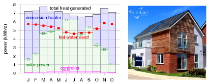
```

Multiplying

$$50\% \times 10\space m^2 \times 110\space W/m^2$$

we find solar heating could deliver

$$13\space kWh\space per\space day\space per\space person$$

I colour this production box white in figure \@ref(fig:solar-thermal-stack) to indicate that it
describes production of low-grade energy – hot water is not as valuable as the
high-grade electrical energy that wind turbines produce. Heat can't be exported to
the electricity grid. If you don't need it, then it's wasted. We should bear in
mind that much of this captured heat would not be in the right place. In
cities, where many people live, residential accommodation has less roof area per
person than the national average.  Furthermore, this power would be delivered
non-uniformly through the year.

Solar photo-voltaic
------------------

Photo-voltaic (PV) panels convert sunlight into electricity. Typical solar
panels have an efficiency of about 10%; expensive ones perform at
20%.(Fundamental physical laws limit the efficiency of photo-voltaic systems to
at best 60% with perfect concentrating mirrors or lenses, and 45% without
concentration. A mass-produced device with efficiency greater than 30%would be
quite remarkable.) The average power delivered by south-facing^[There's a myth
going around that states that solar panels produce almost as much power in
cloudy conditions as in sunshine. This is simply not true. On a bright but
cloudy day, solar photo-voltaic panels and plants do continue toconvert some
energy, but much less: photo-voltaic production falls roughly ten-fold when the
sun goes behind clouds (because the intensity of the in-coming sunlight falls
ten-fold). As figure 6.15 shows, the power delivered by photo-voltaic panels is
almost exactly proportional to the intensity of the sunlight – at least, if the
panels are at 25°C. To complicate things, the power delivered depends on
temperature too – hotter panels have reduced power (typically 0.38% loss in
power per °C) – but if you check data from real panels, e.g. at
www.solarwarrior.com, you can confirm the main point: output on a cloudy day is
*far less* than on a sunny day. This issue is obfuscated by some solar-panel
promoters who discuss how the "efficiency"  varies with sunlight. "The panels
are more efficient in cloudy conditions,"  they say; this may be true, but
efficiency should not be confused with delivered power.] 20%-efficient 
photo-voltaic panels in Britain would be

$$20\% \times 110\space W/m^2 = 22\space W/m^2$$

Figure \@ref(fig:pv-data-cambridgeshire) shows data to back up this number.
Let's give every person $10\space m^2$ of expensive (20%-efficient) solar panels
and cover all south-facing roofs. These will deliver $5\space kWh$ per day per person.

```{r solar-thermal-stack, fig.cap='Solar thermal: a 10 m^2^ array of thermal panels can deliver (on average) about 13 kWh per day of thermal energy.'}
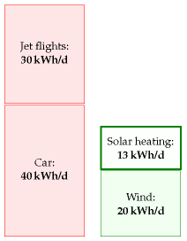
```

Since the area of all south-facing roofs is $10\space m^2$ per person, there 
certainly isn't space on our roofs for these photo-voltaic panels as well as the
solar-thermal panels of the last section. So we have to choose whether to have 
the photo-voltaic contribution or the solar hot water contribution. But I'll 
just plop both these on the production stack anyway. Incidentally, the present 
cost of installing such photo voltaic panels is about four times the cost of 
installing solar thermal panels, but they deliver only half as much energy, 
albeit high-grade energy (electricity). So I'd advise a family thinking of going
solar to investigate the solar thermal option first. The smartest solution, at 
least in sunny countries, is to make combined systems that deliver both 
electricity and hot water from a single installation. This is the approach 
pioneered by Heliodynamics^[www.hdsolar.com. See figure 
\@ref(fig:heliodynamics-heat-pv). A similar system is made by Arontis 
www.arontis.se.], who reduce the overall cost of their systems by surrounding 
small high-grade gallium arsenide photo-voltaic units with arrays of 
slowly-moving flat mirrors; the mirrors focus the sun-light onto the 
photo-voltaic units, which deliver both electricity and hot water; the hot water
is generated by pumping water past the back of the photo-voltaic units.

The conclusion so far: covering your south-facing roof at home with
photo-voltaics may provide enough juice to cover quite a big chunk of your
personal average electricity consumption; but roofs are not big enough to make a
huge dent in our total *energy* consumption. To do more with PV, we need to step
down to terra firma. The solar warriors in figure \@ref(fig:solar-warriors) show
the way.

```{r pv-data-cambridgeshire, fig.cap="Solar photo-voltaics: data from a 25-m^2^ array in Cambridgeshire in 2006. The peak power delivered by this array is about 4 kW. The average, year-round, is 12 kWh per day. That's 20 W per square metre of panel."}
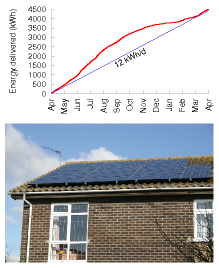
```

```{r solar-warriors, fig.cap="Two solar warriors enjoying their photo voltaic system, which powers their electric cars and home. The array of 120 panels (300 W each, 2.2 m^2^ each) has an area of 268 m^2^, a peak output (allowing for losses in DC–to–AC conversion) of 30.5 kW, and an average output – in California, near Santa Cruz – of 5 kW (19 W/m^2^). Photo kindly provided by Kenneth Adelman. www.solarwarrior.com"}
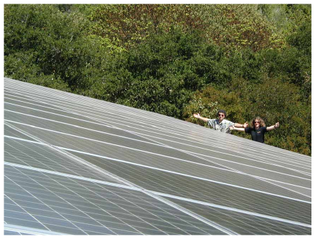
```

### Fantasy time: solar farming

If a breakthrough of solar technology occurs and the cost of photo-voltaics came
down enough that we could deploy panels all over the countryside, what is the
maximum conceivable production? Well, if we covered 5% of the UK with
10%-efficient panels, we'd have

$$10\% \times 100\space W/m^2 \times 200\space m^2\space per\space person \approx 50\space kWh/day/person$$

I assumed only 10%-efficient panels, by the way, because I imagine that solar
panels would be mass-produced on such a scale only if they were very cheap, and
it's the lower-efficiency panels that will get cheap first. The power density
(the power per unit area) of such a solar farm would be

$$10\% \times 100\space W/m^2 = 10\space W/m^2$$

This power density is twice that of the Bavaria Solar park (images/figure 6.7).

Could this flood of solar panels co-exist with the army of windmills we imagined
in Chapter 4? Yes, no problem: windmills cast little shadow, and ground-level 
solar panels have negligible effect on the wind. How audacious is this plan? The
solar power capacity required to deliver this 50 kWh per day per person in the
UK is more than 100 times all the photo-voltaics in the whole world^[To deliver 
50 kWh/d per person in the UK would require 125 GW average power, which requires
1250 GW of capacity. At the end of 2007, world installed photo-voltaics amounted
to 10 GW peak; the build rate is roughly 2 GW per year.]. So should I include 
the PV farm in my sustainable production stack? I'm in two minds. At the start 
of this book I said Wanted to explore what the laws of physics say about the 
limits of sustainable energy, assuming money is no object. On those grounds, I 
should certainly go ahead, industrialize the countryside, and push the PV farm 
onto the stack. At the same time, I want to help people figure out what we 
should be doing between *now* and 2050. And today, electricity from solar farms 
would be four times as expensive as the market rate. So I feel a bit 
irresponsible as I include this estimate in the sustainable production stack in 
figure \@ref(fig:pv-farm-stack) – paving 5% of the UK with solar panels seems 
beyond the bounds of plausibility in so many ways^[My main reason for feeling
such a panelling of the countrywould be implausible is that Brits like using
their countryside for farming and recreation rather than solar-panel husbandry. 
Another concern might be price. This isn't a book about economics, but here are
a few figures. Going by the price-tag of the Bavarian solar farm, to deliver 50
kWh/d per person would cost €91 000 per person; if that power station lasted 20
years without further expenditure, the wholesale cost of the electricity would
be €0.25 per kWh. Further reading: David Carlson, BP solar [2ahecp].]. If we
seriously contemplated doing such a thing, it would quite probably be better to
put the panels in a two-fold sunnier country and send some of the energy home by
power lines. We'll return to this idea in Chapter 25.

### Mythconceptions

#### Manufacturing a solar panel consumes more energy than itwill ever de-liver.

*False*. The energy yield ratio (the ratio of energy delivered by a system over
its lifetime, to the energy required to make it) of a roof-mounted,
grid-connected solar system in Central Northern Europe is 4, for a system with a
lifetime of 20 years (Richards and Watt, 2007); and more than 7 in a sunnier
spot such as Australia. (An energy yield ratio bigger than one means that a
system is A Good Thing, energy-wise.) Wind turbines with lifetime of 20 years
have an energy yield ratio of 80.

```{r solarpark-bavaria, fig.cap="A solar photo-voltaic farm: the 6.3 MW (peak) Solar park in Mühlhausen, Bavaria. Its average power per unit land area is expected to be about 5 W/m^2^. Photo by SunPower."}
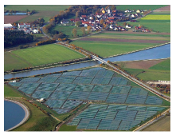
```

Figure 6.7. 

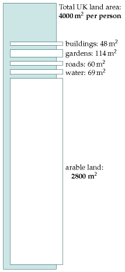

Figure 6.8. Land areas per person in Britain.

#### Aren't photovoltaic panels going to get more and more efficientas technology improves?

I am sure that photo-voltaic panels will become ever *cheaper*; I'm also sure that
solar panels will become ever less energy-intensive to *manufacture*, so their
energy yield ratio will improve. But this chapter's photo-voltaic estimates
weren't constrained by the economic cost of the panels, nor by the energy cost
of their manufacture. This chapter was concerned with the maximum conceivable
power delivered.  Photo-voltaic panels with 20% efficiency are already close to
the theoretical limit (see this chapters' end-notes). I'll be surprised if this
chapter's estimate for roof-based photo-voltaics ever needs a significant upward
revision.

Solar biomass
-------------

> All of a sudden, you know, we may be in the energy business by being able to
> grow grass on the ranch! And have it harvested and converted into energy.
> That's what's close to happening. --- George W. Bush, February 2006

All available bio-energy solutions involve first growing green stuff, and then
doing something with the green stuff. How big could the energy collected by the
green stuff possibly be? There are four main routes to get energy from
solar-powered biological systems:

1.  We can grow specially-chosen plants and burn them in a power station that
    produces electricity or heat or both. We'll call this "coal substitution." 
2.  We can grow specially-chosen plants (oil-seed rape, sugar cane, or corn,
    say), turn them into ethanol or bio-diesel, and shove that into cars, trains,
    planes or other places where such chemicals are useful. Or we might
    cultivate genetically-engineered bacteria, cyanobacteria, or algae that
    directly produce hydrogen, ethanol, or butanol, or even electricity. We'll
    call all such approaches "petroleum substitution." 
3.  We can take by-products from other agricultural activities and burn them in a
    power station. The by-products might range from straw (a by-product
    of Weetabix) to chicken poo (a by-product of McNuggets). Burning by-products
    is coal substitution again, but using ordinary plants, not the best
    high-energy plants. A power station that burns agricultural by-products won't
    deliver as much power per unit area of farmland as an optimized
    biomass-growing facility, but it has the advantage that it doesn't
    monopolize the land. Burning methane gas from landfill sites is a similar way
    of getting energy, but it's sustainable only as long as we have a
    sustainable source of junk to keep putting into the landfill sites. (Most of
    the landfill methane comes from wasted food; people in Britain throw away
    about 300 g of food per day per person^[Source: Ventour(2008).].) Incinerating
    household waste is another slightly less roundabout way of getting power from
    solar biomass.
4.  We can grow plants and feed them directly to energy-requiring
    humans or other animals.

```{r pv-farm-stack, fig.cap="Solar photo-voltaics: a 10 m^2^ array of building-mounted south-facing panels with 20% efficiency can deliver about 5 kWh per day of electrical energy. If 5% of the country were coated with 10%-efficient solar panels (200 m^2^ of panels per person) they would deliver 50 kWh/day/person.", out.width = "30%"}
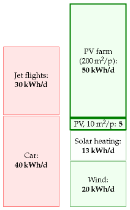
```

For all of these processes, the first staging post for the energy is in a
chemical molecule such as a carbohydrate in a green plant. We can
therefore estimate the power obtainable from any and all of these processes by
estimating how much power could pass through that first staging post.
All subsequent steps involving tractors, animals, chemical facilities, land-fill
sites, or power stations can only lose energy. So the power at the first staging
post is an upper bound on the power available from all plant-based power
solutions.

So, let's simply estimate the power at the first staging post. (In section
\@ref(solar-ii) we'll go into more detail, estimating the maximum contribution
of each process.) The average harvestable power of sunlight in Britain is
$100\space W/m^2$. The most efficient plants in Europe are about 2%-efficient at
turning solar energy into carbohydrates, which would suggest that plants might
deliver $2\space W/m^2$; however, their efficiency drops at higher light
levels^[*At low light intensities*, the best British plants are 2.4% efficient
in well-fertilized fields (Monteith, 1977) but at higher light in-tensities,
their conversion efficiency drops. According to Turkenburg (2000) and
Schiermeier et al. (2008), the conversion efficiency of solar to biomassenergy
is less than 1%. Here are a few sources to back up my estimate of $0.5\space
W/m^2$ for vegetablepower in the UK. The Royal Commission on Environmental 
Pollution's esti-mate of the potential delivered power density from energy crops
in Britain is $0.2\space W/m^2$ (Royal Commission on Environmental Pollution,
2004). On page 43 of the Royal Society's biofuels document (Royal Society
working groupon biofuels, 2008), *Miscanthus* tops the list, delivering about
$0.8\space W/m^2$ of chemical power. ], and the best performance of any energy
crops in Europe is closer to $0.5\space W/m^2$. Let's cover 75% of the country 
with quality green stuff.  That's $3000\space m^2$ per person devoted to 
bio-energy. This is the same as the British land area currently devoted to 
agriculture. So the maximum power available, ignoring all the additional costs 
of growing, harvesting, and processing the greenery, is

$$0.5\space W/m^2 × 3000\space m^2\space per\space person = 36\space kWh/d\space per\space person$$

Wow. That's not very much, considering the outrageously generous assumptions we 
just made, to try to get a big number. If you wanted to get bio-fuels for cars
or planes from the greenery, all the other steps in the chain from farm to spark
plug would inevitably be inefficient. I think it'd be optimistic to hope that
the overall losses along the processing chain would be as small as 33%. Even
burning dried wood in a good wood boiler loses 20% of the heat up the
chimney^[Sources: Royal Society working group on biofuels(2008); Royal
Commission on Environmental Pollution (2004).]. So surely the true potential
power from biomass and bio-fuels cannot be any bigger than 24 kWh/d per person.
And don't forget, we want to use some of the greenery to make food for us and
for our animal companions.

```{r power-production-plants, fig.cap="[^**E**^](http://www.withouthotair.com/Errata.html#43) Power production, per unit area, achieved by various plants.[^**E**^](http://www.withouthotair.com/Errata.html#43) These power densities vary depending on irrigation and fertilization; ranges are indicated for some crops, for example wood has a range from 0.095–0.254 W/m^2^. The bottom three power densities are for crops grown in tropical locations. The last power density (tropical plantations^[The numbers in this figure are drawn from Rogner (2000) (netenergy yields of wood, rape, sugarcane, and tropical plantations); BayerCrop Science (2003) (rape to biodiesel); Francis et al. (2005) and Asselbergset al. (2006) (jatropha); Mabee et al. (2006) (sugarcane, Brazil); Schmer et al.(2008) (switchgrass, marginal cropland in USA); Shapouri et al. (1995) (cornto ethanol); Royal Commission on Environmental Pollution (2004); Royal So-ciety working group on biofuels (2008); Energy for Sustainable DevelopmentLtd (2003); Archer and Barber (2004); Boyer (1982); Monteith (1977).]) assumes genetic modification, fertilizer application, and irrigation. In the text, I use 0.5 W/m^2^ as a summary figure for the best energy crops in NW Europe."}

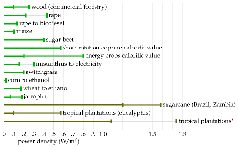
```

```{r miscanthus, fig.cap='Some *Miscanthus* grass enjoying the company of Dr Emily Heaton, who is 5′4″ (163 cm) tall. In Britain, *Miscanthus* achieves a power per unit area of 0.75 W/m^2^. Photo provided by the University of Illinois.'}
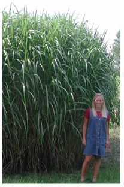
```

Could genetic engineering produce plants that convert solar energy to chemicals
more efficiently? It's conceivable; but I haven't found any scientific
publication predicting that plants in Europe could achieve net power production
beyond 1 W/m^2^.

I'll pop 24 kWh/d per person onto the green stack, emphasizing that I think this
number is an over-estimate – I think the true maximum power that we could get
from biomass will be smaller because of the losses in farming and processing.

I think one conclusion is clear: *biofuels can't add up* – at least, not
in countries like Britain, and not as a replacement for all transport fuels.
Even leaving aside biofuels' main defects – that their production competes
with food, and that the additional inputs required for farming and
processing often cancel out most of the delivered energy (images/figure 6.14) –
biofuels made from plants, in a European country like Britain, can deliver so
little power, I think they are scarcely worth talking about.

```{r average-sunshine, fig.cap='Average power of sunshine falling on a horizontal surface in selected locations in Europe, North America, and Africa.'}
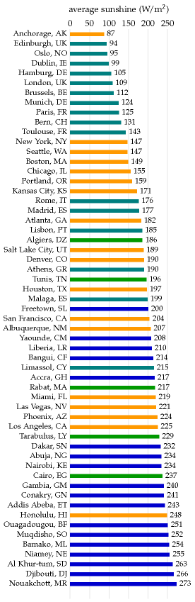
```

Notes and further reading
-------------------------
–*In a typical UK location the sun shines during one third of daylight
hours.*

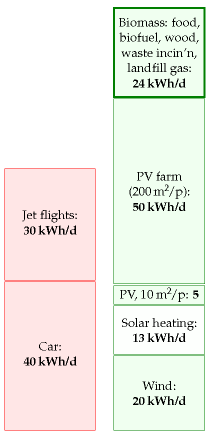

Figure 6.12. Solar biomass, including all forms of biofuel, waste
incineration, and food: 24 kWh/d per person.

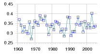

Figure 6.13. Sunniness of Cambridge: the number of hours of sunshine per year,
expressed as a fraction of the total number of daylight hours.

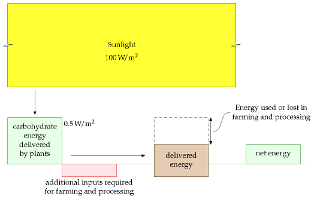

38*The average raw power of sunshine per square metre of south-facing roof
inBritain is roughly 110 W/m^2^, and of flat ground, roughly 100 W/m^2^*.
Source:NASA "Surface meteorology and Solar Energy"  [5hrxls].  Surprised
thatthere's so little difference between a tilted roof facing south and a
horizontalroof? I was. The difference really is just 10% [6z9epq].

39*... that would be about 10 m^2^ of panels per person.* 

```{r energy-inputs-to-biofuel, fig.cap='This figure illustrates the quantitative questions that must be asked of any proposed biofuel. What are the additional energy inputs required for farming and processing? What is the delivered energy? What is the *net* energy output? Often the additional inputs and losses wipe out most of the energy delivered by the plants.'}
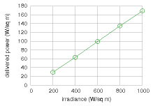
```

Figure 6.15. Power produced by the Sanyo HIP-210NKHE1 module as a
function of light intensity (at 25°C, assuming an output voltage of 40
V). Source: datasheet, www.sanyo-solar.eu.

```{r photon-energy-eV, fig.cap="Part of Shockley and Queisser's explanation for the 31% limit of the efficiency of simple photovoltaics. Left: the spectrum of midday sunlight. The vertical axis shows the power density in W/m^2^ per eV of spectral interval. The visible part of the spectrum is indicated by the coloured section. Right: the energy captured by a photovoltaic device with a single band-gap at 1.1 eV is shown by the tomato-shaded area. Photons with energy less than the band-gap are lost. Some of the energy of photons above the band-gap is lost; for example half of the energy of every 2.2 eV photon is lost. Further losses are incurred because of inevitable radiation from recombining charges in the photovoltaic material."}
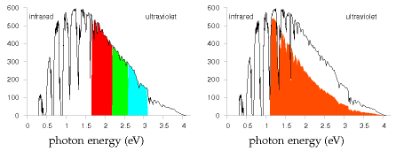
```


39*Typical solar panels have an efficiency of about 10%; expensive ones
per-form at 20%*. See figure 6.18. Sources: Turkenburg (2000), Sunpower
www.sunpowercorp.com, Sanyo www.sanyo-solar.eu, Suntech.

–*A device with efficiency greater than 30% would be quite remarkable*.
Thisis a quote from Hopfield and Gollub (1978), who were writing about
panelswithout concentrating mirrors or lenses. The theoretical limit for
a standard"single-junction"  solar panel without concentrators, the
Shockley–Queisserlimit, says that at most 31% of the energy in sunlight
can be converted toelectricity (Shockley and Queisser, 1961). (The main
reason for this limitis that a standard solar material has a property
called its band-gap, whichdefines a particular energy of photon that
that material converts most ef-ficiently. Sunlight contains photons with
many energies; photons with en-ergy *below* the band-gap are not used at
all; photons with energy *greater* than the band-gap may be captured, but
all their energy in excess of theband-gap is lost.) Concentrators
(lenses or mirrors) can both reduce thecost (per watt) of photovoltaic
systems, and increase their efficiency. TheShockley–Queisser limit for
solar panels with concentrators is 41% efficiency. The only way to beat
the Shockley–Queisser limit is to make fancy photo-voltaic devices that
split the light into different wavelengths, processing
eachwavelength-range with its own personalized band-gap. These are
calledmultiple-junction photovoltaics. Recently multiple-junction
photovoltaicswith optical concentrators have been reported to be about
40% efficient.[2tl7t6], www.spectrolab.com. In July 2007, the University
of Delawarereported 42.8% efficiency with 20-times concentration
[6hobq2], [2lsx6t]. InAugust 2008, NREL reported 40.8% efficiency with
326-times concentration[62ccou]. Strangely, both these results were
called world efficiency records. What multiple-junction devices are
available on the market? Uni-solar sell athin-film triple-junction 58
W(peak) panel with an area of 1 m^2^. That impliesan efficiency, in full
sunlight, of only 5.8%.

40*Figure 6.5: Solar PV data*. Data and photograph kindly provided by
Jonathan Kimmitt.


```{r efficiences-of-panels, fig.cap="Efficiencies of solar photovoltaic modules available for sale today. In the text I assume that roof-top photovoltaics are 20% efficient, and that country-covering photovoltaics would be 10% efficient. In a location where the average power density of incoming sunlight is 100 W/m^2^, 20%-efficient panels deliver 20 W/m^2^."}
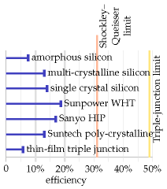
```

Figure \@ref(fig:solarpark-bavaria) *The Solarpark in Muhlhausen, Bavaria.* On 
average this 25-hectare farm is expected to deliver $0.7\space MW$
($17,000\space kWh\space per\space day$). New York's Stillwell Avenue subway
station has integrated amorphous silicon thin-film photovoltaics in its roof
canopy, delivering $4\space W/m^2$ (Fies et al.,2007). The Nellis solar power plant in
Nevada was completed in December, 2007, on 140 acres, and is expected to
generate 30 GWh per year. That's $6\space W/m^2$ [5hzs5y]. Serpa Solar Power
Plant, Portugal (PV), "the world's most powerful solar power plant,"  [39z5m5]
[2uk8q8] has sun-tracking panels occupying 60 hectares, i.e.,
$600,000\space m^2$ or $0.6\space km^2$, expected to generate 20 GWh per year,
i.e., $2.3\space MW$ on average. That's a power per unit area of $3.8\space W/m^2$.

–*Figure \@ref(fig:miscanthus)*. In the USA, *Miscanthus* grown without nitrogen fertilizer
yieldsabout 24 t/ha/y of dry matter. In Britain, yields of 12–16 t/ha/y are
reported. Dry *Miscanthus* has a net calorific value of 17 MJ/kg, so the British
yield corresponds to a power density of 0.75 W/m^2^. Sources: Heaton et
al.(2004) and [6kqq77]. The estimated yield is obtained only after three years
of undisturbed growing.


```{r heliodynamics-heat-pv, fig.cap="A combined-heat-and-power photovoltaic unit from Heliodynamics. A reflector area of 32 m^2^ (a bit larger than the side of a double-decker bus) delivers up to 10 kW of heat and 1.5 kW of electrical power. In a sun-belt country, one of these one-ton devices could deliver about 60 kWh/d of heat and 9 kWh/d of electricity. These powers correspond to average fluxes of 80 W/m^2^ of heat and 12 W/m^2^ of electricity (that's per square metre of device surface); these fluxes are similar to the fluxes delivered by standard solar heating panels and solar photovoltaic panels, but Heliodynamics's concentrating design delivers power at a lower cost, because most of the material is simple flat glass. For comparison, the total power consumption of the average European person is 125 kWh/d."}
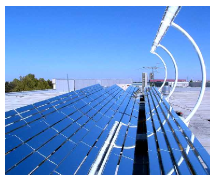
```

In the World Energy Assessment published by the UNDP, Rogner (2000)writes: 
"Assuming a 45% conversion efficiency to electricity and yields of15 oven dry 
tons per hectare per year, 2 km^2^ of plantation would be needed per megawatt of
electricity of installed capacity running 4,000 hours a year." That is a power 
per unit area of $0.23\space W(e)/m^2$. ($1\space W(e)$ means 1 watt of
electrical power.) Energy for Sustainable Development Ltd (2003) estimates that 
short-rotation coppices can deliver over 10 tons of dry wood per hectare per 
year, which corresponds to a power density of $0.57\space W/m^2$. (Dry wood has
a calorific value of 5 kWh per kg.) According to Archer and Barber (2004), the 
instantaneous efficiency of a healthy leaf in optimal conditions can approach
5%, but the long-term energy-storage efficiency of modern crops is 0.5–1%.
Archer and Barber suggest that by genetic modification, it might be possible to
improve the storage efficiency of plants, especially *C4 plants*, which have
already naturally evolved a more efficient photosynthetic pathway. C4 plants are
mainly found in the tropics and thrive in high temperatures; they don't grow at 
temperatures below 10°C. Some examples of C4 plants are sugarcane, maize, 
sorghum, fingermillet, and switchgrass. Zhu et al. (2008) calculate that the 
theoretical limit for the conversion efficiency of solar energy to biomass is 
4.6% for C3 photo-synthesis at 30°C and today's 380 ppm atmospheric CO~2~ 
concentration, and 6% for C4 photosynthesis. They say that the highest solar 
energy conversion efficiencies reported for C3 and C4 crops are 2.4% and 3.7% 
respectively; and, citing Boyer (1982), that the average conversion efficiencies
of major crops in the US are 3 or 4 times lower than those record efficiencies 
(that is, about 1% efficient). One reason that plants don't achieve the 
theoretical limit is that they have insufficient capacity to use all the
incoming radiation of bright sunlight. Both these papers (Zhu et al., 2008;
Boyer, 1982) discuss prospects for genetic engineering of more-efficient plants.