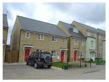
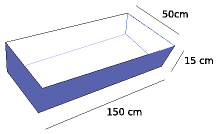
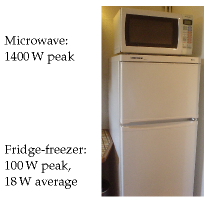
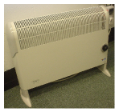
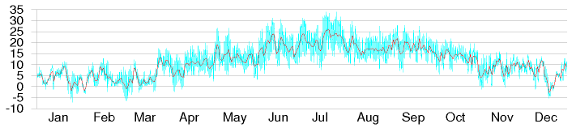
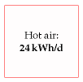

#Heating and cooling

This chapter explores how much power we spend controlling the
temperature of our surroundings – at home and at work – and on warming
or cooling our food, drink, laundry, and dirty dishes.

Domestic water heating
----------------------

The biggest use of hot water in a house might be baths, showers,
dish-washing, or clothes-washing – it depends on your lifestyle. Let's
estimate first the energy used by taking a hot bath.

The volume of bath-water is 50 cm × 15 cm × 150 cm ≈ 110 litre. Say the
temperature of the bath is 50 °C (120 F) and the water coming into
the house is at 10 °C. The heat capacity of water, which measures how
much energy is required to heat it up, is 4200 J per litre per °C. So the
energy required to heat up the water by 40 °C is

4200 J/litre/°C × 110 litre × 40 °C ≈ 18 MJ ≈ 5 kWh.

So taking a bath uses about 5 kWh. For comparison, taking a shower(30
litres) uses about 1.4 kWh.

### Kettles and cookers

Britain, being a civilized country, has a 230 volt domestic electricity
supply.With this supply, we can use an electric kettle to boil several
litres of water in a couple of minutes. Such kettles have a power of 3
kW. Why 3 kW?Because this is the biggest power that a 230 volt outlet
can deliver with-out the current exceeding the maximum permitted, 13
amps. In countries where the voltage is 110 volts, it takes twice as long
to make a pot of tea.

If a household has the kettle on for 20 minutes per day, that's an
average power consumption of 1 kWh per day. (I'll work out the next few
items"per household," with 2 people per household.)

One small ring on an electric cooker has the same power as a toaster:1
kW. The higher-power hot plates deliver 2.3 kW. If you use two rings of
the cooker on full power for half an hour per day, that corresponds
to1.6 kWh per day.

A microwave oven usually has its cooking power marked on the front:mine
says 900 W, but it actually *consumes* about 1.4 kW. If you use
the microwave for 20 minutes per day, that's 0.5 kWh per day.

A regular oven guzzles more: about 3 kW when on full. If you use the oven
for one hour per day, and the oven's on full power for half of that time,
that's 1.5 kWh per day.

Figure 7.1. A flock of new houses.

Figure 7.2. The water in a bath.

230 V × 13 A = 3000 W

Figure 7.3. Power consumption by a heating and cooling device.

Device

power

time per day

energy per day

Cooking

– kettle

3 kW

1⁄3 h

1 kWh/d

– microwave

1.4 kW

1⁄3 h

0.5 kWh/d

– electric cooker (rings)

3.3 kW

½ h

1.6 kWh/d

– electric oven

3 kW

½ h

1.5 kWh/d

Cleaning

– washing machine

2.5 kW

1 kWh/d

– tumble dryer

2.5 kW

0.8 h

2 kWh/d

– airing-cupboard drying

0.5 kWh/d

– washing-line drying

0 kWh/d

– dishwasher

2.5 kW

1.5 kWh/d

Cooling

– refrigerator

0.02 kW

24 h

0.5 kWh/d

– freezer

0.09 kW

24 h

2.3 kWh/d

– air-conditioning

0.6 kW

1 h

0.6 kWh/d

### Hot clothes and hot dishes

A clothes washer, dishwasher, and tumble dryer all use a power of
about2.5 kW when running.

A clothes washer uses about 80 litres of water per load, with an
energy cost of about 1 kWh if the temperature is set to 40 °C. If we use
an indoor airing-cupboard instead of a tumble dryer to dry clothes, heat
is still required to evaporate the water – roughly 1.5 kWh to dry one
load of clothes, instead of 3 kWh.

Totting up the estimates relating to hot water, I think it's easy to
use about 12 kWh per day per person.

Hot air – at home and at work
-----------------------------

Now, does more power go into making hot water and hot food, or
into making hot air via our buildings' radiators?

One way to estimate the energy used per day for hot air is to imagine a
building heated instead by electric fires, whose powers are more
familiar to us. The power of a small electric bar fire or electric fan
heater is 1 kW(24 kWh per day). In winter, you might need one of these
per person to keep toasty. In summer, none. So we estimate that on
average one modern person *needs* to use 12 kWh per day on hot air. But
most people use more than they need, keeping several rooms warm
simultaneously (kitchen, living room, corridor, and bathroom, say). So a
plausible consumption figure for hot air is about double that: 24 kWh per
day per person.

This chapter's companion Chapter E contains a more detailed account of
where the heat is going in a building; this model makes it possible to

Table 7.4. Energy consumption figures for heating and cooling devices,
per household.

Figure 7.5. The hot water total at both home and work – including
bathing, showering, clothes washing, cookers, kettles, microwave oven,
and dish-washing – is about 12 kWh per day per person. I've given this
box a light colour to indicate that this power could be delivered by
low-grade thermal energy.

Figure 7.6. A big electric heater: 2 kW.

predict the heat savings from turning the thermostat down,
double-glazing the windows, and so forth.

### Warming the outdoors, and other luxuries

There's a growing trend of warming the outdoors with patio heaters. Typical
patio heaters have a power of 15 kW. So if you use one of these for
a couple of hours every evening, you are using an extra 30 kWh per day.

A more modest luxury is an electric blanket. An electric blanket for
a double bed uses 140 W; switching it on for one hour uses 0.14 kWh.

Cooling
-------

### Fridge and freezer

We control the temperatures not only of the hot water and hot air
with which we surround ourselves, but also of the cold cupboards we
squeeze into our hothouses. My fridge-freezer, pictured in figure 7.3,
consumes18 W on average – that's roughly 0.5 kWh/d.

### Air-conditioning

In countries where the temperature gets above 30 °C, air-conditioning
is viewed as a necessity, and the energy cost of delivering that
temperature control can be large. However, this part of the book is about
British energy consumption, and Britain's temperatures provide little
need for air- conditioning (images/figure 7.8).

An economical way to get air-conditioning is an air-source heat pump.A
window-mounted electric air-conditioning unit for a single room uses0.6
kW of electricity and (by heat-exchanger) delivers 2.6 kW of cooling.
To estimate how much energy someone might use in the UK, I assumed
they might switch such an air-conditioning unit on for about 12 hours per
day on 30 days of the year. On the days when it's on, the air-conditioner
uses7.2 kWh. The average consumption over the whole year is 0.6 kWh/d.

This chapter's estimate of the energy cost of cooling – 1 kWh/d
per person – includes this air-conditioning and a domestic refrigerator.
Society

Figure 7.7. Hot air total – including domestic and workplace heating –
about 24 kWh per day per person.

Figure 7.8. Cambridge temperature in degrees Celsius, daily (red line),
and half-hourly (blue line) during 2006.

Figure 7.9. Cooling total – including a refrigerator (fridge/freezer)
and a little summer air-conditioning – 1 kWh/d.

