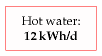
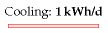

#Heating and cooling

This chapter explores how much power we spend controlling the temperature of
our surroundings – at home and at work – and on warming or cooling our food,
drink, laundry, and dirty dishes.

Domestic water heating
----------------------

The biggest use of hot water in a house might be baths, showers, dish-washing,
or clothes-washing – it depends on your lifestyle. Let's estimate first the
energy used by taking a hot bath.

The volume of bath-water is $50\space cm \times 15\space cm \times 150\space cm
\approx 110\space litre$. Say the temperature of the bath is 50 °C (120 F) and
the water coming into the house is at 10 °C. The heat capacity of water, which
measures how much energy is required to heat it up, is 4200 J per litre per °C.
So the energy required to heat up the water by 40 °C is

$4200\space J/litre/°C \times 110\space litre \times 40°C \approx 18\space MJ \approx 5\space kWh$.

So taking a bath uses about 5 kWh. For comparison, taking a shower(30 litres)
uses about 1.4 kWh.

### Kettles and cookers

Britain, being a civilized country, has a 230 volt domestic electricity supply.
With this supply, we can use an electric kettle to boil several litres of water
in a couple of minutes. Such kettles have a power of 3 kW. Why 3 kW? Because
this is the biggest power that a 230 volt outlet can deliver with-out the
current exceeding the maximum permitted, 13 amps. In countries where the
voltage is 110 volts, it takes twice as long to make a pot of tea.

If a household has the kettle on for 20 minutes per day, that's an average
power consumption of 1 kWh per day. (I'll work out the next few items "per
household," with 2 people per household.)

One small ring on an electric cooker has the same power as a toaster: 1 kW. The
higher-power hot plates deliver 2.3 kW. If you use two rings of the cooker on
full power for half an hour per day, that corresponds to 1.6 kWh per day.

A microwave oven usually has its cooking power marked on the front: mine says
900 W, but it actually *consumes* about 1.4 kW. If you use the microwave for 20
minutes per day, that's 0.5 kWh per day.

A regular oven guzzles more: about 3 kW^[Obviously there’s a range of powers.
Many ovens have a maximum power of 1.8 kW or 2.2 kW. Top-of-the-line ovens use
as much as 6 kW. For example, the Whirlpool AGB 487/WP 4 Hotplate Electric Oven
Range has a 5.9 kW oven, and four 2.3 kW hotplates.] when on full. If you use
the oven for one hour per day, and the oven's on full power for half of that
time, that's 1.5 kWh per day.

$230\space V \times 13\space A = 3000\space W$

```{r picture-of-houses, fig.cap='A flock of new houses.'}

```

```{r water-in-a-bath, fig.cap='The water in a bath.'}

```


```{r power-consumption-heating-and-cooling, fig.cap='Energy consumption figures for heating and cooling devices, per household.'}
devices <- c('kettle', 'microwave', 'electric cooker (rings)', 'electric oven', 'washing machine', 'tumble dryer', 'airing-cupboard drying', 'washing-line drying', 'dishwasher', 'refrigerator', 'freezer', 'air-conditioning')

powers <- c(3, 1.4, 3.3, 3, 2.5, 2.5, NA, NA, 2.5, 0.02, 0.09, 0.6)

times_per_day <- c(20, 20, 30, 30, 24, 48, NA, NA, 36, 1440, 1440, 60)

power_use_heating_and_cooling <- tibble::data_frame(Device = devices, `power` = powers, `Hours per day` = times_per_day / 60)

power_use_heating_and_cooling <-
  mutate(power_use_heating_and_cooling, `Energy per day` = `power` * `Hours per day`)

class(power_use_heating_and_cooling$`Hours per day`) <- c('duration', 'numeric')
class(power_use_heating_and_cooling$`Energy per day`) <- c('energy', 'numeric')

pander::pander(power_use_heating_and_cooling)
```

### Hot clothes and hot dishes

A clothes washer, dishwasher, and tumble dryer all use a power of about 2.5 kW
when running.

A clothes washer uses about 80 litres of water per load, with an energy cost of
about 1 kWh if the temperature is set to 40 °C. If we use an indoor
airing-cupboard instead of a tumble dryer to dry clothes, heat is still
required to evaporate the water – roughly 1.5 kWh to dry one load of clothes,
instead of 3 kWh.

Totting up the estimates relating to hot water, I think it's easy to use about
12 kWh per day per person.

Hot air – at home and at work
-----------------------------

Now, does more power go into making hot water and hot food, or into making hot
air via our buildings' radiators?

One way to estimate the energy used per day for hot air is to imagine a
building heated instead by electric fires, whose powers are more familiar to
us. The power of a small electric bar fire or electric fan heater is 1 kW (24
kWh per day). In winter, you might need one of these per person to keep toasty.
In summer, none. So we estimate that on average one modern person *needs* to
use 12 kWh per day on hot air. But most people use more than they need, keeping
several rooms warm simultaneously (kitchen, living room, corridor, and
bathroom, say). So a plausible consumption figure for hot air is about double
that: 24 kWh per day per person.

This chapter's companion Chapter E contains a more detailed account of where
the heat is going in a building; this model makes it possible to predict the
heat savings from turning the thermostat down, double-glazing the windows, and
so forth.

```{r heating-stack, fig.cap='The hot water total at both home and work – including bathing, showering, clothes washing, cookers, kettles, microwave oven, and dish-washing – is about 12 kWh per day per person. I've given this box a light colour to indicate that this power could be delivered by low-grade thermal energy.'}

```

```{r big-electric-heater, fig.cap='A big electric heater: 2 kW.'}

```


### Warming the outdoors, and other luxuries

There's a growing trend of warming the outdoors with patio heaters. Typical
patio heaters have a power of 15 kW. So if you use one of these for a couple of
hours every evening, you are using an extra 30 kWh per day.

A more modest luxury is an electric blanket. An electric blanket for a double
bed uses 140 W; switching it on for one hour uses 0.14 kWh.

Cooling
-------

### Fridge and freezer


with which we surround ourselves, but also of the cold cupboards we squeeze
into our hothouses. My fridge-freezer, pictured in figure 7.3, consumes 18 W on
average – that's roughly 0.5 kWh/d.

### Air-conditioning

In countries where the temperature gets above 30 °C, air-conditioning
is viewed as a necessity, and the energy cost of delivering that
temperature control can be large. However, this part of the book is about
British energy consumption, and Britain's temperatures provide little
need for air-conditioning (figure \@ref(fig:cambridge-temperatures)).

```{r cambridge-temperatures, fig.cap='Cambridge temperature in degrees Celsius, daily (red line), and half-hourly (blue line) during 2006.', out.width="80%"}

```

An economical way to get air-conditioning is an air-source heat pump. A
window-mounted electric air-conditioning unit for a single room uses 0.6
kW of electricity and (by heat-exchanger) delivers 2.6 kW of cooling.
To estimate how much energy someone might use in the UK, I assumed
they might switch such an air-conditioning unit on for about 12 hours per
day on 30 days of the year. On the days when it's on, the air-conditioner
uses 7.2 kWh. The average consumption over the whole year is 0.6 kWh/d.

This chapter's estimate of the energy cost of cooling – 1 kWh/d per person –
includes this air-conditioning and a domestic refrigerator. Society also
refrigerates food on its way from field to shopping basket. I’ll estimate the
power cost of the food-chain later, in Chapter 15.

```{r authors-gas-use, fig.cap='My domestic cumulative gas consumption, in kWh, each year from 1993 to 2005. The number at the top of each year’s line is the average rate of energy consumption, in kWh per day. To find out what happened in 2007, keep reading!'}
knitr::include_graphics('figures/figure61.png')
```

Our rough estimate of the total energy that one person might spend on heating
and cooling, including home, workplace, and cooking, is 37 kWh/d per person (12
for hot water, 24 for hot air, and 1 for cooling).  Evidence that this estimate
is in the right ballpark, or perhaps a little on the low side, comes from my
own domestic gas consumption, which for 12 years averaged 40 kWh per day
(figure \@ref(fig:authors-gas-use)). At the time I thought I was a fairly
frugal user of heating, but I wasn’t being attentive to my actual power
consumption. Chapter 21 will reveal how much power I saved once I started
paying attention.

Since heating is a big item in our consumption stack, let’s check my estimates
against some national statistics. Nationally, the average domestic consumption
for space heating, water, and cooking in the year 2000 was 21 kWh per day per
person, and consumption in the service sector for heat- ing, cooling, catering,
and hot water was 8.5 kWh/d/p. For an estimate of workplace heating, let’s take
the gas consumption of the University of Cambridge in 2006–7: 16 kWh/d per
employee.

Totting up these three numbers, a second guess for the national spend on
heating is $21 + 8.5 + 16 \approx 45\space kWh/d$ per person, if Cambridge
University is a normal workplace. Good, that’s reassuringly close to our first
guess of 37 kWh/d.


```{r heating-stack-two, fig.cap='Hot air total – including domestic and workplace heating – about 24 kWh per day per person.'}

```

```{r cooling-stack, fig.cap='Cooling total – including a refrigerator (fridge/freezer) and a little summer air-conditioning – 1 kWh/d.'}

```

```{r heating-cooling-stack, fig.cap='Heating and cooling – about 37 units per day per person. I’ve removed the shading from this box to indicate that it represents power that could be delivered by low-grade thermal energy.'}

```

