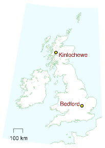
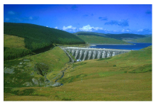
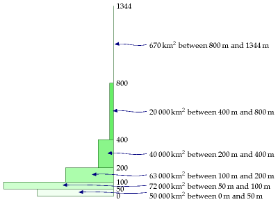
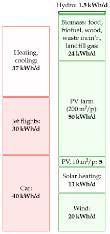
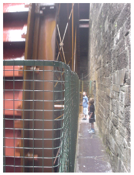

#Hydroelectricity

To make hydroelectric power, you need altitude, and you need rainfall. Let's
estimate the total energy of all the rain as it runs down to sea-level.

For this hydroelectric forecast, I'll divide Britain into two: the lower, dryer
bits, which I'll call "the lowlands;" and the higher, wetter bits, which I'll
call "the highlands." I'll choose Bedford and Kinlochewe as my representatives
of these two regions.

Let's do the lowlands first. To estimate the gravitational power of low-land 
rain, we multiply the rainfall in Bedford ($584 mm$ per year^[Statistics are
from the BBC weather centre.]) by the density of water ($1000\space kg/m^3$),
the strength of gravity ($10\space m/s^2$) and the typical lowland altitude
above the sea (say 100 m). The power per unit area works out to $0.02\space
W/m^2$. That's the power per unit area of land on which rain falls.

When we multiply this by the area per person ($2700\space m^2$, if the lowlands are
equally shared between all 60 million Brits), we find an average raw power of
about 1 kWh per day per person. This is the absolute upper limit for lowland
hydroelectric power, if every river were dammed and every drop perfectly
exploited. Realistically, we will only ever dam rivers with substantial height
drops, with catchment areas much smaller than the whole country. Much of the
water evaporates before it gets anywhere near a turbine, and no hydroelectric
system exploits the full potential energy of the water. We thus arrive at a firm
conclusion about lowland water power. People may enjoy making "run-of-the-river"
hydro and other small-scale hydroelectric schemes, but such lowland facilities
can never deliver more than $1\space kWh$ per day per person.



```{r nant-y-moch-dam, fig.cap="Nant-y-Moch dam, part of a 55 MW hydroelectric scheme in Wales. Photo by Dave Newbould, www.origins-photography.co.uk."}

```

[^**Erratum**^](http://www.withouthotair.com/Errata.html#55)

```{r altitudes-in-britain, fig.cap="Altitudes of land in Britain. The rectangles show how much land area there is at each height."}

```

Let's turn to the highlands. Kinlochewe is a rainier spot: it gets $2278 mm$ per
year, four times more than Bedford. The height drops there are bigger too – 
large areas of land are above $300 m$. So overall a twelve-fold increase in 
power per square metre is plausible for mountainous regions. The raw power per 
unit area is roughly $0.24\space W/m^2$^[We can check this estimate against the 
actual power density of the Loch Slo hydro-electric scheme, completed in 1950 
(Ross, 2008). The catchment area of Loch Sloy is about $83\space km^2$; the
rainfall there is about $2900 mm$ per year (a bit higher than the $2278\space mm/y$
of Kinlochewe); and the electricity output in 2006 was $142\space GWh$ per year,
which corresponds to a power density of $0.2W\space per\space m^2$ of catchment
area. Loch Sloy's surface area is about $1.5\space km^2$, so the hydroelectric
facility itself has a[^**E**^](http://www.withouthotair.com/Errata.html#56) per
unit lake area of $11\space W/m^2$. So the hillsides, aqueducts, and tunnels
bringing water to Loch Sloy act like a55-fold power concentrator.]. If the
highlands generously share their hydro-power with the rest of the UK (at
$1300\space m^2$ area per person), we find an upper limit of about $7\space kWh$
per day per person. As in the lowlands, this is the upper limit on raw power if
evaporation were outlawed and every drop were perfectly exploited.

What should we estimate is the plausible practical limit? Let's guess 20% of
this – 1.4 kWh per day, and round it up a little to allow for production in the
lowlands: 1.5 kWh per day.

The actual power from hydroelectricity in the UK today is
$0.2\space kWh/d\space per\space person$^[Source: MacLeay et al. (2007). In
2006, large-scale hydro produced $3515\space GWh$ (from plant with a capacity of
$1.37\space GW$); small-scale hydro, $212\space GWh$ ($0.01\space kWh/d/p$)
(from a capacity of $153\space MW$). In 1943, when the growth of
hydroelectricity was in full swing, the North of Scotland Hydroelectricity
Board's engineers estimated that the Highlands of Scotland could produce $6.3 TWh$
per year in 102 facilities – that would correspond to $0.3 kWh/d\space per\space person$
in the UK (Ross, 2008). Glendoe, the first new large-scale hydroelectric project
in the UK since 1957, will add capacity of $100 MW$ and is expected to deliver
$180 GWh$ per year. Glendoe's catchment area is $75 km^2$, so its
power density works out to $0.27 W\space per\space m^2$ of catchment area.
Glendoe has been billed as "big enough to power Glasgow." But if we share its
$180 GWh$ per year across the population of Glasgow (616 000 people), we get
only $0.8 kWh/d\space per\space person$. That is just 5% of the average 
electricity consumption of $17 kWh/d\space per\space person$. The 20-fold
exaggeration is achieved by focusing on Glendoe's peak output rather than its
average, which is 5 times smaller; and by discussing "homes" rather than the 
total electrical power of Glasgow (see section \@ref(reference-homes)).], so
this $1.5 kWh/d\space per\space person$ would require a seven-fold in-crease in
hydroelectric power.

```{r hydro-stack, fig.cap="Hydro-electricity"}

```

```{r waterwheel, fig.cap="A 60 kW waterwheel"}

```