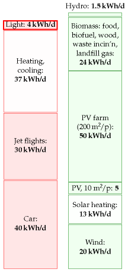
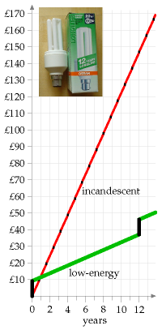
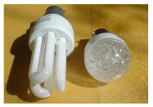

#Light

Lighting home and work
----------------------

The brightest domestic light-bulbs use 250 W, and bedside lamps use 40
W. In an old-fashioned incandescent bulb, most of this power gets turned
into heat, rather than light. A fluorescent tube can produce an equal
amount of light using one quarter of the power of an incandescent bulb.

How much power does a moderately affluent person use for lighting? My
rough estimate, based on table 9.2, is that a typical two-person
home with a mix of low-energy and high-energy bulbs uses about 5.5 kWh
per day, or 2.7 kWh per day per person. I assume that each person also
has a workplace where they share similar illumination with their
colleagues;guessing that the workplace uses 1.3 kWh/d per person, we get
a round figure of 4 kWh/d per person.

Street-lights and traffic lights
--------------------------------

Do we need to include public lighting too, to get an accurate estimate, or do 
home and work dominate the lighting budget? Street-lights in fact use about 0.1 
kWh per day per person^[There's roughly one sodium street-light per 10 people; 
each light has a power of 100 W, switched on for 10 hours per day. That's 0.1 
kWh per day per person.], and traffic lights only $0.005\space kWh/d$ per person
– both negligible, compared with our home and workplace lighting. What about 
other forms of public lighting – illuminated signs and bollards, for example? 
There are fewer of them than street-lights^[[www.highwayelectrical.org.uk]. 
There are 7.7 million lighting units (street lighting, illuminated signs and 
bollards) in the UK. Of these, roughly 7 millionare street-lights and 1 million 
are illuminated road signs. There are 210 000 traffic signals. According to
DUKES 2005, the total power for public lighting is 2095 GWh/y, which is 0.1
kWh/d per person.]; and street-lights already came in well under our radar, so
we don't need to modify our overall estimate of 4 kWh/d per person.

Lights on the traffic

In some countries, drivers must switch their lights on whenever their
car is moving. How does the extra power required by that policy
compare with the power already being used to trundle the car around?
Let's say the car has four incandescent lights totalling 100 W. The
electricity for those bulbs is supplied by a 25%-efficient engine
powering a 55%-efficient generator, so the power required is 730 W. For
comparison, a typical car going at an average speed of 50 km/h and
consuming one litre per 12 km

  Device                   power    Time per day   Energy per day per home
  ------------------------ -------- -------------- ------------------------
  10 incandescent lights   1 kW     5 h            5 kWh
  10 low-energy lights     0.1 kW   5 h            0.5 kWh



Figure 9.1. Lighting – 4 kWh per day per person.

Table 9.2. Electric consumption for domestic lighting. A plausible total
is 5.5 kWh per home per day; and a similar figure at work; perhaps 4 kWh
per day per person.

has an average power consumption of 42 000W. So having the lights
on while driving requires 2% extra power.

What about the future's electric cars? The power consumption of atypical
electric car is about 5000 W. So popping on an extra 100 W would increase
its consumption by 2%. Power consumption would be smaller if we switched
all car lights to light-emitting diodes, but if we pay anymore attention
to this topic, we will be coming down with a severe case
of every-little-helps-ism.

The economics of low-energy bulbs
---------------------------------

Generally I avoid discussing economics, but I'd like to make an exception for 
light-bulbs. Osram's 20 W low-energy bulb claims the same light output as a 100 
W incandescent bulb. Moreover, its lifetime is said to be 15,000 hours (or "12 
years," at 3 hours per day). In contrast a typical incandescent bulb might last 
1000 hours. So during a 12-year period, you have this choice (figure
\@ref(fig:replace-old-bulbs)) : buy 15 incandescent bulbs and 1500 kWh of
electricity (which costs roughly £150); or buy one low-energy bulb and300 kWh of
electricity (which costs roughly £30).

#### Should I wait until the old bulb dies before replacing it?

It feels like a waste, doesn't it? Someone put resources into making the old 
incandescent light-bulb; shouldn't we cash in that original investment by using 
the bulb until it's worn out? But the economic answer is clear: *continuing to 
use an old light-bulb is throwing good money after bad*. If you can find a 
satisfactory low-energy replacement, replace the old bulb now.

#### What about the mercury in compact fluorescent lights? Are LEDbulbs better than fluorescents?

Researchers say that LED (light-emitting diode) bulbs will soon be
even more energy-efficient than compact fluorescent lights. The
efficiency of alight is measured in *lumens per watt*. I checked the
numbers on my latest purchases: the Philips Genie 11 W compact
fluorescent bulb (images/figure 9.4)has a brightness of 600 lumens, which is an
efficiency of **55 lumens perwatt**; regular incandescent bulbs deliver
**10 lumens per watt**; the Omicron1.3 W lamp, which has 20 white LEDs
hiding inside it, has a brightness of 46 lumens, which is an efficiency
of **35 lumens per watt**. So this LED bulb is almost as efficient as the
fluorescent bulb. The LED industry still has a little catching up to do.
In its favour, the LED bulb has a life of50 000 hours, eight times the
life of the fluorescent bulb. As I write, I see that www.cree.com is
selling LEDs with a power of **100 lumens perwatt**. It's projected that
in the future, white LEDs will have an efficiency of over 150 lumens per
watt [ynjzej]. I expect that within another couple of years, the best
advice, from the point of view of both energy efficiency and avoiding
mercury pollution, will be to use LED bulbs.

```{r replace-old-bulbs, fig.cap="Total cumulative cost of using a traditional incandescent 100 W bulb for 3 hours per day, compared with replacing it *now* with an Osram Dulux Long-life Energy Saver (pictured). Assumptions: electricity costs 10p per kWh; replacement traditional bulbs cost 45p each; energy-saving bulbs cost £9. (I know you can find them cheaper than this, but this graph shows that even at £9, they're much more economical.)"}

lighting_old <- tibble::data_frame(year = 0:14, type = 'incandescent')
lighting_old <- mutate(lighting_old, `replacement cost` = 45)
lighting_old <- mutate(lighting_old, `running cost` = 3 * 0.3 * 10 * 365)

lighting_new <- tibble::data_frame(year = 0:14, type = 'compact flurescent')
lighting_new <- mutate(lighting_new, `replacement cost` = 0)
lighting_new$`replacement cost`[1]  <- 900
lighting_new$`replacement cost`[13] <- 900
lighting_new <- mutate(lighting_new, `running cost` = 3 * 0.02 * 10 * 365)

lighting_costs <- rbind(lighting_old, lighting_new)
lighting_costs <- mutate(lighting_costs, cost = `running cost` + `replacement cost`)
lighting_costs <- lighting_costs %>% group_by(type) %>% mutate(csum = cumsum(cost))


# add 45p each year for traditional bulb replacement
# 
ggplot(data = lighting_costs) +
  geom_line(mapping = aes(x = year, y = csum / 100, colour = type)) +
  labs(x = 'Year', y = "Cost (£)")
```



Figure 9.4. Philips 11 W alongside Omicron 1.3 W LED bulb.

### Mythconceptions

#### "There is no point in my switching to energy-saving lights. The "wasted" energy they put out heats my home, so it's not wasted."

This myth is addressed in section \@ref(waste-heat-not-wasted).

Notes and further reading
-------------------------

page no.

57*Street-lights use about 0.1 kWh per day per person...* 

–*... and traffic lights only 0.005 kWh/d per person*. Britain has 420
000 traffic and pedestrian signal light bulbs, consuming 100 million kWh
of electricity per year. Shared between 60 million people, 100 million
kWh per year is0.005 kWh/d per person.

–*There are fewer signs and illuminated bollards than
street-lights*.

–*55%-efficient generator* – source:en.wikipedia.org/wiki/Alternator.
Generators in power stations are much more efficient at converting
mechanical work to electricity.

```{r lighting-efficiencies, fig.cap="Lighting efficiencies of commercially-available bulbs. In the future, white LEDs are expected to deliver 150 lumens per watt."}
bulb_types = c('incandescent', 'halogen', 'whte LED',
               'compact fluorescent', 'large fluorescent',
               'sodium street light')

efficiencies <- c(10, '16-24', 35, 55, 94, 150)

lighting_efficiencies <- tibble::data_frame(`Bulb type` = bulb_types, `efficiency (lumens/W)` = efficiencies)
pander::pander(lighting_efficiencies)
```