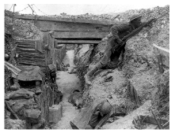
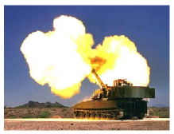
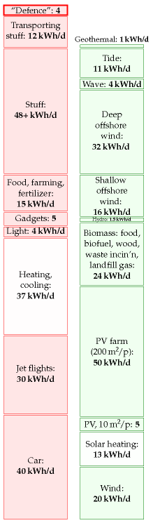
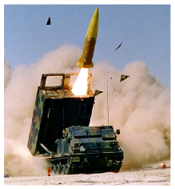
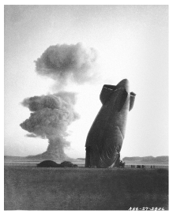

#Public services

> Every gun that is made, every warship launched, every rocket fired
> signifies, in the final sense, a theft from those who hunger and are
> not fed, those who are cold and are not clothed.
>
> This world in arms is not spending money alone. It is spending the
> sweat of its laborers, the genius of its scientists, the hopes of its
> children.
>
> President Dwight D. Eisenhower – April, 1953

The energy cost of "defence"
----------------------------

Let's try to estimate how much energy we spend on our military.

In 2007–8, the fraction of British central government expenditure that
went to defence was £33 billion/£587 billion = 6%. If we include the
UK's spending on counter-terrorism and intelligence (£2.5 billion per
year and rising), the total for defensive activities comes to £36
billion.

As a crude estimate we might guess that 6% of this £36 billion is spent
on energy at a cost of 2.7p per kWh. (6% is the fraction of GDP that is
spent on energy, and 2.7p is the average price of energy.) That works
out to about 80 TWh per year of energy going into defence: making
bullets, bombs, nuc- lear weapons; making devices for delivering
bullets, bombs, and nuclear weapons; and roaring around keeping in trim
for the next game of good- against-evil. In our favourite units, this
corresponds to 4 kWh per day per person.

The cost of nuclear defence
---------------------------

The financial expenditure by the USA on manufacturing and deploying
nuclear weapons from 1945 to 1996 was \$5.5 trillion (in 1996 dollars).

Nuclear-weapons spending over this period exceeded the combined to- tal
federal spending for education; agriculture; training, employment, and
social services; natural resources and the environment; general science,
space, and technology; community and regional development (including
disaster relief); law enforcement; and energy production and regulation.

If again we assume that 6% of this expenditure went to energy at a cost
of 5¢ per kWh, we find that the energy cost of having nuclear weapons
was 26 000 kWh per American, or 1.4 kWh per day per American (shared
among 250 million Americans over 51 years).

What energy would have been delivered to the lucky recipients, had all
those nuclear weapons been used? The energies of the biggest thermonu-
clear weapons developed by the USA and USSR are measured in megatons of
TNT. A ton of TNT is 1200 kWh. The bomb that destroyed Hiroshima

had the energy of 15 000 tons of TNT (18 million kWh). A *megaton* bomb
delivers an energy of 1.2 billion kWh. If dropped on a city of one
million, a megaton bomb makes an energy donation of 1200 kWh per person,
equivalent to 120 litres of petrol per person. The total energy of the
USA's nuclear arsenal today is 2400 megatons, contained in 10 000
warheads. In the good old days when folks really took defence seriously,
the arsenal's energy was 20 000 megatons. These bombs, if used, would
have delivered an energy of about 100 000 kWh per American. That's
equivalent to 7 kWh per day per person for a duration of 40 years –
similar to all the electrical energy supplied to America by nuclear
power.

### Energy cost of making nuclear materials for bombs

The main nuclear materials are plutonium, of which the USA has produced
104 t, and high-enriched uranium (HEU), of which the USA has produced
994 t. Manufacturing these materials requires energy.

The most efficient plutonium-production facilities use 24 000 kWh of
heat when producing 1 gram of plutonium. So the direct energy-cost of
making the USA's 104 tons of plutonium (1945–1996) was at least 2.5
tril- lion kWh which is 0.5 kWh per day per person (if shared between
250 million Americans).

The main energy-cost in manufacturing HEU is the cost of enrichment.
Work is required to separate the ^235^U and ^238^U atoms in natural
uranium in order to create a final product that is richer in ^235^U. The
USA's production of 994 tons of highly-enriched uranium (the USA's
total, 1945–1996) had an energy cost of about 0.1 kWh per day per
person.

> "Trident creates jobs." Well, so does relining our schools with
> asbestos,but that doesn't mean we should do it!
>
> Marcus Brigstocke

Universities
------------

According to Times Higher Education Supplement (30 March 2007), UK
universities use 5.2 billion kWh per year. Shared out among the whole
population, that's a power of 0.24 kWh per day per person.

So higher education and research seem to have a much lower energy cost
than defensive war-gaming.

There may be other energy-consuming public services we could talk about,
but at this point I'd like to wrap up our race between the red and green
stacks.

Figure 17.1. The energy cost of defence in the UK is estimated to be
about 4 kWh per day per person.

Notes and further reading
-------------------------

page no.

100*military energy budget*. The UK budget can be found at [yttg7p];
defence gets £33.4 billion [fcqfw] and intelligence and
counter-terrorism £2.5 billion per year [2e4fcs]. According to p14 of
the Government's Expenditure Plans 2007/08 [33x5kc], the "total resource
budget" of the Department of Defence is a bigger sum, £39 billion, of
which £33.5 billion goes for "provision of defence capability" and £6
billion for armed forces pay and pensions and war pensions. A breakdown
of this budget can be found here: [35ab2c]. See also [yg5fsj], [yfgjna],
and www.conscienceonline.org.uk. The US military's energy consumption is
published: "The Department of Defense is the largest single consumer of
energy in the United States. In 2006, it spent \$13.6 billion to buy 110
million barrels of petroleum fuel [roughly 190 billion kWh] and 3.8
billion kWh of electricity" (Dept. of Defense, 2008). This figure
describes the direct use of fuel and electricity and doesn't include the
embodied energy in the military's toys. Dividing by the US population of
300 million, it comes to 1.7 kWh/d per person.

–*The financial expenditure by the USA on manufacturing and deploying
nuclear weapons from 1945 to 1996 was \$5.5 trillion (in 1996 dollars)*.
Source: Schwartz (1998).

101*Energy cost of plutonium production*. [slbae].

–*The USA's production of 994 tons of HEU...* Material enriched to
between 4% and 5% ^235^U is called low-enriched uranium (LEU).
90%-enriched ura- nium is called high-enriched uranium (HEU). It takes
three times as much work to enrich uranium from its natural state to 5%
LEU as it does to enrich LEU to 90% HEU. The nuclear power industry
measures these energy requirements in a unit called the separative work
unit (SWU). To produce a kilogram of ^235^U as HEU takes 232 SWU. To
make 1 kg of ^235^U as LEU (in 22.7 kg of LEU) takes about 151 SWU. In
both cases one starts from natural uranium (0.71% 235U) and discards
depleted uranium containing 0.25% ^235^U. The commercial nuclear fuel
market values an SWU at about \$100. It takes about 100 000 SWU of
enriched uranium to fuel a typical 1000 MW commer- cial nuclear reactor
for a year. Two uranium enrichment methods are cur- rently in commercial
use: gaseous diffusion and gas centrifuge. The gaseous diffusion process
consumes about 2500 kWh per SWU, while modern gas centrifuge plants
require only about 50 kWh per SWU. [yh45h8], [t2948], [2ywzee]. A modern
centrifuge produces about 3 SWU per year. The USA's production of 994
tons of highly-enriched uranium (the USA's total, 1945–1996) cost 230
million SWU, which works out to 0.1 kWh/d per person (assuming 250
million Americans, and using 2500 kWh/SWU as the cost of diffusion
enrichment).

