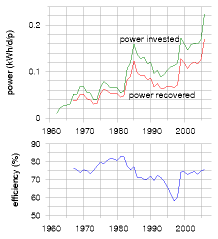
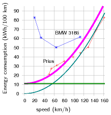

#Every BIG helps

We've established that the UK's present lifestyle can't be sustained on
the UK's own renewables (except with the industrialization of
country-sized areas of land and sea). So, what are our options, if we
wish to get off fossil fuels and live sustainably? We can balance the
energy budget either by reducing demand, or by increasing supply, or, of
course, by doing both.

Have no illusions. To achieve our goal of getting off fossil fuels,
these reductions in demand and increases in supply must be *big*. Don't
be distracted by the myth that "every little helps." *If everyone does a
little, we'll achieve only a little*. We must do a lot. What's required
are *big* changes in demand and in supply.

"But surely, if 60 million people all do a little, it'll add up to a
lot?" No. This "if-everyone" multiplying machine is just a way of making
something small *sound* big. The "if-everyone" multiplying machine
churns out inspirational statements of the form "if *everyone* did X,
then it would provide enough energy/water/gas to do Y," where Y sounds
impressive. Is it surprising that Y sounds big? Of course not. We got Y
by multiplying X by the number of people involved – 60 million or so!
Here's an example from the Conservative Party's otherwise
straight-talking *Blueprint for a Green Economy*:

> "The mobile phone charger averages around ... 1W consumption, but if
> every one of the country's 25 million mobile phones chargers were left
> plugged in and switched on they would consume enough electricity
> (219GWh) to power 66 000 homes for one year."

66 000? Wow, what a lot of homes! Switch off the chargers! 66 000 sounds
a lot, but the sensible thing to compare it with is the total number of
homes that we're imagining would participate in this feat of
conservation, namely 25 *million* homes. 66 000 is just *one quarter of
one percent* of 25 million. So while the statement quoted above is true,
I think a calmer way to put it is:

> If you leave your mobile phone charger plugged in, it uses one quarter
> of one percent of your home's electricity.

And if everyone does it?

> If *everyone* leaves their mobile phone charger plugged in, those
> chargers will use one quarter of one percent of their homes'
> electricity.

The "if-everyone" multiplying machine is a bad thing because it deflects
people's attention towards 25million minnows instead of 25million
sharks. The mantra "*Little changes can make a big difference*" is
bunkum, when applied to climate change and power. It may be true that
"many people doing

Figure 19.1. Reproduced by kind permission of PRIVATE EYE / Robert
Thompson www.private-eye.co.uk.

a little adds up to a lot," if all those "littles" are somehow focused
into a single "lot" – for example, if one million people donate £10 to
*one* accident- victim, then the victim receives £10 million. That's a
lot. But power is a very different thing. We all use power. So to
achieve a "big difference" in total power consumption, you need almost
everyone to make a "big" difference to their own power consumption.

So, what's required are *big* changes in demand and in supply. Demand
for power could be reduced in three ways:

1.  by reducing our population (images/figure 19.2);
2.  by changing our lifestyle;
3.  by keeping our lifestyle, but reducing its energy intensity through
    "efficiency" and "technology."

Supply could be increased in three ways:

1.  We could get off fossil fuels by investing in "clean coal"
    technology. Oops! Coal is a fossil fuel. Well, never mind – let's
    take a look at this idea. If we used coal "sustainably" (a notion
    we'll define in a moment), how much power could it offer? If we
    don't care about sustainability and just want "security of supply,"
    could coal offer that?
2.  We could invest in nuclear fission. Is current nuclear technology
    "sustainable"? Is it at least a stop-gap that might last for 100
    years?
3.  We could buy, beg, or steal renewable energy from other countries –
    bearing in mind that most countries will be in the same boat as
    Britain and will have no renewable energy to spare; and also bearing
    in mind that sourcing renewable energy from another country doesn't
    magically shrink the renewable power facilities required. If we
    import renewable energy from other countries in order to avoid
    building renewable facilities the size of Wales in *our* country,
    someone will have to build facilities roughly the size of Wales in
    those other countries.

The next seven chapters discuss first how to reduce demand
substantially, and second how to increase supply to meet that reduced,
but still "huge," demand. In these chapters, I won't mention *all* the
good ideas. I'll discuss just the *big* ideas.

Cartoon Britain
---------------

To simplify and streamline our discussion of demand reduction, I propose
to work with a cartoon of British energy consumption, omitting lots of
details in order to focus on the big picture. My cartoon-Britain
consumes

*While the footprint of each individual cannot be reduced to zero, the
absence of an individual does do so.*

Chris Rapley, former Director of the British Antarctic Survey

*We need fewer people, not greener ones.*

Daily Telegraph, 24 July 2007

*Democracy cannot survive overpopulation. Human dignity cannot survive
overpopulation.*

Isaac Asimov

Figure 19.2. Population growth and emissions... Cartoon courtesy of
Colin Wheeler.

energy in just three forms: heating, transport, and electricity. The
heating consumption of cartoon-Britain is 40 kWh per day per person
(currently all supplied by fossil fuels); the transport consumption is
also 40 kWh per day per person (currently all supplied by fossil fuels);
and the electricity consumption is 18 kWh(e) per day per person; the
electricity is currently al- most all generated from fossil fuels; the
conversion of fossil-fuel energy to electricity is 40% efficient, so
supplying 18 kWh(e) of electricity in today's cartoon-Britain requires a
fossil-fuel input of 45 kWh per day per person. This simplification
ignores some fairly sizeable details, such as agriculture and industry,
and the embodied energy of imported goods! But I'd like to be able to
have a *quick* conversation about the main things we need to do to get
off fossil fuels. Heating, transport, and electricity account for more
than half of our energy consumption, so if we can come up with a plan
that delivers heating, transport, and electricity sustainably, then we
have made a good step on the way to a more detailed plan that adds up.

Having adopted this cartoon of Britain, our discussions of demand re-
duction will have just three bits. First, how can we reduce transport's
energy-demand and eliminate all fossil fuel use for transport? This is
the topic of Chapter 20. Second, how can we reduce heating's
energy-demand and eliminate all fossil fuel use for heating? This is the
topic of Chapter 21. Third, what about electricity? Chapter 22 discusses
efficiency in electricity consumption.

Three supply options – clean coal, nuclear, and other people's
renewables – are then discussed in Chapters 23, 24, and 25. Finally,
Chapter 26 discusses how to cope with fluctuations in demand and
fluctuations in renewable power production.

Having laid out the demand-reducing and supply-increasing options,
Chapters 27 and 28 discuss various ways to put these options together to
make plans that add up, in order to supply cartoon-Britain's transport,
heating, and electricity.

I could spend many pages discussing "50 things you can do to make a
difference," but I think this cartoon approach, chasing the three
biggest fish, should lead to more effective policies.

But what about "stuff"? According to Part I, the embodied energy in
imported stuff might be the biggest fish of all! Yes, perhaps that fish
is the mammoth in the room. But let's leave defossilizing that mammoth
to one side, and focus on the animals over which we have direct control.

So, here we go: let's talk about transport, heating, and electricity.

For the impatient reader
------------------------

Are you eager to know the end of the story right away? Here is a quick
summary, a sneak preview of Part II.

First, we electrify transport. Electrification both gets transport off
fossil fuels, and makes transport more energy-efficient. (Of course,
electrification

Figure 19.3. Current consumption in "cartoon-Britain 2008."

increases our demand for green electricity.)

Second, to supplement solar-thermal heating, we electrify most heating
of air and water in buildings using *heat pumps*, which are four times
more efficient than ordinary electrical heaters. This electrification of
heating further increases the amount of green electricity required.

Third, we get all the green electricity from a mix of four sources: from
our own renewables; perhaps from "clean coal;" perhaps from nuclear; and
finally, and with great politeness, from other countries' renewables.

Among other countries' renewables, solar power in deserts is the most
plentiful option. As long as we can build peaceful international
collabor- ations, solar power in other people's deserts certainly has
the technical potential to provide us, them, and everyone with 125 kWh
per day per person.

Questions? Read on.

20   Better transport {.darkblue}
=====================

> Modern vehicle technology can reduce climate change emissions without
> changing the look, feel or performance that owners have come to
> expect.
>
> California Air Resources Board

Roughly one third of our energy goes into transportation. Can
*technology* deliver a reduction in consumption? In this chapter we
explore options for achieving two goals: to deliver the biggest possible
reduction in transport's energy use, *and* to eliminate fossil fuel use
in transport.

Transport featured in three of our consumption chapters: Chapter 3
(cars), Chapter 5 (planes), and Chapter 15 (road freight and sea
freight). So there are two sorts of transport to address: passenger
transport, and freight. Our unit of passenger transport is the
passenger-kilometre (p-km). If a car carries one person a distance of
100 km, it delivers 100 p-km of transportation. If it carries four
people the same distance, it has delivered 400 p-km. Similarly our unit
of freight transport is the ton-km (t-km). If a truck carries 5 t of
cargo a distance of 100 km then it has delivered 500 t-km of
freight-transport. We'll measure the energy consumption of passenger
transport in "kWh per 100 passenger-kilometres," and the energy con-
sumption of freight in "kWh per ton-km." Notice that these measures are
the other way up compared to "miles per gallon": whereas we like
vehicles to deliver *many* miles per gallon, we want energy-consumption
to be *few* kWh per 100 p-km.

We'll start this chapter by discussing how to reduce the energy con-
sumption of surface transport. To understand how to reduce energy con-
sumption, we need to understand where the energy is going in surface
transport. Here are the three key concepts, which are explained in more
detail in Technical Chapter A.

1.  In *short-distance travel* with lots of starting and stopping, the
    energy mainly goes into speeding up the vehicle and its contents.
    Key strate- gies for consuming less in this sort of transportation
    are therefore to *weigh less*, and to *go further between stops*.
    Regenerative braking, which captures energy when slowing down, may
    help too. In addition, it helps to *move slower*, and to *move
    less*.
2.  In *long-distance travel* at steady speed, by train or automobile,
    most of the energy goes into making air swirl around, because you
    only have to accelerate the vehicle once. The key strategies for
    consuming less in this sort of transportation are therefore to *move
    slower*, and to *move less*, and to *use long, thin vehicles*.
3.  In all forms of travel, there's an energy-conversion chain, which
    takes energy in some sort of fuel and uses some of it to push the
    vehicle

Figure 20.1. This chapter's starting point: an urban luxury tractor. The
average UK car has a fuel consumption of 33 miles per gallon, which
corresponds to an energy consumption of 80 kWh per 100 km. Can we do
better?

1.  forwards. Inevitably this energy chain has inefficiencies. In a
    stan- dard fossil-fuel car, for example, only 25% is used for
    pushing, and roughly 75% of the energy is lost in making the engine
    and radiator hot. So a final strategy for consuming less energy is
    to make the energy-conversion chain more efficient.

These observations lead us to six principles of vehicle design and vehi-
cle use for more-efficient surface transport: *a)* reduce the frontal
area per person; *b)* reduce the vehicle's weight per person; *c)* when
travelling, go at a steady speed and avoid using brakes; *d)* travel
more slowly; *e)* travel less; and *f)* make the energy chain more
efficient. We'll now discuss a variety of ways to apply these
principles.

How to roll better
------------------

A widely quoted statistic says something along the lines of "only *1
percent* of the energy used by a car goes into moving the driver" – the
implication being that, surely, by being a bit smarter, we could make
cars *100* times more efficient? The answer is yes, almost, but only by
applying the princi- ples of vehicle design and vehicle use, listed
above, to *extreme* degrees.

One illustration of extreme vehicle design is an eco-car, which has
small frontal area and low weight, and – if any records are to be broken
– is carefully driven at a low and steady speed. The *Team Crocodile*
eco-car (images/figure 20.2) does 2184 miles per gallon (1.3 kWh per 100 km) at
a speed of 15 mph (24 km/h). Weighing 50 kg and shorter in height than a
traffic cone, it comfortably accommodates one teenage driver.

Hmm. I think that the driver of the urban tractor in figure 20.1 might
detect a change in "look, feel and performance" if we switched them to
the eco-car and instructed them to keep their speed below 15 miles per
hour. So, the idea that cars could easily be 100 times more energy
efficient is a myth. We'll come back to the challenge of making
energy-efficient cars in a moment. But first, let's see some other ways
of satisfying the principles of more-efficient surface transport.

Figure 20.3 shows a multi-passenger vehicle that is at least 25 times
more energy-efficient than a standard petrol car: a bicycle. The
bicycle's performance (in terms of energy per distance) is about the
same as the eco- car's. Its speed is the same, its mass is lower than
the eco-car's (because the human replaces the fuel tank and engine), and
its effective frontal area is higher, because the cyclist is not so well
streamlined as the eco-car.

Figure 20.4 shows another possible replacement for the petrol car: a
train, with an energy-cost, if full, of 1.6 kWh per 100 passenger-km. In
contrast to the eco-car and the bicycle, trains manage to achieve
outstanding efficiency without travelling slowly, and without having a
low weight per person. Trains make up for their high speed and heavy
frame by exploiting the principle of small frontal area per person.
Whereas a cyclist

Figure 20.2. Team Crocodile's eco-car uses 1.3 kWh per 100 km. Photo
kindly provided by Team Crocodile. www.teamcrocodile.com

Figure 20.3. "Babies on board." This mode of transportation has an
energy cost of 1 kWh per 100 person-km.

Figure 20.4. This 8-carriage train, at its maximum speed of 100mph (161
km/h), consumes 1.6 kWh per 100 passenger-km, if full.

and a regular car have effective frontal areas of about 0.8 m^2^ and 0.5
m^2^ re- spectively, a full commuter train from Cambridge to London has
a frontal area per passenger of 0.02 m^2^.

But whoops, now we've broached an ugly topic – the prospect of sharing a
vehicle with "all those horrible people." Well, squish aboard, and let's
ask: How much could consumption be reduced by a switch from personal
gas-guzzlers to excellent integrated public transport?

Public transport
----------------

At its best, shared public transport is far more energy-efficient than
indi- vidual car-driving. A diesel-powered **coach**, carrying 49
passengers and doing 10 miles per gallon at 65 miles per hour, uses 6
kWh per 100 p-km – 13 times better than the single-person car.
Vancouver's **trolleybuses** con- sume 270 kWh
per[^**E**^](http://www.withouthotair.com/Errata.html#120) vehicle-km,
and have an average speed of 15 km/h. If the trolleybus has 40
passengers on board, then its passenger transport cost is 7 kWh per 100
p-km. The Vancouver **SeaBus** has a transport cost of 83 kWh per
vehicle-km at a speed of 13.5 km/h. It can seat 400 people, so its
passenger transport cost when full is 21 kWh per 100 p-km. London
**underground trains**, at peak times, use 4.4 kWh per 100 p-km – 18
times better than individual cars. Even **high-speed trains**, which
violate two of our energy-saving principles by going twice as fast as
the car and weighing a lot, are much more energy efficient: if the
electric high-speed train

Figure 20.5. Some public transports, and their energy-efficiencies, when
on best behaviour. Tubes, outer and inner. Two high-speed trains. The
electric one uses 3 kWh per 100 seat-km; the diesel, 9 kWh. Trolleybuses
in San Francisco. Vancouver SeaBus. Photo by Larry.

Private vehicles: technology, legislation, and incentives
---------------------------------------------------------

The energy consumption of individual cars can be reduced. The wide range
of energy efficiencies of cars for sale proves this. In a single show-
room in 2006 you could buy a Honda Civic 1.4 that uses roughly 44 kWh
per 100 km, or a Honda NSX 3.2 that uses 116 kWh per 100 km (images/figure
20.9). The fact that people merrily *buy* from this wide range is also
proof that we need extra incentives and legislation to encourage the
blithe consumer to *choose* more energy-efficient cars. There are
various ways to help con- sumers prefer the Honda Civic over the Honda
NSX 3.2 gas-guzzler: raising the price of fuel; cranking up the showroom
tax (the tax on new cars) in proportion to the predicted lifetime
consumption of the vehicle; cranking up the road-tax on gas guzzlers;
parking privileges for economical cars (images/figure 20.10); or fuel
rationing. All such measures are unpopular with at least some voters.
Perhaps a better legislative tactic would be to *enforce* rea- sonable
energy-efficiency, rather than continuing to allow unconstrained choice;
for example, we could simply *ban*, from a certain date, the sale of
*any* car whose energy consumption is more than 80 kWh per 100 km; and
then, over time, reduce this ceiling to 60 kWh per 100 km, then 40 kWh
per 100 km, and beyond. Alternatively, to give the consumer more choice,
regulations could force car manufacturers to reduce the *average* energy
consumption of all the cars they sell. Additional legislation limiting
the weight and frontal area of vehicles would simultaneously reduce fuel
con- sumption and improve safety for other road-users (images/figure 20.11).
People today choose their cars to make fashion statements. With strong
efficiency legislation, there could still be a wide choice of fashions;
they'd all just happen to be energy-efficient. You could choose any
colour, as long as it was green.

Figure 20.9. Carbon pollution, in grams CO~2~ per km, of a selection of
cars for sale in the UK. The horizontal axis shows the emission rate,
and the height of the blue histogram indicates the number of models on
sale with those emissions in 2006. Source: www.newcarnet.co.uk. The
second horizontal scale indicates approximate energy consumptions,
assuming that 240 g CO~2~ is associated with 1 kWh of chemical energy.

Figure 20.10. Special parking privileges for electric cars in Ann Arbor,
Michigan.

Figure 20.11. Monstercars are just tall enough to completely obscure the
view and the visibility of pedestrians.

In the French city of Lyon, a privately-run public bicycle network,
V´elo'v, was introduced in 2005 and has proved popular. Lyon's
population of 470 000 inhabitants is served by 2000 bikes distributed
around 175 cycle-stations in an area of 50 km^2^ (images/figure 20.15). In the
city centre, you're usually within 400 metres of a cycle-station. Users
join the scheme by paying a subscription fee of €10 per year and may
then hire bicycles free for all trips lasting less than 30 minutes. For
longer hire periods, users pay up to €1 per hour. Short-term visitors to
Lyon can buy one-week subscriptions for €1.

### Other legislative opportunities

Speed limits are a simple knob that could be twiddled. As a rule, cars
that travel slower use less energy (see Chapter A). With practice,
drivers can learn to drive more economically: using the accelerator and
brake less and always driving in the highest possible gear can give a
20% reduction in fuel consumption.

Another way to reduce fuel consumption is to reduce congestion. Stop-
ping and starting, speeding up and slowing down, is a much less
efficient way to get around than driving smoothly. Idling in stationary
traffic is an especially poor deliverer of miles per gallon!

Congestion occurs when there are too many vehicles on the roads. So one
simple way to reduce congestion is to group travellers into fewer ve-
hicles. A striking way to think about a switch from cars to coaches is
to calculate the road area required by the two modes. Take a trunk road
on the verge of congestion, where the desired speed is 60 mph. The safe
dis- tance from one car to the next at 60 mph is 77 m. If we assume
there's one car every 80 m and that each car contains 1.6 people, then
vacuuming up 40 people into a single coach frees up *two kilometres* of
road!

Congestion can be reduced by providing good alternatives (cycle lanes,
public transport), and by charging road users extra if they contribute
to congestion. In this chapter's notes I describe a fair and simple
method for handling congestion-charging.

Enhancing cars
--------------

Assuming that the developed world's love-affair with the car is not
about to be broken off, what are the technologies that can deliver
significant en- ergy savings? Savings of 10% or 20% are easy – we've
already discussed some ways to achieve them, such as making cars smaller
and lighter. Another option is to switch from petrol to diesel. Diesel
engines are more expensive to make, but they tend to be more
fuel-efficient. But are there technologies that can radically increase
the efficiency of the energy-conversion chain? (Recall that in a
standard petrol car, 75% of the energy is turned

Figure 20.15. A V´elo'v station in Lyon.

Figure 20.16. With congestion like this, it's faster to walk.

into heat and blown out of the radiator!) And what about the goal of
getting off fossil fuels?

In this section, we'll discuss five technologies: regenerative braking;
hybrid cars; electric cars; hydrogen-powered cars; and compressed-air
cars.

### Regenerative braking

There are four ways to capture energy as a vehicle slows down.

1.  An electric generator coupled to the wheels can charge up an
    electric battery or supercapacitor.
2.  Hydraulic motors driven by the wheels can make compressed air,
    stored in a small canister.
3.  Energy can be stored in a flywheel.
4.  Braking energy can be stored as gravitational energy by driving the
    vehicle up a ramp whenever you want to slow down. This gravitational
    energy storage option is rather inflexible, since there must be a
    ramp in the right place. It's an option that's most useful for
    trains, and it is illustrated by the London Underground's Victoria
    line, which has hump-back stations. Each station is at the top of a
    hill in the track. Arriving trains are automatically slowed down by
    the hill, and departing trains are accelerated as they go down the
    far side of the hill. The hump-back-station design provides an
    energy saving of 5% and makes the trains run 9% faster.

Electric regenerative braking (using a battery to store the energy)
salvages roughly 50% of the car's energy in a braking event, leading to
perhaps a 20% reduction in the energy cost of city driving.

Figure 20.17. A BMW 530i modified by Artemis Intelligent Power to use
digital hydraulics. Lower left: A 6-litre accumulator (the red
canister), capable of storing about 0.05 kWh of energy in compressed
nitrogen. Lower right: Two 200 kW hydraulic motors, one for each rear
wheel, which both accelerate and decelerate the car. The car is still
powered by its standard 190 kW petrol engine, but thanks to the digital
hydraulic transmission and regenerative braking, it uses 30% less fuel.

Regenerative systems using flywheels and hydraulics seem to work a
little better than battery-based systems, salvaging at least 70% of the
brak- ing energy. Figure 20.17 describes a hybrid car with a petrol
engine powering digitally-controlled hydraulics. On a standard driving
cycle, this car uses 30% less fuel than the original petrol car. In
urban driving, its energy consumption is halved, from 131 kWh per 100 km
to 62 kWh per 100 km (20 mpg to 43 mpg). (Credit for this performance
improvement must be shared between regenerative braking and the use of
hybrid technology.) Hydraulics and flywheels are both promising ways to
handle regenerative braking because small systems can handle large
powers. A flywheel system weighing just 24 kg (images/figure 20.18), designed
for energy storage in a racing car, can store 400 kJ (0.1 kWh) of energy
– enough energy to acceler- ate an ordinary car up to 60 miles per hour
(97 km/h); and it can accept or deliver 60 kW of power. Electric
batteries capable of delivering that much power would weigh about 200
kg. So, unless you're already carrying that much battery on board, an
electrical regenerative-braking system should probably use capacitors to
store braking energy. Super-capacitors have similar energy-storage and
power-delivery parameters to the flywheel's.

### Hybrid cars

Hybrid cars such as the Toyota Prius (images/figure 20.19) have more-efficient
engines and electric regenerative braking, but to be honest, today's
hybrid vehicles don't really stand out from the crowd (images/figure 20.9).

The horizontal bars in figure 20.9 highlight a few cars including two
hybrids. Whereas the average new car in the UK emits 168 g, the hybrid
Prius emits about 100 g of CO~2~ per km, as do several other non-hybrid
vehicles – the VW Polo blue motion emits 99 g/km, and there's a Smart
car that emits 88 g/km.

The Lexus RX 400h is the second hybrid, advertised with the slogan "LOW
POLLUTION. ZERO GUILT." But its CO~2~ emissions are 192 g/km – worse
than the average UK car! The advertising standards authority ruled that
this advertisement breached the advertising codes on Truthfulness,
Comparisons and Environmental claims. "We considered that ... readers
were likely to understand that the car caused little or no harm to the
envir- onment, which was not the case, and had low emissions in
comparison with all cars, which was also not the case."

In practice, hybrid technologies seem to give fuel savings of 20 or 30%.
So neither these petrol/electric hybrids, nor the petrol/hydraulic
hybrid featured in figure 20.17 seems to me to have really cracked the
transport challenge. A 30% reduction in fossil-fuel consumption is
impressive, but it's not enough by this book's standards. Our opening
assumption was that we want to get off fossil fuels, or at least to
reduce fossil fuel use by 90%. Can this goal be achieved without
reverting to bicycles?

Figure 20.18. A flywheel regenerative-braking system. Photos courtesy of
Flybrid Systems.

Figure 20.19. Toyota Prius – according to Jeremy Clarkson, "a very
expensive, very complex, not terribly green, slow, cheaply made, and
pointless way of moving around."

### Electric vehicles

The REVA electric car was launched in June 2001 in Bangalore and is ex-
ported to the UK as the G-Wiz. The G-Wiz's electric motor has a peak
power of 13 kW, and can produce a sustained power of 4.8 kW. The motor
provides regenerative braking. It is powered by eight 6-volt lead acid
batteries, which when fully charged give a range of "up to 77 km." A
full charge consumes 9.7 kWh of electricity. These figures imply a
transport cost of 13 kWh per 100 km.

Manufacturers always quote the best possible performance of their
products. What happens in real life? The real-life performance of a
G-Wiz in London is shown in figure 20.21. Over the course of 19
recharges, the average transport cost of this G-Wiz is 21 kWh per 100 km
– about four times better than an average fossil fuel car. The best
result was 16 kWh per 100 km, and the worst was 33 kWh per 100 km. If
you are interested in carbon emissions, 21 kWh per 100 km is equivalent
to 105 g CO~2~ per km, assuming that electricity has a footprint of 500
g CO~2~ per kWh.

Now, the G-Wiz sits at one end of the performance spectrum. What if we
demand more – more acceleration, more speed, and more range? At the
other end of the spectrum is the Tesla Roadster. The Tesla Roadster 2008
has a range of 220 miles (354 km); its lithium-ion battery pack stores
53 kWh and weighs 450 kg (120 Wh/kg). The vehicle weighs 1220 kg and its
motor's maximum power is 185 kW. What is the energy-consumption of this
muscle car? Remarkably, it's better than the G-Wiz: 15 kWh per 100 km.
Evidence that a range of 354 km should be enough for most people most of
the time comes from the fact that only 8.3% of commuters travel more
than 30 km to their workplace.

I've looked up the performance figures for lots of electric vehicles –
they're listed in this chapter's end-notes – and they seem to be
consistent with this summary: electric vehicles can deliver transport at
an energy cost of roughly 15 kWh per 100 km. That's five times better
than our baseline fossil-car, and significantly better than any hybrid
cars. Hurray! To achieve economical transport, we don't have to huddle
together in public transport – we can still hurtle around, enjoying all
the pleasures and freedoms of solo travel, thanks to electric vehicles.

Figure 20.20. Electric vehicles. From left to right: the G-Wiz; the
rotting corpse of a Sinclair C5; a Citroën Berlingo; and an Elettrica.

Figure 20.21. Electricity required to recharge a G-Wiz versus distance
driven. Measurements were made at the socket.

Figure 20.22. Tesla Roadster: 15 kWh per 100 km. www.teslamotors.com.

Figure 20.23. Energy requirements of different forms of passenger
transport. The vertical coordinate shows the energy consumption in kWh
per 100 passenger-km. The horizontal coordinate indicates the speed of
the transport. The "Car (1)" is an average UK car doing 33 miles per
gallon with a single occupant. The "Bus" is the average performance of
all London buses. The "Underground system" shows the performance of the
whole London Underground system. The catamaran is a diesel-powered
vessel. I've indicated on the left-hand side equivalent fuel
efficiencies in passenger-miles per imperial gallon (p-mpg). Hollow
point-styles show best-practice performance, assuming all seats of a
vehicle are in use. Filled point-styles indicate actual performance of a
vehicle in typical use. See also figure 15.8 (energy requirements of
freight transport).

This moment of celebration feels like a good time to unveil this
chapter's big summary diagram, figure 20.23, which shows the energy
requirements of all the forms of passenger-transport we have discussed
and a couple that are still to come.

OK, the race is over, and I've announced two winners – public transport,
and electric vehicles. But are there any other options crossing the
finishing line? We have yet to hear about the compressed-air-powered car
and the hydrogen car. If either of these turns out to be better than
electric car, it won't affect the long-term picture very much: whichever
of these three technologies we went for, the vehicles would be charged
up using energy generated from a "green" source.

### Compressed-air cars

Air-powered vehicles are not a new idea. Hundreds of trams powered by
compressed air and hot water plied the streets of Nantes and Paris from
1879 to 1911. Figure 20.24 shows a German pneumatic locomotive from
1958. I think that in terms of energy efficiency the compressed-air
tech- nique for storing energy isn't as good as electric batteries. The
problem is that compressing the air generates *heat* that's unlikely to
be used efficiently; and expanding the air generates *cold*, another
by-product that is unlikely to be used efficiently. But compressed air
may be a superior technology to electric batteries in other ways. For
example, air can be compressed thous- ands of times and doesn't wear
out! It's interesting to note, however, that the first product sold by
the Aircar company is actually an *electric* scooter.
[www.theaircar.com/acf]

There's talk of Tata Motors in India manufacturing air-cars, but it's
hard to be sure whether the compressed-air vehicle is going to see a
revival, because no-one has published the specifications of any modern
prototypes. Here's the fundamental limitation: the energy-density of
compressed-air energy-stores is only about 11–28 Wh per kg, which is
similar to lead-acid batteries, and roughly five times smaller than
lithium-ion batteries. (See figure 26.13, p199, for details of other
storage technologies.) So the range of a compressed-air car will only
ever be as good as the range of the earliest electric cars.
Compressed-air storage systems do have three advantages over batteries:
longer life, cheaper construction, and fewer nasty chemicals.

### Hydrogen cars – blimp your ride

I think hydrogen is a hyped-up bandwagon. I'll be delighted to be proved
wrong, but I don't see how hydrogen is going to help us with our energy
problems. Hydrogen is not a miraculous *source* of energy; it's just an
en- ergy *carrier*, like a rechargeable battery. And it is a rather
inefficient energy carrier, with a whole bunch of practical defects.

The "hydrogen economy" received support from *Nature* magazine in

Figure 20.24. Top: A compressed-air tram taking on air and steam in
Nantes. Powering the trams of Nantes used 4.4 kg of coal (36 kWh) per
vehicle-km, or 115 kWh per 100 p-km, if the trams were full. [5qhvcb]
Bottom: A compressed-air locomotive; weight 9.2 t, pressure 175 bar,
power 26 kW; photo courtesy of Rüdiger Fach, Rolf-Dieter Reichert, and
Frankfurter Feldbahnmuseum.

Figure 20.25. The Hummer H2H: embracing the green revolution, the
American way. Photo courtesy of General Motors.

a column praising California Governor Arnold Schwarzenegger for filling
up a hydrogen-powered Hummer (images/figure 20.25). Nature's article lauded
Arnold's vision of hydrogen-powered cars replacing "polluting models"
with the quote "the governor is a real-life climate action hero." But
the critical question that needs to be asked when such hydrogen heroism
is on display is "where is the *energy* to come from to *make* the
hydrogen?" Moreover, converting energy to and from hydrogen can only be
done inef- ficiently – at least, with today's technology.

Here are some numbers.

-   In the CUTE (Clean Urban Transport for Europe) project, which was
    intended to demonstrate the feasibility and reliability of fuelcell
    buses and hydrogen technology, fuelling the hydrogen buses required
    between 80% and 200% *more* energy than the baseline diesel bus.
-   Fuelling the *Hydrogen 7*, the hydrogen-powered car made by BMW,
    requires 254 kWh per 100 km – *220% more* energy than an average
    European car.

If our task were "please stop using fossil fuels for transport, allowing
your- self the assumption that *infinite* quantities of green
electricity are available for free," then of course an energy-profligate
transport solution like hy- drogen might be a contender (though hydrogen
faces other problems). But *green electricity is not free*. Indeed,
getting green electricity on the scale of our current consumption is
going to be very challenging. The fossil fuel challenge is an energy
challenge. The climate-change problem is an energy problem. We need to
focus on solutions that use less energy, not "solutions" that use more!
*I know of no form of land transport whose energy consumption is worse
than this hydrogen car*. (The only transport methods I know that are
worse are jet-skis – using about 500 kWh per 100 km – and the
*Earthrace* biodiesel-powered speed-boat, absurdly called an eco-boat,
which uses 800 kWh per 100 p-km.)

Hydrogen advocates may say "the BMW Hydrogen 7 is just an early
prototype, and it's a luxury car with lots of muscle – the technology is
going to get more efficient." Well, I hope so, because it has a lot of
catching up to do. The Tesla Roadster (images/figure 20.22) is an early
prototype too, and it's also a luxury car with lots of muscle. And it's
more than ten times more energy-efficient than the Hydrogen 7! Feel free
to put your money on the hydrogen horse if you want, and if it wins in
the end, fine. But it seems daft to back the horse that's so far behind
in the race. Just look at figure 20.23 – if I hadn't squished the top of
the vertical axis, the hydrogen car would not have fitted on the page!

Yes, the Honda fuel-cell car, the FCX Clarity, does better – it rolls in
at 69 kWh per 100 km – but my prediction is that after all the "zero-
emissions" trumpeting is over, we'll find that hydrogen cars use just as
much energy as the average fossil car of today.

Figure 20.26. BMW Hydrogen 7. Energy consumption: 254 kWh per 100 km.
Photo from BMW.

Figure 20.27. The Earthrace "eco-boat." Photo by David Castor.

Figure 20.28. The Honda FCX Clarity hydrogen-powered fuel-cell sedan,
with a Jamie Lee Curtis for scale. Photo courtesy of
automobiles.honda.com.

Here are some other problems with hydrogen. Hydrogen is a less
convenient energy storage medium than most liquid fuels, because of its
bulk, whether stored as a high pressure gas or as a liquid (which
requires a temperature of -253 °C). Even at a pressure of 700 bar (which
requires a hefty pressure vessel) its energy density (energy per unit
volume) is 22% of gasoline's. The cryogenic tank of the BMW Hydrogen 7
weighs 120 kg and stores 8 kg of hydrogen. Furthermore, hydrogen
gradually leaks out of any practical
container.[^**E**^](http://www.withouthotair.com/Errata.html#131) If you
park your hydrogen car at the railway station with a full tank and come
back a week later, you should expect to find most of the hydrogen has
gone.[^**E**^](http://www.withouthotair.com/Errata.html#131)

### Some questions about electric vehicles

#### You've shown that electric cars are more energy-efficient than fossil cars. But are they better if our objective is to reduce CO~2~ emissions, and the electricity is still generated by fossil power- stations?

This is quite an easy calculation to do. Assume the electric vehicle's
energy cost is 20 kWh(e) per 100 km. (I think 15 kWh(e) per 100 km is
perfectly possible, but let's play sceptical in this calculation.) If
grid electricity has a carbon footprint of 500 g per kWh(e) then the
effective emissions of this vehicle are **100 g CO~2~ per km**, which is
as good as the best fossil cars (images/figure 20.9). So I conclude that
switching to electric cars is *already* a good idea, even before we
green our electricity supply.

#### Electric cars, like fossil cars, have costs of both manufacture and use. Electric cars may cost less to use, but if the batteries don't last very long, shouldn't you pay more attention to the manufacturing cost?

Yes, that's a good point. My transport diagram shows only the use cost.
If electric cars require new batteries every few years, my numbers may
be underestimates. The batteries in a Prius are expected to last just 10
years, and a new set would cost £3500. Will anyone want to own a 10-year
old Prius and pay that cost? It could be predicted that most Priuses
will be junked at age 10 years. This is certainly a concern for all
electric vehicles that have batteries. I guess I'm optimistic that, as
we switch to electric vehicles, battery technology is going to improve.

#### I live in a hot place. How could I drive an electric car? I demand power-hungry air-conditioning!

There's an elegant fix for this demand: fit 4 m^2^ of photovoltaic
panels in the upward-facing surfaces of the electric car. If the
air-conditioning is needed, the sun must surely be shining.
20%-efficient panels will generate up to 800 W, which is enough to power
a car's air-conditioning. The panels might even make a useful
contribution to charging the car when it's parked, too. Solar-powered
vehicle cooling was included in a Mazda in 1993; the solar cells were
embedded in the glass sunroof.

#### I live in a cold place. How could I drive an electric car? I demand power-hungry heating!

The motor of an electric vehicle, when it's running, will on average use
something like 10 kW, with an efficiency of 90–95%. Some of the lost
power, the other 5–10%, will be dissipated as heat in the motor. Perhaps
electric cars that are going to be used in cold places can be carefully
designed so that this motor-generated heat, which might amount to 250 or
500 W, can be piped from the motor into the car. That much power would
provide some significant windscreen demisting or body-warming.

#### Are lithium-ion batteries safe in an accident?

Some lithium-ion batteries are unsafe when short-circuited or
overheated, but the battery industry is now producing safer batteries
such as lithium phosphate. There's a fun safety video at
www.valence.com.

#### Is there enough lithium to make all the batteries for a huge fleet of electric cars?

World lithium reserves are estimated to be 9.5 million tons in ore
deposits (p175). A lithium-ion battery is 3% lithium. If we assume each
vehicle has a 200 kg battery, then we need 6 kg of lithium per vehicle.
So the estimated reserves in ore deposits are enough to make the
batteries for 1.6 billion vehicles. That's more than the number of cars
in the world today (roughly 1 billion) – but not much more, so the
amount of lithium may be a concern, especially when we take into account
the competing ambitions of the nuclear fusion posse (Chapter 24) to
guzzle lithium in their reactors. There's many thousands times more
lithium in sea water, so perhaps the oceans will provide a useful
backup. However, lithium specialist R. Keith Evans says "concerns
regarding lithium availability for hybrid or electric vehicle batteries
or other foreseeable applications are unfounded." And anyway, other
lithium-free battery technologies such as zinc-air recharge- ables are
being developed [www.revolttechnology.com]. I think the elec- tric car
is a goer!

The future of flying?
---------------------

The superjumbo A380 is said by Airbus to be "a highly fuel-efficient
air- craft." In fact, it burns just 12% less fuel per passenger than a
747.

Boeing has announced similar breakthroughs: their new 747–8 Inter-
continental, trumpeted for its planet-saving properties, is (according
to Boeing's advertisements) only 15% more fuel-efficient than a 747–400.

This slender rate of progress (contrasted with cars, where changes in
technology deliver two-fold or even ten-fold improvements in efficiency)
is explained in Technical Chapter C. Planes are up against a fundamental
limit imposed by the laws of physics. Any plane, whatever its size, *has
to* expend an energy of about 0.4 kWh per ton-km on keeping up and
keeping

Figure 20.29. Airbus A380.

moving. Planes have already been fantastically optimized, and there is
no prospect of significant improvements in plane efficiency.

For a time, I thought that the way to solve the long-distance-transport
problem was to revert to the way it was done before planes: ocean
liners. Then I looked at the numbers. The sad truth is that ocean liners
use more energy per passenger-km than jumbo jets. The QE2 uses four
times as much energy per passenger-km as a jumbo. OK, it's a luxury
vessel; can we do better with slower tourist-class liners? From 1952 to
1968, the eco- nomical way to cross the Atlantic was in two Dutch-built
liners known as "The Economy Twins," the Maasdam and the
Rijnsdam[^**E**^](http://www.withouthotair.com/Errata.html#133). These
travelled at 16.5 knots (30.5 km/h), so the crossing from Britain to New
York took eight days. Their energy consumption, if they carried a full
load of 893 passengers, was 103 kWh per 100 p-km. At a typical 85%
occupancy, the energy consumption was 121 kWh per 100 pkm – more than
twice that of the jumbo jet. To be fair to the boats, they are not only
providing trans- portation: they also provide the passengers and crew
with hot air, hot water, light, and entertainment for several days; but
the energy saved back home from being cooped up on the boat is dwarfed
by the boat's energy consumption, which, in the case of the QE2, is
about 3000 kWh per day per passenger.

So, sadly, I don't think boats are going to beat planes in energy con-
sumption. If eventually we want a way of travelling large distances
without fossil fuels, perhaps nuclear-powered ships are an interesting
option (images/figures 20.31 & 20.32).

What about freight?
-------------------

International shipping is a surprisingly efficient user of fossil fuels;
so get- ting road transport off fossil fuels is a higher priority than
getting ships off fossil fuels. But fossil fuels are a finite resource,
and eventually ships must be powered by something else. Biofuels *may*
work out. Another option will be nuclear power. The first
nuclear-powered ship for carrying cargo and passengers was the NS
Savannah, launched in 1962 as part of President Dwight D. Eisenhower's
*Atoms for Peace* initiative (images/figure 20.31). Powered by one 74-MW
nuclear reactor driving a 15-MW motor, the Sa- vannah had a service
speed of 21 knots (39 km/h) and could carry 60 pas- sengers and 14000 t
of cargo. That's a cargo transport cost of 0.14 kWh per ton-km. She
could travel 500 000 km without refuelling. There are already many
nuclear-powered ships, both military and civilian. Russia has ten
nuclear-powered ice-breakers, for example, of which seven are still
active. Figure 20.32 shows the nuclear ice-breaker Yamal, which has two
171-MW reactors, and motors that can deliver 55 MW.

Figure 20.30. TSS Rijndam.

Figure 20.31. NS Savannah, the first commercial nuclear-powered cargo
vessel, passing under the Golden Gate Bridge in 1962.

Figure 20.32. The nuclear ice-breaker Yamal, carrying 100 tourists to
the North Pole in 2001. Photo by Wofratz.

"Hang on! You haven't mentioned magnetic levitation"
----------------------------------------------------

The German company, Transrapid, which made the maglev train for Shang-
hai, China (images/figure 20.33), says: "The Transrapid Superspeed Maglev
System is unrivaled when it comes to noise emission, energy consumption,
and land use. The innovative non-contact transportation system provides
mobility without the environment falling by the wayside."

Magnetic levitation is one of many technologies that gets hyped up when
people are discussing energy issues. In energy-consumption terms, the
comparison with other fast trains is actually not as flattering as the
hype suggests. The Transrapid site compares the Transrapid with the
Inter- CityExpress (ICE), a high-speed electric train.

Fast trains compared at 200 km/h (125mph)

Transrapid

2.2 kWh per 100 seat-km

ICE

2.9 kWh per 100 seat-km

The main reasons why maglev is slightly better than the ICE are: the
magnetic propulsion motor has high efficiency; the train itself has low
mass, because most of the propulsion system is in the track, rather than
the train; and more passengers are inside the train because space is not
needed for motors. Oh, and perhaps because the data are from the maglev
company's website, so are bound to make the maglev look better!

Incidentally, people who have seen the Transrapid train in Shanghai tell
me that at full speed it is "about as quiet as a jet aircraft."

Notes and further reading
-------------------------

page no.

119 *A widely quoted statistic says "Only 1% of fuel energy in a car
goes into moving the driver."* In fact the percentage in this myth
varies in size as it commutes around the urban community. Some people
say "5% of the energy goes into moving the driver." Others say "A mere
*three tenths of 1 percent* of fuel energy goes into moving the driver."
[4qgg8q] My take, by the way, is that none of these statistics is
correct or helpful.

– *The bicycle's performance is about the same as the eco-car's.*
Cycling on a single-person bike costs about 1.6 kWh per 100 km, assuming
a speed of 20 km/h. For details and references, see Chapter A, p262.

– *The 8-carriage stopping train from Cambridge to London* (images/figure 20.4)
weighs 275 tonnes, and can carry 584 passengers seated. Its maximum
speed is 100mph (161 km/h), and the power output is 1.5 MW. If all the
seats are occupied, this train at top speed consumes at most *1.6 kWh
per 100 passenger-km*.

Figure 20.33. A maglev train at Pudong International Airport, Shanghai.

"driving without wheels; flying without wings."

Photo by Alex Needham.

Figure 20.34. Nine out of ten vehicles in London are G-Wizes. (And 95%
of statistics are made up.)

120 *London Underground*. A Victoria-line train consists of four
30.5-ton and four 20.5-ton cars (the former carrying the motors). Laden,
an average train weighs 228 tons. The maximum speed is 45 mile/h. The
average speed is 31 mph. A train with most seats occupied carries about
350 passengers; crush-loaded, the train takes about 620. The energy
consumption at peak times is about *4.4 kWh per 100 passenger-km*
(Catling, 1966).

121 *High-speed train*. A diesel-powered intercity 125 train (on the
right in figure 20.5) weighs 410 tons. When travelling at 125mph, the
power delivered "at the rail" is 2.6 MW. The number of passengers in a
full train is about 500. The average fuel consumption is about 0.84
litres of diesel per 100 seat-km [5o5x5m], which is a transport cost of
about *9 kWh per 100 seat-km*. The Class 91 electric train (on the left
in figure 20.5) travels at 140 mph (225 km/h) and uses 4.5 MW. According
to Roger Kemp, this train's average energy consumption is *3 kWh per 100
seat-km* [5o5x5m]. The government document [5fbeg9] says that east-coast
mainline and west-coast mainline trains both consume about 15 kWh per km
(whole train). The number of seats in each train is 526 or 470
respectively. So that's *2.9–3.2 kWh per 100 seat-km*.

– *the total energy cost of all London's underground trains, was 15 kWh
per 100 p-km. ... The energy cost of all London buses was 32 kWh per 100
pkm*. Source: [679rpc]. Source for train speeds and bus speeds: Ridley
and Catling (1982).

– *Croydon Tramlink*.
www.tfl.gov.uk/assets/downloads/corporate/TfL-environment-report-
2007.pdf, www.tfl.gov.uk/assets/downloads/corporate/London-Travel-
Report-2007-final.pdf, www.croydon-tramlink.co.uk.

123*... provision of excellent cycle facilities ...* The UK street
design guide [www.manualforstreets.org.uk] encourages designing streets
to make 20 miles per hour the natural speed. See also Franklin (2007).

124*A fair and simple method for handling congestion-charging*. I learnt
a brilliant way to automate congestion-charging from Stephen Salter. A
simple daily congestion charge, as levied in London, sends only a crude
signal to drivers; once a car-owner has decided to pay the day's charge
and drive into a congestion zone, he has no incentive to drive *little*
in the zone. Nor is he rewarded with any rebate if he carefully chooses
routes in the zone that are not congested. Instead of having a
centralized authority that decides in advance when and where the
congestion-charge zones are, with expensive and intrusive monitoring and
recording of vehicle movements into and within all those zones, Salter
has a simpler, decentralized, anonymous method of charging drivers for
driving in heavy, slow traffic, wherever and whenever it actually
exists. The system would operate nationwide. Here's how it works. We
want a device that answers the question "how congested is the traffic I
am driving in?" A good measure of congestion is "how many other active
vehicles are close to mine?" In fast-moving traffic, the spacing between
vehicles is larger than slow-moving traffic. Traffic that's trundling in
tedious queues is the

Figure 20.35. 100 km in a single-person car, compared with 100 km on a
fully-occupied electric high-speed train.

Figure 20.36. Trams work nicely in Istanbul and Prague too.

most densely packed. The number of nearby vehicles that are active can
be sensed anonymously by fitting in every vehicle a radio
transmitter/receiver (like a very cheap mobile phone) that transmits
little radio-bleeps at a steady rate whenever the engine is running, and
that counts the number of bleeps it hears from other vehicles. The
congestion charge would be proportional to the number of bleeps
received; this charge could be paid at refuelling stations whenever the
vehicle is refuelled. The radio transmitter/receiver would replace the
current UK road tax disc.

126*hydraulics and flywheels salvage at least 70% of the braking
energy*. Compressed air is used for regenerative braking in trucks;
eaton.com say "hydraulic launch assist" captures 70% of the kinetic
energy. [5cp27j] The flywheel systemof flybridsystems.com also captures
70% of the kinetic energy. www.flybridsystems.com/F1System.html
*Electric regenerative braking salvages 50%*. Source: E4tech (2007).

–*Electric batteries capable of delivering 60 kW would weigh about 200
kg*. Good lithium-ion batteries have a specific power of 300 W/kg (Horie
et al., 1997; Mindl, 2003).

–*the average new car in the UK emits 168 g CO~2~ per km*. This is the
figure for the year 2006 (King, 2008). The average emissions of a new
passenger vehicle in the USA were 255 g per km (King, 2008).

–*The Toyota Prius has a more-efficient engine*. The Prius's petrol
engine uses the Atkinson cycle, in contrast to the conventional Otto
cycle. By cunningly mixing electric power and petrol power as the
driver's demands change, the Prius gets by with a smaller engine than is
normal in a car of its weight, and converts petrol to work more
efficiently than a conventional petrol engine.

–*Hybrid technologies give fuel savings of 20% or 30%*. For example,
from Hitachi's research report describing hybrid trains (Kaneko et al.,
2004): high- efficiency power generation and regenerative braking are
"expected to give fuel savings of approximately 20% compared with
conventional diesel-powered trains."

127*Only 8.3% of commuters travel over 30 km to their workplace*.
Source: Eddington (2006). The dependence of the range of an electric car
on the size of its battery is discussed in Chapter A (p261).

–*Lots of electric vehicles*. They are all listed below, in no
particular order. Performance figures are mainly from the manufacturers.
As we saw on p127, real-life performance doesn't always match
manufacturers' claims.

Th!nk Electric cars from Norway. The five-door Th!nk Ox has a range of
200- km. Its batteries weigh 350 kg, and the car weighs 1500 kg in
total. Its energy consumption is approximately 20 kWh per 100 km.
www.think.no

Electric Smart Car "The electric version is powered by a 40 bhp motor,
can go- up to 70 miles, and has a top speed of 70 mph. Recharging is
done through a standard electrical power point and costs about £1.20,
producing the equiv- alent of 60 g/km of carbon dioxide emissions at the
power station. [cf. the equivalent petrol-powered Smart: 116 g/km.] A
full recharge takes

Figure 20.37. Th!nk Ox. Photo from www.think.no.

about eight hours, but the battery can be topped up from 80%-drained to
80%-charged in about three-and-a-half hours." [www.whatcar.com/news-
article.aspx?NA=226488]

Berlingo Electrique 500E, an urban delivery van (images/figure 20.20), has 27
nicad bat- teries and a 28 kW motor. It can transport a payload of 500
kg. Top speed: 100 km/h; range: 100 km. 25 kWh per 100 km. (Estimate
kindly supplied by a Berlingo owner.) [4wm2w4]

i MiEV This electric car is projected to have a range of 160 km with a
16 kWh bat- tery pack. That's 10 kWh per 100 km – better than the G-Wiz
– and whereas it's hard to fit two adult Europeans in a G-Wiz, the
Mitsubishi prototype has four doors and four full-size seats (images/figure
20.38). [658ode]

EV1 The two-seater General Motors EV1 had a range of 120 to 240 km per
charge, with nickel-metal hydride batteries holding 26.4 kWh. That's an
energy con- sumption of between 11 and 22 kWh per 100 km.

Lightning (images/figure 20.39) – has four 120 kW brushless motors, one on each
wheel, regenerative braking, and fast-charging Nanosafe lithium titanate
batteries. A capacity of 36 kWh gives a range of 200 miles (320 km).
That's 11 kWh per 100 km.

Aptera This fantastic slippery fish is a two-seater vehicle, said to
have an energy cost of 6 kWh per 100 km. It has a drag coefficient of
0.11 (images/figure 20.40). Electric and hybrid models are being developed.

Loremo Like the Aptera, the Loremo (images/figure 20.41) has a small frontal
area and small drag coefficient (0.2) and it's going to be available in
both fossil-fuel and electric versions. It has two adult seats and two
rear-facing kiddie seats. The Loremo EV will have lithium ion batteries
and is predicted to have an energy cost of 6 kWh per 100 km, a top speed
of 170 km/h, and a range of 153 km. It weighs 600 kg.

eBox The eBox has a lithium-ion battery with a capacity of 35 kWh and a
weight of 280 kg; and a range of 140–180 miles. Its motor has a peak
power of 120 kW and can produce a sustained power of 50 kW. Energy
consumption: 12 kWh per 100 km.

Ze-0 A five-seat, five-door car. Maximum speed: 50mph. Range: 50 miles.
Weight, including batteries: 1350 kg. Lead acid batteries with capacity
of 18 kWh. Motor: 15 kW. 22.4 kWh per 100 km.

e500 An Italian Fiat-like car, with two doors and 4 seats. Maximum
speed: 60 mph. Range in city driving: 75 miles. Battery: lithium-ion
polymer.

MyCar The MyCar is an Italian-designed two-seater. Maximum speed: 40
mph. Maximum range: 60 miles. Lead-acid battery.

Mega City A two-seater car with a maximum continuous power of 4 kW and
max- imum speed of 40 mph: 11.5 kWh per 100 km. Weight unladen
(including batteries) – 725 kg. The lead batteries have a capacity of 10
kWh.

Xebra Is claimed to have a 40 km range from a 4.75 kWh charge. 12 kWh
per 100 km. Maximum speed 65 km/h. Lead-acid batteries.

Figure 20.38. The i MiEV from Mitsubishi Motors Corporation. It has a 47
kW motor, weighs 1080 kg, and has a top speed of 130 km/h.

Figure 20.39. Lightning: 11 kWh per 100 km. Photo from
www.lightningcarcompany.co.uk.

Figure 20.40. The Aptera. 6 kWh per 100 km. Photo from www.aptera.com.

Figure 20.41. The Loremo. 6 kWh per 100 km. Photo from
evolution.loremo.com.

TREV The Two-Seater Renewable Energy Vehicle (TREV) is a prototype
devel- oped by the University of South Australia (images/figure 20.42). This
three-wheeler has a range of 150 km, a top speed of 120 km/h, a mass of
300 kg, and lithium-ion polymer batteries weighing 45 kg. During a real
3000 km trip, the energy consumption was 6.2 kWh per 100 km.

Venturi Fetish Has a 28 kWh battery, weighing 248 kg. The car weighs
1000 kg. Range 160–250 km. That's 11–17 kWh per 100 km.
www.venturifetish.fr/fetish.html

Toyota RAV4 EV This vehicle – an all-electric mini-SUV – was sold by
Toyota be- tween 1997 and 2003 (images/figure 20.43). The RAV4 EV has 24
12-volt 95 Ah NiMH batteries capable of storing 27.4 kWh of energy; and
a range of 130 to 190 km. So that's an energy consumption of 14–21 kWh
per 100 km. The RAV4 EV was popular with Jersey Police force.

Phoenix SUT – a five-seat "sport utility truck" made in California – has
a range of "up to 130 miles" from a 35 kWh lithium-ion battery pack.
(That's 17 kWh per 100 km.) The batteries can be recharged from a
special outlet in 10 minutes. www.gizmag.com/go/7446/

Modec delivery vehicle Modec carries two tons a distance of 100 miles.
Kerb weight 3000 kg. www.modec.co.uk

Smith Ampere Smaller delivery van, 24 kWh lithium ion batteries. Range
"over 100 miles." www.smithelectricvehicles.com

Electric minibus From www.smithelectricvehicles.com: 40 kWh lithium ion
battery pack. 90 kW motor with regenerative brakes. Range "up to 100
miles." 15 seats. Vehicle kerb weight 3026 kg. Payload 1224 kg. That's a
vehicle-performance of at best 25 kWh per 100 km. If the vehicle is
fully occupied, it could deliver transportation at an impressive cost of
2 kWh per 100 p-km.

Electric coach The Thunder Sky bus has a range of 180 miles and a
recharge time of three hours. www.thunder-sky.com

Electric scooters The Vectrix is a substantial scooter (images/figure 20.44).
Its battery (nickel metal hydride) has a capacity of 3.7 kWh. It can be
driven for up to 68 miles at 25 miles/h (40 km/h), on a two-hour charge
from a standard electrical socket. That's 110 km for 3 kWh, or 2.75 kWh
per 100 km. It has a maximum speed of 62 mph (100 km/h). It weighs 210
kg and has a peak power of 20 kW. www.vectrix.com The "Oxygen Cargo" is
a smaller scooter. It weighs 121 kg, has a 38 mile range, and takes 2–3
hours to charge. Peak power: 3.5 kW; maximum speed 28 mph. It has two
lithium-ion batteries and regenerative brakes. The range can be extended
by adding extra batteries, which store about 1.2 kWh and weigh 15 kg
each. Energy consumption: 4 kWh per 100 km.

Figure 20.42. The TREV. 6 kWh per 100 km. Photo from www.unisa.edu.au.

Figure 20.43. Toyota RAV4 EV. Photo by Kenneth Adelman,
www.solarwarrior.com.

Figure 20.44. Vectrix: 2.75 kWh per 100 km. Photo from www.vectrix.com.

129*the energy-density of compressed-air energy-stores is only about
11–28Wh per kg*. The theoretical limit, assuming perfect isothermal
compression: if 1 m^3^ of ambient air is slowly compressed into a
5-litre container at 200 bar, the potential energy stored is 0.16 kWh in
1.2 kg of air. In practice, a 5-litre container appropriate for this
sort of pressure weighs about 7.5 kg if made from steel or 2 kg using
kevlar or carbon fibre, and the overall energy density achieved would be
about 11–28 Wh per kg. The theoretical energy density is the same,
whatever the volume of the container.

130*Arnold Schwarzenegger ... filling up a hydrogen-powered Hummer*.
*Nature* 438, 24 November 2005. I'm not saying that hydrogen will
*never* be useful for transportation; but I would hope that such a
distinguished journal as *Nature* would address the hydrogen bandwagon
with some critical thought, not only euphoria.

> Hydrogen and fuel cells are not the way to go. The decision by the
> Bush administration and the State of California to follow the hydrogen
> highway is the single worst decision of the past few years.
>
> James Woolsey, Chairman of the Advisory Board of the US Clean Fuels
> Foundation, 27th November 2007.

In September 2008, *The Economist* wrote "Almost nobody disputes that
... eventually most cars will be powered by batteries alone." On the
other hand, to hear more from advocates of hydrogen-based transport, see
the Rocky Mountain Institute's pages about the "HyperCar"
www.rmi.org/hypercar/.

–*In the Clean Urban Transport for Europe project the overall energy
required to power the hydrogen buses was between 80% and 200% greater
than that of the baseline diesel bus*. Source: CUTE (2006); Binder et
al. (2006).

–*Fuelling the hydrogen-powered car made by BMW requires three times
more energy than an average car*. Half of the boot of the BMW "Hydrogen
7" car is taken up by its 170-litre hydrogen tank, which holds 8 kg of
hydrogen, giving a range of 200 km on hydrogen
[news.bbc.co.uk/1/hi/business/6154212.stm]. The calorific value of
hydrogen is 39 kWh per kg, and the best-practice energy cost of making
hydrogen is 63 kWh per kg (made up of 52 kWh of natural gas and 11 kWh
of electricity) (CUTE, 2006). So filling up the 8 kg tank has an energy
cost of at least 508 kWh; and if that tank indeed delivers 200 km, then
the energy cost is 254 kWh per 100 km.

> The Hydrogen 7 and its hydrogen-fuel-cell cousins are, in many ways,
> simply flashy distractions.
>
> David Talbot, MIT Technology Review
> www.technologyreview.com/Energy/18301/

*Honda's fuel-cell car, the FCX Clarity*, weighs 1625 kg, stores 4.1 kg
of hydrogen at a pressure of 345 bar, and is said to have a range of 280
miles, consuming 57 miles of road per kg of hydrogen (91 km per kg) in a
standard mix of driving conditions [czjjo], [5a3ryx]. Using the cost for
creating hydrogen mentioned above, assuming natural gas is used as the
main energy source, this car has a transport cost of 69 kWh per 100 km.

> Honda might be able to kid journalists into thinking that hydrogen
> cars are "zero emission" but unfortunately they can't fool the
> climate.
>
> Merrick Godhaven

132*A lithium-ion battery is 3% lithium*. Source: Fisher et al. (2006).

–*Lithium specialist R. Keith Evans says "concerns regarding lithium
availability ... are unfounded*." – Evans (2008).

133*Two Dutch-built liners known as "The Economy Twins*."
www.ssmaritime.com/rijndam-maasdam.htm. QE2: www.qe2.org.uk.

134*Transrapid magnetic levitation train*. www.transrapid.de.

21   Smarter heating {.darkblue}
====================

In the last chapter, we learned that electrification could shrink
transport's energy consumption to one fifth of its current levels; and
that public trans- port and cycling can be about 40 times more
energy-efficient than car- driving. How about heating? What sort of
energy-savings can technology or lifestyle-change offer?

The power used to heat a building is given by multiplying together three
quantities:

power used

=

average temperature difference × leakiness of building

efficiency of heating system

Let me explain this formula (which is discussed in detail in Chapter E)
with an example. My house is a three-bedroom semi-detached house built
about 1940 (images/figure 21.1). The average temperature difference between the
inside and outside of the house depends on the setting of the thermostat
and on the weather. If the thermostat is permanently at 20 °C, the
average temperature difference might be 9 °C. The *leakiness* of the
building describes how quickly heat gets out through walls, windows, and
cracks, in response to a temperature difference. The leakiness is
sometimes called the *heat-loss coefficient* of the building. It is
measured in kWh per day per degree of temperature difference. In Chapter
E, I calculate that the leakiness of my house in 2006 was 7.7 kWh/d/°C.
The product

average temperature difference × leakiness of building

is the rate at which heat flows out of the house by conduction and
ventilation. For example, if the average temperature difference is 9 °C
then the heat loss is

9 °C × 7.7 kWh/d/°C ≅ 70 kWh/d.

Finally, to calculate the power required, we divide this heat loss by
the efficiency of the heating system. In my house, the condensing gas
boiler has an efficiency of 90%, so we find:

power used

=

9 °C × 7.7 kWh/d/°C

=

77 kWh/d.

0.9

That's bigger than the space-heating requirement we estimated in Chapter
7. It's bigger for two reasons: first, this formula assumes that all the
heat is supplied by the boiler, whereas in fact some heat is supplied by
incidental heat gains from occupants, gadgets, and the sun; second, in
Chapter 7 we assumed that a person kept just two rooms at 20 °C all the
time; keeping an entire house at this temperature all the time would
require more.

OK, how can we reduce the power used by heating? Well, obviously, there
are three lines of attack.

Figure 21.1. My house.

1.  Reduce the average temperature difference. This can be achieved by
    turning thermostats down (or, if you have friends in high places, by
    changing the weather).
2.  Reduce the leakiness of the building. This can be done by improving
    the building's insulation – think triple glazing, draught-proofing,
    and fluffy blankets in the loft – or, more radically, by demolishing
    the building and replacing it with a better insulated building; or
    perhaps by living in a building of smaller size per person.
    (Leakiness tends to be bigger, the larger a building's floor area,
    because the areas of external wall, window, and roof tend to be
    bigger too.)
3.  Increase the efficiency of the heating system. You might think that
    90% sounds hard to beat, but actually we can do much better.

Cool technology: the thermostat
-------------------------------

The thermostat (accompanied by woolly jumpers) is hard to beat, when it
comes to value-for-money technology. You turn it down, and your building
uses less energy. Magic! In Britain, for every degree that you turn the
thermostat down, the heat loss decreases by about 10%. Turning the ther-
mostat down from 20 °C to 15 °C would nearly halve the heat loss. Thanks
to incidental heat gains by the building, the savings in heating power
will be even bigger than these reductions in heat loss.

Unfortunately, however, this remarkable energy-saving technology has
side-effects. Some humans call turning the thermostat down a lifestyle
change, and are not happy with it. I'll make some suggestions later
about how to sidestep this lifestyle issue. Meanwhile, as proof that
"the most important smart component in a building with smart heating is
the occupant," figure 21.2 shows data from a Carbon Trust study,
observing the heat consumption in twelve identical modern houses. This
study permits us to gawp at the family at number 1, whose heat
consumption is twice as big as that of Mr. and Mrs. Woolly at number 12.
However, we should pay attention to the numbers: the family at number 1
are using 43 kWh per day. But if this is shocking, hang on – a moment
ago, didn't I estimate that *my* house might use more than that? Indeed,
my average gas consumption from 1993 to 2003 was a little more than 43
kWh per day (fi- gure 7.10, p53), and I thought I was a frugal person!
The problem is the *house*. All the modern houses in the Carbon Trust
study had a leakiness of 2.7 kWh/d/°C, but my house had a leakiness of
7.7 kWh/d/°C! People who live in leaky houses...

The war on leakiness
--------------------

What can be done with leaky old houses, apart from calling in the bull-
dozers? Figure 21.3 shows estimates of the space heating required in old

Figure 21.2. Actual heat consumption in 12 identical houses with
identical heating systems. All houses had floor area 86 m^2^ and were
designed to have a leakiness of 2.7 kWh/d/°C. Source: Carbon Trust
(2007).

detached, semi-detached, and terraced houses as progressively more
effort is put into patching them up. Adding loft insulation and
cavity-wall insul- ation reduces heat loss in a typical old house by
about 25%. Thanks to incidental heat gains, this 25% reduction in heat
loss translates into roughly a 40% reduction in heating consumption.

Let's put these ideas to the test.

A case study
------------

I introduced you to my house on page 53. Let's pick up the story. In
2004 I had a condensing boiler installed, replacing the old gas boiler.
(Condensing boilers use a heat-exchanger to transfer heat from the
exhaust gases to incoming air.) At the same time I removed the house's
hot-water tank (so hot water is now made only on demand), and I put
thermostats on all the bedroom radiators. Along with the new condensing
boiler came a

Figure 21.3. Estimates of the space heating required in a range of UK
houses. From Eden and Bending (1985).

book titles," and you'll have bright lights on all the time. But that
question presumes that we have to fix the light level; and we don't have
to. We can fit light switches that the reader can turn on, and that
switch themselves off again after an appropriate time. Similarly,
thermostats don't need to be left up at 20 °C all the time.

Before leaving the topic of thermostat settings, I should mention air-
conditioning. Doesn't it drive you crazy to go into a building in summer
where the thermostat of the air-conditioning is set to 18 °C? These
loony building managers are subjecting everyone to temperatures that in
winter- time they would whinge are too cold! In Japan, the government's
"Cool- Biz" guidelines recommend that air-conditioning be set to 28 °C
(82 F).

Better buildings
----------------

If you get the chance to build a new building then there are lots of
ways to ensure its heating consumption is much smaller than that of an
old building. Figure 21.2 gave evidence that modern houses are built to
much better insulation standards than those of the 1940s. But the
building standards in Britain could be still better, as Chapter E
discusses. The three key ideas for the best results are: (1) have really
thick insulation in floors, walls, and roofs; (2) ensure the building is
completely sealed and use active ventilation to introduce fresh air and
remove stale and humid air, with heat exchangers passively recovering
much of the heat from the removed air; (3) design the building to
exploit sunshine as much as possible.

The energy cost of heat
-----------------------

So far, this chapter has focused on temperature control and leakiness.
Now we turn to the third factor in the equation:

power used

=

average temperature difference × leakiness of building

efficiency of heating system

How efficiently can heat be produced? Can we obtain heat on the cheap?
Today, building-heating in Britain is primarily delivered by burning a
fossil fuel, natural gas, in boilers with efficiencies of 78%–90%. Can
we get off fossil fuels at the same time as making building-heating more
efficient?

One technology that is held up as an answer to Britain's heating problem
is called "combined heat and power" (CHP), or its cousin, "micro- CHP."
I will explain combined heat and power now, but I've come to the
conclusion that it's a bad idea, because there's a better technology for
heat- ing, called heat pumps, which I'll describe in a few pages.

Figure 21.7. Eggborough. Not a power station participating in smart
heating.

### Combined heat and power

The standard view of conventional big centralised power stations is that
they are terribly inefficient, chucking heat willy-nilly up chimneys and
cooling towers. A more sophisticated view recognizes that to turn
thermal energy into electricity, we inevitably have to dump heat in a
cold place (images/figure 21.8). That is how heat engines work. There *has* to
be a cold place. But surely, it's argued, we could use *buildings* as
the dumping place for this "waste" heat instead of cooling towers or sea
water? This idea is called "combined heat and power" (CHP) or
cogeneration, and it's been widely used in continental Europe for
decades – in many cities, a big power station is integrated with a
district heating system. Proponents of the modern incarnation of
combined heat and power, "micro-CHP," suggest that tiny power stations
should be created within single buildings or small collections of
buildings, delivering heat and electricity to those buildings, and
exporting some electricity to the grid.

There's certainly some truth in the view that Britain is rather backward
when it comes to district heating and combined heat and power, but dis-
cussion is hampered by a general lack of numbers, and by two particular
errors. First, when comparing different ways of using fuel, the wrong
mea- sure of "efficiency" is used, namely one that weights electricity
as having equal value to heat. The truth is, electricity is more
valuable than heat. Second, it's widely assumed that the "waste" heat in
a traditional power

Figure 21.8. How a power station works. There has to be a cold place to
condense the steam to make the turbine go round. The cold place is
usually a cooling tower or river.

Figure 21.9. Combined heat and power. District heating absorbs heat that
would have been chucked up a cooling tower.

station could be captured for a useful purpose *without impairing the
power station's electricity production*. This sadly is not true, as the
numbers will show. Delivering useful heat to a customer always reduces
the electricity produced to some degree. The true net gains from
combined heat and power are often much smaller than the hype would lead
you to believe.

A final impediment to rational discussion of combined heat and power is
a myth that has grown up recently, that decentralizing a technology
somehow makes it greener. So whereas big centralized fossil fuel power
stations are "bad," flocks of local micro-power stations are imbued with
goodness. But if decentralization is actually a good idea then "small is
beautiful" should be evident in the numbers. Decentralization should be
able to stand on its own two feet. And what the numbers actually show is
that *centralized* electricity generation has many benefits in both
economic and energy terms. Only in large buildings is there any benefit
to local generation, and usually that benefit is only about 10% or 20%.

The government has a target for growth of combined heat and power to 10
GW of electrical capacity by 2010, but I think that growth of gas-
powered combined heat and power would be a mistake. Such combined heat
and power is not green: it uses fossil fuel, and it locks us into
continued use of fossil fuel. Given that heat pumps are a better
technology, I believe we should leapfrog over gas-powered combined heat
and power and go directly for heat pumps.

### Heat pumps

Like district heating and combined heat and power, heat pumps are
already widely used in continental Europe, but strangely rare in
Britain. Heat pumps are back-to-front refrigerators. Feel the back of
your refrigerator: it's *warm*. A refrigerator moves heat from one place
(its inside) to

Figure 21.10. Heat pumps.

another (its back panel). So one way to heat a building is to turn a
refrig- erator inside-out – put the *inside* of the refrigerator in the
garden, thus cooling the garden down; and leave the back panel of the
refrigerator in your kitchen, thus warming the house up. What isn't
obvious about this whacky idea is that it is a really efficient way to
warm your house. For every kilowatt of power drawn from the electricity
grid, the back-to-front refrigerator can pump three kilowatts of heat
from the garden, so that a total of four kilowatts of heat gets into
your house. So heat pumps are roughly four times as efficient as a
standard electrical bar-fire. Whereas the bar-fire's efficiency is 100%,
the heat pump's is 400%. The efficiency of a heat pump is usually called
its *coefficient of performance* or CoP. If the efficiency is 400%, the
coefficient of performance is 4.

Heat pumps can be configured in various ways (images/figure 21.10). A heat pump
can cool down the *air* in your garden using a heat-exchanger (typ-
ically a 1-metre tall white box, figure 21.11), in which case it's
called an air-source heat pump. Alternatively, the pump may cool down
the *ground* using big loops of underground plumbing (many tens of
metres long), in which case it's called a ground-source heat pump. Heat
can also be pumped from rivers and lakes.

Some heat pumps can pump heat in either direction. When an airsource
heat pump runs in reverse, it uses electricity to warm up the *outside*
air and cool down the air *inside* your building. This is called
air-condition- ing. Many air-conditioners are indeed heat-pumps working
in precisely this way. Ground-source heat pumps can also work as
air-con- ditioners. So a single piece of hardware can be used to provide
winter heating and summer cooling.

People sometimes say that ground-source heat pumps use "geothermal
energy," but that's not the right name. As we saw in Chapter 16,
geothermal energy offers only a tiny trickle of power per unit area
(about 50 mW/m^2^), in most parts of the world; heat pumps have nothing
to do with this trickle, and they can be used both for heating and for
cooling. Heat pumps simply use the ground as a place to suck heat from,
or to dump heat into. When they steadily suck heat, that heat is
actually being replenished by warmth from the sun.

There's two things left to do in this chapter. We need to compare heat
pumps with combined heat and power. Then we need to discuss what are the
limits to ground-source heat pumps.

### Heat pumps, compared with combined heat and power

I used to think that combined heat and power was a no-brainer.
"Obviously, we should use the discarded heat from power stations to heat
buildings rather than just chucking it up a cooling tower!" However,
looking carefully at the numbers describing the performance of real CHP
systems, I've come to the conclusion that there are better ways of
providing electric

Figure 21.11. The inner and outer bits of an air-source heat pump that
has a coefficient of performance of 4. The inner bit is accompanied by a
ball-point pen, for scale. One of these Fujitsu units can deliver 3.6 kW
of heating when using just 0.845 kW of electricity. It can also run in
reverse, delivering 2.6 kW of cooling when using 0.655 kW of
electricity.

formance of 3 or 4, assuming that the extra electricity for the heat
pumps is generated by an average gas power station or by a
top-of-the-line gas power station, and allowing for 8% loss in the
national electricity network between the power station and the building
where the heat pumps pump heat. The top-of-the-line gas power station's
efficiency is 53%, assuming it's running optimally. (I imagine the
Carbon Trust and Nimbus made a similar assumption when providing the
numbers used in this diagram for CHP systems.) In the future, heat pumps
will probably get even better than I assumed here. In Japan, thanks to
strong legislation favouring effi- ciency improvements, heat pumps are
now available with a coefficient of performance of 4.9.

Notice that heat pumps offer a system that can be "better than 100%-
efficient." For example the "best gas" power station, feeding
electricity to heat pumps can deliver a combination of 30%-efficient
electricity and 80%- efficient heat, a "total efficiency" of 110%. No
plain CHP system could ever match this performance.

Let me spell this out. Heat pumps are superior in efficiency to condens-
ing boilers, even if the heat pumps are powered by electricity from a
power station burning natural gas. If you want to heat lots of buildings
using natural gas, you could install condensing boilers, which are "90%
ef- ficient," or you could send the same gas to a new gas power station
making electricity and install electricity-powered heat pumps in all the
buildings; the second solution's efficiency would be somewhere between
140% and 185%. It's not necessary to dig big holes in the garden and
install underfloor heating to get the benefits of heat pumps; the best
air-source heat pumps (which require just a small external box, like an
air-conditioner's) can deliver hot water to normal radiators with a
coefficient of performance above 3. The air-source heat pump in figure
21.11 (p147) directly delivers warm air to an office.

I thus conclude that combined heat and power, even though it sounds a
good idea, is probably not the best way to heat buildings and make
electricity using natural gas, assuming that air-source or ground-source
heat pumps can be installed in the buildings. The heat-pump solution has
further advantages that should be emphasized: heat pumps can be located
in any buildings where there is an electricity supply; they can be
driven by any electricity source, so they keep on working when the gas
runs out or the gas price goes through the roof; and heat pumps are
flexible: they can be turned on and off to suit the demand of the
building occupants.

I emphasize that this critical comparison does not mean that CHP is
always a bad idea. What I'm comparing here are methods for heating
ordinary buildings, which requires only very low-grade heat. CHP can
also be used to deliver higher-grade heat to industrial users (at 200
°C, for example). In such industrial settings, heat pumps are unlikely
to compete so well because their coefficient of performance would be
lower.

### Limits to growth (of heat pumps)

Because the temperature of the ground, a few metres down, stays
sluggishly close to 11 °C, whether it's summer or winter, the ground is
theoretically a better place for a heat pump to grab its heat than the
air, which in midwinter may be 10 or 15 °C colder than the ground. So
heat-pump advisors encourage the choice of ground-source over air-source
heat pumps, where possible. (Heat pumps work less efficiently when
there's a big temperature difference between the inside and outside.)

However, the ground is not a limitless source of heat. The heat has to
come from somewhere, and ground is not a very good thermal conductor. If
we suck heat too fast from the ground, the ground will become as cold as
ice, and the advantage of the ground-source heat pump will be
diminished.

In Britain, the main purpose of heat pumps would be to get heat into
buildings in the winter. The ultimate source of this heat is the sun,
which replenishes heat in the ground by direct radiation and by
conduction through the air. The rate at which heat is sucked from the
ground must satisfy two constraints: it must not cause the ground's
temperature to drop too low during the winter; and the heat sucked in
the winter must be replenished somehow during the summer. If there's any
risk that the *natural* trickling of heat in the summer won't make up
for the heat removed in the winter, then the replenishment must be
driven *actively* – for example by running the system in reverse in
summer, putting heat down into the ground (and thus providing
air-conditioning up top).

Let's put some numbers into this discussion. How big a piece of ground
does a ground-source heat pump need? Assume that we have a neighbourhood
with quite a high population density – say 6200 people per km^2^ (160
m^2^ per person), the density of a typical British suburb. Can
*everyone* use ground-source heat pumps, without using active summer
replenishment? A calculation in Chapter E (p303) gives a tentative
answer of *no*: if we wanted everyone in the neighbourhood to be able to
pull from the ground a heat flow of about 48 kWh/d per person (my
estimate of our typical winter heat demand), we'd end up freezing the
ground in the winter. Avoiding unreasonable cooling of the ground
requires that the sucking rate be less than 12 kWh/d per person. So if
we switch to ground-source heat pumps, we should plan to include
substantial summer heat-dumping in the design, so as to refill the
ground with heat for use in the winter. This summer heat-dumping could
use heat from air-conditioning, or heat from

Figure 21.12. How close together can ground-source heat pumps be packed?

area per person (m^2^)

Bangalore

37

Manhattan

39

Paris

40

Chelsea

66

Tokyo

72

Moscow

97

Taipei

104

The Hague

152

San Francisco

156

Singapore

156

Cambridge MA

164

Sydney

174

Portsmouth

213

Table 21.13. Some urban areas per person.

roof-mounted solar water-heating panels. (Summer solar heat is stored in
the ground for subsequent use in winter by Drake Landing Solar Com-
munity in Canada [www.dlsc.ca].) Alternatively, we should expect to need
to use some air-source heat pumps too, and then we'll be able to get all
the heat we want – as long as we have the electricity to pump it. In the
UK, air temperatures don't go very far below freezing, so concerns about
poor winter-time performance of air-source pumps, which might apply in
North America and Scandanavia, probably do not apply in Britain.

My conclusion: can we reduce the energy we consume for heating? Yes. Can
we get off fossil fuels at the same time? Yes. Not forgetting the
low-hanging fruit – building-insulation and thermostat shenanigans – we
should replace all our fossil-fuel heaters with electric-powered heat
pumps; we can reduce the energy required to 25% of today's levels. Of
course this plan for electrification would require more electricity. But
even if the extra electricity came from gas-fired power stations, that
would still be a much better way to get heating than what we do today,
simply setting fire to the gas. Heat pumps are future-proof, allowing us
to heat buildings efficiently with electricity from any source.

Nay-sayers object that the coefficient of performance of air-source heat
pumps is lousy – just 2 or 3. But their information is out of date. If
we are careful to buy top-of-the-line heat pumps, we can do much better.
The Japanese government legislated a decade-long efficiency drive that
has greatly improved the performance of air-conditioners; thanks to this
drive, there are now air-source heat pumps with a coefficient of
performance of 4.9; these heat pumps can make hot water as well as hot
air.

Another objection to heat pumps is "oh, we can't approve of people
fitting efficient air-source heaters, because they might use them for
air- conditioning in the summer." Come on – I hate gratuitous
air-conditioning as much as anyone, but these heat pumps are four times
more efficient than any other winter heating method! Show me a better
choice. Wood pellets? Sure, a few wood-scavengers can burn wood. But
there is not enough wood for everyone to do so. For forest-dwellers,
there's wood. For everyone else, there's heat pumps.

Notes and further reading
-------------------------

page no.

142*Loft and cavity insulation reduces heat loss in a typical old house
by about a quarter*. Eden and Bending (1985).

143*The average internal temperature in British houses in 1970 was 13
°C!* Source: Dept. of Trade and Industry (2002a, para 3.11)

145*Britain is rather backward when it comes to district heating and
combined heat and power*. The rejected heat from UK power stations could
meet the

heating needs of the entire country (Wood, 1985). In Denmark in 1985,
district heating systems supplied 42% of space heating, with heat being
transmitted 20 km or more in hot pressurized water. In West Germany in
1985, 4 million dwellings received 7 kW per dwelling from district
heating. Two thirds of the heat supplied was from power stations. In
Vasteras, Sweden in 1985, 98% of the city's heat was supplied from power
stations.

147*Heat pumps are roughly four times as efficient as a standard
electrical barfire*. See www.gshp.org.uk. Some heat pumps available in
the UK already have a coefficient of peformance bigger than 4.0
[yok2nw]. Indeed there is a government subsidy for water-source heat
pumps that applies only to pumps with a coefficient of peformance better
than 4.4 [2dtx8z]. Commercial ground-source heat pumps are available
with a coefficient of performance of 5.4 for cooling and 4.9 for heating
[2fd8ar].

153*Air-source heat pumps with a coefficient of performance of 4.9...*
According to HPTCJ (2007), heat pumps with a coefficient of performance
of 6.6 have been available in Japan since 2006. The performance of heat
pumps in Japan improved from 3 to 6 within a decade thanks to government
regulations. HPTCJ (2007) describe an air-source-heat-pump water-heater
called Eco Cute with a coefficient of performance of 4.9. The Eco Cute
came on the market in 2001. www.ecosystem-japan.com.

Further reading on heat pumps: European Heat Pump Network

ehpn.fiz-karlsruhe.de/en/, www.kensaengineering.com, www.heatking.co.uk,
www.iceenergy.co.uk.

Figure 21.14. Advertisement from the Mayor of London's "DIY planet
repairs" campaign of 2007. The text reads "**Turn down**. If every
London household turned down their thermostat by one degree, we could
save 837 000 tons of CO~2~ and £110m per year." [london.gov.uk/diy]
Expressed in savings per person, that's 0.12 t CO~2~ per year per
person. That's about 1% of one person's total (11 t), so this is good
advice. Well done, Ken!

22   Efficient electricity use {.darkblue}
==============================

Can we cut electricity use? Yes, switching off gadgets when they're not
in use is an easy way to make a difference. Energy-efficient light bulbs
will save you electricity too.

We already examined gadgets in Chapter 11. Some gadgets are unim-
portant, but some are astonishing guzzlers. The laser-printer in my
office, sitting there doing nothing, is slurping 17 W – nearly 0.5 kWh
per day! A friend bought a lamp from IKEA. Its awful adaptor (images/figure
22.1) guzzles 10 W (0.25 kWh per day) whether or not the lamp is on. If
you add up a few stereos, DVD players, cable modems, and wireless
devices, you may even find that half of your home electricity
consumption can be saved.

According to the International Energy Agency, standby power con-
sumption accounts for roughly 8% of residential electricity demand. In
the UK and France, the average standby power is about 0.75 kWh/d per
household. The problem isn't standby itself – it's the shoddy way in
which standby is implemented. It's perfectly possible to make standby
systems that draw less than 0.01 W; but manufacturers, saving themselves
a penny in the manufacturing costs, are saddling the consumer with an
annual cost of pounds.

A vampire-killing experiment
----------------------------

Figure 22.2 shows an experiment I did at home. First, for two days, I
mea- sured the power consumption when I was out or asleep. Then,
switching

Figure 22.1. An awful AC lamp-adaptor from IKEA – the adaptor uses
nearly 10 W even when the lamp is switched off!

Figure 22.2. Efficiency in the offing. I measured the electricity
savings from switching off vampires during a week when I was away at
work most of each day, so both days and nights were almost devoid of
useful activity, except for the fridge. The brief little blips of
consumption are caused by the microwave, toaster, washing machine, or
vacuum cleaner. On the Tuesday I switched off most of my vampires: two
stereos, a DVD player, a cable modem, a wireless router, and an
answering machine. The red line shows the trend of "nobody-at-home"
consumption before, and the green line shows the "nobody-at-home"
consumption after this change. Consumption fell by 45 W, or 1.1 kWh per
day.

23   Sustainable fossil fuels? {.green}
==============================

> It is an inescapable reality that fossil fuels will continue to be an
> important part of the energy mix for decades to come.
>
> UK government spokesperson, April 2008

> Our present happy progressive condition is a thing of limited
> duration.
>
> William Stanley Jevons, 1865

We explored in the last three chapters the main technologies and
lifestyle changes for reducing power consumption. We found that we could
halve the power consumption of transport (and de-fossilize it) by
switching to electric vehicles. We found that we could shrink the power
consumption of heating even more (and de-fossilize it) by insulating all
buildings better and using electric heat pumps instead of fossil fuels.
So yes, we can reduce consumption. But still, matching even this reduced
consumption with power from Britain's own renewables looks very
challenging (images/figure 18.7, p109). It's time to discuss non-renewable
options for power produc- tion.

Take the known reserves of fossil fuels, which are overwhelmingly coal:
1600 Gt of coal. Share them equally between six billion people, and burn
them "sustainably." What do we mean if we talk about using up a finite
resource "sustainably"? Here's the arbitrary definition I'll use: the
burn-rate is "sustainable" if the resources would last 1000 years. A ton
of coal delivers 8000 kWh of chemical energy, so 1600 Gt of coal shared
be- tween 6 billion people over 1000 years works out to a power of 6 kWh
per day per person. A standard coal power station would turn this
chemical power into electricity with an efficiency of about 37% – that
means about 2.2 kWh(e) per day per person. If we care about the climate,
however, then presumably we would not use a standard power station.
Rather, we would go for "clean coal," also known as "coal with carbon
capture and storage" – an as-yet scarcely-implemented technology that
sucks most of the carbon dioxide out of the chimney-flue gases and then
shoves it down a hole in the ground. Cleaning up power station emissions
in this way has a significant energy cost – it would reduce the
delivered electricity by about 25%. So a "sustainable" use of known coal
reserves would deliver only about 1.6 kWh(e) per day per person.

We can compare this "sustainable" coal-burning rate – 1.6 Gt per year –
with the current global rate of coal consumption: 6.3 Gt per year, and
rising.

What about the UK alone? Britain is estimated to have 7 Gt of coal left.
OK, if we share 7 Gt between 60 million people, we get 100 tons per
person. If we want a 1000-year solution, this corresponds to 2.5 kWh per

Figure 23.1. Coal being delivered to Kingsnorth power station (capacity
1940 MW) in 2005. Photos by Ian Boyle www.simplonpc.co.uk.

Figure 23.2. "Sustainable fossil fuels."

day per person. In a power station performing carbon capture and
storage, this sustainable approach to UK coal would yield 0.7 kWh(e) per
day per person.

Our conclusion is clear:

> Clean coal is only a stop-gap.

If we do develop "clean coal" technology in order to reduce greenhouse
gas emissions, we must be careful, while patting ourselves on the back,
to do the accounting honestly. The coal-burning process releases
greenhouse gases not only at the power station but also at the coal
mine. Coal-mining tends to release methane, carbon monoxide, and carbon
dioxide, both di- rectly from the coal seams as they are exposed, and
subsequently from discarded shales and mudstones; for an ordinary coal
power station, these coal-mine emissions bump up the greenhouse gas
footprint by about 2%, so for a "clean" coal power station, these
emissions may have some impact on the accounts. There's a similar
accounting problem with natural gas: if, say, 5% of the natural gas
leaks out along the journey from hole in the ground to power station,
then this accidental methane pollution is equiva- lent (in greenhouse
effect) to a 40% boost in the carbon dioxide released at the power
station.

New coal technologies
---------------------

Stanford-based company directcarbon.com are developing the *Direct Car-
bon Fuel Cell*, which converts fuel and air directly to electricity and
CO~2~, without involving any water or steam turbines. They claim that
this way of generating electricity from coal is twice as efficient as
the standard power station.

When's the end of business as usual?
------------------------------------

The economist Jevons did a simple calculation in 1865. People were dis-
cussing how long British coal would last. They tended to answer this
question by dividing the estimated coal remaining by the rate of coal
consumption, getting answers like "1000 years." But, Jevons said,
consumption is *not* constant. It's been doubling every 20 years, and
"progress" would have it continue to do so. So "reserves divided by
consumption-rate" gives the wrong answer.

Instead, Jevons extrapolated the exponentially-growing consumption,
calculating the time by which the total amount consumed would exceed the
estimated reserves. This was a much shorter time. Jevons was not
assuming that consumption would actually continue to grow at the same
rate; rather he was making the point that growth was not sustainable.
His calculation estimated for his British readership the inevitable
limits

Figure 23.3. A caterpillar grazing on old leaves. Photo by Peter Gunn.

24   Nuclear? {.green}
=============

> We made the mistake of lumping nuclear energy in with nuclear weapons,
> as if all things nuclear were evil. I think that's as big a mistake as
> if you lumped nuclear medicine in with nuclear weapons.
>
> Patrick Moore, former Director of Greenpeace International

Nuclear power comes in two flavours. Nuclear *fission* is the flavour
that we know how to use in power stations; fission uses uranium, an
exceptionally heavy element, as fuel. Nuclear *fusion* is the flavour
that we don't yet know how to implement in power stations; fusion would
use light elements, especially hydrogen, as its fuel. Fission reactions
split up heavy nuclei into medium-sized nuclei, releasing energy. Fusion
reactions fuse light nuclei into medium-sized nuclei, releasing energy.

Both forms of nuclear power, fission and fusion, have an important
property: the nuclear energy available per atom is roughly one million
times bigger than the chemical energy per atom of typical fuels. This
means that the amounts of fuel and waste that must be dealt with at a
nuclear reactor can be up to one million times smaller than the amounts
of fuel and waste at an equivalent fossil-fuel power station.

Let's try to personalize these ideas. The mass of the fossil fuels con-
sumed by "the average British person" is about 16 kg per day (4 kg of
coal, 4 kg of oil, and 8 kg of gas). That means that every single day,
an amount of fossil fuels with the same weight as 28 pints of milk is
extracted from a hole in the ground, transported, processed, and burned
somewhere on your behalf. The average Brit's fossil fuel habit creates
11 tons per year of waste carbon dioxide; that's 30 kg per day. In the
previous chapter we raised the idea of capturing waste carbon dioxide,
compressing it into solid or liquid form, and transporting it somewhere
for disposal. Imagine that one person was responsible for capturing and
dealing with all their own carbon dioxide waste. 30 kg per day of carbon
dioxide is a substantial rucksack-full every day – the same weight as 53
pints of milk!

In contrast, the amount of natural uranium required to provide the same
amount of energy as 16 kg of fossil fuels, in a standard fission
reactor, is 2 grams; and the resulting waste weighs one quarter of a
gram. (This 2 g of uranium is not as small as one millionth of 16 kg per
day, by the way, because today's reactors burn up less than 1% of the
uranium.) To deliver 2 grams of uranium per day, the miners at the
uranium mine would have to deal with perhaps 200 g of ore per day.

So the material streams flowing into and out of nuclear reactors are
small, relative to fossil-fuel streams. "Small is beautiful," but the
fact that the nuclear waste stream is small doesn't mean that it's not a
problem; it's just a "beautifully small" problem.

Figure 24.1. Electricity generated per capita from nuclear fission in
2007, in kWh per day per person, in each of the countries with nuclear
power.

"Sustainable" power from nuclear fission
----------------------------------------

Figure 24.1 shows how much electricity was generated globally by nuclear
power in 2007, broken down by country.

Could nuclear power be "sustainable"? Leaving aside for a moment the
usual questions about safety and waste-disposal, a key question is
whether humanity could live for generations on fission. How great are
the world wide supplies of uranium, and other fissionable fuels? Do we
have only a few decades' worth of uranium, or do we have enough for
millennia?

To estimate a "sustainable" power from uranium, I took the total recov-
erable uranium in the ground and in seawater, divided it fairly between
6 billion humans, and asked "how fast can we use this if it has to last
1000 years?"

Almost all the recoverable uranium is in the oceans, not in the ground:
seawater contains 3.3 mg of uranium per m^3^ of water, which adds up to
4.5 billion tons worldwide. I called the uranium in the ocean
"recoverable" but this is a bit inaccurate – most ocean waters are quite
inaccessible, and the ocean conveyor belt rolls round only once every
1000 years or so; and no-one has yet demonstrated uranium-extraction
from seawater on an in dustrial scale. So we'll make separate estimates
for two cases: first using only mined uranium, and second using ocean
uranium too.

The uranium ore in the ground that's extractable at prices below \$130
per kg of uranium is about one thousandth of this. If prices went above
\$130 per kg, phosphate deposits that contain uranium at low concentra-
tions would become economic to mine. Recovery of uranium from phosp-
hates is perfectly possible, and was done in America and Belgium before
1998. For the estimate of mined uranium, I'll add both the conventional
uranium ore and the phosphates, to give a total resource of 27 million
tons of uranium (table 24.2).

We'll consider two ways to use uranium in a reactor: (a) the widely-used
*once-through method* gets energy mainly fromthe ^235^U (which makes up
just 0.7% of uranium), and discards the remaining ^238^U; (b) *fast
breeder reactors*, which are more expensive to build, convert the ^238^U
to fission able plutonium-239 and obtain roughly 60 times as much energy
from the uranium.

### Once-through reactors, using uranium from the ground

A once-through **one-gigawatt** nuclear power station uses **162 tons
per year of uranium**. So the known mineable resources of uranium,
shared between 6 billion people, would last for 1000 years if we
produced nuclear power at a rate of 0.55 kWh per day per person. This
sustainable rate is the output of just 136 nuclear power stations, and
is half of today's nuclear power production. It's very possible this is
an underestimate of uranium's poten- tial, since, as there is not yet a
uranium shortage, there is no incentive for

million tons uranium

Australia

1.14

Kazakhstan

0.82

Canada

0.44

USA

0.34

South Africa

0.34

Namibia

0.28

Brazil

0.28

Russian Federation

0.17

Uzbekistan

0.12

World total (conventional reserves in the ground)

4.7

Phosphate deposits

22

Seawater

4500

Table 24.2. Known recoverable resources of uranium. The top part of the
table shows the "reasonable assured resources" and "inferred resources,"
at cost less than \$130 per kg of uranium, as of 1 Jan 2005. These are
the estimated resources in areas where exploration has taken place.
There's also 1.3 million tons of depleted uranium sitting around in
stockpiles, a by-product of previous uranium activities.

Figure 24.3. Workers push uranium slugs into the X-10 Graphite Reactor.

exploration and little uranium exploration has been undertaken since the
1980s; so maybe more mineable uranium will be discovered. Indeed, one
paper published in 1980 estimated that the low-grade uranium resource is
more than 1000 times greater than the 27 million tons we just assumed.

Could our current once-through use of mined uranium be sustainable? It's
hard to say, since there is such uncertainty about the result of future
exploration. Certainly at today's rate of consumption, once-through
reac- tors could keep going for hundreds of years. But if we wanted to
crank up nuclear power 40-fold worldwide, in order to get off fossil
fuels and to al- low standards of living to rise, we might worry that
once-through reactors are not a sustainable technology.

### Fast breeder reactors, using uranium from the ground

Uranium can be used 60 times more efficiently in fast breeder reactors,
which burn up all the uranium – both the ^238^U and the ^235^U (in
contrast to the once-through reactors, which burn mainly ^235^U). As
long as we don't chuck away the spent fuel that is spat out by
once-through reactors, this source of depleted uranium could be used
too, so uranium that is put in once-through reactors need not be wasted.
If we used all the mineable uranium (plus the depleted uranium
stockpiles) in 60-times-more-efficient fast breeder reactors, the power
would be 33 kWh per day per person. Attitudes to fast breeder reactors
range from "this is a dangerous failed experimental technology whereof
one should not speak" to "we can and should start building breeder
reactors right away." I am not competent to comment on the risks of
breeder technology, and I don't want to mix ethical assertions with
factual assertions. My aim is just to help understand the numbers. The
one ethical position I wish to push is "we should have a plan that adds
up."

### Once-through, using uranium from the oceans

The oceans' uranium, if completely extracted and used in once-through
reactors, corresponds to a total energy of

4.5 billion tons per planet

 = 28 million GW-years per planet.

162 tons uranium per GW-year

How fast could uranium be extracted from the oceans? The oceans
circulate slowly: half of the water is in the Pacific Ocean, and deep
Pacific waters circulate to the surface on the great ocean conveyor only
every 1600 years. Let's imagine that 10% of the uranium is extracted
over such a 1600-year period. That's an extraction rate of 280 000 tons
per year. In once-through reactors, this would deliver power at a rate
of

2.8 million GW-years / 1600 years = 1750 GW,

Figure 24.4. Three Mile Island nuclear power plant.

Figure 24.5. Dounreay Nuclear Power Development Establishment, whose
primary purpose was the development of fast breeder reactor technology.
Photo by John Mullen.

### Using uranium from rivers

The uranium in the oceans is being topped up by rivers, which deliver
uranium at a rate of 32 000 tons per year. If 10% of this influx were
captured, it would provide enough fuel for 20 GW of once-through
reactors, or 1200 GW of fast breeder reactors. The fast breeder reactors
would deliver 5 kWh per day per person.

All these numbers are summarized in figure 24.6.

### What about costs?

As usual in this book, my main calculations have paid little attention
to economics. However, since the potential contribution of
ocean-uranium- based power is one of the biggest in our "sustainable"
production list, it seems appropriate to discuss whether this
uranium-power figure is at all economically plausible.

Japanese researchers have found a technique for extracting uranium from
seawater at a cost of \$100–300 per kilogram of uranium, in compar- ison
with a current cost of about \$20/kg for uranium from ore. Because
uranium contains so much more energy per ton than traditional fuels,
this 5-fold or 15-fold increase in the cost of uranium would have little
effect on the cost of nuclear power: nuclear power's price is dominated
by the cost of power-station construction and decommissioning, not by
the cost of the fuel. Even a price of \$300/kg would increase the cost
of nuclear energy by only about 0.3 p per kWh. The expense of uranium
extraction could be reduced by combining it with another use of seawater
– for example, power-station cooling.

We're not home yet: does the Japanese technique scale up? What is the
energy cost of processing all the seawater? In the Japanese experiment,
three cages full of adsorbent uranium-attracting material weighing 350
kg collected "more than 1 kg of yellow cake in 240 days;" this figure
corresponds to about 1.6 kg per year. The cages had a cross-sectional
area of 48 m^2^. To power a once-through 1 GW nuclear power station, we
need 160 000 kg per year, which is a production rate 100 000 times
greater than the Japanese experiment's. If we simply scaled up the
Japanese technique, which accumulated uranium passively from the sea, a
power of 1 GW would thus need cages having a collecting area of 4.8
km^2^ and containing a weight of 350 000 tons of adsorbent material –
more than the weight of the steel in the reactor itself. To put these
large numbers in human terms, if uranium were delivering, say, 22 kWh
per day per person, each 1 GW reactor would be shared between 1 million
people, each of whom needs 0.16 kg of uranium per year. So each person
would require one tenth of the Japanese experimental facility, with a
weight of 35 kg per person, and an area of 5 m^2^ per person. The
proposal that such uranium-extraction facilities should be created is
thus similar in scale to proposals such as "every person should have 10
m^2^ of solar panels" and "every person should have a

one-ton car and a dedicated parking place for it." A large investment,
yes, but not absurdly off scale. And that was the calculation for
once-through reactors. For fast breeder reactors, 60 times less uranium
is required, so the mass per person of the uranium collector would be
0.5 kg.

Thorium
-------

Thorium is a radioactive element similar to uranium. Formerly used to
make gas mantles, it is about three times as abundant in the earth's
crust as uranium. Soil commonly contains around 6 parts per million of
thorium, and some minerals contain 12% thorium oxide. Seawater contains
little thorium, because thorium oxide is insoluble. Thorium can be
completely burned up in simple reactors (in contrast to standard uranium
reactors which use only about 1% of natural uranium). Thorium is used in
nuclear reactors in India. If uranium ore runs low, thorium will
probably become the dominant nuclear fuel.

Thorium reactors deliver 3.6 billion kWh of heat per ton of thorium,
which implies that a 1 GW reactor requires about 6 tons of thorium per
year, assuming its generators are 40% efficient. Worldwide thorium re-
sources are estimated to total about 6 million tons, four times more
than the known reserves shown in table 24.7. As with the uranium
resources, it seems plausible that these thorium resources are an
underestimate, since thorium prospecting is not highly valued today. If
we assume, as with ura- nium, that these resources are used up over 1000
years and shared equally among 6 billion people, we find that the
"sustainable" power thus generated is 4 kWh/d per person.

An alternative nuclear reactor for thorium, the "energy amplifier" or
"accelerator-driven system" proposed by Nobel laureate Carlo Rubbia and
his colleagues would, they estimated, convert 6 million tons of thorium
to 15 000 TWy of energy, or 60 kWh/d per person over 1000 years.
Assuming conversion to electricity at 40% efficiency, this would deliver
24 kWh/d per person for 1000 years. And the waste from the energy
amplifier would be much less radioactive too. They argue that, in due
course, many times more thorium would be economically extractable than
the current 6 million tons. If their suggestion – 300 times more – is
correct, then thorium and the energy amplifier could offer 120 kWh/d per
person for 60 000 years.

Land use
--------

Let's imagine that Britain decides it is serious about getting off
fossil fuels, and creates a lot of new nuclear reactors, even though
this may not be "sustainable." If we build enough reactors to make
possible a significant decarbonization of transport and heating, can we
fit the required nuclear reactors into Britain? The number we need to
know is the power

  Country           Reserves (1000 tons)
  ----------------- ----------------------
  Turkey            380
  Australia         300
  India             290
  Norway            170
  USA               160
  Canada            100
  South Africa      35
  Brazil            16
  Other countries   95
  World total       1580

Table 24.7. Known world thorium resources in monazite (economically
extractable).

Figure 24.8. Thorium options.

per unit area of nuclear power stations, which is about 1000W/m^2^
(images/figure 24.10). Let's imagine generating 22 kWh per day per person of
nuclear power – equivalent to 55 GW (roughly the same as France's
nuclear power), which could be delivered by 55 nuclear power stations,
each occu- pying one square kilometre. That's about 0.02% of the area of
the country. Wind farms delivering the same average power would require
500 times as much land: 10% of the country. If the nuclear power
stations were placed in pairs around the coast (length about 3000 km, at
5 km resolution), then there'd be two every 100 km. Thus while the area
required is modest, the fraction of coastline gobbled by these power
stations would be about 2% (2 kilometres in every 100).

Economics of cleanup
--------------------

What's the cost of cleaning up nuclear power sites? The nuclear decom-
missioning authority has an annual budget of £2 billion for the next 25
years.[^**E**^](http://www.withouthotair.com/Errata.html#167) The
nuclear industry sold everyone in the UK 4 kWh/d for about 25 years, so
the nuclear decommissioning authority's cost is 2.3
p/kWh.[^**E**^](http://www.withouthotair.com/Errata.html#167) That's a
hefty subsidy – though not, it must be said, as hefty as the subsidy
currently given to offshore wind (7 p/kWh).

Safety
------

The safety of nuclear operations in Britain remains a concern. The THORP
reprocessing facility at Sellafield, built in 1994 at a cost of £1.8
billion, had a growing leak from a broken pipe from August 2004 to April
2005. Over eight months, the leak let *85 000 litres* of uranium-rich
fluid flow into a sump which was equipped with safety systems that were
designed to detect immediately any leak of as little as *15 litres*. But
the leak went undetected because the operators hadn't completed the
checks that ensured the safety systems were working; and the operators
were in the habit of ignoring safety alarms anyway.

The safety system came with belt and braces. Independent of the failed
safety alarms, routine safety-measurements of fluids in the sump should
have detected the abnormal presence of uranium within one month of the
start of the leak; but the operators often didn't bother taking these
routine measurements, because they felt too busy; and when they *did*
take mea- surements that detected the abnormal presence of uranium in
the sump (on 28 August 2004, 26 November 2004, and 24 February 2005), no
action was taken.

By April 2005, *22 tons* of uranium had leaked, but still none of the
leak-detection systems detected the leak. The leak was finally detected
by *accountancy*, when the bean-counters noticed that they were getting
10% less uranium out than their clients claimed they'd put in! Thank
goodness this private company had a profit motive, hey? The criticism
from the

Figure 24.9. Sizewell's power stations. Sizewell A, in the foreground,
had a capacity of 420 MW, and was shut down at the end of 2006. Sizewell
B, behind, has a capacity of 1.2 GW. Photo by William Connolley.

Figure 24.10. Sizewell occupies less than 1 km^2^. The blue grid's
spacing is 1 km. © Crown copyright; Ordnance Survey.

Chief Inspector of Nuclear Installations was withering: "The Plant was
operated in a culture that seemed to allow instruments to operate in
alarm mode rather than questioning the alarm and rectifying the relevant
fault."

If we let private companies build new reactors, how can we ensure that
higher safety standards are adhered to? I don't know.

At the same time, we must not let ourselves be swept off our feet in
horror at the danger of nuclear power. Nuclear power is not infinitely
dangerous. It's just dangerous, much as coal mines, petrol repositories,
fossil-fuel burning and wind turbines are dangerous. Even if we have no
guarantee against nuclear accidents in the future, I think the right way
to assess nuclear is to compare it objectively with other sources of
power. Coal power stations, for example, expose the public to nuclear
radiation, because coal ash typically contains uranium. Indeed,
according to a paper published in the journal *Science*, people in
America living near coal-fired power stations are exposed to higher
radiation doses than those living near nuclear power plants.

When quantifying the public risks of different power sources, we need a
new unit. I'll go with "deaths per GWy (gigawatt-year)." Let me try to
convey what it would mean if a power source had a death rate of 1 death
per GWy. One gigawatt-year is the energy produced by a 1 GW power
station, if it operates flat-out for one year. Britain's electricity
consumption is roughly 45 GW, or, if you like, 45 gigawatt-years per
year. So if we got our electricity from sources with a death rate of 1
death per GWy, that would mean the British electricity supply system was
killing 45 people per year. For comparison, 3000 people die per year on
Britain's roads. So, if you are *not* campaigning for the abolition of
roads, you may deduce that "1 death per GWy" is a death rate that, while
sad, you might be content to live with. Obviously, 0.1 deaths per GWy
would be preferable, but it takes only a moment's reflection to realize
that, sadly, fossil-fuel energy production must have a cost greater than
0.1 deaths per GWy – just think of disasters on oil rigs; helicopters
lost at sea; pipeline fires; refinery explosions; and coal mine
accidents: there are tens of fossil-chain fatalities per year in
Britain.

So, let's discuss the actual death rates of a range of electricity
sources. The death rates vary a lot from country to country. In China,
for example, the death rate in coal mines, per ton of coal delivered, is
50 times that of most nations. Figure 24.11 shows numbers from studies
by the Paul Scherrer Institute and by a European Union project called
ExternE, which made comprehensive estimates of all the impacts of energy
production. According to the EU figures, coal, lignite, and oil have the
highest death rates, followed by peat and biomass-power, with death
rates above 1 per GWy. Nuclear and wind are the best, with death rates
below 0.2 per GWy. Hydroelectricity is the best of all according to the
EU study, but comes out worst in the Paul Scherrer Institute's study,
because the latter surveyed a different set of countries.

Figure 24.11. Death rates of electricity generation technologies. x:
European Union estimates by the ExternE project. O: Paul Scherrer
Institute.

### Inherently safe nuclear power

Spurred on by worries about nuclear accidents, engineers have devised
many new reactors with improved safety features. The GT-MHR power plant,
for example, is claimed to be inherently safe; and, moreover it has a
higher efficiency of conversion of heat to electricity than conventional
nuclear plants [gt-mhr.ga.com].

Mythconceptions
---------------

Two widely-cited defects of nuclear power are construction costs, and
waste. Let's examine some aspects of these issues.

#### Building a nuclear power station requires huge amounts of con- crete and steel, materials whose creation involves huge CO2 pollution.

The steel and concrete in a 1 GW nuclear power station have a carbon
footprint of roughly 300 000 t CO~2~.

Spreading this "huge" number over a 25-year reactor life we can express
this contribution to the carbon intensity in the standard units (g CO~2~
per kWh(e)),

carbon intensity associated with construction

 = 

300× 10^9^ g

10^6^ kW(e) × 220 000 h

 = 

1.4 g/kWh(e),

which is much smaller than the fossil-fuel benchmark of 400 g
CO~2~/kWh(e). The IPCC estimates that the total carbon intensity of
nuclear power (in- cluding construction, fuel processing, and
decommissioning) is less than 40 g CO~2~/kWh(e) (Sims et al., 2007).

Please don't get me wrong: I'm not trying to be pro-nuclear. I'm just
pro-arithmetic.

#### Isn't the waste from nuclear reactors a huge problem?

As we noted in the opening of this chapter, the volume of waste from
nuclear reactors is relatively small. Whereas the ash from ten
coal-fired power stations would have a mass of four million tons per
year (having a volume of roughly 40 litres per person per year), the
nuclear waste from Britain's ten nuclear power stations has a volume of
just 0.84 litres per person per year – think of that as a bottle of wine
per person per year (images/figure 24.13).

Most of this waste is low-level waste. 7% is intermediate-level waste,
and just 3% of it – 25 ml per year – is high-level waste.

The high-level waste is the really nasty stuff. It's conventional to
keep the high-level waste at the reactor for its first 40 years. It is
stored in pools of water and cooled. After 40 years, the level of
radioactivity has dropped 1000-fold. The level of radioactivity
continues to fall; after 1000
years,[^**E**^](http://www.withouthotair.com/Errata.html#169) the

Figure 24.12. Chernobyl power plant (top), and the abandoned town of
Prypiat, which used to serve it (bottom). Photos by Nik Stanbridge.

dard of living, using 125 kWh per day derived from fossil sources, from
nuclear power, or from mined geothermal power. The area of the earth per
person would be 51 000 m^2^. Dividing the power per person by the area
per person, we find that the extra power contributed by human energy use
would be 0.1 W/m^2^. That's one fortieth of the 4 W/m^2^ that we're
currently fretting about, and a little smaller than the 0.25 W/m^2^
effect of solar vari- ations. So yes, under these assumptions, human
power production would *just* show up as a contributor to global climate
change.

#### I heard that nuclear power can't be built at a sufficient rate to make a useful contribution.

The difficulty of building nuclear power fast has been exaggerated with
the help of a misleading presentation technique I call "the magic
playing field." In this technique, two things appear to be compared, but
the basis of the comparison is switched halfway through. The Guardian's
environment editor, summarizing a report from the *Oxford Research
Group*, wrote "For nuclear power to make any significant contribution to
a reduction in global carbon emissions in the next two generations, the
industry would have to construct nearly 3000 new reactors – or about one
a week for 60 years. A civil nuclear construction and supply programme
on this scale is a pipe dream, and completely unfeasible. The highest
historic rate is 3.4 new reactors a year." 3000 sounds much bigger than
3.4, doesn't it! In this application of the "magic playing field"
technique, there is a switch not only of timescale but also of region.
While the first figure (3000 new reactors over 60 years) is the number
required *for the whole planet*, the second figure (3.4 new reactors per
year) is the maximum rate of building by a *single country* (France)!

A more honest presentation would have kept the comparison on a per-
planet basis. France has 59 of the world's 429 operating nuclear
reactors, so it's plausible that the highest rate of reactor building
for the whole planet was something like ten times France's, that is, 34
new reactors per year. And the required rate (3000 new reactors over 60
years) is 50 new reactors per year. So the assertion that "civil nuclear
construction on this scale is a pipe dream, and completely unfeasible"
is poppycock. Yes, it's a big construction rate, but it's in the same
ballpark as historical construction rates.

How reasonable is my assertion that the world's maximum historical
construction rate must have been about 34 new nuclear reactors per year?
Let's look at the data. Figure 24.14 shows the power of the world's
nuclear fleet as a function of time, showing only the power stations
still operational in 2007. The rate of new build was biggest in 1984,
and had a value of (drum-roll please...) about 30 GW per year – about 30
1-GW reactors. So there!

Figure 24.14. Graph of the total nuclear power in the world that was
built since 1967 and that is still operational today. The world
construction rate peaked at 30 GW of nuclear power per year in 1984.

What about nuclear fusion?
--------------------------

> We say that we will put the sun into a box. The idea is pretty. The
> problem is, we don't know how to make the box.
>
> S´ebastien Balibar, Director of Research, CNRS

Fusion power is speculative and experimental. I think it is reckless to
assume that the fusion problem *will* be cracked, but I'm happy to
estimate how much power fusion could deliver, *if* the problem is
cracked.

The two fusion reactions that are considered the most promising are:

**the DT reaction**, which fuses deuterium with tritium, making helium;
and

**the DD reaction**, which fuses deuterium with deuterium.

Deuterium, a naturally occurring heavy isotope of hydrogen, can be ob-
tained from seawater; tritium, a heavier isotope of hydrogen, isn't
found in large quantities naturally (because it has a half-life of only
12 years) but it can be manufactured from lithium.

ITER is an international project to figure out how to make a steadily-
working fusion reactor. The ITER prototype will use the DT reaction. DT
is preferred over DD, because the DT reaction yields more energy and be-
cause it requires a temperature of "only" 100 million °C to get it
going, whereas the DD reaction requires 300 million °C. (The maximum
temper- ature in the sun is 15 million °C.)

Let's fantasize, and assume that the ITER project is successful. What
sustainable power could fusion then deliver? Power stations using the DT
reaction, fuelled by lithium, will run out of juice when the lithium
runs out. Before that time, hopefully the second installment of the
fantasy will have arrived: fusion reactors using deuterium alone.

I'll call these two fantasy energy sources "lithium fusion" and "deu-
terium fusion," naming them after the principal fuel we'd worry about in
each case. Let's now estimate how much energy each of these sources
could deliver.

### Lithium fusion

World lithium reserves are estimated to be 9.5 million tons in ore
deposits. If all these reserves were devoted to fusion over 1000 years,
the power delivered would be 10 kWh/d per person.

There's another source for lithium: seawater, where lithium has a con-
centration of 0.17 ppm. To produce lithium at a rate of 100 million kg
per year from seawater is estimated to have an energy requirement of 2.5
kWh(e) per gram of lithium. If the fusion reactors give back 2300 kWh(e)
per gram of lithium, the power thus delivered would be 105 kWh/d per
person (assuming 6 billion people). At this rate, the lithium in the
oceans would last more than a million years.

Figure 24.15. The inside of an experimental fusion reactor. Split image
showing the JET vacuum vessel with a superimposed image of a JET plasma,
taken with an ordinary TV camera. Photo: EFDA-JET.

Figure 24.16. Lithium-based fusion, if used fairly and "sustainably,"
could match our current levels of consumption. Mined lithium would
deliver 10 kWh/d per person for 1000 years; lithium extracted from
seawater could deliver 105 kWh/d per person for over a million years.

### Deuterium fusion

If we imagine that scientists and engineers crack the problem of getting
the DD reaction going, we have some very good news. There's 33 g of
deuterium in every ton of water, and the energy that would be released
from fusing just one gram of deuterium is a mind-boggling 100 000 kWh.
Bearing in mind that the mass of the oceans is 230 million tons per
person, we can deduce that there's enough deuterium to supply every
person in a ten-fold increased world population with a power of 30 000
kWh per day (that's more than 100 times the average American
consumption) for 1 million years (images/figure 24.17).

Notes and further reading
-------------------------

page no.

161*Figure 24.1*. Source: World Nuclear Association [5qntkb]. The total
capacity of operable nuclear reactors is 372 GW(e), using 65 000 tons of
uranium per year. The USA has 99 GW, France 63.5 GW, Japan 47.6 GW,
Russia 22 GW, Germany 20 GW, South Korea 17.5 GW, Ukraine 13 GW, Canada
12.6 GW, and UK 11 GW. In 2007 all the world's reactors generated 2608
TWh of electricity, which is an average of 300 GW, or 1.2 kWh per day
per person.

162*Fast breeder reactors obtain 60 times as much energy from the
uranium*. Source: www.world-nuclear.org/info/inf98. html. Japan
currently leads the development of fast breeder reactors.

–*A once-through one-gigawatt nuclear power station uses 162 tons per
year of uranium*. Source: www.world-nuclear.org/info/inf03.html. A 1
GW(e) station with a thermal efficiency of 33% running at a load factor
of 83% has the following upstream footprint: mining – 16 600 tons of
1%-uranium ore; milling – 191 t of uranium oxide (containing 162 t of
natural uranium); enrichment and fuel fabrication – 22.4 t of uranium
oxide (containing 20 t of enriched uranium). The enrichment requires 115
000 SWU; see p102 for the energy cost of SWU (separative work units).

Figure 24.17. Deuterium-based fusion, if it is achievable, offers
plentiful sustainable energy for millions of years. This diagram's scale
is shrunk ten-fold in each dimension so as to fit fusion's potential
contribution on the page. The red and green stacks from figure 18.1 are
shown to the same scale, for comparison.

163*it's been estimated that the low-grade uranium resource is more than
1000 times greater than the 22 million tons we just assumed*. Deffeyes
and MacGregor (1980) estimate that the resource of uranium in
concentrations of 30 ppm or more is 3×10^10^ tons. (The average ore
grade processed in South Africa in 1985 and 1990 was 150 ppm. Phosphates
typically average 100 ppm.) Here's what the World Nuclear Association
said on the topic of uranium reserves in June 2008: "From time to time
concerns are raised that the known resources might be insufficient when
judged as a multiple of present rate of use. But this is the Limits to
Growth fallacy, ... which takes no account of the very limited nature of
the knowledge we have at any time of what is actually in the Earth's
crust. Our knowledge of geology is such that we can be confident that
identified resources of metal minerals are a small fraction of what is
there. "Measured resources of uranium, the amount known to be
economically recoverable from orebodies, are ... dependent on the
intensity of past exploration effort, and are basically a statement
about what is known rather than what is there in the Earth's crust. "The
world's present measured resources of uranium (5.5 Mt) ... are enough to
last for over 80 years. This represents a higher level of assured
resources than is normal for most minerals. Further exploration and
higher prices will certainly, on the basis of present geological
knowledge, yield further resources as present ones are used up."
"Economically rational players will only invest in finding these new
reserves when they are most confident of gaining a return from them,
which usually requires positive price messages caused by undersupply
trends. If the economic system is working correctly and maximizing
capital efficiency, there should never be more than a few decades of any
resource commodity in reserves at any point in time." [Exploration has a
cost; exploring for uranium, for example, has had a cost of \$1–\$1.50
per kg of uranium (\$3.4/MJ), which is 2% of the spot price of \$78/kgU;
in contrast, the finding costs of crude oil have averaged around
\$6/barrel (\$1050/MJ) (12% of the spot price) over at least the past
three decades.] "Unlike the metals which have been in demand for
centuries, society has barely begun to utilize uranium. There has been
only one cycle of exploration-discovery-production, driven in large part
by late 1970s price peaks. "It is premature to speak about long-term
uranium scarcity when the entire nuclear industry is so young that only
one cycle of resource replenishment has been required."
www.world-nuclear.org/info/inf75.html Further reading: Herring (2004);
Price and Blaise (2002); Cohen (1983). The IPCC, citing the OECD,
project that at the 2004 utilization levels, the uranium in conventional
resources and phosphates would last 670 years in once-through reactors,
20 000 years in fast reactors with plutonium recycling, and 160 000
years in fast reactors recycling uranium and all actinides (Sims et al.,
2007).

165*Japanese researchers have found a technique for extracting uranium
from seawater*. The price estimate of \$100 per kg is from Seko et al.
(2003) and [y3wnzr]; the estimate of \$300 per kg is from OECD Nuclear
Energy Agency (2006, p130). The uranium extraction technique involves
dunking tissue in the ocean for a couple of months; the tissue is made
of polymer fibres that are rendered sticky by irradiating them before
they are dunked; the sticky fibres collect uranium to the tune of 2 g of
uranium per kilogram of fibre.

–*The expense of uranium extraction could be reduced by combining it
with another use of seawater – for example, power-station cooling*. The
idea of a nuclear-powered island producing hydrogen was floated by C.
Marchetti. Breeder reactors would be cooled by seawater and would
extract uranium from the cooling water at a rate of 600 t uranium per
500 000 Mt of seawater.

166*Thorium reactors deliver 3.6×10^9^ kWh of heat per ton of thorium*.
Source: www.world-nuclear.org/info/inf62.html. There remains scope for
advancement in thorium reactors, so this figure could be bumped up in
the future.

–*An alternative nuclear reactor for thorium, the "energy amplifier"...*
See Rubbia et al. (1995), web.ift.uib.no/ \~lillestol/Energy
Web/EA.html, [32t5zt], [2qr3yr], [ynk54y].

–*World thorium resources in monazite*. source: US Geological Survey,
Mineral Commodity Summaries, January 1999. [yl7tkm] Quoted in UIC
Nuclear Issues Briefing Paper \#67 November 2004. "Other ore minerals
with higher thorium contents, such as thorite, would be more likely
sources if demand significantly increased."

[yju4a4] omits the figure for Turkey, which is found here: [yeyr7z].

167*The nuclear industry sold everyone in the UK 4 kWh/d for about 25
years*. The total generated to 2006 was about 2200 TWh. Source: Stephen
Salter's Energy Review for the Scottish National Party.

–*The nuclear decommissioning authority has an annual budget of £2
billion*. In fact, this clean-up budget seems to rise and rise. The
latest figure for the total cost of decommissioning is £73 billion.
news.bbc.co.uk/1/hi/uk/7215688.stm

168*The criticism of the Chief Inspector of Nuclear Installations was
withering...* (Weightman, 2007).

–*Nuclear power is not infinitely dangerous. It's just dangerous*.
Further reading on risk: Kammen and Hassenzahl (1999).

–*People in America living near coal-fired power stations are exposed to
higher radiation doses than those living near nuclear power plants*.
Source: McBride et al. (1978). Uranium and thorium have concentrations
of roughly 1 ppm and 2 ppm respectively in coal. Further reading:
gabe.web.psi.ch/research/ra/ra res.html,
www.physics.ohio-state.edu/\~wilkins/energy/Companion/E20.12.pdf.xpdf.

–*Nuclear power and wind power have the lowest death rates*. See also
Jones (1984). These death rates are from studies that are predicting the
future. We can also look in the past. In Britain, nuclear power has
generated 200 GWy of electricity, and the nuclear industry has had 1
fatality, a worker who died at Chapelcross in 1978 [4f2ekz]. One death
per 200 GWy is an impressively low death rate compared with the fossil
fuel industry. Worldwide, the nuclear-power historical death rate is
hard to estimate. The Three Mile Island meltdown killed no-one, and the
associated leaks are estimated to have perhaps killed one person in the
time since the accident. The accident at Chernobyl first killed 62 who
died directly from exposure, and 15 local people who died later of
thyroid cancer; it's estimated that nearby, another 4000 died of cancer,
and that worldwide, about 5000 people (among 7 million who were exposed
to fallout) died of cancer because of Chernobyl (Williams and
Baverstock, 2006); but these deaths are impossible to detect because
cancers, many of them caused by natural nuclear radiation, already cause
25% of deaths in Europe. One way to estimate a global death rate from
nuclear power worldwide is to divide this estimate of Chernobyl's death-
toll (9000 deaths) by the cumulative output of nuclear power from 1969
to 1996, which was 3685 GWy. This gives a death rate of 2.4 deaths per
GWy. As for deaths attributed to wind, Caithness Windfarm Information
Forum www.caithnesswindfarms.co.uk list 49 fatalities worldwide from
1970 to 2007 (35 wind industry workers and 14 members of the public). In
2007, Paul Gipe listed 34 deaths total worldwide
[www.wind-works.org/articles/BreathLife.html]. In the mid-1990s the
mortality rate associated with wind power was 3.5 deaths per GWy.
According to Paul Gipe, the worldwide mortality rate of wind power
dropped to 1.3 deaths per GWy by the end of 2000. So the historical
death rates of both nuclear power and wind are higher than the predicted
future death rates.

169*The steel and concrete in a 1 GW nuclear power station have a carbon
footprint of roughly 300 000 t CO~2~*. A 1 GW nuclear power station
contains 520 000 m^3^ of concrete (1.2 million tons) and 67 000 tons of
steel [2k8y7o]. Assuming 240 kg CO~2~ per m^3^ of concrete [3pvf4j], the
concrete's footprint is around 100 000 t CO~2~. From Blue Scope Steel
[4r7zpg], the footprint of steel is about 2.5 tons of CO~2~ per ton of
steel. So the 67 000 tons of steel has a footprint of about 170 000 tons
of CO~2~.

170*Nuclear waste discussion*. Sources:
www.world-nuclear.org/info/inf04.html, [49hcnw], [3kduo7]. New nuclear
waste compared with old. Committee on Radioactive Waste Management
(2006).

172*World lithium reserves are estimated as 9.5 million tons*. The main
lithium sources are found in Bolivia (56.6%), Chile (31.4%) and the USA
(4.3%). www.dnpm.gov.br

–*There's another source for lithium: seawater...* Several extraction
techniques have been investigated (Steinberg and Dang, 1975; Tsuruta,
2005; Chitrakar et al., 2001).

–*Fusion power from lithium reserves.* The energy density of natural
lithium is about 7500 kWh per gram (Ongena and Van Oost, 2006). There's
considerable variation among the estimates of how efficiently fusion
reactors would turn this into electricity, ranging from 310 kWh(e)/g
(Eckhartt, 1995) to 3400 kWh(e)/g of natural lithium (Steinberg and
Dang, 1975). I've assumed 2300 kWh(e)/g, based on this widely quoted
summary figure: "A 1 GW fusion plant will use about 100 kg of deuterium
and 3 tons of natural lithium per year, generating about 7 billion kWh."
[69vt8r], [6oby22], [63l2lp].

Further reading about fission: Hodgson (1999), Nuttall (2004), Rogner
(2000), Williams (2000). Uranium Information Center – www.uic.com.au.
www.world-nuclear.org, [wnchw]. On costs: Zaleski (2005). On waste
repositories: [shrln]. On breeder reactors and thorium:
www.energyfromthorium.com.

Further reading about fusion: www.fusion.org.uk,
www.askmar.com/Fusion.html.

25   Living on other countries' renewables? {.green}
===========================================

> Whether the Mediterranean becomes an area of cooperation or
> confrontation in the 21st century will be of strategic importance to
> our common security.
>
> Joschka Fischer, German Foreign Minister, February 2004

We've found that it's hard to get off fossil fuels by living on our own
re- newables. Nuclear has its problems too. So what else can we do?
Well, how about living on someone else's renewables? (Not that we have
any en- titlement to someone else's renewables, of course, but perhaps
they might be interested in selling them to us.)

Most of the resources for living sustainably are related to land area:
if you want to use solar panels, you need land to put them on; if you
want to grow crops, you need land again. Jared Diamond, in his book
Collapse, observes that, while many factors contribute to the collapse
of civilizations, a common feature of all collapses is that the human
population density became too great.

Places like Britain and Europe are in a pickle because they have large
population densities, and all the available renewables are diffuse –
they have small power density (table 25.1). When looking for help, we
should look to countries that have three things: a) low population
density; b) large area; and c) a renewable power supply with high power
density.

  Region           Population      Area (km^2^)   Density (persons per km^2^)   Area per person (m^2^)
  ---------------- --------------- -------------- ----------------------------- ------------------------
  Libya            5 760 000       1 750 000      3                             305 000
  Kazakhstan       15 100 000      2 710 000      6                             178 000
  Saudi Arabia     26 400 000      1 960 000      13                            74 200
  Algeria          32 500 000      2 380 000      14                            73 200
  Sudan            40 100 000      2 500 000      16                            62 300
  World            6 440 000 000   148 000 000    43                            23 100
  Scotland         5 050 000       78 700         64                            15 500
  European Union   496 000 000     4 330 000      115                           8 720
  Wales            2 910 000       20 700         140                           7 110
  United Kingdom   59 500 000      244 000        243                           4 110
  England          49 600 000      130 000        380                           2 630

Table 25.2 highlights some countries that fit the bill. Libya's
population density, for example, is 70 times smaller than Britain's, and
its area is 7 times bigger. Other large, area-rich, countries are
Kazakhstan, Saudi Arabia, Algeria, and Sudan.

POWER PER UNIT LAND OR WATER AREA

Wind

2 W/m^2^

Offshore wind

3 W/m^2^

Tidal pools

3 W/m^2^

Tidal stream

6 W/m^2^

Solar PV panels

5–20 W/m^2^

Plants

0.5 W/m^2^

Rain-water    (highlands)

0.24 W/m^2^

Hydroelectric    facility

11 W/m^2^

Solar chimney

0.1 W/m^2^

**Concentrating solar    power (desert)**

15 W/m^2^

Table 25.1. Renewable facilities have to be country-sized because all
renewables are so diffuse.

Table 25.2. Some regions, ordered from small to large population
density. See p338 for more population densities.

In all these countries, I think the most promising renewable is so- lar
power, *concentrating solar power* in particular, which uses mirrors or
lenses to focus sunlight. Concentrating solar power stations come in
several flavours, arranging their moving mirrors in various geometries,
and putting various power conversion technologies at the focus –
Stirling en- gines, pressurized water, or molten salt, for example – but
they all deliver fairly similar average powers per unit area, in the
ballpark of 15 W/m^2^.

A technology that adds up
-------------------------

"All the world's power could be provided by a square 100 km by 100 km in
the Sahara." Is this true? Concentrating solar power in deserts delivers
an average power per unit land area of roughly 15 W/m^2^. So, allowing
no space for anything else in such a square, the power delivered would
be 150 GW. This is *not* the same as current world power consumption.
It's not even near current world *electricity* consumption, which is
2000 GW. World power consumption today is 15 000 GW. So the correct
statement about power from the Sahara is that today's consumption could
be provided by a *1000 km by 1000 km* square in the desert, completely
filled with concentrating solar power. That's four times the area of the
UK. And if we are interested in living in an equitable world, we should
presumably aim to supply more than *today's* consumption. To supply
every person in the world with an average European's power consumption
(125 kWh/d), the area required would be *two* 1000 km by 1000 km squares
in the desert.

Fortunately, the Sahara is not the only desert, so maybe it's more rele-
vant to chop the world into smaller regions, and ask what area is needed
in each region's local desert. So, focusing on Europe, "what area is
required in the North Sahara to supply *everyone in Europe and North
Africa* with an average European's power consumption? Taking the
population of Europe and North Africa to be 1 billion, the area required
drops to 340 000 km^2^, which corresponds to a square **600 km by 600
km**. This area is equal to one Germany, to 1.4 United Kingdoms, or to
**16 Waleses**.

The UK's share of this 16-Wales area would be one Wales: a 145 km by 145
km square in the Sahara would provide all the UK's current primary
energy consumption. These squares are shown in figure 25.5. Notice that
while the yellow square may look "little" compared with Africa, it does
have the same area as Germany.

### The DESERTEC plan

An organization called DESERTEC [www.desertec.org] is promoting a plan
to use concentrating solar power in sunny Mediterranean countries, and
high-voltage direct-current (HVDC) transmission lines (images/figure 25.7) to
deliver the power to cloudier northern parts. HVDC technology has been
in use since 1954 to transmit power both through overhead lines and
through

Figure 25.3. Stirling dish engine. These beautiful concentrators deliver
a power per unit land area of 14 W/m^2^. Photo courtesy of Stirling
Energy Systems. www.stirlingenergy.com

Figure 25.4. Andasol – a "100MW" solar power station under construction
in Spain. Excess thermal energy produced during the day will be stored
in liquid salt tanks for up to seven hours, allowing a continuous and
stable supply of electric power to the grid. The power station is
predicted to produce 350 GWh per year (40 MW). The parabolic troughs
occupy 400 hectares, so the power per unit land area will be 10 W/m^2^.
Upper photo: ABB. Lower photo: IEA SolarPACES.

submarine cables (such as the interconnector between France and
England). It is already used to transmit electricity over 1000-km
distances in South Africa, China, America, Canada, Brazil, and Congo. A
typical 500 kV line can transmit a power of 2 GW. A pair of HVDC lines
in Brazil transmits 6.3 GW.

HVDC is preferred over traditional high-voltage AC lines because less
physical hardware is needed, less land area is needed, and the power
losses of HVDC are smaller. The power losses on a 3500 km-long HVDC
line, in- cluding conversion from AC to DC and back, would be about 15%.
A further advantage of HVDC systems is that they help stabilize the
electricity networks to which they are connected.

In the DESERTEC plans, the prime areas to exploit are coastal areas,
because concentrating solar power stations that are near to the sea can
deliver desalinated water as a by-product – valuable for human use, and
for agriculture.

Table 25.6 shows DESERTEC's estimates of the potential power that

Figure 25.5. The celebrated little square. This map shows a square of
size 600 km by 600 km in Africa, and another in Saudi Arabia, Jordan,
and Iraq. Concentrating solar power facilities completely filling one
such square would provide enough power to give 1 billion people the
average European's consumption of 125 kWh/d. The area of one square is
the same as the area of Germany, and 16 times the area of Wales. Within
each big square is a smaller 145 km by 145 km square showing the area
required in the Sahara – one Wales – to supply all British power
consumption.

  Country        Economic potential (TWh/y)   Coastal potential (TWh/y)
  -------------- ---------------------------- ---------------------------
  Algeria        169 000                      60
  Libya          140 000                      500
  Saudi Arabia   125 000                      2 000
  Egypt          74 000                       500
  Iraq           29 000                       60
  Morocco        20 000                       300
  Oman           19 000                       500
  Syria          10 000                       0
  Tunisia        9 200                        350
  Jordan         6 400                        0
  Yemen          5 100                        390
  Israel         3 100                        1
  UAE            2 000                        540
  Kuwait         1 500                        130
  Spain          1 300                        70
  Qatar          800                          320
  Portugal       140                          7
  Turkey         130                          12
  Total          620 000 (70 000 GW)          6 000 (650 GW)

could be produced in countries in Europe and North Africa. The "eco-
nomic potential" adds up to more than enough to supply 125 kWh per day
to 1 billion people. The total "coastal potential" is enough to supply
16 kWh per day per person to 1 billion people.

Let's try to convey on a map what a realistic plan could look like.
Imagine making solar facilities each having an area of 1500 km^2^ –
that's roughly the size of London. (Greater London has an area of 1580
km^2^; the M25 orbital motorway around London encloses an area of 2300
km^2^.) Let's call each facility a *blob*. Imagine that in each of these
blobs, half the area is devoted to concentrating power stations with an
average power density of 15 W/m^2^, leaving space around for
agriculture, buildings, railways, roads, pipelines, and cables. Allowing
for 10% transmission loss between the blob and the consumer, each of
these blobs generates an average power of 10 GW. Figure 25.8 shows some
blobs to scale on a map. To give a sense of the scale of these blobs
I've dropped a few in Britain too. *Four* of these blobs would have an
output roughly equal to Britain's total electricity consumption (16
kWh/d per person for 60 million people). *Sixty-five* blobs would
provide all one billion people in Europe and North Africa with 16 kWh/d
per person. Figure 25.8 shows 68 blobs in the desert.

Table 25.6. Solar power potential in countries around and near to
Europe. The "economic potential" is the power that could be generated in
suitable places where the direct normal irradiance is more than 2000
kWh/m^2^/y. The "coastal potential" is the power that could be generated
within 20 m (vertical) of sea level; such power is especially promising
because of the potential combination with desalination. For comparison,
the total power required to give 125 kWh per day to 1 billion people is
46 000 TWh/y (5 200 GW). 6000 TWh/y (650 GW) is 16 kWh per day per
person for 1 billion people.

Figure 25.7. Laying a high-voltage DC link between Finland and Estonia.
A pair of these cables transmit a power of 350 MW. Photo: ABB.

Figure 25.8. Each circular blobrepresents an area of 1500 km^2^,which,
if
one-third-filled[^**E**^](http://www.withouthotair.com/Errata.html#181)
with solarpower facilities, would generate10 GW on average. 65 such
blobswould provide 1 billion people with16 kWh/d per person.

### Concentrating photovoltaics

An alternative to concentrating thermal solar power in deserts is large-
scale concentrating photovoltaic systems. To make these, we plop a high-
quality electricity-producing solar cell at the focus of cheap lenses or
mirrors. Faiman et al. (2007) say that "solar, in its concentrator
photovoltaics variety, can be completely cost-competitive with fossil
fuel [in desert states such as California, Arizona, New Mexico, and
Texas] without the need for any kind of subsidy."

According to manufacturers Amonix, this form of concentrating solar
power would have an average power per unit land area of 18 W/m^2^.

Another way to get a feel for required hardware is to personalize. One
of the "25 kW" (peak) collectors shown in figure 25.9 generates on
average about 138 kWh per day; the American lifestyle currently uses 250
kWh per day per person. So to get the USA off fossil fuels using solar
power, we need roughly two of these 15 m×15 m collectors per person.

Queries
-------

#### I'm confused! In Chapter 6, you said that the best photovoltaic panels deliver 20 W/m^2^ on average, in a place with British sun- niness. Presumably in the desert the same panels would deliver 40 W/m^2^. So how come the concentrating solar power stations deliver only 15–20 W/m^2^? Surely concentrating power should be even better than plain flat panels?

Good question. The short answer is no. Concentrating solar power does
not achieve a better power per unit land area than flat panels. The
concen- trating contraption has to track the sun, otherwise the sunlight
won't be focused right; once you start packing land with sun-tracking
contraptions, you have to leave gaps between them; lots of sunlight
falls through the gaps and is lost. The reason that people nevertheless
make concentrating solar power systems is that, today, flat photovoltaic
panels are very expensive, and concentrating systems are cheaper. The
concentrating people's goal is not to make systems with big power per
unit land area. Land area is cheap (they assume). The goal is to deliver
big power per dollar.

#### But if flat panels have bigger power density, why don't you des- cribe covering the Sahara desert with them?

Because I am trying to discuss practical options for large-scale
sustainable power production for Europe and North Africa by 2050. My
guess is that by 2050, mirrors will still be cheaper than photovoltaic
panels, so concentrating solar power is the technology on which we
should focus.

#### What about solar chimneys?

A solar chimney or solar updraft tower uses solar power in a very simple
way. A huge chimney is built at the centre of an area covered by a
transparent roof made of glass or plastic; because hot air rises, hot
air created

Figure 25.9. A 25 kW (peak) concentrator photovoltaic collector produced
by Californian company Amonix. Its 225 m^2^ aperture contains 5760
Fresnel lenses with optical concentration ×260, each of which
illuminates a 25%-efficient silicon cell. One such collector, in an
appropriate desert location, generates 138 kWh per day – enough to cover
the energy consumption of half an American. Note the human providing a
scale. Photo by David Faiman.

in this greenhouse-like heat-collector whooshes up the chimney, drawing
in cooler air from the perimeter of the heat-collector. Power is
extracted from the air-flow by turbines at the base of the chimney.
Solar chimneys are fairly simple to build, but they don't deliver a very
impressive power per unit area. A pilot plant in Manzanares, Spain
operated for seven years between 1982 and 1989. The chimney had a height
of 195 m and a diameter of 10 m; the collector had a diameter of 240 m,
and its roof had 6000 m^2^ of glass and 40 000 m^2^ of transparent
plastic. It generated 44 MWh per year, which corresponds to a power per
unit area of 0.1 W/m^2^. Theoretically, the bigger the collector and the
taller the chimney, the bigger the power density of a solar chimney
becomes. The engineers behind Manzanares reckon that, at a site with a
solar radiation of 2300 kWh/m^2^ per year (262 W/m^2^), a 1000 m-high
tower surrounded by a 7 km-diameter collector could gen- erate 680 GWh
per year, an average power of 78 MW. That's a power per unit area of
about 1.6 W/m^2^, which is similar to the power per unit area of
windfarms in Britain, and one tenth of the power per unit area I said
concentrating solar power stations would deliver. It's claimed that
solar chimneys could generate electricity at a price similar to that of
conventional power stations. I suggest that countries that have enough
land and sunshine to spare should host a big bake-off contest between
solar chimneys and concentrating solar power, to be funded by
oil-producing and oil-consuming countries.

#### What about getting power from Iceland, where geothermal pow- er and hydroelectricity are so plentiful?

Indeed, Iceland already effectively exports energy by powering
industries that make energy-intensive products. Iceland produces nearly
one ton of aluminium per citizen per year, for example! So from
Iceland's point of view, there are great profits to be made. But can
Iceland save Europe? I would be surprised if Iceland's power production
could be scaled up enough to make sizeable electricity exports even to
Britain alone. As a benchmark, let's compare with the England–France
Interconnector, which can deliver up to 2 GW across the English Channel.
That maximum power is equivalent to 0.8 kWh per day per person in the
UK, roughly 5% of British average electricity consumption. Iceland's
average geothermal elec- tricity generation is just 0.3 GW, which is
less than 1% of Britain's average electricity consumption. Iceland's
average electricity production is 1.1 GW. So to create a link sending
power equal to the capacity of the French inter- connector, Iceland
would have to *triple* its electricity production. To provide us with 4
kWh per day per person (roughly what Britain gets from its own nuclear
power stations), Iceland's electricity production would have to increase
*ten-fold*. It is probably a good idea to build interconnectors to
Iceland, but don't expect them to deliver more than a small
contribution.

Figure 25.10. The Manzanares prototype solar chimney. Photos from
solarmillennium.de.

Figure 25.11. More geothermal power in Iceland. Photo by Rosie Ward.

Notes and further reading
-------------------------

page no.

178*Concentrating solar power in deserts delivers an average power per
unit area of roughly 15 W/m^2^*. My sources for this number are two
companies making concentrating solar power for deserts.
www.stirlingenergy.com says one of its dishes with a 25 kW Stirling
engine at its focus can generate 60 000 kWh/y in a favourable desert
location. They could be packed at a concentration of one dish per 500
m^2^. That's an average power of 14 W/m^2^. They say that solar dish
Stirling makes the best use of land area, in terms of energy delivered.
www.ausra.com uses flat mirrors to heat water to 285 °C and drive a
steam turbine. The heated, pressurized water can be stored in deep
metal-lined caverns to allow power generation at night. Describing a
"240 MW(e)" plant proposed for Australia (Mills and LiÈvre, 2004), the
designers claim that 3.5 km^2^ of mirrors would deliver 1.2 TWh(e);
that's 38 W/m^2^ of mirror. To find the power per unit land area, we
need to allow for the gaps between the mirrors. Ausra say they need a
153 km by 153 km square in the desert to supply all US electric power
(Mills and Morgan, 2008). Total US electricity is 3600 TWh/y, so they
are claiming a power per unit land area of 18 W/m^2^. This technology
goes by the name *compact linear fresnel reflector* (Mills and Morrison,
2000; Mills et al., 2004; Mills and Morgan, 2008). Incidentally, rather
than "concentrating solar power," the company Ausra prefers to use the
term *solar thermal electricity* (STE); they emphasize the benefits of
ther- mal storage, in contrast to concentrating photovoltaics, which
don't come with a natural storage option. Trieb and Knies (2004), who
are strong proponents of concentrating solar power, project that the
alternative concentrating solar power technologies would have powers per
unit land area in the following ranges: parabolic troughs, 14–19 W/m^2^;
linear fresnel collector, 19–28 W/m^2^; tower with helio- stats, 9–14
W/m^2^; stirling dish, 9–14 W/m^2^. There are three European
demonstration plants for concentrating solar power. Andasol – using
parabolic troughs; Solúcar PS10, a tower near Seville; and Solartres, a
tower using molten salt for heat storage. The Andasol parabolic- trough
system shown in figure 25.4 is predicted to deliver 10 W/m^2^. Solúcar's
"11 MW" solar tower has 624 mirrors, each 121 m^2^. The mirrors
concentrate sunlight to a radiation density of up to 650 kW/m^2^. The
receiver receives a peak power of 55 MW. The power station can store 20
MWh of thermal energy, allowing it to keep going during 50 minutes of
cloudiness. It was expected to generate 24.2 GWh of electricity per
year, and it occupies 55 hectares. That's an average power per unit land
area of 5 W/m^2^. (Source: Abengoa Annual Report 2003.) Solartres will
occupy 142 hectares and is expected to produce 96.4 GWh per year; that's
a power density of 8 W/m^2^. Andasol and Solartres will both use some
natural gas in normal operation.

179*HVDC is already used to transmit electricity over 1000-km distances
in South Africa, China, America, Canada, Brazil, and Congo.* Sources:
Asplund (2004), Bahrman and Johnson (2007). Further reading on HVDC:
Carlsson (2002).

Figure 25.12. Two engineers assembling an eSolar concentrating power
station using heliostats (mirrors that rotate and tip to follow the
sun). esolar.com make medium-scale power stations: a 33 MW (peak) power
unit on a 64 hectare site. That's 51 W/m^2^ peak, so I'd guess that in a
typical desert location they would deliver about one quarter of that: 13
W/m^2^.

Figure 25.13. A high-voltage DC power system in China. Photo: ABB.

179*Losses on a 3500 km-long HVDC line, including conversion from AC to
DC and back,would be about 15%.* Sources: Trieb and Knies (2004); van
Voorthuy- sen (2008).

182 *According to Amonix, concentrating photovoltaics would have an
average power per unit land area of 18 W/m^2^.* The assumptions of
www.amonix.com are: the lens transmits 85% of the light; 32% cell
efficiency; 25% collector efficiency; and 10% further loss due to
shading. Aperture/land ratio of 1/3. Normal direct irradiance: 2222
kWh/m^2^/year. They expect each kW of peak capacity to deliver 2000
kWh/y (an average of 0.23 kW). A plant of 1 GW peak capacity would
occupy 12 km^2^ of land and deliver 2000 GWh per year. That's 18 W/m^2^.

–*Solar chimneys.* Sources: Schlaich J (2001); Schlaich et al. (2005);
Dennis (2006), www.enviromission.com.au, www.solarairpower.com.

183*Iceland's average geothermal electricity generation is just 0.3 GW.
Iceland's average electricity production is 1.1 GW.* These are the
statistics for 2006: 7.3 TWh of hydroelectricity and 2.6 TWh of
geothermal electricity, with ca- pacities of 1.16 GW and 0.42 GW,
respectively. Source: Orkustofnun National Energy Authority
[www.os.is/page/energystatistics].

Further reading: European Commission (2007), German Aerospace Center
(DLR) Institute of Technical Thermodynamics Section Systems Analysis and
Tech- nology Assessment (2006), www.solarmillennium.de.

26   Fluctuations and storage {.darkblue}
=============================

> The wind, as a direct motive power, is wholly inapplicable to a system
> of machine labour, for during a calm season the whole business of the
> country would be thrown out of gear. Before the era of steamengines,
> windmills were tried for draining mines; but though they were powerful
> machines, they were very irregular, so that in a long tract of calm
> weather the mines were drowned, and all the workmen thrown idle.
>
> William Stanley Jevons, 1865

If we kick fossil fuels and go all-out for renewables, *or* all-out for
nuclear, *or* a mixture of the two, we may have a problem. Most of the
big renewables are not turn-off-and-onable. When the wind blows and the
sun comes out, power is there for the taking; but maybe two hours later,
it's not available any more. Nuclear power stations are not usually
designed to be turn-offand- onable either. They are usually on all the
time, and their delivered power can be turned down and up only on a
timescale of hours. This is a problem because, on an electricity
network, consumption and production must be exactly equal all the time.
The electricity grid can't *store* energy. To have an energy plan that
adds up every minute of every day, we therefore need *something easily
turn-off-and-onable*. It's commonly assumed that the easily
turn-off-and-onable something should be a *source* of power that gets
turned off and on to compensate for the fluctuations of supply relative
to demand (for example, a fossil fuel power station!). But another
equally effective way to match supply and demand would be to have an
easily turn-off-and-onable *demand* for power – a sink of power that can
be turned off and on at the drop of a hat.

Either way, the easily turn-off-and-onable something needs to be a *big*
something because electricity demand varies a lot (images/figure 26.1). The de-

Figure 26.1. Electricity demand in Great Britain (in kWh/d per person)
during two winter weeks and two summer weeks of 2006. The peaks in
January are at 6pm each day. The five-day working week is evident in
summer and winter. (If you'd like to obtain the national demand in GW,
remember the top of the scale, 24 kWh/d per person, is the same as 60 GW
per UK.)

mand sometimes changes significantly on a timescale of a few minutes.
This chapter discusses how to cope with fluctuations in supply and
demand, without using fossil fuels.

How much do renewables fluctuate?
---------------------------------

However much we love renewables, we must not kid ourselves about the
fact that wind does fluctuate.

Critics of wind power say: "Wind power is intermittent and
unpredictable, so it can make no contribution to security of supply; if
we create lots of wind power, we'll have to maintain lots of fossil-fuel
power plant to replace the wind when it drops." Headlines such as "Loss
of wind causes Texas power grid emergency" reinforce this view.
Supporters of wind energy play down this problem: "Don't worry –
*individual* wind farms may be intermittent, but taken together, the
*sum* of all wind farms in different locations is much less
intermittent."

Let's look at real data and try to figure out a balanced viewpoint.
Figure 26.2 shows the summed output of the wind fleet of the Republic of
Ireland from April 2006 to April 2007. Clearly wind is intermittent,
even if we add up lots of turbines covering a whole country. The UK is a
bit larger than Ireland, but the same problem holds there too. Between
October 2006 and February 2007 there were 17 days when the output from
Britain's 1632 windmills was less than 10% of their capacity. During
that period there were five days when output was less than 5% and one
day when it was

Figure 26.2. Total output, in MW, of all wind farms of the Republic of
Ireland, from April 2006 to April 2007 (top), and detail from January
2007 to April 2007 (middle), and February 2007 (bottom). Peak
electricity demand in Ireland is about 5000 MW. Its wind "capacity" in
2007 is 745 MW, dispersed in about 60 wind farms. Data are provided
every 15 minutes by www.eirgrid.com.

only 2%.

Let's quantify the fluctuations in country-wide wind power. The two
issues are short-term changes, and long-term lulls. Let's find the
fastest short-term change in a month of Irish wind data. On 11th
February 2007, the Irish wind power fell steadily from 415 MW at
midnight to 79 MW at 4am. That's a slew rate of 84 MW per hour for a
country-wide fleet of capacity 745 MW. (By slew rate I mean the rate at
which the delivered power fell or rose – the slope of the graph on 11th
February.) OK: if we scale British wind power up to a capacity of 33 GW
(so that it delivers 10 GW on average), we can expect to have occasional
slew rates of

84 MW/h × 

33 000 MW 

= 3700 MW/h,

745 MW

assuming Britain is like Ireland. So we need to be able to either power
*up* replacements for wind at a rate of 3.7 GW per hour – that's 4
nuclear power stations going from no power to full power every hour, say
– *or* we need to be able to suddenly turn *down* our *demand* at a rate
of 3.7 GW per hour.

Could these windy demands be met? In answering this question we'll need
to talk more about "gigawatts." Gigawatts are big country-sized units of
power. They are to a country what a kilowatt-hour-per-day is to a
person: a nice convenient unit. The UK's average electricity consumption
is about 40 GW. We can relate this national number to personal
consumption: 1 kWh per day per person is equivalent to 2.5 GW
nationally. So if every person uses 16 kWh per day of electricity, then
national consumption is 40 GW.

Is a national slew-rate of 4 GW per hour completely outside human
experience? No. Every morning, as figure 26.3 shows, British demand
climbs by about 13 GW between 6.30am and 8.30am. That's a slew rate of
*6.5 GW per hour*. So our power engineers already cope, every day, with
slew rates bigger than 4GW per hour on the national grid. An extra
occasional slew of 4 GW per hour induced by sudden wind variations is no
reasonable cause for ditching the idea of country-sized wind farms. It's
a problem

Figure 26.3. Electricity demand in Great Britain during two winter weeks
of 2006. The left and right scales show the demand in national units
(GW) and personal units (kWh/d per person) respectively. These are the
same data as in figure 26.1.

just like problems that engineers have already solved. We simply need to
figure out how to match ever-changing supply and demand in a grid with
no fossil fuels. I'm not saying that the wind-slew problem is *already*
solved – just that it is a problem of the same size as other problems
that have been solved.

OK, before we start looking for solutions, we need to quantify wind's
other problem: long-term lulls. At the start of February 2007, Ireland
had a country-wide lull that lasted five days. This was not an unusual
event, as you can see in figure 26.2. Lulls lasting two or three days
happen several times a year.

There are two ways to get through lulls. Either we can store up energy
somewhere before the lull, or we need to have a way of reducing demand
during the entire lull. (Or a mix of the two.) If we have 33 GW of wind
turbines delivering an average power of 10 GW then the amount of energy
we must either store up in advance or do without during a five-day lull
is

10 GW × (5 × 24 h) = 1200 GWh.

(The gigawatt-hour (GWh) is the cuddly energy unit for nations.
Britain's electricity consumption is roughly 1000 GWh per day.)

To personalize this quantity, an energy store of 1200 GWh for the nation
is equivalent to an energy store of 20 kWh per person. Such an energy
store would allow the nation to go without 10 GW of electricity for 5
days; or equivalently, every individual to go without 4 kWh per day of
electricity for 5 days.

Coping with lulls and slews
---------------------------

We need to solve two problems – lulls (long periods with small renewable
production), and slews (short-term changes in either supply or demand).
We've quantified these problems, assuming that Britain had roughly 33 GW
of wind power. To cope with lulls, we must effectively store up roughly
1200 GWh of energy (20 kWh per person). The slew rate we must cope with
is 6.5 GW per hour (or 0.1 kW per hour per person).

There are two solutions, both of which could scale up to solve these
problems. The first solution is a centralized solution, and the second
is decentralized. The first solution stores up energy, then copes with
fluctuations by turning on and off a *source* powered from the energy
store. The second solution works by turning on and off a piece of
*demand*.

The first solution is *pumped storage*. The second uses the batteries of
the *electric vehicles* that we discussed in Chapter 20. Before I
describe these solutions, let's discuss a few other ideas for coping
with slew.

### Other supply-side ways of coping with slew

Some of the renewables are turn-off-and-onable. If we had a lot of
renew- able power that was easily turn-off-and-onable, all the problems
of this chapter would go away. Countries like Norway and Sweden have
large and deep hydroelectric supplies which they can turn on and off.
What might the options be in Britain?

First, Britain could have lots of waste incinerators and biomass
inciner- ators – power stations playing the role that is today played by
fossil power stations. If these stations were designed to be
turn-off-and-onable, there would be cost implications, just as there are
costs when we have extra fossil power stations that are only working
part-time: their generators would sometimes be idle and sometimes work
twice as hard; and most generators aren't as efficient if you keep
turning them up and down, compared with running them at a steady speed.
OK, leaving cost to one side, the crucial question is how big a
turn-off-and-onable resource we might have. If all municipal waste were
incinerated, and an equal amount of agricultural waste were incinerated,
then the average power from these sources would be about 3 GW. If we
built capacity equal to *twice* this power, making incinerators capable
of delivering 6 GW, and thus planning to have them operate only half the
time, these would be able to deliver 6 GW throughout periods of high
demand, then zero in the wee hours. These power stations could be
designed to switch on or off within an hour, thus coping with slew rates
of 6 GW per hour – but only for a maximum slew range of 6 GW! That's a
helpful contribution, but not enough slew range in itself, if we are to
cope with the fluctuations of 33 GW of wind.

What about hydroelectricity? Britain's hydroelectric stations have an
average load factor of 20% so they certainly have the potential to be
turned on and off. Furthermore, hydro has the wonderful feature that it
can be turned on and off very quickly. Glendoe, a new hydro station with
a capacity of 100 MW, will be able to switch from off to on in 30
seconds, for example. That's a slew rate of 12 GW per hour in just one
power station! So a sufficiently large fleet of hydro power stations
should be able to cope with the slew introduced by enormous wind farms.
However, the capacity of the British hydro fleet is *not* currently big
enough to make much con- tribution to our slew problem (assuming we want
to cope with the rapid loss of say 10 or 33 GW of wind power). The total
capacity of traditional hydroelectric stations in Britain is only about
1.5 GW.

So simply switching on and off other renewable power sources is not
going to work in Britain. We need other solutions.

Pumped storage
--------------

Pumped storage systems use cheap electricity to shove water from a
downhill lake to an uphill lake; then regenerate electricity when it's
valuable,

  station      power (GW)   head (m)   volume (million m^3^)   energy stored (GWh)
  ------------ ------------ ---------- ----------------------- ---------------------
  Ffestiniog   0.36         320–295    1.7                     1.3
  Cruachan     0.40         365–334    11.3                    10
  Foyers       0.30         178–172    13.6                    6.3
  Dinorwig     1.80         542–494    6.7                     9.1

using turbines just like the ones in hydroelectric power stations.

Britain has four pumped storage facilities, which can store 30 GWh be-
tween them (table 26.4, figure 26.6). They are typically used to store
excess electricity at night, then return it during the day, especially
at moments of peak demand – a profitable business, as figure 26.5 shows.
The Dinorwig power station – an astonishing cathedral inside a mountain
in Snowdonia – also plays an insurance role: it has enough oomph to
restart the national grid in the event of a major failure. Dinorwig can
switch on, from 0 to 1.3 GW power, in 12 seconds.

Dinorwig is the Queen of the four facilities. Let's review her vital
statis- tics. The total energy that can be stored in Dinorwig is about 9
GWh. Its upper lake is about 500 m above the lower, and the working
volume of 7 million m^3^ flows at a maximum rate of 390 m^3^/s, allowing
power delivery at 1.7 GW for 5 hours. The efficiency of this storage
system is 75%.

If all four pumped storage stations are switched on simultaneously, they
can produce a power of 2.8 GW. They can switch on extremely fast, coping
with any slew rate that demand-fluctuations or wind-fluctuations could
come up with. However the capacity of 2.8 GW is not enough to replace 10
GW or 33 GW of wind power if it suddenly went missing. Nor is the total
energy stored (30 GWh) anywhere near the 1200 GWh we are interested in
storing in order to make it through a big lull. Could pumped

Table 26.4. Pumped storage facilities in Britain. The maximum energy
storable in today's pumped storage systems is about 30 GWh.

Figure 26.5. How pumped storage pays for itself. Electricity prices, in
£ per MWh, on three days in 2006 and 2007.

Figure 26.6. Llyn Stwlan, the upper reservoir of the Ffestiniog pumped
storage scheme in north Wales. Energy stored: 1.3 GWh. Photo by Adrian
Pingstone.

storage be ramped up? Can we imagine solving the entire lull problem
using pumped storage alone?

### Can we store 1200 GWh?

We are interested in making much bigger storage systems, storing a total
of 1200 GWh (about 130 times what Dinorwig stores). And we'd like the
capacity to be about 20 GW – about ten times bigger than Dinorwig's. So
here is the pumped storage solution: we have to imagine creating roughly
12 new sites, each storing 100 GWh – roughly ten times the energy stored
in Dinorwig. The pumping and generating hardware at each site would be
the same as Dinorwig's.

Assuming the generators have an efficiency of 90%, table 26.7 shows a
few ways of storing 100 GWh, for a range of height drops. (For the
physics behind this table, see this chapter's endnotes.)

Ways to store 100 GWh[^**E**^](http://www.withouthotair.com/Errata.html)

drop from upper lake

working volume required (million m^3^)

example size of lake area  depth

500 m

40

 

2 km^2^×20 m [^**E**^](http://www.withouthotair.com/Errata.html#192)

500 m

40

4 km^2^×10 m [^**E**^](http://www.withouthotair.com/Errata.html#192)

200 m

100

5 km^2^×20 m [^**E**^](http://www.withouthotair.com/Errata.html#192)

200 m

100

10 km^2^×10 m [^**E**^](http://www.withouthotair.com/Errata.html#192)

100 m

200

10 km^2^×20 m [^**E**^](http://www.withouthotair.com/Errata.html#192)

100 m

200

20 km^2^×10 m [^**E**^](http://www.withouthotair.com/Errata.html#192)

Is it plausible that twelve such sites could be found? Certainly, we
could build several more sites like Dinorwig in Snowdonia alone. Table
26.8 shows two alternative sites near to Ffestiniog where two facilities
equal to Dinorwig could have been built. These sites were considered
alongside Dinorwig in the 1970s, and Dinorwig was chosen.

  proposed location   power (GW)   head (m)   volume (million m^3^)   energy stored (GWh)
  ------------------- ------------ ---------- ----------------------- ---------------------
  Bowydd              2.40         250        17.7                    12.0
  Croesor             1.35         310        8.0                     6.7

Pumped-storage facilities holding significantly more energy than
Dinorwig could be built in Scotland by upgrading existing hydroelectric
facilities. Scanning a map of Scotland, one candidate location would use
Loch Sloy as its upper lake and Loch Lomond as its lower lake. There is
already a small hydroelectric power station linking these lakes. Figure
26.9 shows these lakes and the Dinorwig lakes on the same scale. The
height

Table 26.7. Pumped storage. Ways to store 100 GWh. For comparison with
column 2, the working volume of Dinorwig is 7 million m^3^, and the
volume of Lake Windermere is 300 million m^3^. For comparison with
column 3, Rutland water has an area of 12.6 km^2^; Grafham water 7.4
km^2^. Carron valley reservoir is 3.9 km^2^. The largest lake in Great
Britain is Loch Lomond, with an area of 71 km^2^.

Table 26.8. Alternative sites for pumped storage facilities in
Snowdonia. At both these sites the lower lake would have been a new
artificial reservoir.

difference between Loch Sloy and Loch Lomond is about 270 m. Sloy's area
is about 1.5 km^2^, and it can already store an energy of 20 GWh. If
Loch Sloy's dam were raised by another 40 m then the extra energy that
could be stored would be about 40 GWh. The water level in Loch Lomond
would change by at most 0.8 m during a cycle. This is less than the
normal range of annual water level variations of Loch Lomond (2 m).

Figure 26.10 shows 13 locations in Scotland with potential for pumped
storage. (Most of them already have a hydroelectric facility.) If ten of
these had the same potential as I just estimated for Loch Sloy, then we
could store 400 GWh – one third of the total of 1200 GWh that we were
aiming for.

We could scour the map of Britain for other locations. The best loca-
tions would be near to big wind farms. One idea would be to make a new
artificial lake in a hanging valley (across the mouth of which a dam
would

Figure 26.9. Dinorwig, in the Snowdonia National Park, compared with
Loch Sloy and Loch Lomond. The upper maps show 10 km by 10 km areas. In
the lower maps the blue grid is made of 1 km squares. Images produced
from Ordnance Survey's Get-a-map service
www.ordnancesurvey.co.uk/getamap. Images reproduced with permission of
Ordnance Survey. © Crown Copyright 2006.

be built) terminating above the sea, with the sea being used as the
lower lake.

Thinking further outside the box, one could imagine getting away from
lakes and reservoirs, putting half of the facility in an underground
cham- ber. A pumped-storage chamber one kilometre below London has been
mooted.

By building more pumped storage systems, it looks as if we could in-
crease our maximum energy store from 30 GWh to 100 GWh or perhaps 400
GWh. Achieving the full 1200 GWh that we were hoping for looks tough,
however. Fortunately there is another solution.

Demand management using electric vehicles
-----------------------------------------

To recap our requirements: we'd like to be able to store or do without
about 1200 GWh, which is 20 kWh per person; and to cope with swings in
supply of up to 33 GW – that's 0.5 kW per person. These numbers are
delightfully similar in size to the energy and power requirements of
electric cars. The electric cars we saw in Chapter 20 had energy stores
of between 9 kWh and 53 kWh. A national fleet of 30 million electric
cars would store an energy similar to 20 kWh per person! Typical battery
chargers draw a power of 2 or 3 kW. So simultaneously switching on 30
million battery chargers would create a change in demand of about 60 GW!
The average power required to power all the nation's transport, if it
were all electric, is roughly 40 or 50 GW. There's therefore a close
match between the adoption of electric cars proposed in Chapter 20 and
the creation of roughly 33 GW

Figure 26.10. Lochs in Scotland with potential for pumped storage.

Figure 26.11. Okinawa pumped-storage power plant, whose lower reservoir
is the ocean. Energy stored: 0.2 GWh. Photo by courtesy of J-Power.
www.ieahydro.org.

of wind capacity, delivering 10 GW of power on average.

Here's one way this match could be exploited: electric cars could be
plugged in to smart chargers, at home or at work. These smart chargers
would be aware both of the value of electricity, and of the car user's
requirements (for example, "my car must be fully charged by 7am on Mon-
day morning"). The charger would sensibly satisfy the user's
requirements by guzzling electricity whenever the wind blows, and
switching off when the wind drops, or when other forms of demand
increase. These smart chargers would provide a useful service in
balancing to the grid, a service which could be rewarded financially.

We could have an especially robust solution if the cars' batteries were
exchangeable. Imagine popping in to a filling station and slotting in a
set of fresh batteries in exchange for your exhausted batteries. The
filling station would be responsible for recharging the batteries; they
could do this at the perfect times, turning up and down their chargers
so that total supply and demand were always kept in balance. Using
exchangeable batteries is an especially robust solution because there
could be millions of spare batteries in the filling stations'
storerooms. These spare batteries would provide an extra buffer to help
us get through wind lulls. Some people say, "Horrors! How could I trust
the filling station to look after my batteries for me? What if they gave
me a duff one?" Well, you could equally well ask today "What if the
filling station gave me petrol laced with water?" Myself, I'd much
rather use a vehicle maintained by a professional than by a muppet like
me!

Let's recap our options. We can balance fluctuating demand and fluctu-
ating supply by switching on and off power *generators* (waste
incinerators and hydroelectric stations, for example); by *storing*
energy somewhere and regenerating it when it's needed; or by switching
*demand* off and on.

The most promising of these options, in terms of scale, is switching on
and off the power demand of electric-vehicle charging. 30 million cars,
with 40 kWh of associated batteries each (some of which might be ex-
changeable batteries sitting in filling stations) adds up to 1200 GWh.
If freight delivery were electrified too then the total storage capacity
would be bigger still.

There is thus a beautiful match between wind power and electric
vehicles. If we ramp up electric vehicles at the same time as ramping up
wind power, roughly 3000 new vehicles for every 3 MW wind turbine, and
if we ensure that the charging systems for the vehicles are smart, this
synergy would go a long way to solving the problem of wind fluctuations.
If my prediction about hydrogen vehicles is wrong, and hydrogen vehicles
turn out to be the low-energy vehicles of the future, then the
wind-with-electric- vehicles match-up that I've just described could of
course be replaced by a wind-with-hydrogen match-up. The wind turbines
would make electricity; and whenever electricity was plentiful, hydrogen
would be produced and stored in tanks, for subsequent use in vehicles or
in other applications,

such as glass production.

Other demand-management and storage ideas
-----------------------------------------

There are a few other demand-management and energy-storage options,
which we'll survey now.

The idea of modifying the rate of production of stuff to match the power
of a renewable source is not new. Many aluminium production plants are
located close to hydroelectric power stations; the more it rains, the
more aluminium is produced. Wherever power is used to create stuff that
is storable, there's potential for switching that power-demand on and
off in a smart way. For example, reverse-osmosis systems (which make
pure water from sea-water – see p92) are major power consumers in many
countries (though not Britain). Another storable product is heat. If, as
sug- gested in Chapter 21, we electrify buildings' heating and cooling
systems, especially water-heating and air-heating, then there's
potential for lots of easily-turn-off-and-onable power demand to be
attached to the grid. Well- insulated buildings hold their heat for many
hours, so there's flexibility in the timing of their heating. Moreover,
we could include large thermal reservoirs in buildings, and use
heat-pumps to pump heat into or out of those reservoirs at times of
electricity abundance; then use a second set of heat pumps to deliver
heat or cold from the reservoirs to the places where heating or cooling
are wanted.

Controlling electricity demand automatically would be easy. The simp-
lest way to do this is to have devices such as fridges and freezers
listen to the frequency of the mains. When there is a shortage of power
on the grid, the frequency drops below its standard value of 50 Hz; when
there is a power excess, the frequency rises above 50 Hz. (It's just
like a dynamo on a bicycle: when you switch the lights on, you have to
pedal harder to supply the extra power; if you don't then the bike goes
a bit slower.) Fridges can be modified to nudge their internal
thermostats up and down just a little in response to the mains
frequency, in such a way that, without ever jeopardizing the temperature
of your butter, they tend to take power at times that help the grid.

Can demand-management provide a significant chunk of virtual storage?
How big a sink of power are the nation's fridges? On average, a typical
fridge-freezer draws about 18 W; let's guess that the number of fridges
is about 30million. So the ability to switch off all the nation's
fridges for a few minutes would be equivalent to 0.54 GW of automatic
ad- justable power. This is quite a lot of electrical power – more than
1% of the national total – and it is similar in size to the sudden
increases in demand produced when the people, united in an act of
religious observance (such as watching EastEnders), simultaneously
switch on their kettles. Such "TV pick-ups" typically produce increases
of demand of 0.6–0.8 GW. Auto- matically switching off every fridge
would *nearly* cover these daily blips

of concerted kettle boiling. These smart fridges could also help iron
out short-time-scale fluctuations in wind power. The TV pick-ups
associated with the holiest acts of observance (for example, watching
England play footie against Sweden) can produce sudden increases in
demand of over 2 GW. On such occasions, electricity demand and supply
are kept in balance by unleashing the full might of Dinorwig.

To provide flexibility to the electricity-grid's managers, who
perpetually turn power stations up and down to match supply to demand,
many industrial users of electricity are on special contracts that allow
the managers to switch off those users' demand at very short notice. In
South Africa (where there are frequent electricity shortages),
radio-controlled demand-management systems are being installed in
hundreds of thousands of homes, to control air-conditioning systems and
electric water heaters.

### Denmark's solution

Here's how Denmark copes with the intermittency of its wind power. The
Danes effectively pay to use other countries' hydroelectric facilities
as stor- age facilities. Almost all of Denmark's wind power is exported
to its European neighbours, some of whom have hydroelectric power, which
they can turn down to balance things out. The saved hydroelectric power
is then sold back to the Danes (at a higher price) during the next
period of low wind and high demand. Overall, Danish wind is contributing
useful energy, and the system as a whole has considerable security
thanks to the capacity of the hydro system.

Could Britain adopt the Danish solution? We would need direct large-
capacity connections to countries with lots of turn-off-and-on-able
hydro- electric capacity; or a big connection to a Europe-wide
electricity grid.

Norway has 27.5 GW of hydroelectric capacity. Sweden has roughly 16 GW.
And Iceland has 1.8 GW. A 1.2 GW high-voltage DC interconnector to
Norway was mooted in 2003, but not built. A connection to the
Netherlands – the BritNed interconnector, with a capacity of 1 GW – will
be built in 2010. Denmark's wind capacity is 3.1 GW, and it has a 1 GW
connection to Norway, 0.6 GW to Sweden, and 1.2 GW to Germany, a total
export capacity of 2.8 GW, very similar to its wind capacity. To be able
to export all its excess wind power in the style of Denmark, Britain
(assuming 33 GW of wind capacity) would need something like a 10 GW
connection to Norway, 8 GW to Sweden, and 1 GW to Iceland.

### A solution with two grids

A radical approach is to put wind power and other intermittent sources
onto a separate *second* electricity grid, used to power systems that
don't re- quire reliable power, such as heating and electric vehicle
battery-charging.

Figure 26.12. Electrical production and consumption on Fair Isle,
1995–96. All numbers are in kWh/d per person. Production exceeds
consumption because 0.6 kWh/d per person were dumped

For over 25 years (since 1982), the Scottish island of Fair Isle
(population 70, area 5.6 km^2^) has had two electricity networks that
distribute power from two wind turbines and, if necessary, a
diesel-powered electricity generator. Standard electricity service is
provided on one network, and electric heating is delivered by a second
set of cables. The electric heating is mainly served by excess
electricity from the wind-turbines that would otherwise have had to be
dumped. Remote frequency-sensitive programmable relays control
individual water heaters and storage heaters in the individual buildings
of the community. The mains frequency is used to inform heaters when
they may switch on. In fact there are up to six frequency channels per
household, so the system emulates seven grids. Fair Isle also
successfully trialled a kinetic-energy storage system (a flywheel) to
store energy during fluctuations of wind strength on a time-scale of 20
seconds.

### Electrical vehicles as generators

If 30 million electric vehicles were willing, in times of national
electricity shortage, to run their chargers in reverse and put power
back into the grid, then, at 2 kW per vehicle, we'd have a potential
power source of 60 GW – similar to the capacity of all the power
stations in the country. Even if only one third of the vehicles were
connected and available at one time, they'd still amount to a potential
source of 20 GW of power. If each of those vehicles made an emergency
donation of 2 kWh of energy – corresponding to perhaps 20% of its
battery's energy-storage capacity – then the total energy provided by
the fleet would be 20 GWh – twice as much as the energy in the Dinorwig
pumped storage facility.

### Other storage technologies

There are lots of ways to store energy, and lots of criteria by which
storage solutions are judged. Figure 26.13 shows three of the most
important criteria: energy density (how much energy is stored per
kilogram of storage system); efficiency (how much energy you get back
per unit energy put in); and lifetime (how many cycles of energy storage
can be delivered before the system needs refurbishing). Other important
criteria are: the maximum rate at which energy can be pumped into or out
of the storage system, often expressed as a power per kg; the duration
for which energy stays stored in the system; and of course the cost and
safety of the system.

##### Flywheels

Figure 26.15 shows a monster flywheel used to supply brief bursts of
power of up to 0.4 GW to power an experimental facility. It weighs 800
t. Spinning at 225 revolutions per minute, it can store 1000 kWh, and
its en- ergy density is about 1 Wh per kg.

Figure 26.15. One of the two flywheels at the fusion research facility
in Culham, under construction. Photo: EFDA-JET. www.jet.efda.org.

fuel

calorific value

(kWh/kg)

(MJ/l)

propane

13.8

25.4

petrol

13.0

34.7

diesel oil (DERV)

12.7

37.9

kerosene

12.8

37

heating oil

12.8

37.3

ethanol

8.2

23.4

methanol

5.5

18.0

bioethanol

21.6

coal

8.0

firewood

4.4

hydrogen

39.0

natural gas

14.85

0.04

  battery type          energy density (Wh/kg)   lifetime (cycles)
  --------------------- ------------------------ -------------------
  nickel-cadmium        45–80                    1500
  NiMH                  60–120                   300–500
  lead-acid             30–50                    200–300
  lithium-ion           110–160                  300–500
  lithium-ion-polymer   100–130                  300–500
  reusable alkaline     80                       50

​(a) (b)

A flywheel system designed for energy storage in a racing car can store
400 kJ (0.1 kWh) of energy and weighs 24 kg (p126). That's an energy
den- sity of 4.6 Wh per kg.

High-speed flywheels made of composite materials have energy densi- ties
up to 100 Wh/kg.

##### Supercapacitors

Supercapacitors are used to store small amounts of electrical energy (up
to 1 kWh) where many cycles of operation are required, and charging must
be completed quickly. For example, supercapacitors are favoured over
batteries for regenerative braking in vehicles that do many stops and
starts. You can buy supercapacitors with an energy density of 6 Wh/kg.

A US company, EEStor, claims to be able to make much better super-
capacitors, using barium titanate, with an energy density of 280 Wh/kg.

Figure 26.13. Some properties of storage systems and fuels. (a) Energy
density (on a logarithmic scale) versus lifetime (number of cycles). (b)
Energy density versus efficiency. The energy densities don't include the
masses of the energy systems' containers, except in the case of "air"
(compressed air storage). Taking into account the weight of a cryogenic
tank for holding hydrogen, the energy density of hydrogen is
reduced[^**E**^](http://www.withouthotair.com/Errata.html#199) 39
000Wh/kg to roughly 2400 Wh/kg.

Table 26.14. (a) Calorific values (energy densities, per kg and per
litre) of some fuels (in kWh per kg and MJ per litre). (b) Energy
density of some batteries (in Wh per kg). 1 kWh = 1000Wh.

##### Vanadium flow batteries

VRB power systems have provided a 12 MWh energy storage system for the
Sorne Hill wind farm in Ireland, whose current capacity is "32 MW,"
increasing to "39 MW." (VRB stands for vanadium redox battery.) This
storage system is a big "flow battery," a redox regenerative fuel cell,
with a couple of tanks full of vanadium in different chemical states.
This storage system can smooth the output of its wind farm on a
time-scale of minutes, but the longest time for which it could deliver
one third of the capacity (during a lull in the wind) is one hour.

A 1.5 MWh vanadium system costing \$480 000 occupies 70 m^2^ with a mass
of 107 tons. The vanadium redox battery has a life of more than 10 000
cycles. It can be charged at the same rate that it is discharged (in
contrast to lead-acid batteries which must be charged 5 times as
slowly). Its efficiency is 70–75%, round-trip. The volume required is
about 1 m^3^ of 2-molar vanadium in sulphuric acid to store 20 kWh.
(That's 20 Wh/kg.)

So to store 10 GWh would require 500 000 m^3^ (170 swimming pools) – for
example, tanks 2 m high covering a floor area of 500 m × 500 m.

Scaling up the vanadium technology to match a big pumped-storage system
– 10 GWh – might have a noticeable effect on the world vanadium market,
but there is no long-term shortage of vanadium. Current worldwide
production of vanadium is 40 000 tons per year. A 10 GWh system would
contain 36 000 tons of vanadium – about one year's worth of current
production. Vanadium is currently produced as a by-product of other pro-
cesses, and the total world vanadium resource is estimated to be 63
million tons.

### "Economical" solutions

In the present world which doesn't put any cost on carbon pollution, the
financial bar that a storage system must beat is an ugly alternative:
storage can be emulated by simply putting up an extra gas-fired power
station to meet extra demand, and shedding any excess electrical power
by throwing it away in heaters.

Seasonal fluctuations
---------------------

The fluctuations of supply and demand that have the longest timescale
are seasonal. The most important fluctuation is that of
building-heating, which goes up every winter. Current UK natural gas
demand varies throughout the year, from a typical average of 36 kWh/d
per person in July and August to an average of 72 kWh/d per person in
December to February, with extremes of 30–80 kWh/d/p (images/figure 26.16).

Some renewables also have yearly fluctuations – solar power is stronger
in summer and wind power is weaker.

Figure 26.16. Gas demand (lower graph) and temperature (upper graph) in
Britain during 2007.

How to ride through these very-long-timescale fluctuations? Electric
vehicles and pumped storage are not going to help store the sort of
quantities required. A useful technology will surely be long-term
thermal storage. A big rock or a big vat of water can store a winter's
worth of heat for a building – Chapter E discusses this idea in more
detail. In the Netherlands, summer heat from roads is stored in aquifers
until the winter; and delivered to buildings via heat pumps [2wmuw7].

Notes
-----

page no.

187*The total output of the wind fleet of the Republic of Ireland.* Data
from eirgrid.com [2hxf6c].

–*"Loss of wind causes Texas power grid emergency".* [2l99ht] Actually,
my reading of this news article is that this event, albeit unusual, was
an example of normal power grid operation. The grid has industrial
customers whose supply is interruptible, in the event of a mismatch
between supply and demand. Wind output dropped by 1.4 GW at the same
time that Texans' demand increased by 4.4 GW, causing exactly such a
mismatch between supply and demand. The interruptible supplies were
interrupted. Everything worked as intended. Here is another example,
where better power-system planning would have helped: "Spain wind power
hits record, cut ordered." [3x2kvv] Spain's av- erage electricity
consumption is 31 GW. On Tuesday 4th March 2008, its wind generators
were delivering 10 GW. "Spain's power market has become particularly
sensitive to fluctuations in wind."

–*Supporters of wind energy play down this problem: "Don't worry –
individual wind farms may be intermittent, but taken together, the sum
of all wind farms is much less intermittent."* For an example, see the
website yes2wind.com, which, on its page "debunking the myth that wind
power isn't reliable" asserts that "the variation in output from wind
farms dis- tributed around the country is scarcely noticeable."
www.yes2wind.com/ intermittency debunk.html

–*...wind is intermittent, even if we add up lots of turbines covering a
whole country. The UK is a bit larger than Ireland, but the same problem
holds there too.* Source: Oswald et al. (2008).

191*Dinorwig's pumped-storage efficiency is 75%.* Figure 26.17 shows
data. Further information about Dinorwig and the alternate sites for
pumped stor- age: Baines et al. (1983, 1986).

192*Table 26.7.* The working volume required, *V*, is computed from the
height drop *h* as follows. If *ε* is the efficiency of potential energy
to electricity conversion,

*V* = 100 GWh/(*ρghε*),

where *ρ* is the density of water and *g* is the acceleration of
gravity. I assumed the generators have an efficiency of *ε* = 0.9.

Figure 26.17. Efficiency of the four pumped storage systems of Britain.

192*Table 26.8, Alternative sites for pumped storage facilities.* The
proposed upper reservoir for Bowydd was Llyn Newydd, grid reference SH
722 470; for Croesor: Llyn Cwm-y-Foel, SH 653 466.

193*If ten Scottish pumped storage facilities had the same potential as
Loch Sloy, then we could store 400 GWh.* This rough estimate is backed
up by a study by Strathclyde University [5o2xgu] which lists 14 sites
having an estimated storage capacity of 514 GWh.

196*Fridges can be modified to nudge their internal thermostats up and
down . . . in response to the mains frequency.* [2n3pmb] Further links:
Dynamic De- mand www.dynamicdemand.co.uk; www.rltec.com;
www.responsiveload.com.

197*In South Africa... demand-management systems are being installed.*
Source: [2k8h4o]

–*Almost all of Denmark's wind power is exported to its European
neighbours.* Source: Sharman (2005).

198*For over 25 years (since 1982), Fair Isle has had two electricity
networks.* www.fairisle.org.uk/FIECo/ Wind speeds are between 3 m/s and
16 m/s most of the time; 7 m/s is the most probable speed.

199*Figure 26.13. Storage efficiencies.* Lithium-ion batteries: 88%
efficient. Source: www.national.com/appinfo/power/files/swcap eet.pdf
Lead-acid batteries: 85–95%. Source: www.windsun.com/Batteries/Battery
FAQ.htm Compressed air storage: 18% efficient. Source: Lemofouet-Gatsi
and Rufer (2005); Lemofouet-Gatsi (2006). See also Denholm et al.
(2005). Air/oil: hydraulic accumulators, as used for regenerative
braking in trucks, are compressed-air storage devices that can be
90%-efficient round-trip and allow 70% of kinetic energy to be captured.
Sources: Lemofouet-Gatsi (2006), [5cp27j].

–*Table 26.14.* Sources: Xtronics xtronics.com/reference/energy
density.htm; Battery University [2sxlyj]; flywheel information from
Ruddell (2003). The latest batteries with highest energy density are
lithium-sulphur and lithium-sulphide batteries, which have an energy
density of 300 Wh/kg. Some disillusioned hydrogen-enthusiasts seem to be
making their way up the periodic table and becoming boron- enthusiasts.
Boron (assuming you will burn it to B2O3) has an energy density of 15
000Wh per kg, which is nice and high. But I imagine that my main concern
about hydrogen will apply to boron too: that the production of the fuel
(here, boron from boron oxide) will be inefficient in energy terms, and
so will the combustion process.

200*Vanadium flow batteries.* Sources: www.vrbpower.com; *Ireland wind
farm* [ktd7a]; *charging rate* [627ced]; *worldwide production*
[5fasl7].

201*... summer heat from roads is stored in aquifers...* [2wmuw7].

Figure 26.18. A possible site for another 7 GWh pumped storage facility.
Croesor valley is in the centre-left, between the sharp peak (Cnicht) on
the left and the broader peaks (the Moelwyns) on the right.

27   Five energy plans for Britain {.darkblue}
==================================

If we are to get off our current fossil fuel addiction we need a plan
for radical action. And the plan needs to add up. The plan also needs a
political and financial roadmap. Politics and economics are not part of
this book's brief, so here I will simply discuss what the technical side
of a plan that adds up might look like.

There are many plans that add up. In this chapter I will describe five.
Please don't take any of the plans I present as "the author's
recommended solution." My sole recommendation is this:

> Make sure your policies include a plan that adds up!

Each plan has a consumption side and a production side: we have to
specify how much power our country will be consuming, and how that power
is to be produced. To avoid the plans' taking many pages, I deal with a
cartoon of our country, in which we consume power in just three forms:
transport, heating, and electricity. This is a drastic simplification,
omitting industry, farming, food, imports, and so forth. But I hope it's
a helpful simplification, allowing us to compare and contrast
alternative plans in one minute. Eventually we'll need more detailed
plans, but today, we are so far from our destination that I think a
simple cartoon is the best way to capture the issues.

I'll present a few plans that I believe are technically feasible for the
UK by 2050. All will share the same consumption side. I emphasize again,
this doesn't mean that I think this is the correct plan for consumption,
or the only plan. I just want to avoid overwhelming you with a
proliferation of plans. On the production side, I will describe a range
of plans using different mixes of renewables, "clean coal," and nuclear
power.

The current situation
---------------------

The current situation in our cartoon country is as follows. Transport
(of both humans and stuff) uses 40 kWh/d per person. Most of that energy
is currently consumed as petrol, diesel, or kerosene. Heating of air and
water uses 40 kWh/d per person. Much of that energy is currently
provided by natural gas. Delivered electricity amounts to 18 kWh/d/p and
uses fuel (mainly coal, gas, and nuclear) with an energy content of 45
kWh/d/p. The remaining 27 kWh/d/p goes up cooling towers (25 kWh/d/p)
and is lost in the wires of the distribution network (2 kWh/d/p). The
total energy input to this present-day cartoon country is 125 kWh/d per
person.

Common features of all five plans
---------------------------------

In my future cartoon country, the energy consumption is reduced by using
more efficient technology for transport and heating.

In the five plans for the future, transport is largely electrified.
Electric engines are more efficient than petrol engines, so the energy
required for transport is reduced. Public transport (also largely
electrified) is better integrated, better personalized, and better
patronized. I've assumed that electrification makes transport about four
times more efficient, and that economic growth cancels out some of these
savings, so that the net effect is a halving of energy consumption for
transport. There are a few essential vehicles that can't be easily
electrified, and for those we make our own liquid fuels (for example
biodiesel or biomethanol or cellulosic

Figure 27.1. Current consumption per person in "cartoon Britain 2008"
(left two columns), and a future consumption plan, along with a possible
breakdown of fuels (right two columns). This plan requires that
electricity supply be increased from 18 to 48 kWh/d per person of
electricity.

bioethanol). The energy for transport is 18 kWh/d/p of electricity and 2
kWh/d/p of liquid fuels. The electric vehicles' batteries serve as an
energy storage facility, helping to cope with fluctuations of
electricity supply and demand. The area required for the biofuel
production is about 12% of the UK (500 m^2^ per person), assuming that
biofuel production comes from 1%-efficient plants and that conversion of
plant to fuel is 33% efficient. Alternatively, the biofuels could be
imported if we could persuade other countries to devote the required
(Wales-sized) area of agricultural land to biofuels for us.

In all five plans, the energy consumption of **heating** is reduced by
im- proving the insulation of all buildings, and improving the control
of tem- perature (through thermostats, education, and the promotion of
sweater- wearing by sexy personalities). New buildings (all those built
from 2010 onwards) are really well insulated and require almost no space
heating. Old buildings (which will still dominate in 2050) are mainly
heated by air- source heat pumps and ground-source heat pumps. Some
water heating is delivered by solar panels (2.5 square metres on every
house), some by heat pumps, and some by electricity. Some buildings
located near to managed forests and energy-crop plantations are heated
by biomass. The power re- quired for heating is thus reduced from 40
kWh/d/p to 12 kWh/d/p of electricity, 2
kWh/d/p[^**E**^](http://www.withouthotair.com/Errata.html#205) of solar
hot water, and 5 kWh/d/p of wood.

The wood for making heat (or possibly combined heat and power) comes
from nearby forests and energy crops (perhaps miscanthus grass, willow,
or poplar) covering a land area of 30 000 km^2^, or 500 m^2^ per person;
this corresponds to 18% of the UK's agricultural land, which has an area
of 2800 m^2^ per person. The energy crops are grown mainly on the lower-
grade land, leaving the higher-grade land for food-farming. Each 500
m^2^ of energy crops yields 0.5 oven dry tons per year, which has an
energy content of about 7 kWh/d; of this power, about 30% is lost in the
process of heat production and delivery. The final heat delivered is 5
kWh/d per person.

In these plans, I assume the current demand for **electricity** for
gadgets, light, and so forth is maintained. So we still require 18
kWh(e)/d/p of electricity. Yes, lighting efficiency is improved by a
switch to light-emitting diodes for most lighting, and many other
gadgets will get more efficient; but thanks to the blessings of economic
growth, we'll have increased the number of gadgets in our lives – for
example video-conferencing systems to help us travel less.

The total consumption of electricity under this plan goes up (because of
the 18 kWh/d/p for electric transport and the 12 kWh/d/p for heat pumps)
to 48 kWh/d/p (or 120 GW nationally). This is nearly a tripling of UK
electricity consumption. Where's that energy to come from? Let's
describe some alternatives. Not all of these alternatives are
"sustainable" as defined in this book; but they are all low-carbon
plans.

Producing lots of electricity – the components
----------------------------------------------

To make lots of electricity, each plan uses some amount of onshore and
off- shore wind; some solar photovoltaics; possibly some solar power
bought from countries with deserts; waste incineration (including refuse
and agri- cultural waste); hydroelectricity (the same amount as we get
today); perhaps wave power; tidal barrages, tidal lagoons, and tidal
stream power; perhaps nuclear power; and perhaps some "clean fossil
fuel," that is, coal burnt in power stations that do carbon capture and
storage. Each plan aims for a total electricity production of 50 kWh/d/p
on average – I got this figure by rounding up the 48 kWh/d/p of average
demand, allowing for some loss in the distribution network.

Some of the plans that follow will import power from other countries.
For comparison, it may be helpful to know how much of our current power
is imported today. The answer is that, in 2006, the UK imported 28
kWh/d/p of fuel – 23% of its primary consumption. These imports are
dominated by coal (18 kWh/d/p), crude oil (5 kWh/d/p), and natural gas
(6 kWh/d/p). Nuclear fuel (uranium) is not usually counted as an import
since it's easily stored.

In all five plans I will assume that we scale up municipal waste in-
cineration so that almost all waste that can't usefully be recycled is
in- cinerated rather than landfilled. Incinerating 1 kg per day per
person of waste yields roughly 0.5 kWh/d per person of electricity. I'll
assume that a similar amount of agricultural waste is also incinerated,
yielding 0.6 kWh/d/p. Incinerating this waste requires roughly 3 GW of
waste-to- energy capacity, a ten-fold increase over the incinerating
power stations of 2008 (images/figure 27.2). London (7 million people) would
have twelve 30-MW waste-to-energy plants like the SELCHP plant in South
London (see p 287). Birmingham (1 million people) would have two of
them. Every town of 200 000 people would have a 10 MW waste-to-energy
plant. Any fears that waste incineration at this scale would be
difficult, dirty, or dangerous should be allayed by figure 27.3, which
shows that many countries in Europe incinerate *far* more waste per
person than the UK; these incineration-loving countries include Germany,
Sweden, Denmark, the Netherlands, and Switzerland – not usually nations
associated with hygiene problems! One good side-effect of this waste
incineration plan is that it eliminates future methane emissions from
landfill sites.

In all five plans, hydroelectricity contributes 0.2 kWh/d/p, the same as
today.

Electric vehicles are used as a dynamically-adjustable load on the elec-
tricity network. The average power required to charge the electric
vehicles is 45 GW (18 kWh/d/p). So fluctuations in renewables such as
solar and wind can be balanced by turning up and down this load, as long
as the fluctuations are not too big or lengthy. Daily swings in
electricity demand are going to be bigger than they are today because of
the replacement of

Figure 27.2. Waste-to-energy facilities in Britain. The line shows the
average power production assuming 1 kg of waste → 0.5 kWh of
electricity.

gas for cooking and heating by electricity (see figure 26.16, p200). To
ensure that surges in demand of 10 GW lasting up to 5 hours can be
covered, all the plans would build five new pumped storage facilities
like Dinorwig (or upgrade hydroelectric facilities to provide pumped
storage). 50 GWh of storage is equal to five Dinorwigs, each with a
capacity of 2 GW. Some of the plans that follow will require extra
pumped storage beyond this. For additional insurance, all the plans
would build an electricity interconnector to Norway, with a capacity of
2 GW.

Producing lots of electricity – plan D
--------------------------------------

Plan D ("D" stands for "domestic diversity") uses a lot of every
possible domestic source of electricity, and depends relatively little
on energy supply from other countries.

Here's where plan D gets its 50 kWh/d/p of electricity from. Wind: 8
kWh/d/p (20 GW average; 66 GW peak) (plus about 400 GWh of assoc- iated
pumped storage facilities). Solar PV: 3 kWh/d/p. Waste incineration:
1.3[^**E**^](http://www.withouthotair.com/Errata.html#207) kWh/d/p.
Hydroelectricity: 0.2 kWh/d/p. Wave: 2 kWh/d/p. Tide: 3.7 kWh/d/p.
Nuclear: 16 kWh/d/p (40 GW). "Clean coal": 16 kWh/d/p (40 GW).

Figure 27.3. Left: Municipal solid waste put into landfill, versus
amount incinerated, in kg per day per person, by country. Right: Amount
of waste recycled versus amount landfilled or incinerated. Percentage of
waste recycled is given beside each country's name.

To get 8 kWh/d/p of wind requires a 30-fold increase in wind power over
the installed power in 2008. Britain would have nearly 3 times as much
wind hardware as Germany has now. Installing this much windpower
offshore over a period of 10 years would require roughly 50 jack-up
barges.

Getting 3 kWh/d/p from solar photovoltaics requires 6 m^2^ of 20%-
efficient panels per person. Most south-facing roofs would have to be
completely covered with panels; alternatively, it might be more
economical, and cause less distress to the League for the Preservation
of Old Buildings, to plant many of these panels in the countryside in
the traditional Bavarian manner (images/figure 6.7, p41).

The waste incineration corresponds to 1 kg per day per person of domes-
tic waste (yielding 0.5 kWh/d/p) and a similar amount of agricultural
waste yielding 0.6 kWh/d/p; the hydroelectricity is 0.2 kWh/d/p, the
same amount as we get from hydro today.

The wave power requires 16 000 Pelamis deep-sea wave devices occu- pying
830 km of Atlantic coastline (see the map on p73). The tide power comes
from 5 GW of tidal stream installations, a 2 GW Severn barrage, and 2.5
GW of tidal lagoons, which can serve as pumped storage systems too.

To get 16 kWh/d/p of nuclear power requires 40 GW of nukes, which is a
roughly four-fold increase of the 2007 nuclear fleet. If we produced 16
kWh/d/p of nuclear power, we'd lie between Belgium, Finland, France and
Sweden, in terms of per-capita production: Belgium and Finland each
produce roughly 12 kWh/d/p; France and Sweden produce 19 kWh/d/p and 20
kWh/d/p respectively.

To get 16 kWh/d/p of "clean coal" (40 GW), we would have to take the
current fleet of coal stations, which deliver about 30 GW, retrofit
carbon- capture systems to them, which would reduce their output to 22
GW, then build another 18 GW of new clean-coal stations. This level of
coal power requires an energy input of about 53 kWh/d/p of coal, which
is a little big- ger than the total rate at which we currently burn
*all* fossil fuels at power stations, and well above the level we
estimated as being "sustainable" in Chapter 23. This rate of consumption
of coal is roughly three times the current rate of coal imports (18
kWh/d/p). If we didn't reopen UK coal mines, this plan would have 32% of
UK electricity depending on imported coal. Reopened UK coal mines could
deliver an energy input of about 8 kWh/d/p, so either way, the UK would
not be self-sufficient for coal.

Do any features of this plan strike you as unreasonable or
objectionable? If so, perhaps one of the next four plans is more to your
liking.

Producing lots of electricity – plan N
--------------------------------------

Plan N is the "NIMBY" plan, for people who don't like industrializing
the British countryside with renewable energy facilities, and who don't
want

Figure 27.4. Plan D

new nuclear power stations either. Let's reveal the plan in stages.

First, we turn down all the renewable knobs from their very high set-
tings in plan D to: wind: 2 kWh/d/p (5 GW average); solar PV: 0; wave:
0; tide: 1 kWh/d/p.

We've just lost ourselves 14 kWh/d/p (35 GW nationally) by turning down
the renewables. (Don't misunderstand! Wind is still eight-fold increased
over its 2008 levels.)

In the NIMBY plan, we reduce the contribution of nuclear power to 10
kWh/d/p (25 GW) – a reduction by 15 GW compared to plan D, but still a
substantial increase over today's levels. 25 GW of nuclear power could,
I think, be squeezed onto the existing nuclear sites, so as to avoid
imposing on any new back yards. I left the clean-coal contribution
unchanged at 16 kWh/d/p (40 GW). The electricity contributions of
hydroelectricity and waste incineration remain the same as in plan D.

Where are we going to get an extra 50 GW from? The NIMBY says, "not in
my back yard, but in someone else's." Thus the NIMBY plan pays other
countries for imports of solar power from their deserts to the tune of
20 kWh/d/p (50 GW).

This plan requires the creation of five blobs each the size of London
(44 km in diameter) in the transmediterranean desert, filled with solar
power stations. It also requires power transmission systems to get 50 GW
of power up to the UK. Today's high voltage electricity connection from
France can deliver only 2 GW of power. So this plan requires a 25-fold
increase in the capacity of the electricity connection from the
continent. (Or an equivalent power-transport solution – perhaps ships
filled with methanol or boron plying their way from desert shores.)

Having less wind power, plan N doesn't need to build in Britain the
extra pumped-storage facilities mentioned in plan D, but given its
depen- dence on sunshine, it still requires storage systems to be built
somewhere to store energy from the fluctuating sun. Molten salt storage
systems at the solar power stations are one option. Tapping into pumped
storage systems in the Alps might also be possible. Converting the
electricity to a storable fuel such as methanol is another option,
though conversions entail losses and thus require more solar power
stations.

This plan gets 32% + 40% = 72% of the UK's electricity from other
countries.

Producing lots of electricity – plan L
--------------------------------------

Some people say "we don't want nuclear power!" How can we satisfy them?
Perhaps it should be the job of this anti-nuclear bunch to persuade the
NIMBY bunch that they do want renewable energy in our back yard after
all.

We can create a nuclear-free plan by taking plan D, keeping all those
renewables in our back yard, and doing a straight swap of nuclear for

Figure 27.5. Plan N

Figure 27.6. Plan L

desert power. As in plan N, the delivery of desert power requires a
large increase in transmission systems between North Africa and Britain;
the Europe–UK interconnectors would need to be increased from 2 GW to at
least 40 GW.

Here's where plan L gets its 50 kWh/d/p of electricity from. Wind: 8
kWh/d/p (20 GW average) (plus about 400 GWh of associated pumped storage
facilities). Solar PV: 3 kWh/d/p. Hydroelectricity and waste in-
cineration: 1.3 kWh/d/p. Wave: 2 kWh/d/p. Tide: 3.7 kWh/d/p. "Clean
coal": 16 kWh/d/p (40 GW). Solar power in deserts: 16 kWh/d/p (40 GW
average power).

This plan imports 64% of UK electricity from other countries.

I call this "plan L" because it aligns fairly well with the policies of
the Liberal Democrats – at least it did when I first wrote this chapter
in mid- 2007; recently, they've been talking about "real energy
independence for the UK," and have announced a zero-carbon policy, under
which Britain would be a net energy *exporter*; their policy does not
detail how these targets would be met.

Producing lots of electricity – plan G
--------------------------------------

Some people say "we don't want nuclear power, *and* we don't want coal!"
It sounds a desirable goal, but we need a plan to deliver it. I call
this "plan G," because I guess the Green Party don't want nuclear or
coal, though I think not all Greens would like the rest of the plan.
Greenpeace, I know, *love* wind, so plan G is dedicated to them too,
because it has *lots* of wind.

I make plan G by starting again from plan D, nudging up the wave
contribution by 1 kWh/d/p (by pumping money into wave research and
increasing the efficiency of the Pelamis converter) and bumping up wind
power fourfold (relative to plan D) to 32 kWh/d/p, so that wind delivers
64% of all the electricity. This is a 120-fold increase of British wind
power over today's levels. Under this plan, *world* wind power in 2008
is multiplied by 4, with all of the increase being placed on or around
the British Isles.

The immense dependence of plan G on renewables, especially wind, creates
difficulties for our main method of balancing supply and demand, namely
adjusting the charging rate of millions of rechargeable batteries for
transport. So in plan G we have to include substantial additional
pumped- storage facilities, capable of balancing out the fluctuations in
wind on a timescale of days. Pumped-storage facilities equal to 400
Dinorwigs can completely replace wind for a national lull lasting 2
days. Roughly 100 of Britain's major lakes and lochs would be required
for the associated pumped-storage systems.

Plan G's electricity breaks down as follows. Wind: 32 kWh/d/p (80 GW
average) (plus about 4000 GWh of associated pumped-storage facilities).
Solar photovoltaics: 3 kWh/d/p. Hydroelectricity and waste incineration:

Figure 27.7. Plan G

1.3 kWh/d/p. Wave: 3 kWh/d/p. Tide: 3.7 kWh/d/p. Solar power in deserts:
7 kWh/d/p (17 GW).

This plan gets 14% of its electricity from other countries.

Producing lots of electricity – plan E
--------------------------------------

E stands for "economics." This fifth plan is a rough guess for what
might happen in a liberated energy market with a strong carbon price. On
a level economic playing field with a strong price signal preventing the
emission of CO~2~, we don't expect a diverse solution with a wide range
of power- costs; rather, we expect an economically optimal solution that
delivers the required power at the lowest cost. And when "clean coal"
and nuclear go head to head on price, it's nuclear that wins. (Engineers
at a UK electricity generator told me that the capital cost of regular
dirty coal power stations is £1 billion per GW, about the same as
nuclear; but the capital cost of "clean-coal" power, including carbon
capture and storage, is roughly £2 billion per GW.) I've assumed that
solar power in other people's deserts loses to nuclear power when we
take into account the cost of the required 2000-km-long transmission
lines (though van Voorthuysen (2008) reckons that with
Nobel-prize-worthy developments in solar-powered production of chemical
fuels, solar power in deserts would be the economic equal of nuclear
power). Offshore wind also loses to nuclear, but I've assumed that
onshore wind costs about the same as nuclear.

Here's where plan E gets its 50 kWh/d/p of electricity from. Wind: 4
kWh/d/p (10 GW average). Solar PV: 0. Hydroelectricity and waste
incineration: 1.3 kWh/d/p. Wave: 0. Tide: 0.7 kWh/d/p. And nuclear: 44
kWh/d/p (110 GW).

This plan has a ten-fold increase in our nuclear power over 2007 levels.
Britain would have 110 GW, which is roughly double France's nuclear
fleet. I included a little tidal power because I believe a well-designed
tidal lagoon facility can compete with nuclear power.

In this plan, Britain has no energy imports (except for the uranium,
which, as we said before, is not conventionally counted as an import).

Figure 27.9 shows all five plans.

How these plans relate to carbon-sucking and air travel
-------------------------------------------------------

In a future world where carbon pollution is priced appropriately to
prevent catastrophic climate change, we will be interested in any power
scheme that can at low cost put extra carbon down a hole in the ground.
Such carbon-neutralization schemes might permit us to continue flying at
2004 levels (while oil lasts). In 2004, average UK emissions of CO~2~
from flying were about 0.5 t CO~2~ per year per person. Accounting for
the full green- house impact of flying, perhaps the effective emissions
were about 1 t CO~2~e per year per person. Now, in all five of these
plans I assumed that one

Figure 27.8. Plan E

1 t CO~2~e means greenhouse-gas emissions equivalent to one ton of
CO~2~.

eighth of the UK was devoted to the production of energy crops which
were then used for heating or for combined heat and power. If instead we
directed all these crops to power stations with carbon capture and
storage – the "clean-coal" plants that featured in three of the plans –
then the amount of extra CO~2~ captured would be about 1 t of CO~2~ per
year per person. If the municipal and agricultural waste incinerators
were located at clean-coal plants too so that they could share the same
chimney, perhaps the total captured could be increased to 2 t CO~2~ per
year per person. This arrangement would have additional costs: the
biomass and waste might have to be transported further; the
carbon-capture process would require a significant fraction of the
energy from the crops; and the lost building- heating would have to be
replaced by more air-source heat pumps. But, if carbon-neutrality is our
aim, it would be worth planning ahead by seeking to locate new
clean-coal plants with waste incinerators in regions close to potential
biomass plantations.

"All these plans are absurd!"
-----------------------------

If you don't like these plans, I'm not surprised. I agree that there is
something unpalatable about every one of them. Feel free to make another
plan that is more to your liking. But make sure it adds up!

Figure 27.9. All five plans.

Perhaps you will conclude that a viable plan has to involve less power
consumption per capita. I might agree with that, but it's a difficult
policy to sell – recall Tony Blair's response (p222) when someone
suggested he should fly overseas for holidays less frequently!

Alternatively, you may conclude that we have too high a population
density, and that a viable plan requires fewer people. Again, a
difficult policy to sell.

Notes and further reading
-------------------------

page no.

206*Incinerating 1 kg of waste yields roughly 0.5 kWh of electricity.*
The calorific value of municipal solid waste is about 2.6 kWh per kg;
power stations burning waste produce electricity with an efficiency of
about 20%. Source: SELCHP tour guide.

207*Figure 27.3.* Data from Eurostat, www.epa.gov, and
www.esrcsocietytoday. ac.uk/ESRCInfoCentre/.

210*The policies of the Liberal Democrats.* See www.libdems.org.uk:
[5os7dy], [yrw2oo].

28   Putting costs in perspective {.darkblue}
=================================

A plan on a map
---------------

Let me try to make clear the scale of the previous chapter's plans by
show- ing you a map of Britain bearing a sixth plan. This sixth plan
lies roughly in the middle of the first five, so I call it plan M
(images/figure 28.1).

The areas and rough costs of these facilities are shown in table 28.3.
For simplicity, the financial costs are estimated using today's prices
for comparable facilities, many of which are early prototypes. We can
expect many of the prices to drop significantly. The rough costs given
here are the building costs, and don't include running costs or
decommissioning costs. The "per person" costs are found by dividing the
total cost by 60 million. Please remember, this is not a book about
economics – that would require another 400 pages! I'm providing these
cost estimates only to give a rough indication of the price tag we
should expect to see on a plan that adds up.

I'd like to emphasize that I am not advocating this particular plan – it
includes several features that I, as dictator of Britain, would not
select. I've deliberately included all available technologies, so that
you can try out your own plans with other mixes.

For example, if you say "photovoltaics are going to be too expensive,
I'd like a plan with more wave power instead," you can see how to do it:
you need to increase the wave farms eight-fold. If you don't like the
wind farms' locations, feel free to move them (but where to?). Bear in
mind that putting more of them offshore will increase costs. If you'd
like fewer wind farms, no problem – just specify which of the other
technologies you'd like instead. You can replace five of the 100 km^2^
wind farms by adding one more 1 GW nuclear power station, for example.

Perhaps you think that this plan (like each of the five plans in the
previ- ous chapter) devotes unreasonably large areas to biofuels. Fine:
you may therefore conclude that the demand for liquid fuels for
transport must be reduced below the 2 kWh per day per person that this
plan assumed; or that liquid fuels must be created in some other way.

Cost of switching from fossil fuels to renewables
-------------------------------------------------

Every wind farm costs a few million pounds to build and delivers a few
megawatts. As a very rough ballpark figure in 2008, installing one watt
of capacity costs one pound; one kilowatt costs 1000 pounds; a megawatt
of wind costs a million; a gigawatt of nuclear costs a billion or
perhaps two. Other renewables are more expensive. We (the UK) currently
consume a total power of roughly 300 GW, most of which is fossil fuel.
So we can anticipate that a major switching from fossil fuel to
renewables and/or nu- clear is going to require roughly 300 GW of
renewables and/or nuclear and

Figure 28.1. Plan M

Capacity

Rough cost total

per person

Average power delivered

52 onshore wind farms: 5200 km^2^

35 GW

£27bn

£450

4.2 kWh/d/p

–based on Lewis wind farm

29 offshore wind farms: 2900 km^2^

29 GW

£36bn

£650

3.5 kWh/d/p

– based on Kentish Flats, & including £3bn investment in jack-up barges.

Pumped storage:    15 facilities similar to Dinorwig

30 GW

£15bn

£250

Photovoltaic farms: 1000 km^2^

48 GW

£190bn

£3200

2 kWh/d/p

– based on Solarpark in Bavaria

Solar hot water panels:    1 m^2^ of roof-mounted panel    per person.
(60 km^2^ total)

2.5 GW(th) average

£72bn

£1200

1 kWh/d/p

Waste incinerators:    100 new 30 MW incinerators

3 GW

£8.5bn

£140

1.1 kWh/d/p

– based on SELCHP

Heat pumps

210 GW(th)

£60bn

£1000

12 kWh/d/p

Wave farms – 2500 Pelamis,    130 km of sea

1.9 GW (0.76 GW average)

£6bn?

£100

0.3 kWh/d/p

Severn barrage: 550 km^2^

8 GW (2 GW average)

£15bn

£250

0.8 kWh/d/p

Tidal lagoons: 800 km^2^

1.75 GW average

£2.6bn?

£45

0.7 kWh/d/p

Tidal stream:    15 000 turbines – 2000 km^2^

18 GW (5.5 GW average)

£21bn?

£350

2.2 kWh/d/p

Nuclear power: 40 stations

45 GW

£60bn

£1000

16 kWh/d/p

– based on Olkiluoto, Finland

Clean coal

8 GW

£16bn

£270

3 kWh/d/p

Concentrating solar power    in deserts: 2700 km^2^

40 GW average

£340bn

£5700

16 kWh/d/p

– based on Solúcar

Land in Europe for 1600 km of    HVDC power lines: 1200 km^2^

50 GW

£1bn

£15

– assuming land costs £7500 per ha

2000 km of HVDC power lines

50 GW

£1bn

£15

– based on German Aerospace Center estimates

Biofuels: 30 000 km^2^

(cost not estimated)

2 kWh/d/p

Wood/Miscanthus: 31 000 km^2^

(cost not estimated)

5 kWh/d/p

Table 28.3. Areas of land and sea required by plan M, and rough costs.
Costs with a question mark are for technologies where no accurate cost
is yet available from prototypes. "1 GW(th)" denotes one GW of thermal
power.

thus have a cost in the ballpark of £300 billion. The rough costs in
table 28.3 add up to £870 bn, with the solar power facilities dominating
the total – the photovoltaics cost £190 bn and the concentrating solar
stations cost £340 bn. Both these costs might well come down
dramatically as we learn by doing. A government report leaked by the
Guardian in August 2007 estimates that achieving "20% by 2020" (that is,
20% of all energy from renewables, which would require an increase in
renewable power of 80 GW) could cost "up to £22 billion" (which would
average out to £1.7 billion per year). Even though this estimate is
smaller than the £80 billion that the rule of thumb I just mentioned
would have suggested, the authors of the leaked report seem to view £22
billion as an "unreasonable" cost, preferring a target of just 9%
renewables. (Another reason they give for disliking the "20% by 2020"
target is that the resulting greenhouse gas savings "risk making the EU
emissions trading scheme redundant." Terrifying thought!)

Other things that cost a billion
--------------------------------

Billions are big numbers and hard to get a feel for. To try to help put
the cost of kicking fossil fuels into perspective, let's now list some
other things that also come in billions of pounds, or in billions per
year. I'll also express many of these expenditures "per person,"
dividing the total by an appropriate population.

Perhaps the most relevant quantity to compare with is the money we
*already* spend on energy every year. In the UK, the money spent on
energy by final users is £75 billion per year, and the total market
value of all energy consumed is £130 billion per year. So the idea of
spending £1.7 billion per year on investment in future energy
infrastructure seems not at all unreasonable – it is less than 3% of our
current expenditure on energy!

Another good comparison to make is with our annual expenditure on
insurance: some of the investments we need to make offer an uncertain
return – just like insurance. UK individuals and businesses spend £90 bn
per year on insurance.

### Subsidies

£56 billion over 25 years: the cost of decommissioning the UK's nuclear
power stations[^**E**^](http://www.withouthotair.com/Errata.html#217).
That's the 2004 figure; in 2008 it was up to £73 billion (£1200 per
person in the UK). [6eoyhg]

### Transport

£4.3 billion: the cost of London Heathrow Airport's Terminal 5. (£72 per
person in the UK.) £1.9 billion: the cost of widening 91 km of the M1
(from junction 21 to 30, figure 28.4). [yu8em5]. (£32 per person in the
UK.)

Figure 28.4. The M1, from junction 21 to 30.

### Special occasions

Cost of the London 2012 Olympics: £2.4 billion; no, I'm sorry, £5
billion [3x2cr4]; or perhaps £9 billion [2dd4mz]. (£150 per person in
the UK.)

### Business as usual

£2.5 billion/y: Tesco's profits (announced 2007). (£42 per year per
person in the UK.) £10.2 billion/y: spent by British people on food that
they buy but do not eat. (£170 per year per person in the UK.) £11
billion/y: BP's profits (2006). £13 billion/y: Royal Dutch Shell's
profits (2006). \$40 billion/y. Exxon's profits (2006). \$33 billion/y.
World expenditure on perfumes and make-up. \$700 billion per year: USA's
expenditure on foreign oil (2008). (\$2300 per year per person in the
USA.)

### Government business as usual

£1.5 billion: the cost of refurbishment of Ministry of Defence offices.
(Private Eye No. 1176, 19th January 2007, page 5.) (£25 per person in
the UK.) £15 billion: the cost of introducing UK identity card scheme
[7vlxp]. (£250 per person in the UK.)

### Planning for the future

£3.2 billion: the cost of the Langeled pipeline, which ships gas from
Norwegian producers to Britain. The pipeline's capacity is 20 billion
m^3^ per year, corresponding to a power of 25 GW. [6x4nvu] [39g2wz]
[3ac8sj]. (£53 per person in the UK.)

### Tobacco taxes and related games

£8 billion/y: annual revenue from tobacco taxes in the UK [y7kg26].
(£130 per year per person in the UK.) The European Union spends almost
e1 billion a year subsidising tobacco farming. www.ash.org.uk \$46
billion/y: Annual cost of the USA's "War on drugs." [r9fcf] (\$150 per
year per person in the USA.)

### Space

\$1.7 billion: the cost of one space shuttle. (\$6 per person in the
USA.)

### Banks

\$700 billion: in October 2008, the US government committed \$700
billion to bailing out Wall Street, and ... £500 billion: the UK
government committed £500 billion to bailing out British banks.

### Military

£5 billion per year: UK's arms exports (£83 per year per person in the
UK), of which £2.5 billion go to the Middle East, and £1 billion go to
Saudi Arabia. Source: Observer, 3 December 2006. £8.5 billion: cost of
redevelopment of army barracks in Aldershot and Salis- bury Plain. (£140
per person in the UK.) £3.8 billion: the cost of two new aircraft
carriers (£63 per person in the UK).
news.bbc.co.uk/1/low/scotland/6914788.stm \$4.5 billion per year: the
cost of not making nuclear weapons – the US Department of Energy's
budget allocates at least \$4.5 billion per year to "stockpile
stewardship" activities to maintain the nuclear stockpile *without*
nuclear testing and *without* large-scale production of new weapons.
(\$15 per year per person in America.)

Figure 28.6. A few more things that run into billions. The vertical
scale is squished 20-fold compared with the previous figure, figure
28.5, which is shown to scale inside the magenta box.

£10–25 billion: the cost of replacing Trident, the British nuclear
weapon system. (£170–420 per person in the UK.) [ysncks]. \$63 billion:
American donation of "military aid" (i.e. weapons) to the Middle East
over 10 years – roughly half to Israel, and half to Arab states.
[2vq59t] (\$210 per person in the USA.) \$1200 billion per year: world
expenditure on arms [ym46a9]. (\$200 per year per person in the world.)
\$2000 billion or more: the cost, to the USA, of the [99bpt] Iraq war
according to Nobel prize-winning economist Joseph Stiglitz. (\$7000 per
person in America.)

According to the Stern review, the global cost of averting dangerous
climate change (if we act now) is \$440 billion per year (\$440 per year
per person, if shared equally between the 1 billion richest people). In
2005, the US government alone spent \$480 billion on wars and
preparation for wars. The total military expenditure of the 15 biggest
military-spending countries was \$840 billion.

### Expenditure that does **not** run into billions

£0.012 billion per year: the smallest item displayed in figure 28.5 is
the UK government's annual investment in renewable-energy research and
development. (£0.20 per person in the UK, per year.)

Notes and further reading
-------------------------

215*Figure 28.2.* I've assumed that the solar photovoltaic farms have a
power per unit area of 5 W/m^2^, the same as the Bavaria farm on p41, so
each farm on the map delivers 100 MW on average. Their total average
production would be 5 GW, which requires roughly 50 GW of peak capacity
(that's 16 times Germany's PV capacity in 2006). The yellow hexagons
representing concentrating solar power have an average power of 5 GW
each; it takes two of these hexagons to power one of the "blobs" of
Chapter 25.

217*A government report leaked by the Guardian...* The Guardian report,
13th August 2007, said [2bmuod] "Government officials have secretly
briefed ministers that Britain has no hope of getting remotely near the
new European Union renewable energy target that Tony Blair signed up to
in the spring - and have suggested that they find ways of wriggling out
of it." The leaked document is at [3g8nn8].

219*... perfume...* Source: Worldwatch Institute
www.worldwatch.org/press/news/2004/01/07/

221*...wars and preparation for wars...* www.conscienceonline.org.uk

–*Government investment in renewable-energy-related research and
development.* In 2002–3, the UK Government's commitment to
renewable-energy-related R&D was £12.2 million. Source: House of Lords
Science and Technology Committee, 4th Report of Session 2003–04.
[3jo7q2] Comparably small is the government's allocation to the Low
Carbon Buildings Programme, £0.018bn/y shared between wind, biomass,
solar hot water/PV, ground-source heat pumps, micro-hydro and micro CHP.

29   What to do now {.darkblue}
===================

> Unless we act now, not some time distant but now, these consequences,
> disastrous as they are, will be irreversible. So there is nothing more
> serious, more urgent or more demanding of leadership.
>
> Tony Blair, 30 October 2006

> a bit impractical actually...
>
> Tony Blair, two months later, responding to the suggestion that he
> should *show* leadership by not flying to Barbados for holidays.

What we should do depends in part on our motivation. Recall that on page
5 we discussed three motivations for getting off fossil fuels: the end
of cheap fossil fuels; security of supply; and climate change. Let's
assume first that we have the climate-change motivation – that we want
to reduce carbon emissions radically. (Anyone who doesn't believe in
climate change can skip this section and rejoin the rest of us on page
223.)

What to do about carbon pollution
---------------------------------

We are not on track to a zero-carbon future. Long-term investment is not
happening. Carbon sequestration companies are not thriving, even though
the advice from climate experts and economic experts alike is that
sucking carbon dioxide from thin air will very probably be necessary to
avoid dangerous climate change. Carbon is not even being captured at any
coal power stations (except for one tiny prototype in Germany).

Why not?

The principal problem is that carbon pollution is not priced correctly.
And there is no confidence that it's going to be priced correctly in the
future. When I say "correctly," I mean that the price of emitting carbon
dioxide should be big enough such that every running coal power station
has carbon capture technology fitted to it.

Solving climate change is a complex topic, but in a single crude brush-
stroke, here is the solution: the price of carbon dioxide must be such
that people *stop burning coal without capture*. Most of the solution is
captured in this one brush-stroke because, in the long term, coal is the
big fossil fuel. (Trying to reduce emissions from oil and gas is of
secondary importance because supplies of both oil and gas are expected
to decline over the next 50 years.)

So what do politicians need to do? They need to ensure that all coal
power stations have carbon capture fitted. The first step towards this
goal is for government to finance a large-scale demonstration project to
sort out the technology for carbon capture and storage; second,
politicians need to

enough to promote investment in alternatives to fossil fuels, and
invest- ment in efficiency measures. Notice this is exactly the same
policy as was suggested in the previous section. So, whether our
motivation is fixing climate change, or ensuring security of supply, the
policy outcome is the same: we need a carbon price that is stable and
high. Figure 29.2 indicates very roughly the various carbon prices that
are required to bring about various behaviour changes and investments;
and the much lower prices charged by organizations that claim to
"offset" greenhouse-gas emissions. How best to arrange a high carbon
price? Is the European emissions trading scheme (images/figure 29.1) the way to
go? This question lies in the domain of economists and international
policy experts. The view of Cambridge economists Michael Grubb and David
Newbery is that the European emis- sions trading scheme is not up to the
job – "current instruments will not deliver an adequate investment
response."

*The Economist* recommends a carbon tax as the primary mechanism for
government support of clean energy sources. The Conservative Party's
Quality of Life Policy Group also recommends increasing environmental
taxes and reducing other taxes – "a shift from *pay as you earn to pay
as you burn*." The Royal Commission on Environmental Pollution also says
that the UK should introduce a carbon tax. "It should apply upstream and
cover all sectors."

So, there's clear support for a big carbon tax, accompanied by
reductions in employment taxes, corporation taxes, and value-added
taxes. But taxes and markets alone are not going to bring about all the
actions needed. The tax-and-market approach fails if consumers sometimes
choose irrat- ionally, if consumers value short-term cash more highly
than long-term savings, or if the person choosing what to buy doesn't
pay all the costs associated with their choice.

Indeed many brands are "*reassuringly expensive*." Consumer choice is
not determined solely by price signals. Many consumers care more about
image and perception, and some deliberately buy expensive.

Once an inefficient thing is bought, it's too late. It's essential that
inefficient things should not be manufactured in the first place; or
that the consumer, when buying, should feel influenced not to buy
inefficient things.

Here are some further examples of failures of the free market.

### The admission barrier

Imagine that carbon taxes are sufficiently high that a new super-duper
low- carbon gizmo would cost 5% less than its long-standing high-carbon
rival, the Dino-gizmo, *if* it were mass-produced in the same
quantities. Thanks to clever technology, the Eco-gizmo's carbon
emissions are a fantastic 90% lower than the Dino-gizmo's. It's clear
that it would be good for society if everyone bought Eco-gizmos now. But
at the moment, sales of the new Eco-gizmo are low, so the per-unit
economic costs are higher than the

Dino-gizmo's. Only a few tree-huggers and lab coats will buy the Eco-
Gizmo, and Eco-Gizmo Inc. will go out of business.

Perhaps government interventions are necessary to oil the transition and
give innovation a chance. Support for research and development? Tax-
incentives favouring the new product (like the tax-incentives that oiled
the transition from leaded to unleaded petrol)?

### The problem of small cost differences

Imagine that Eco-Gizmo Inc. makes it from tadpole to frog, and that
carbon taxes are sufficiently high that an Eco-gizmo indeed costs 5%
less than its long-standing high-carbon rival from Dino-appliances, Inc.
Surely the carbon taxes will now do their job, and all consumers will
buy the low- carbon gizmo? Ha! First, many consumers don't care too much
about a 5% price difference. Image is everything. Second, if they feel
at all threatened by the Eco-gizmo, Dino-appliances, Inc. will relaunch
their Dino-gizmo, emphasizing that it's more patriotic, announcing that
it's now available in green, and showing cool people sticking with the
old faithful Dino-gizmo. "Real men buy Dino-gizmos." If this doesn't
work, Dino will issue press- releases saying scientists haven't ruled
out the possibility that long-term use of the Eco-gizmo might cause
cancer, highlighting the case of an old lady who was tripped up by an
Eco-gizmo, or suggesting that Eco-gizmos harm the lesser spotted fruit
bat. Fear, Uncertainty, Doubt. As a backup plan, Dino-appliances could
always buy up the Eco-gizmo company. The winning product will have
nothing to do with energy saving if the economic incentive to the
consumer is only 5%.

How to fix this problem? Perhaps government should simply ban the sales
of the Dino-gizmo (just as it banned sales of leaded-petrol cars)?

### The problem of Larry and Tina

Imagine that Larry the landlord rents out a flat to Tina the tenant.
Larry is responsible for maintaining the flat and providing the
appliances in it, and Tina pays the monthly heating and electricity
bills. Here's the problem: Larry feels no incentive to invest in
modifications to the flat that would reduce Tina's bills. He could
install more-efficient lightbulbs, and plug in a more economical fridge;
these eco-friendly appliances would easily pay back their extra up-front
cost over their long life; but it's Tina who would benefit, not Larry.
Similarly, Larry feels little incentive to improve the flat's insulation
or install double-glazing, especially when he takes into account the
risk that Tina's boyfriend Wayne might smash one of the windows when
drunk. In principle, in a perfect market, Larry and Tina would both make
the "right" decisions: Larry would install all the energy-saving
features, and would charge Tina a slightly higher monthly rent; Tina
would recognize that the modern and well-appointed flat would be cheaper
to live

in and would thus be happy to pay the higher rent; Larry would demand an
increased deposit in case of breakage of the expensive new windows; and
Tina would respond rationally and banish Wayne. However, I don't think
that Larry and Tina can ever deliver a perfect market. Tina is poor, so
has difficulty paying large deposits. Larry strongly wishes to rent out
the flat, so Tina mistrusts his assurances about the property's low
energy bills, suspecting Larry of exaggeration.

So some sort of intervention is required, to get Larry and Tina to do
the right thing – for example, government could legislate a huge tax on
inefficient appliances; ban from sale all fridges that do not meet
economy benchmarks; require all flats to meet high standards of
insulation; or in- troduce a system of mandatory independent flat
assessment, so that Tina could read about the flat's energy profile
before renting.

Investment in research and development
--------------------------------------

> We deplore the minimal amounts that the Government have committedto
> renewable-energy-related research and development (£12.2 million in
> 2002-03). ... If resources other than wind are to be exploited in the
> United Kingdom this has to change. We could not avoid the conclusion
> that the Government are not taking energy problems sufficiently
> seriously.
>
> House of Lords Science and Technology Committee

> The absence of scientific understanding often leads to superficial
> decision- making. The 2003 energy white paper was a good example of
> that. I would not like publicly to call it amateurish but it did not
> tackle the problem in a realistic way.
>
> Sir David King, former Chief Scientist

> Serving on the government's Renewables Advisory Board ... felt like
> watching several dozen episodes of Yes Minister in slow motion. I do
> not think this government has ever been serious about renewables.
>
> Jeremy Leggett, founder of Solarcentury

I think the numbers speak for themselves. Just look at figure 28.5
(p218) and compare the billions spent on office refurbishments and
military toys with the hundred-fold smaller commitment to
renewable-energy-related research and development. It takes decades to
develop renewable tech- nologies such as tidal stream power,
concentrating solar power, and pho- tovoltaics. Nuclear fusion takes
decades too. All these technologies need up-front support if they are
going to succeed.

  Major action                                                                possible saving
  --------------------------------------------------------------------------- -----------------
  Eliminate draughts.                                                         5 kWh/d
  Double glazing.                                                             10 kWh/d
  Improve wall, roof, and floor insulation.                                   10 kWh/d
  Solar hot water panels.                                                     8 kWh/d
  Photovoltaic panels.                                                        5 kWh/d
  Knock down old building and replace by new.                                 35 kWh/d
  Replace fossil-fuel heating by ground-source or    air-source heat pumps.   10 kWh/d

Finally, table 29.5 shows a few runners-up: some simple actions with
small savings.

  Action                                                                 possible saving
  ---------------------------------------------------------------------- -----------------
  Wash laundry in cold water.                                            0.5 kWh/d
  Stop using a tumble-dryer; use a clothes-line    or airing cupboard.   0.5 kWh/d

Notes and further reading
-------------------------

page no.

222*"a bit impractical actually"* The full transcript of the interview
with Tony Blair (9 January 2007) is here [2ykfgw]. Here are some more
quotes from it: **Interviewer**: Have you thought of perhaps not flying
to Barbados for a holiday and not using all those air miles? **Tony
Blair**: I would, frankly, be reluctant to give up my holidays abroad.
**Interviewer**: It would send out a clear message though wouldn't it,
if we didn't see that great big air journey off to the sunshine? ... – a
holiday closer to home? **Tony Blair**: Yeah – but I personally think
these things are a bit impractical actually to expect people to do that.
I think that what we need to do is to look at how you make air travel
more energy efficient, how you develop the new fuels that will allow us
to burn less energy and emit less. How – for example – in the new frames
for the aircraft, they are far more energy efficient. I know everyone
always – people probably think the Prime Minister shouldn't go on
holiday at all, but I think if what we do in this area is set people
unrealistic targets, you know if we say to people we're going to cancel
all the cheap air travel . . . You know, I'm still waiting for the first
politician who's actually running for office who's going to come out and
say it – and they're not. The other quote: "Unless we act now, not some
time distant but now, these consequences, disastrous as they are, will
be irreversible. So there is nothing more serious, more urgent or more
demanding of leadership." is Tony Blair speaking at the launch of the
Stern review, 30 October 2006 [2nsvx2]. See also [yxq5xk] for further
comment.

225*Environmental tax reform.* See the Green Fiscal Commission,
www.greenfiscalcommission.org.uk.

226*The Economist recommends a carbon tax.* "Nuclear power's new age,"
*The Economist*, September 8th 2007.

–*The Conservative Party's Quality of Life Policy Group* – Gummer et al.
(2007).

Table 29.4. Seven harder actions.

Table 29.5. A few more simple actions with small savings.

30   Energy plans for Europe, America, and the World {.darkblue}
====================================================

Figure 30.1 shows the power consumptions of lots of countries or
regions, versus their gross domestic products (GDPs). It is a widely
held assumption that human development and growth are good things, so
when sketching world plans for sustainable energy I am going to assume
that all the countries with low GDP per capita are going to progress
rightwards in figure 30.1. And as their GDPs increase, it's inevitable
that their power consumptions will increase too. It's not clear what
consumption we should plan for, but I think that the average European
level (125 kWh per day per person) seems a reasonable assumption;
alternatively, we could assume that efficiency measures, like those
envisaged in Cartoon Britain in Chapters 19–28, allow all countries to
attain a European standard of living with a lower power consumption. In
the consumption plan on p204, Cartoon Britain's consumption fell to
about 68 kWh/d/p. Bearing in mind that Cartoon Britain doesn't havemuch
industrial activity, perhaps it would be sensible to assume a slightly
higher target, such as Hong Kong's 80 kWh/d/p.

Figure 30.1. Power consumption per capita versus GDP per capita, in
purchasing-power-parity US dollars. Data from UNDP Human Development
Report, 2007. Squares show countries having "high human development;"
circles, "medium" or "low." Both variables are on logarithmic scales.
Figure 18.4 shows the same data on normal scales.

2.6 kWh/d per person. The Baltic and Mediterranean coastlines have no
tidal resource worth talking of.

### Solar photovoltaics and thermal panels on roofs

Most places are sunnier than the UK, so solar panels would deliver more
power in continental Europe. 10 m^2^ of roof-mounted photovoltaic panels
would deliver about 7 kWh/d in all places south of the UK. Similarly, 2
m^2^ of water-heating panels could deliver on average 3.6 kWh/d of
low-grade thermal heat. (I don't see much point in suggesting having
more than 2 m^2^ per person of water-heating panels, since this capacity
would already be enough to saturate typical demand for hot water.)

### What else?

The total so far is 9 + 6.4 + 2 + 2.6 + 7 + 3.6 = 30.6 kWh/d per person.
The only resources not mentioned so far are geothermal power, and
large-scale solar farming (with mirrors, panels, or biomass).

Geothermal power might work, but it's still in the research stages. I
suggest treating it like fusion power: a good investment, but not to be
relied on.

So what about solar farming? We could imagine using 5% of Europe (450
m^2^ per person) for solar photovoltaic farms like the Bavarian one in
figure 6.7 (which has a power density of 5 W/m^2^). This would deliver
an average power of

5 W/m^2^ × 450 m^2^ = 54 kWh/d per person.

Solar PV farming would, therefore, add up to something substantial. The
main problem with photovoltaic panels is their cost. Getting power
during the winter is also a concern!

Energy crops? Plants capture only 0.5 W/m^2^ (images/figure 6.11). Given that
Europe needs to feed itself, the non-food energy contribution from
plants in Europe can never be enormous. Yes, there will be some oil-seed
rape here and some forestry there, but I don't imagine that the total
non-food contribution of plants could be more than 12 kWh/d per person.

### The bottom line

Let's be realistic. Just like Britain, *Europe can't live on its own
renewables*. So if the aim is to get off fossil fuels, Europe needs
nuclear power, or solar power in other people's deserts (as discussed on
p179), or both.

Figure 30.2. A solar water heater providing hot water for a family in
Michigan. The system's pump is powered by the small photovoltaic panel
on the left.

Redoing the calculations for North America
------------------------------------------

The average American uses 250 kWh per day. Can we hit that target with
renewables? What if we imagine imposing shocking efficiency measures
(such as efficient cars and high-speed electric trains) such that
Americans were reduced to the misery of living on the mere 125 kWh/d of
an average European or Japanese citizen?

### Wind

A study by Elliott et al. (1991) assessed the wind energy potential of
the USA. The windiest spots are in North Dakota, Wyoming, and Montana.
They reckoned that, over the whole country, 435 000 km^2^ of windy land
could be exploited without raising too many hackles, and that the
electricity generated would be 4600 TWh per year, which is 42 kWh per
day per person if shared between 300 million people. Their calculations
ass- umed an average power density of 1.2 W/m^2^, incidentally – smaller
than the 2 W/m^2^ we assumed in Chapter 4. The area of these wind farms,
435 000 km^2^, is roughly the same as the area of California. The amount
of wind hardware required (assuming a load factor of 20%) would be a
capacity of about 2600 GW, which would be a 200-fold increase in wind
hardware in the USA.

### Offshore wind

If we assume that shallow offshore waters with an area equal to the sum
of Delaware and Connecticut (20 000 km^2^, a substantial chunk of all
shal- low waters on the east coast of the USA) are filled with offshore
wind farms having a power density of 3 W/m^2^, we obtain an average
power of 60 GW. That's 4.8 kWh/d per person if shared between 300
million people. The wind hardware required would be 15 times the total
wind hardware currently in the USA.

### Geothermal

I mentioned the MIT geothermal energy study (Massachusetts Institute of
Technology, 2006) in Chapter 16. The authors are upbeat about the pot-
ential of geothermal energy in North America, especially in the western
states where there is more hotter rock. "With a reasonable investment in
R&D, enhanced geothermal systems could provide 100 GW(e) or more of
cost-competitive generating capacity in the next 50 years. Further, en-
hanced geothermal systems provide a secure source of power for the long
term." Let's assume they are right. 100 GW of electricity is 8 kWh/d per
person when shared between 300 million.

### Hydro

The hydroelectric facilities of Canada, the USA, and Mexico generate
about 660 TWh per year. Shared between 500 million people, that amounts
to 3.6 kWh/d per person. Could the hydroelectric output of North America
be doubled? If so, hydro would provide 7.2 kWh/d per person.

### What else?

The total so far is 42 + 4.8 + 8 + 7.2 = 62 kWh/d per person. Not enough
for even a European existence! I could discuss various other options
such as the sustainable burning of Canadian forests in power stations.
But rather than prolong the agony, let's go immediately for a technology
that adds up: concentrating solar power.

Figure 30.3 shows the area within North America that would provide
everyone there (500 million people) with an average power of 250 kWh/d.

### The bottom line

North America's *non-solar* renewables aren't enough for North America
to live on. But when we include a massive expansion of solar power,
there's enough. So North America needs solar in its own deserts, or
nuclear power, or both.

Redoing the calculations for the world
--------------------------------------

How can 6 billion people obtain the power for a European standard of
living – 80 kWh per day per person, say?

### Wind

The exceptional spots in the world with strong steady winds are the
central states of the USA (Kansas, Oklahoma); Saskatchewan, Canada; the
southern extremities of Argentina and Chile; northeast Australia;
northeast and northwest China; northwest Sudan; southwest South Africa;
Somalia; Iran; and Afghanistan. And everywhere offshore except for a
tropical strip 60 degrees wide centred on the equator.

For our global estimate, let's go with the numbers from Greenpeace and
the European Wind Energy Association: "the total available wind re-
sources worldwide are estimated at 53 000 TWh per year." That's 24 kWh/d
per person.

### Hydro

Worldwide, hydroelectricity currently contributes about 1.4 kWh/d per
person.

Figure 30.3. The little square strikes again. The 600 km by 600 km
square in North America, completely filled with concentrating solar
power, would provide enough power to give 500 million people the average
American's consumption of 250 kWh/d.    This map also shows the square
of size 600 km by 600 km in Africa, which we met earlier. I've assumed a
power density of 15 W/m^2^, as before.    The area of one yellow square
is a little bigger than the area of Arizona, and 16 times the area of
New Jersey. Within each big square is a smaller 145 km by 145 km square
showing the area required in the desert – one New Jersey – to supply 30
million people with 250 kWh per day per person.

From the website www.ieahydro.org, "The International Hydropower
Association and the International Energy Agency estimate the world's
total technical feasible hydro potential at 14 000 TWh/year [6.4 kWh/d
per person on the globe], of which about 8000 TWh/year [3.6 kWh/d per
per- son] is currently considered economically feasible for development.
Most of the potential for development is in Africa, Asia and Latin
America."

### Tide

There are several places in the world with tidal resources on the same
scale as the Severn estuary (images/figure 14.8). In Argentina there are two
sites: San Jos´e and Golfo Nuevo; Australia has the Walcott Inlet; the
USA & Canada share the Bay of Fundy; Canada has Cobequid; India has the
Gulf of Khambat; the USA has Turnagain Arm and Knik Arm; and Russia has
Tugur.

And then there is the world's tidal whopper, a place called Penzhinsk in
Russia with a resource of 22 GW – ten times as big as the Severn!

Kowalik (2004) estimates that worldwide, 40–80 GW of tidal power could
be generated. Shared between 6 billion people, that comes to 0.16– 0.32
kWh/d per person.

### Wave

We can estimate the total extractable power from waves by multiplying
the length of exposed coastlines (roughly 300 000 km) by the typical
power per unit length of coastline (10 kW per metre): the raw power is
thus about 3000 GW.

Assuming 10% of this raw power is intercepted by systems that are
50%-efficient at converting power to electricity, wave power could
deliver 0.5 kWh/d per person.

### Geothermal

According to D. H. Freeston of the Auckland Geothermal Institute, geo-
thermal power amounted on average to about 4 GW, worldwide, in 1995 –
which is 0.01 kWh/d per person.

If we assume that the MIT authors on p234 were right, and if we assume
that the whole world is like America, then geothermal power offers 8
kWh/d per person.

### Solar for energy crops

People get all excited about energy crops like jatropha, which, it's
claimed, wouldn't need to compete with food for land, because it can be
grown on wastelands. People need to look at the numbers before they get
excited.

The numbers for jatropha are on p284. Even if *all* of Africa were
completely covered with jatropha plantations, the power produced, shared
between six billion people, would be 8 kWh/d per person (which is only
one third of today's global oil consumption). You can't fix your oil
addiction by switching to jatropha!

Let's estimate a bound on the power that energy crops could deliver for
the whole world, using the same method we applied to Britain in Chapter
6: imagine taking all arable land and devoting it to energy crops. 18%
of the world's land is currently arable or crop land – an area of 27
million km2. That's 4500 m^2^ per person, if shared between 6 billion.
Assuming a power density of 0.5 W/m^2^, and losses of 33% in processing
and farming, we find that energy crops, fully taking over all
agricultural land, would deliver 36 kWh/d per person. Now, maybe this is
an underestimate since in figure 6.11 (p43) we saw that Brazilian
sugarcane can deliver a power density of 1.6 W/m^2^, three times bigger
than I just assumed. OK, maybe energy crops from Brazil have some sort
of future. But I'd like to move on to the last option.

### Solar heaters, solar photovoltaics, and concentrating solar power

Solar thermal water heaters are a no-brainer. They will work almost
every- where in the world. China are world leaders in this technology.
There's over 100 GW of solar water heating capacity worldwide, and more
than half of it is in China.

Solar photovoltaics were technically feasible for Europe, but I judged
them too expensive. I hope I'm wrong, obviously. It will be wonderful if
the cost of photovoltaic power drops in the same way that the cost of
computer power has dropped over the last forty years.

My guess is that in many regions, the best solar technology for
electric- ity production will be the concentrating solar power that we
discussed on pages 178 and 236. On those pages we already established
that one billion people in Europe and North Africa could be sustained by
country-sized solar power facilities in deserts near the Mediterranean;
and that half a billion in North America could be sustained by
Arizona-sized facilities in the deserts of the USA and Mexico. I'll
leave it as an exercise for the reader to identify appropriate deserts
to help out the other 4.5 billion people in the world.

### The bottom line

The non-solar numbers add up as follows. Wind: 24 kWh/d/p; hydro: 3.6
kWh/d/p; tide: 0.3 kWh/d/p; wave: 0.5 kWh/d/p; geothermal: 8 kWh/d/p – a
total of 36 kWh/d/p. Our target was a post-European consumption of 80
kWh/d per person. We have a clear conclusion: the non-solar renewables
may be "huge," but they are not huge enough. To

  ------------------- -----
  Sheffield           28%
  Edinburgh           30%
  Manchester          31%
  Cork                32%
  London              34%
  Cologne             35%
  Copenhagen          38%
  Munich              38%
  Paris               39%
  Berlin              42%
  Wellington, NZ      43%
  Seattle             46%
  Toronto             46%
  Detroit, MI         54%
  Winnipeg            55%
  Beijing 2403        55%
  Sydney 2446         56%
  Pula, Croatia       57%
  Nice, France        58%
  Boston, MA          58%
  Bangkok, Thailand   60%
  Chicago             60%
  New York            61%
  Lisbon, Portugal    61%
  Kingston, Jamaica   62%
  San Antonio         62%
  Seville, Spain      66%
  Nairobi, Kenya      68%
  Johannesburg, SA    71%
  Tel Aviv            74%
  Los Angeles         77%
  Upington, SA        91%
  Yuma, AZ            93%
  Sahara Desert       98%
  ------------------- -----

Table 30.4. World sunniness figures. [3doaeg]

complete a plan that adds up, we must rely on one or more forms of solar
power. Or use nuclear power. Or both.

Notes and further reading
-------------------------

page no.

234*North American offshore wind resources.*
www.ocean.udel.edu/windpower/ResourceMap/index-wn-dp.html

235*North America needs solar in its own deserts, or nuclear power, or
both.* To read Google's 2008 plan for a 40% defossilization of the USA,
see Jeffery Greenblatt's article *Clean Energy* 2030 [3lcw9c]. The main
features of this plan are efficiency measures, electrification of
transport, and electricity production from renewables. Their electricity
production plan includes

  ----------------- -------------------------------
  10.6 kWh/d/p      of wind power,
  2.7 kWh/d/p       of solar photovoltaic,
  1.9 kWh/d/p       of concentrating solar power,
  1.7 kWh/d/p       of biomass,
  and 5.8 kWh/d/p   of geothermal power
  ----------------- -------------------------------

by 2030. That's a total of 23 kWh/d/p of new renewables. They also
assume a small increase in nuclear power from 7.2 kWh/d/p to 8.3
kWh/d/p, and no change in hydroelectricity. Natural gas would continue
to be used, contributing 4 kWh/d/p.

237*The world's total hydro potential...* Source:
www.ieahydro.org/faq.htm.

–*Global coastal wave power resource is estimated to be 3000 GW.* See
Quayle and Changery (1981).

–*Geothermal power in 1995.* Freeston (1996).

238*Energy crops.* See Rogner (2000) for estimates similar to mine.

Further reading: *Nature* magazine has an 8-page article discussing how
to power the world (Schiermeier et al., 2008).

31   The last thing we should talk about {.darkblue}
========================================

*Capturing carbon dioxide from thin air is the last thing we should talk
about.*

When I say this, I am deliberately expressing a double meaning. First,
the energy requirements for carbon capture from thin air are so
enormous, it seems almost absurd to talk about it (and there's the worry
that raising the possibility of fixing climate change by this sort of
geoengineering might promote inaction today). But second, I do think we
should talk about it, contemplate how best to do it, and fund research
into how to do it better, because capturing carbon from thin air may
turn out to be our last line of defense, if climate change is as bad as
the climate scientists say, and if humanity fails to take the cheaper
and more sensible options that may still be available today.

Before we discuss capturing carbon from thin air, we need to understand
the global carbon picture better.

Understanding CO~2~
-------------------

When I first planned this book, my intention was to ignore climate
change altogether. In some circles, "Is climate change happening?" was a
contro- versial question. As were "Is it caused by humans?" and "Does it
matter?" And, dangling at the end of a chain of controversies, "What
should we do about it?" I felt that sustainable energy was a compelling
issue by itself, and it was best to avoid controversy. My argument was
to be: "Never mind when fossil fuels are going to run out; never mind
whether climate change is happening; *burning fossil fuels is not
sustainable anyway*; let's imagine liv- ing sustainably, and figure out
how much sustainable energy is available."

However, climate change has risen into public consciousness, and it
raises all sorts of interesting back-of-envelope questions. So I decided
to discuss it a little in the preface and in this closing chapter. Not a
complete discussion, just a few interesting numbers.

### Units

Carbon pollution charges are usually measured in dollars or euros per
ton of CO~2~ so I'll use the *ton* of CO~2~ as the main unit when
talking about per- capita carbon pollution, and the *ton of CO~2~ per
year* to measure rates of pollution. (The average European's greenhouse
emissions are equivalent to 11 tons per year of CO~2~; or 30 kg per day
of CO~2~.) But when talking about carbon in fossil fuels, vegetation,
soil, and water, I'll talk about tons of carbon. One ton of CO~2~
contains 12/44 tons of carbon, a bit more than a quarter of a ton. On a
planetary scale, I'll talk about gigatons of carbon (Gt C). A gigaton of
carbon is a billion tons. Gigatons are hard to imagine, but if you want
to bring it down to a human scale, imagine burning one

Figure 31.1. The weights of an atom of carbon and a molecule of CO~2~
are in the ratio 12 to 44, because the carbon atom weighs 12 units and
the two oxygen atoms weigh 16 each. 12 + 16 +16 = 44.

animal life, and decaying materials). Soils and vegetation together
contain about 3700 Gt. Accessible fossil fuels – mainly coal – contain
about 1600 Gt. Finally, the atmosphere contains about 600 Gt of carbon.

Until recently, all these pools of carbon were roughly in balance: all
flows of carbon out of a pool (say, soils, vegetation, or atmosphere)
were balanced by equal flows into that pool. The flows into and out of
the fossil fuel pool were both negligible. Then humans started burning
fossil fuels. This added two extra *unbalanced* flows, as shown in
figure 31.3.

The rate of fossil fuel burning was roughly 1 Gt C/y in 1920, 2 Gt C/y
in 1955, and 8.4 Gt C in 2006. (These figures include a small
contribution from cement production, which releases CO~2~ from
limestone.)

How has this significant extra flow of carbon modified the picture shown
in figure 31.2? Well, it's not exactly known. Figure 31.3 shows the key
things that *are* known. Much of the extra 8.4 Gt C per year that we're
putting into the atmosphere stays in the atmosphere, raising the at-
mospheric concentration of carbon-dioxide. The atmosphere equilibrates
fairly rapidly with the surface waters of the oceans (this equilibration
takes only five or ten years), and there is a net flow of CO~2~ from the
atmosphere into the surface waters of the oceans, amounting to 2 Gt C
per year. (Recent research indicates this rate of carbon-uptake by the
oceans may be reducing, however.) This unbalanced flow into the surface
waters causes ocean acidification, which is bad news for coral. Some
extra carbon is moving into vegetation and soil too, perhaps about 1.5
Gt C per year, but these flows are less well measured. Because roughly
half of the carbon emissions are staying in the atmosphere, continued
carbon pollution at a rate of 8.4 Gt C per year will continue to
increase CO~2~ levels in the atmosphere, and in the surface waters.

What is the long-term destination of the extra CO~2~? Well, since the
amount in fossil fuels is so much smaller than the total in the oceans,
"in the long term" the extra carbon will make its way into the ocean,
and the amounts of carbon in the atmosphere, vegetation, and soil will
return to normal. However, "the long term" means thousands of years.
Equilibration between atmosphere and the *surface* waters is rapid, as I
said, but figures 31.2 and 31.3 show a dashed line separating the
surface waters of the ocean from the rest of the ocean. On a time-scale
of 50 years, this boundary is virtually a solid wall. Radioactive carbon
dispersed across the globe by the atomic bomb tests of the 1960s and 70s
has penetrated the oceans to a depth of only about 400 m. In contrast
the average depth of the oceans is about 4000 m.

The oceans circulate slowly: a chunk of deep-ocean water takes about
1000 years to roll up to the surface and down again. The circulation of
the deep waters is driven by a combination of temperature gradients and
salinity gradients, so it's called the thermohaline circulation (in
contrast to the circulations of the surface waters, which are
wind-driven).

This slow turn-over of the oceans has a crucial consequence: we have

Figure 31.3. The arrows show two extra carbon flows produced by burning
fossil fuels. There is an imbalance between the 8.4 Gt C/y emissions
into the atmosphere from burning fossil fuels and the 2 Gt C/y take-up
of CO~2~ by the oceans. This cartoon omits the less-well quantified
flows between atmosphere, soil, vegetation, and so forth.

enough fossil fuels to seriously influence the climate over the next
1000 years.

Where is the carbon going
-------------------------

Figure 31.3 is a gross simplification. For example, humans are causing
ad- ditional flows not shown on this diagram: the burning of peat and
forests in Borneo in 1997 alone released about 0.7 Gt C.
Accidentally-started fires in coal seams release about 0.25 Gt C per
year.

Nevertheless, this cartoon helps us understand roughly what will hap-
pen in the short term and the medium term under various policies. First,
if carbon pollution follows a "business as usual" trajectory, burning
another 500 Gt of carbon over the next 50 years, we can expect the
carbon to con- tinue to trickle gradually into the surface waters of the
ocean at a rate of 2 Gt C per year. By 2055, at least 100 Gt of the 500
would have gone into the surface waters, and CO~2~ concentrations in the
atmosphere would be roughly double their pre-industrial levels.

If fossil-fuel burning were reduced to zero in the 2050s, the 2 Gt flow
from atmosphere to ocean would also reduce significantly. (I used to
imag- ine that this flow into the ocean would persist for decades, but
that would be true only if the surface waters were out of equilibrium
with the atmo- sphere; but, as I mentioned earlier, the surface waters
and the atmosphere reach equilibrium within just a few years.) Much of
the 500 Gt we put into the atmosphere would only gradually drift into
the oceans over the next few thousand years, as the surface waters roll
down and are replaced by new water from the deep.

Thus our perturbation of the carbon concentration might eventually be
righted, but only after thousands of years. And that's assuming that
this large perturbation of the atmosphere doesn't drastically alter the
ecosystem. It's conceivable, for example, that the acidification of the
surface waters of the ocean might cause a sufficient extinction of ocean
plant-life that a new vicious cycle kicks in: acidification means
extinguished plant-life, means plant-life absorbs less CO~2~ from the
ocean, means oceans become even more acidic. Such vicious cycles (which
scientists call "positive feedbacks" or "runaway feedbacks") have
happened on earth before: it's believed, for example, that ice ages
ended relatively rapidly because of positive feedback cycles in which
rising temperatures caused surface snow and ice to melt, which reduced
the ground's reflection of sunlight, which meant the ground absorbed
more heat, which led to increased temperatures. (Melted snow – water –
is much darker than frozen snow.) Another positive feedback possibility
to worry about involves methane hydrates, which are frozen in gigaton
quantities in places like Arctic Siberia, and in 100-gigaton quantities
on continental shelves. Global warming greater than 1 °C would possibly
melt methane hydrates, which release methane into the atmosphere, and
methane increases global warming more strongly

Figure 31.4. Decay of a small pulse of CO~2~ added to today's
atmosphere, according to the Bern model of the carbon cycle. Source:
Hansen et al. (2007).

than CO~2~ does.

This isn't the place to discuss the uncertainties of climate change in
any more detail. I highly recommend the books *Avoiding Dangerous
Climate Change* (Schellnhuber et al., 2006) and *Global Climate Change*
(Dessler and Parson, 2006). Also the papers by Hansen et al. (2007) and
Charney et al. (1979).

The purpose of this chapter is to discuss the idea of fixing climate
change by sucking carbon dioxide from thin air; we discuss the energy
cost of this sucking next.

The cost of sucking
-------------------

Today, pumping carbon out of the ground is big bucks. In the future,
per- haps pumping carbon *into* the ground is going to be big bucks.
Assuming that inadequate action is taken now to halt global carbon
pollution, perhaps a coalition of the willing will in a few decades pay
to create a giant vacuum cleaner, and clean up everyone's mess.

Before we go into details of how to capture carbon from thin air, let's
discuss the unavoidable energy cost of carbon capture. Whatever
technolo- gies we use, they have to respect the laws of physics, and
unfortunately grabbing CO~2~ from thin air and concentrating it requires
energy. The laws of physics say that the energy required must be at
least 0.2 kWh per kg of CO~2~ (table 31.5). Given that real processes
are typically 35% efficient at best, I'd be amazed if the energy cost of
carbon capture is ever reduced below 0.55 kWh per kg.

Now, let's assume that we wish to neutralize a typical European's CO~2~
output of 11 tons per year, which is 30 kg per day per person. The
energy required, assuming a cost of 0.55 kWh per kg of CO~2~, is 16.5
kWh per day per person. This is exactly the same as British electricity
consumption. So powering the giant vacuum cleaner may require us to
*double* our electricity production – or at least, to somehow obtain
extra power equal to our current electricity production.

If the cost of running giant vacuum cleaners can be brought down,
brilliant, let's make them. But no amount of research and development
can get round the laws of physics, which say that grabbing CO~2~ from
thin air and concentrating it into liquid CO~2~ requires at least 0.2
kWh per kg of CO~2~.

Now, what's the best way to suck CO~2~ from thin air? I'll discuss four
technologies for building the giant vacuum cleaner:

A. chemical pumps;

B. trees;

C. accelerated weathering of rocks;

D. ocean nourishment.

wood and burying it in a hole in the ground, while, next door, humanity
continues digging up fossil wood and setting fire to it? It's daft to
imagine creating buried wood at the same time as digging up buried wood.
Even so, let's work out the land area required to solve the climate
problem with trees.

The best plants in Europe capture carbon at a rate of roughly 10 tons of
dry wood per hectare per year – equivalent to about 15 tons of CO~2~ per
hectare per year – so to fix a European's output of 11 tons of CO~2~ per
year we need 7500 square metres of forest per person. This required area
of 7500 square metres per person is *twice the area of Britain* per
person. And then you'd have to find somewhere to permanently store 7.5
tons of wood per person per year! At a density of 500 kg per m^3^, each
person's wood would occupy 15 m^3^ per year. A lifetime's wood – which,
remember, must be safely stored away and never burned – would occupy
1000 m^3^. That's five times the entire volume of a typical house. If
anyone proposes using trees to undo climate change, they need to realise
that country-sized facilities are required. I don't see how it could
ever work.

C. Enhanced weathering of rocks
-------------------------------

Is there a sneaky way to avoid the significant energy cost of the
chemical approach to carbon-sucking? Here is an interesting idea:
pulverize rocks that are capable of absorbing CO~2~, and leave them in
the open air. This idea can be pitched as the acceleration of a natural
geological process. Let me explain.

Two flows of carbon that I omitted from figure 31.3 are the flow of
carbon from rocks into oceans, associated with the natural weathering of
rocks, and the natural precipitation of carbon into marine sediments,
which eventually turn back into rocks. These flows are relatively small,
in- volving about 0.2 Gt C per year (0.7 Gt CO~2~ per year). So they are
dwarfed by current human carbon emissions, which are about 40 times
bigger. But the suggestion of enhanced-weathering advocates is that we
could fix climate change by speeding up the rate at which rocks are
broken down and absorb CO~2~. The appropriate rocks to break down
include olivines or mag- nesium silicate minerals, which are widespread.
The idea would be to find mines in places surrounded by many square
kilometres of land on which crushed rocks could be spread, or perhaps to
spread the crushed rocks directly on the oceans. Either way, the rocks
would absorb CO~2~ and turn into carbonates and the resulting carbonates
would end up being washed into the oceans. To pulverize the rocks into
appropriately small grains for the reaction with CO~2~ to take place
requires only 0.04 kWh per kg of sucked CO~2~. Hang on, isn't that
smaller than the 0.20 kWh per kg required by the laws of physics? Yes,
but nothing is wrong: the rocks themselves are the sources of the
missing energy. Silicates have higher energy than carbonates, so the
rocks pay the energy cost of sucking the CO~2~ from thin

1 hectare = 10 000 m^2^

in figure 31.6 shows these areas to scale alongside the British Isles.
As usual, a plan that actually adds up requires country-sized
facilities! And we haven't touched on how we would make all the required
urea.

While it's an untested idea, and currently illegal, I do find ocean
nour- ishment interesting because, in contrast to geological carbon
storage, it's a technology that might be implemented even if the
international com- munity doesn't agree on a high value for cleaning up
carbon pollution; fishermen might nourish the oceans purely in order to
catch more fish.

> Commentators can be predicted to oppose manipulations of the ocean,
> focusing on the uncertainties rather than on the potential benefits.
> They will be playing to the public's fear of the unknown. People are
> ready to passively accept an escalation of an established practice
> (e.g., dumping CO~2~ in the atmosphere) while being wary of
> innovations that might improve their future well being. They have an
> uneven aversion to risk.
>
> Ian Jones

> We, humanity, cannot release to the atmosphere all, or even most,
> fossil fuel CO~2~. To do so would guarantee dramatic climate change,
> yielding a different planet...
>
> J. Hansen et al (2007)

> "Avoiding dangerous climate change" is impossible – dangerous climate
> change is already here. The question is, can we avoid **catastrophic**
> climate change?
>
> David King, UK Chief Scientist, 2007

Notes
-----

page no.

240*climate change... was a controversial question.* Indeed there still
is a "yawning gap between mainstream opinion on climate change among the
educated elites of Europe and America" [voxbz].

241*Where is the carbon?* Sources: Schellnhuber et al. (2006), Davidson
and Janssens (2006).

242*The rate of fossil fuel burning...* Source: Marland et al. (2007).

–*Recent research indicates carbon-uptake by the oceans may be
reducing.* www.timesonline.co.uk/tol/news/uk/science/
article1805870.ece, www.sciencemag.org/cgi/content/abstract/1136188,
[yofchc], Le Quéré et al. (2007).

–*roughly half of the carbon emissions are staying in the atmosphere.*
It takes 2.1 billion tons of carbon in the atmosphere (7.5 Gt CO~2~) to
raise the atmospheric CO~2~ concentration by one part per million (1
ppm). If all the CO~2~ we pumped into the atmosphere stayed there, the
concentration would be rising by more than 3 ppm per year – but it is
actually rising at only 1.5 ppm per year.

–*Radioactive carbon... has penetrated to a depth of only about 400 m.*
The mean value of the penetration depth of bomb ^14^C for all
observational sites during the late 1970s is 390±39 m (Broecker et al.,
1995). From [3e28ed].

244*Global warming greater than 1 °C would possibly melt methane
hydrates.* Source: Hansen et al. (2007, p1942).

245*Table 31.5. Inescapable cost of concentrating and compressing CO~2~
from thin air.* The unavoidable energy requirement to concentrate CO~2~
from 0.03% to 100% at atmospheric pressure is *kT* ln 100/0.03 per
molecule, which is 0.13 kWh per kg. The ideal energy cost of compression
of CO~2~ to 110 bar (a pressure mentioned for geological storage) is
0.067 kWh/kg. So the total ideal cost of CO~2~ capture and compression
is 0.2 kWh/kg. According to the IPCC special report on carbon capture
and storage, the practical cost of the second step, compression of CO~2~
to 110 bar, is 0.11 kWh per kg. (0.4 GJ per t CO~2~; 18 kJ per mole
CO~2~; 7 kT per molecule.)

245*Shoving the CO~2~ down a hole in the ground or deep in the ocean.*
See Williams (2000) for discussion. "For a large fraction of injected
CO~2~ to remain in the ocean, injection must be at great depths. A
consensus is developing that the best near-term strategy would be to
discharge CO~2~ at depths of 1000–1500 metres, which can be done with
existing technology." See also the Special Report by the IPCC:
www.ipcc.ch/ipccreports/srccs.htm.

–*In 2005, the best methods for carbon capture were quite inefficient:
the energy cost was about 3.3 kWh per kg, with a financial cost of about
\$140 per ton of CO~2~.* Sources: Keith et al. (2005), Lackner et al.
(2001), Herzog (2003), Herzog (2001), David and Herzog (2000).

–*Wallace Broecker, climate scientist. . .*
www.af-info.or.jp/eng/honor/hot/enrbro.html. His book promoting
artificial trees: Broecker and Kunzig (2008).

246*The best plants in Europe capture carbon at a rate of roughly 10
tons of dry wood per hectare per year.* Source: Select Committee on
Science and Technology.

–*Enhanced weathering of rocks.* See Schuiling and Krijgsman (2006).

247*Ocean nourishment.* See Judd et al. (2008). See also Chisholm et al.
(2001). The risks of ocean nourishment are discussed in Jones (2008).

32   Saying yes {.darkblue}
===============

Because Britain currently gets 90% of its energy from fossil fuels, it's
no surprise that getting off fossil fuels requires big, big changes – a
total change in the transport fleet; a complete change of most building
heating systems; and a 10- or 20-fold increase in green power.

Given the general tendency of the public to say "no" to wind farms, "no"
to nuclear power, "no" to tidal barrages – "no" to anything other than
fossil fuel power systems – I am worried that we won't actually get off
fossil fuels when we need to. Instead, we'll settle for half-measures:
slightly-more-efficient fossil-fuel power stations, cars, and home
heating systems; a fig-leaf of a carbon trading system; a sprinkling of
wind turbines; an inadequate number of nuclear power stations.

We need to choose a plan that adds up. It *is* possible to make a plan
that adds up, but it's not going to be easy.

We need to stop saying no and start saying yes. We need to stop the
Punch and Judy show and get building.

If you would like an honest, realistic energy policy that adds up,
please tell all your political representatives and prospective political
candidates.

A   Cars II {.red}
===========

We estimated that a car driven 100 km uses about 80 kWh of energy.

Where does this energy go? How does it depend on properties of the car?
Could we make cars that are 100 times more efficient? Let's make a
simple cartoon of car-driving, to describe where the energy goes. The
energy in a typical fossil-fuel car goes to four main destinations, all
of which we will explore:

1.  speeding up then slowing down using the brakes;
2.  air resistance;
3.  rolling resistance;
4.  heat – 75% of the energy is thrown away as heat, because the energy-
    conversion chain is inefficient.

Initially our cartoon will ignore rolling resistance; we'll add in this
effect later in the chapter.

Assume the driver accelerates rapidly up to a cruising speed *v*, and
maintains that speed for a distance *d*, which is the distance between
traffic lights, stop signs, or congestion events. At this point, he
slams on the brakes and turns all his kinetic energy into heat in the
brakes. (This vehicle doesn't have fancy regenerative braking.) Once
he's able to move again, he accelerates back up to his cruising speed,
*v*. This acceleration gives the car kinetic energy; braking throws that
kinetic energy away.

Energy goes not only into the brakes: while the car is moving, it makes
air swirl around. A car leaves behind it a tube of swirling air, moving
at a speed similar to *v*. Which of these two forms of energy is the
bigger: kinetic energy of the swirling air, or heat in the brakes? Let's
work it out.

-   The car speeds up and slows down once in each duration *d/v*. The
    rate at which energy pours into the brakes is:

kinetic energy

 = 

^1^⁄~2~*m~c~v^2^*

 = 

^1^⁄~2~*m~c~v^3^*

,

(A.1)

time between braking events

*d/v*

*d*

where *m~c~* is the mass of the car.

Figure A.1.A Peugot 206 has a drag coefficient of 0.33. Photo by
Christopher Batt.

The key formula for most of the calculations in this book is:

kinetic energy = 1⁄2*mv^2^*

For example, a car of mass *m* = 1000 kg moving at 100 km per hour or
*v* = 28 m/s has an energy of

1⁄2*mv^2^* ≅  390 000 J ≅ 0.1 kWh.

Figure A.2.Our cartoon: a car moves at speed *v* between stops separated
by a distance *d*.

Figure A.3.A car moving at speed *v* creates behind it a tube of
swirling air; the cross-sectional area of the tube is similar to the
frontal area of the car, and the speed at which air in the tube swirls
is roughly *v*.

-   The tube of air created in a time *t* has a volume *Avt*, where *A*
    is the cross-sectional area of the tube, which is similar to the
    area of the front view of the car. (For a streamlined car, *A* is
    usually a little smaller than the frontal area *A*~car~, and the
    ratio of the tube's effective cross-sectional area to the car area
    is called the drag coefficient *c*~d~. Throughout the following
    equations, *A* means the effective area of the car, *c*~d~*A*~car~.)
    The tube has mass *m*~air~ = *ρAvt* (where *ρ* is the density of
    air) and swirls at speed *v*, so its kinetic energy is:

and the rate of generation of kinetic energy in swirling air is:

So the total rate of energy production by the car is:

power going into brakes

+

power going into swirling air

(A.2)

= ^1^⁄~2~*m~c~v^3^/d*

+

^1^⁄~2~*ρAv^3^.*

Both forms of energy dissipation scale as *v*^3^. So this cartoon
predicts that a driver who halves his speed *v* makes his power
consumption 8 times smaller. If he ends up driving the same total
distance, his journey will take twice as long, but the total energy
consumed by his journey will be four times smaller.

Which of the two forms of energy dissipation – brakes or air-swirling –
is the bigger? It depends on the ratio of

(*m*~c~/*d*)/(*ρA*) .

If this ratio is much bigger than 1, then more power is going into
brakes; if it is smaller, more power is going into swirling air.
Rearranging this ratio, it is bigger than 1 if

*m*~c~ \> *ρAd*.

Now, *Ad* is the volume of the tube of air swept out from one stop sign
to the next. And *ρAd* is the mass of that tube of air. So we have a
very simple situation: energy dissipation is dominated by
kinetic-energy-being- dumped-into-the-brakes if the mass of the car is
*bigger* than the mass of the tube of air from one stop sign to the
next; and energy dissipation is dominated by making-air-swirl if the
mass of the car is *smaller* (images/figure A.4).

Let's work out the special distance *d*\* between stop signs, below
which the dissipation is braking-dominated and above which it is
air-swirling dominated (also known as drag-dominated). If the frontal
area of the car is:

*A*~car~ = 2 m wide × 1.5 m high = 3 m^2^

I'm using this formula:     mass = density × volume The symbol *ρ*
(Greek letter ‘rho') denotes the density.

Figure A.4. To know whether energy consumption is braking-dominated or
air-swirling-dominated, we compare the mass of the car with the mass of
the tube of air between stop-signs.

Figure A.5. Power consumed by a car is proportional to its
cross-sectional area, during motorway driving, and to its mass, during
town driving. Guess which gets better mileage – the VW on the left, or
the spaceship?

and the drag coefficient is *c*~d~ = 1/3 and the mass is *m*~c~ = 1000
kg then the special distance is:

So "city-driving" is dominated by kinetic energy and braking if the
distance between stops is less than 750 m. Under these conditions, it's
a good idea, if you want to save energy:

1.  to reduce the mass of your car;
2.  to get a car with regenerative brakes (which roughly halve the
    energy lost in braking – see Chapter 20); and
3.  to drive more slowly.

When the stops are significantly more than 750 m apart, energy
dissipation is drag-dominated. Under these conditions, it doesn't much
matter what your car weighs. Energy dissipation will be much the same
whether the car contains one person or six. Energy dissipation can be
reduced:

1.  by reducing the car's drag coefficient;
2.  by reducing its cross-sectional area; or
3.  by driving more slowly.

The actual energy consumption of the car will be the energy dissipation
in equation (A.2), cranked up by a factor related to the inefficiency of
the engine and the transmission. Typical petrol engines are about 25%
efficient, so of the chemical energy that a car guzzles, three quarters
is wasted in making the car's engine and radiator hot, and just one
quarter goes into "useful" energy:

Let's check this theory of cars by plugging in plausible numbers for
motorway driving. Let *v* = 70 miles per hour = 110 km/h = 31 m/s and A
= *c*~d~*A*~car~ = 1 m^2^. The power consumed by the engine is estimated
to be roughly

If you drive the car at this speed for one hour every day, then you
travel 110 km and use 80 kWh of energy per day. If you drove at half
this speed for two hours per day instead, you would travel the same
distance and use up 20 kWh of energy. This simple theory seems
consistent with the

ENERGY-PER-DISTANCE

Car at 110 km/h

↔

80 kWh/(100 km)

Bicycle at 21 km/h

↔

2.4 kWh/(100 km)

PLANES AT 900 KM/H

A380

27 kWh/100 seat-km

Table A.6. Facts worth remembering: car energy consumption.

sumption of objects with completely different speeds and areas.
Specifically, let's assume that the area ratio is

(Four cyclists can sit shoulder to shoulder in the width of one car.)
Let's assume the bike is not very well streamlined:

And let's assume the speed of the bike is 21 km/h (13 miles per hour),
so

Then

So a cyclist at 21 km/h consumes about 3% of the energy per kilometre of
a lone car-driver on the motorway – about **2.4 kWh per 100 km**.

If you would like a vehicle whose fuel efficiency is 30 times better
than a car's, it's simple: ride a bike.

### What about rolling resistance?

Some things we've completely ignored so far are the energy consumed in
the tyres and bearings of the car, the energy that goes into the noise
of wheels against asphalt, the energy that goes into grinding rubber off
the tyres, and the energy that vehicles put into shaking the ground.
Collec- tively, these forms of energy consumption are called *rolling
resistance*. The standard model of rolling resistance asserts that the
force of rolling resis- tance is simply proportional to the weight of
the vehicle, independent of

  wheel                    *C*~rr~
  ------------------------ ---------
  train (steel on steel)   0.002
  bicycle tyre             0.005
  truck rubber tyres       0.007
  car rubber tyres         0.010

Table A.8. The rolling resistance is equal to the weight multiplied by
the coefficient of rolling resistance, *C*~rr~. The rolling resistance
includes the force due to wheel flex, friction losses in the wheel
bearings, shaking and vibration of both the roadbed and the vehicle
(including energy absorbed by the vehicle's shock absorbers), and
sliding of the wheels on the road or rail. The coefficient varies with
the quality of the road, with the material the wheel is made from, and
with temperature. The numbers given here assume smooth roads. [2bhu35]

  

Figure A.9. Simple theory of car fuel consumption (energy per distance)
when driving at steady speed. Assumptions: the car's engine uses energy
with an efficiency of 0.25, whatever the speed; *c*~d~*A*~car~ = 1 m^2^;
*m*~car~ = 1000 kg; and *C*~rr~ = 0.01.

Figure A.10. Simple theory of bike fuel consumption (energy per
distance). Vertical axis is energy consumption in kWh per 100 km.
Assumptions: the bike's engine (that's you!) uses energy with an
efficiency of 0.25,; the drag-area of the cyclist is 0.75 m^2^; the
cyclist+bike's mass is 90 kg; and *C*~rr~ = 0.005.

Figure A.11. Simple theory of train energy consumption, per passenger,
for an eight-carriage train carrying 584 passengers. Vertical axis is
energy consumption in kWh per 100 p-km. Assumptions: the train's engine
uses energy with an efficiency of 0.90; *c*~d~*A*~train~ = 11 m^2^;
*m*~train~ = 400 000 kg; and *C*~rr~ = 0.002.

the speed. The constant of proportionality is called the coefficient of
rolling resistance, *C*~rr~. Table A.8 gives some typical values.

The coefficient of rolling resistance for a car is about 0.01. The
effect of rolling resistance is just like perpetually driving up a hill
with a slope of one in a hundred. So rolling friction is about 100
newtons per ton, independent of speed. You can confirm this by pushing a
typical one-ton car along a flat road. Once you've got it moving, you'll
find you can keep it moving with one hand. (100 newtons is the weight of
100 apples.) So at a speed of 31 m/s (70 mph), the power required to
overcome rolling resistance, for a one-ton vehicle, is

force × velocity = (100 newtons) × (31 m/s) = 3100 W;

which, allowing for an engine efficiency of 25%, requires 12 kW of power
to go into the engine; whereas the power required to overcome drag was
estimated on p256 to be 80 kW. So, at high speed, about 15% of the power
is required for rolling resistance.

Figure A.9 shows the theory of fuel consumption (energy per unit
distance) as a function of steady speed, when we add together the air
resistance and rolling resistance.

The speed at which a car's rolling resistance is equal to air resistance
is

given by

that is,

[^**E**^](http://www.withouthotair.com/Errata.html#260)

*Bicycles*

For a bicycle (*m* = 90 kg, *A*= 0.75 m^2^), the transition from
rolling-resist- ance-dominated cycling to air-resistance-dominated
cycling takes place at a speed of about 12 km/h. At a steady speed of 20
km/h, cycling costs about 2.2 kWh per 100 km. By adopting an aerodynamic
posture, you can reduce your drag area and cut the energy consumption
down to about 1.6 kWh per 100 km.

*Trains*

For an eight-carriage train as depicted in figure 20.4 (*m* = 400 000
kg, *A* = 11 m^2^), the speed above which air resistance is greater than
rolling resistance is

*v* = 33 m/s = 74 miles per hour.

For a single-carriage train (*m* = 50 000 kg, *A* = 11 m^2^) , the speed
above which air resistance is greater than rolling resistance is

*v* = 12 m/s = 26 miles per hour.

### Dependence of power on speed

When I say that halving your driving speed should reduce fuel
consumption (in miles per gallon) to *one quarter* of current levels,
some people feel sceptical. They have a point: most cars' engines have
an optimum revolution rate, and the choice of gears of the car
determines a range of speeds at which the optimum engine efficiency can
be delivered. If my suggested ex- periment of halving the car's speed
takes the car out of this designed range of speeds, the consumption
might not fall by as much as four-fold. My tacit assumption that the
engine's efficiency is the same at all speeds and all loads led to the
conclusion that it's always good (in terms of miles per gallon) to
travel slower; but if the engine's efficiency drops off at low speeds,
then the most fuel-efficient speed might be at an intermediate speed
that makes a compromise between going slow and keeping the engine
efficient. For the BMW 318ti in figure A.12, for example, the optimum
speed is about 60 km/h. But if society were to decide that car speeds
should be reduced, there is nothing to stop engines and gears being
redesigned so that the peak engine efficiency was found at the right
speed. As further evidence

Figure A.12. Current cars' fuel consumptions do not vary as speed
squared. Prius data from B.Z. Wilson; BMW data from Phil C. Stuart. The
smooth curve shows what a speed-squared curve would look like, assuming
a drag-area of 0.6 m^2^.

Figure A.13. Powers of cars (kW) versus their top speeds (km/h). Both
scales are logarithmic. The power increases as the third power of the
speed. To go twice as fast requires eight times as much engine power.
From Tennekes (1997).

that the power a car requires really does increase as the cube of speed,
figure A.13 shows the engine power versus the top speeds of a range of
cars. The line shows the relationship "power proportional to *v*^3^."

### Electric cars: is range a problem?

People often say that the range of electric cars is not big enough.
Electric car advocates say "no problem, we can just put in more
batteries" – and that's true, but we need to work out what effect the
extra batteries have on the energy consumption. The answer depends
sensitively on what energy density we assume the batteries deliver: for
an energy density of 40 Wh/kg (typical of lead-acid batteries), we'll
see that it's hard to push the range beyond 200 or 300 km; but for an
energy density of 120 Wh/kg (typical of various lithium-based
batteries), a range of 500 km is easily achievable.

Let's assume that the mass of the car and occupants is 740 kg, *without*
any batteries. In due course we'll add 100 kg, 200 kg, 500 kg, or
perhaps 1000 kg of batteries. Let's assume a typical speed of 50 km/h
(30 mph); a drag-area of 0.8 m^2^; a rolling resistance of 0.01; a
distance between stops of 500 m; an engine efficiency of 85%; and that
during stops and starts, regenerative braking recovers half of the
kinetic energy of the car. Charging up the car from the mains is assumed
to be 85% efficient. Figure A.14 shows the transport cost of the car
versus its range, as we vary the amount of battery on board. The upper
curve shows the result for a battery whose energy density is 40 Wh/kg
(old-style lead-acid batteries). The range is limited by a wall at about
500 km. To get close to this maximum range, we have to take along
comically large batteries: for a range of 400 km, for example, 2000 kg
of batteries are required, and the transport cost is above 25 kWh per
100 km. If we are content with a range of 180 km, however, we can get by
with 500 kg of batteries. Things get much better when we switch to
lighter lithium-ion batteries. At an energy density of 120 Wh/kg,
electric cars with 500 kg of batteries can easily deliver a range of 500
km. The transport cost is predicted to be about 13 kWh per 100 km.

It thus seems to me that the range problem has been solved by the advent
of modern batteries. It would be nice to have even better batteries, but
an energy density of 120 Wh per kg is already good enough, as long as
we're happy for the batteries in a car to weigh up to 500 kg. In
practice I imagine most people would be content to have a range of 300
km, which can be delivered by 250 kg of batteries. If these batteries
were divided into ten 25 kg chunks, separately unpluggable, then a car
user could keep just four of the ten chunks on board when he's doing
regular commuting (100 kg gives a range of 140 km); and collect an extra
six chunks from a battery-recharging station when he wants to make
longer-range trips. During long-range trips, he would exchange his
batteries for a fresh set at a battery-exchange station every 300 km or
so.

Figure A.14. Theory of electric car range (horizontal axis) and
transport cost (vertical axis) as a function of battery mass, for two
battery technologies. A car with 500 kg of old batteries, with an energy
density of 40 Wh per kg, has a range of 180 km. With the same weight of
modern batteries, delivering 120 Wh per kg, an electric car can have a
range of more than 500 km. Both cars would have an energy cost of about
13 kWh per 100 km. These numbers allow for a battery charging efficiency
of 85%.

Notes and further reading
-------------------------

page no.

256*Typical petrol engines are about 25% efficient.* Encarta [6by8x]
says "The efficiencies of good modern Otto-cycle engines range between
20 and 25%." The petrol engine of a Toyota Prius, famously one of the
most efficient car engines, uses the Atkinson cycle instead of the Otto
cycle; it has a peak power output of 52 kW and has an efficiency of 34%
when delivering 10 kW [348whs]. The most efficient diesel engine in the
world is 52%-efficient, but it's not suitable for cars as it weighs 2300
tons: the Wartsila–Sulzer RTA96-C turbocharged diesel engine (images/figure
A.15) is intended for container ships and has a power output of 80 MW.

–*Regenerative brakes roughly halve the energy lost in braking*. Source:
E4tech (2007).

257*Electric engines can be about 8 times lighter than petrol engines*.
A 4-stroke petrol engine has a power-to-mass ratio of roughly 0.75
kW/kg. The best electric motors have an efficiency of 90% and a
power-to-mass ratio of 6 kW/kg. So replacing a 75 kW petrol engine with
a 75 kW electric motor saves 85 kg in weight. Sadly, the power to weight
ratio of batteries is about 1 kW per kg, so what the electric vehicle
gained on the motor, it loses on the batteries.

259*The bike's engine uses energy with an efficiency of 0.25*. This and
the other assumptions about cycling are confirmed by di Prampero et al.
(1979). The drag-area of a cyclist in racing posture is *c*~d~*A* = 0.3
m^2^. The rolling resistance of a cyclist on a high-quality racing cycle
(total weight 73 kg) is 3.2 N.

260*Figure A.12*. Prius data from B. Z. Wilson
[home.hiwaay.net/\~bzwilson/prius/]. BMW data from Phil C. Stuart
[www.randomuseless.info/318ti/economy.html].

Further reading: Gabrielli and von Kármán (1950).

Figure A.15. The Wartsila-Sulzer RTA96-C 14-cylinder two-stroke diesel
engine. 27 m long and 13.5 m high. www.wartsila.com

B   Wind II {.green}
===========

The physics of wind power
-------------------------

To estimate the energy in wind, let's imagine holding up a hoop with
area *A*, facing the wind whose speed is *v*. Consider the mass of air
that passes through that hoop in one second. Here's a picture of that
mass of air just before it passes through the hoop:

And here's a picture of the same mass of air one second later:

The mass of this piece of air is the product of its density *ρ*, its
area *A*, and its length, which is *v* times *t*, where *t* is one
second.

The kinetic energy of this piece of air is

(B.1)

So the power of the wind, for an area *A* – that is, the kinetic energy
passing across that area per unit time – is

(B.2)

This formula may look familiar – we derived an identical expression on
p255 when we were discussing the power requirement of a moving car.

What's a typical wind speed? On a windy day, a cyclist really notices
the wind direction; if the wind is behind you, you can go much faster
than

I'm using this formula again:     mass = density × volume

miles/ hour

km/h

m/s

Beaufort scale

2.2

3.6

1

force 1

7

11

3

force 2

11

18

5

force 3

13

21

6

force 4

16

25

7

22

36

10

force 5

29

47

13

force 6

36

**58**

16

force 7

42

68

19

force 8

49

79

22

force 9

60

97

27

force 10

69

112

31

force 11

78

126

35

force 12

Figure B.1. Speeds.

normal; the speed of such a wind is therefore comparable to the typical
speed of the cyclist, which is, let's say, 21 km per hour (13 miles per
hour, or 6 metres per second). In Cambridge, the wind is only
occasionally this big. Nevertheless, let's use this as a typical British
figure (and bear in mind that we may need to revise our estimates).

The density of air is about 1.3 kg per m^3^. (I usually round this to 1
kg per m^3^, which is easier to remember, although I haven't done so
here.) Then the typical power of the wind per square metre of hoop is

(B.3)

Not all of this energy can be extracted by a windmill. The windmill
slows the air down quite a lot, but it has to leave the air with *some*
kinetic energy, otherwise that slowed-down air would get in the way.
Figure B.2 is a cartoon of the actual flow past a windmill. The maximum
fraction of the incoming energy that can be extracted by a disc-like
windmill was worked out by a German physicist called Albert Betz in
1919. If the departing wind speed is one third of the arriving wind
speed, the power extracted is 16/27 of the total power in the wind.
16/27 is 0.59. In practice let's guess that a windmill might be 50%
efficient. In fact, real windmills are designed with particular wind
speeds in mind; if the wind speed is significantly greater than the
turbine's ideal speed, it has to be switched off.

As an example, let's assume a diameter of *d* = 25m, and a hub height of
32 m, which is roughly the size of the lone windmill above the city of
Wellington, New Zealand (images/figure B.3). The power of a single windmill is

(B.4)

(B.5)

(B.6)

Indeed, when I visited this windmill on a very breezy day, its meter
showed it was generating 60 kW.

To estimate how much power we can get from wind, we need to decide how
big our windmills are going to be, and how close together we can pack
them.

Figure B.2. Flow of air past a windmill. The air is slowed down and
splayed out by the windmill.

Figure B.3. The Brooklyn windmill above Wellington, New Zealand, with
people providing a scale at the base. On a breezy day, this windmill was
producing 60 kW, (1400 kWh per day). Photo by Philip Banks.

How densely could such windmills be packed? Too close and the upwind
ones will cast wind-shadows on the downwind ones. Experts say that
windmills can't be spaced closer than 5 times their diameter without
losing significant power. At this spacing, the power that windmills can
generate per unit land area is

(B.7)

(B.8)

(B.9)

(B.10)

This number is worth remembering: a wind farm with a wind speed of 6 m/s
produces a power of 2 W per m^2^ of land area. Notice that our answer
does not depend on the diameter of the windmill. The *ds* cancelled
because bigger windmills have to be spaced further apart. Bigger
windmills might be a good idea in order to catch bigger windspeeds that
exist higher up (the taller a windmill is, the bigger the wind speed it
encounters), or because of economies of scale, but those are the only
reasons for preferring big windmills.

This calculation depended sensitively on our estimate of the windspeed.
Is 6 m/s plausible as a long-term typical windspeed in windy parts of
Britain? Figures 4.1 and 4.2 showed windspeeds in Cambridge and
Cairngorm. Figure B.6 shows the mean winter and summer windspeeds in
eight more locations around Britain. I fear 6 m/s was an overestimate of
the typical speed in most of Britain! If we replace 6 m/s by Bedford's

Figure B.4. Wind farm layout.

POWER PER UNIT AREA

wind farm (speed 6 m/s)

2 W/m^2^

Table B.5. Facts worth remembering: wind farms.

Figure B.6. Average summer windspeed (dark bar) and average winter
windspeed (light bar) in eight locations around Britain. Speeds were
measured at the standard weatherman's height of 10 metres. Averages are
over the period 1971–2000.

### Standard windmill properties

The typical windmill of today has a rotor diameter of around 54 metres
centred at a height of 80 metres; such a machine has a "capacity" of 1
MW. The "capacity" or "peak power" is the *maximum* power the windmill
can generate in optimal conditions. Usually, wind turbines are designed
to start running at wind speeds somewhere around 3 to 5 m/s and to stop
if the wind speed reaches gale speeds of 25 m/s. The actual average
power delivered is the "capacity" multiplied by a factor that describes
the fraction of the time that wind conditions are near optimal. This
factor, sometimes called the "load factor" or "capacity factor," depends
on the site; a typical load factor for a good site in the UK is 30%. In
the Netherlands, the typical load factor is 22%; in Germany, it is 19%.

### Other people's estimates of wind farm power per unit area

In the government's study [www.world-nuclear.org/policy/DTI-PIU.pdf] the
UK onshore wind resource is estimated using an assumed wind farm power
per unit area of at most 9 W/m^2^ (capacity, not average production). If
the capacity factor is 33% then the average power production would be 3
W/m^2^.

The London Array is an offshore wind farm planned for the outer Thames
Estuary. With its 1 GW capacity, it is expected to become the world's
largest offshore wind farm. The completed wind farm will consist of 271
wind turbines in 245 km^2^ [6o86ec] and will deliver an average power of
3100 GWh per year (350 MW). (Cost £1.5 bn.) That's a power per unit area
of 350 MW/245 km^2^ = 1.4 W/m^2^. This is lower than other offshore
farms because, I guess, the site includes a big channel (Knock Deep)
that's too deep (about 20 m) for economical planting of turbines.

> I'm more worried about what these plans [for the proposed London Array
> wind farm] will do to this landscape and our way of life than I ever
> was about a Nazi invasion on the beach.
>
> Bill Boggia of Graveney, where the undersea cables of the wind farm
> will come ashore.

Figure B.8. The qr5 from quietrevolution.co.uk. Not a typical windmill.

Queries
-------

#### What about micro-generation? If you plop one of those mini- turbines on your roof, what energy can you expect it to deliver?

Assuming a windspeed of 6 m/s, which, as I said before, is *above* the
av- erage for most parts of Britain; and assuming a diameter of 1 m, the
power delivered would be 50 W. That's 1.3 kWh per day – not very much.
And in reality, in a typical urban location in England, a microturbine
delivers just 0.2 kWh per day – see p66.

Perhaps the worst windmills in the world are a set in Tsukuba City,
Japan, which actually consume more power than they generate. Their in-
stallers were so embarrassed by the stationary turbines that they
imported power to make them spin so that they looked like they were
working! [6bkvbn]

Notes and further reading
-------------------------

page no.

264*The maximum fraction of the incoming energy that can be extracted by
a disc-like windmill...* There is a nice explanation of this on the
Danish Wind Industry Association's website. [yekdaa].

267*Usually, wind turbines are designed to start running at wind speeds
around 3 to 5 m/s*. [ymfbsn].

–*a typical load factor for a good site is 30%*. In 2005, the average
load factor of all major UK wind farms was 28% [ypvbvd]. The load factor
varied during the year, with a low of 17% in June and July. The load
factor for the best region in the country – Caithness, Orkney and the
Shetlands – was 33%. The load factors of the two offshore wind farms
operating in 2005 were 36% for North Hoyle (off North Wales) and 29% for
Scroby Sands (off Great Yarmouth). Average load factors in 2006 for ten
regions were: Cornwall 25%; Mid-Wales 27%; Cambridgeshire and Norfolk
25%; Cumbria 25%; Durham 16%; Southern Scotland 28%; Orkney and
Shetlands 35%; Northeast Scotland 26%; Northern Ireland 31%; offshore
29%. [wbd8o]

Watson et al. (2002) say a minimum annual mean wind speed of 7.0 m/s is
currently thought to be necessary for commercial viability of wind
power. About 33% of UK land area has such speeds.

Figure B.9. An Ampair "600 W" micro-turbine. The average power generated
by this micro-turbine in Leamington Spa is 0.037 kWh per day (1.5 W).

Figure B.10. A 5.5-m diameter Iskra 5 kW turbine [www.iskrawind.com]
having its annual check-up. This turbine, located in Hertfordshire (not
the windiest of locations in Britain), mounted at a height of 12 m, has
an average output of 11 kWh per day. A wind farm of machines with this
performance, one per 30 m × 30 m square, would have a power per unit
area of 0.5 W/m^2^.

E   Heating II {.red}
==============

A perfectly sealed and insulated building would hold heat for ever and
thus would need no heating. The two dominant reasons why buildings lose
heat are:

1.  **Conduction** – heat flowing directly through walls, windows and
    doors;
2.  **Ventilation** – hot air trickling out through cracks, gaps, or
    deliberate ventilation ducts.

In the standard model for heat loss, both these heat flows are
proportional to the temperature difference between the air inside and
outside. For a typical British house, conduction is the bigger of the
two losses, as we'll see.

### Conduction loss

The rate of conduction of heat through a wall, ceiling, floor, or window
is the product of three things: the area of the wall, a measure of
conductivity of the wall known in the trade as the "U-value" or thermal
transmittance, and the temperature difference –

power loss = area × *U* × temperature difference.

The U-value is usually measured in W/m^2^/K. (One kelvin (1 K) is the
same as one degree Celsius (1 °C).) Bigger U-values mean bigger losses
of power. The thicker a wall is, the smaller its U-value. Double-glazing
is about as good as a solid brick wall. (See table E.2.)

The U-values of objects that are "in series," such as a wall and its
inner lining, can be combined in the same way that electrical
conductances combine:

There's a worked example using this rule on page 296.

### Ventilation loss

To work out the heat required to warm up incoming cold air, we need the
heat capacity of air: 1.2 kJ/m^3^/K.

In the building trade, it's conventional to describe the power-losses
caused by ventilation of a space as the product of the number of changes
*N* of the air per hour, the volume *V* of the space in cubic metres,
the heat capacity *C*, and the temperature difference ΔT between the
inside and

  ---------- -----
  kitchen    2
  bathroom   2
  lounge     1
  bedroom    0.5
  ---------- -----

Table E.1. Air changes per hour: typical values of *N* for
draught-proofed rooms. The worst draughty rooms might have *N* = 3 air
changes per hour. The recommended minimum rate of air exchange is
between 0.5 and 1.0 air changes per hour, providing adequate fresh air
for human health, for safe combustion of fuels and to prevent damage to
the building fabric from excess moisture in the air (EST 2003).

U-values (W/m^2^/K)

 

old buildings

modern standards

best methods

Walls

 

0.45-0.6

0.12

   solid masonry wall

2.4

 

 

   outer wall: 9 inch solid brick

2.2

 

 

   11 inch brick-block cavity wall, unfilled

1.0

 

 

   11 inch brick-block cavity wall, insulated

0.6

 

 

Floors

 

0.45

0.14

   suspended timber floor

0.7

 

 

   solid concrete floor

0.8

 

 

Roofs

 

0.25

0.12

   flat roof with 25 mm insulation

0.9

 

 

   pitched roof with 100 mm insulation

0.3

 

 

Windows

 

 

1.5

   single-glazed

5.0

 

 

   double-glazed

2.9

 

 

   double-glazed, 20 mm gap

1.7

 

 

   triple-glazed

0.7-0.9

 

 

outside of the building

(E.1)

(E.2)

(E.3)

### Energy loss and temperature demand (degree-days)

Since energy is power × time, you can write the energy lost by
*conduction* through an area in a short duration as

energy loss = area × *U* × (Δ*T* × duration),

and the energy lost by *ventilation* as

^1^⁄~3~ *NV* × (Δ*T* × duration).

Both these energy losses have the form

Something × (Δ*T* × duration),

Table E.2. U-values of walls, floors,roofs, and windows.

where the "Something" is measured in watts per °C. As day turns to
night, and seasons pass, the temperature difference Δ*T* changes; we can
think of a long period as being chopped into lots of small durations,
during each of which the temperature difference is roughly constant.
From duration to duration, the temperature difference changes, but the
Somethings don't change. When predicting a space's total energy loss due
to conduction and ventilation over a long period we thus need to
multiply two things:

1.  the sum of all the Somethings (adding area × *U* for all walls,
    roofs, floors, doors, and windows, and ^1^⁄~3~ *NV* for the volume);
    and
2.  the sum of all the Temperature difference × duration factors (for
    all the durations).

The first factor is a property of the building measured in watts per °C.
I'll call this the *leakiness* of the building. (This leakiness is
sometimes called the building's *heat-loss coefficient*.) The second
factor is a property of the weather; it's often expressed as a number of
"degree-days," since temperature difference is measured in degrees, and
days are a convenient unit for thinking about durations. For example, if
your house interior is at 18 °C, and the outside temperature is 8 °C for
a week, then we say that that

Figure E.3. U-values required by British and Swedish building
regulations.

week contributed 10 × 7 = 70 degree-days to the (Δ*T* ×duration) sum.
I'll call the sum of all the (Δ*T* × duration) factors the *temperature
demand* of a period.

energy lost = leakiness × temperature demand.

We can reduce our energy loss by reducing the leakiness of the building,
or by reducing our temperature demand, or both. The next two sections
look more closely at these two factors, using a house in Cambridge as a
case-study.

There is a third factor we must also discuss. The lost energy is replen-
ished by the building's heating system, and by other sources of energy
such as the occupants, their gadgets, their cookers, and the sun.
Focussing on the heating system, the energy *delivered* by the heating
is not the same as the energy *consumed* by the heating. They are
related by the *coefficient of performance* of the heating system.

energy consumed = energy delivered/coefficient of performance.

For a condensing boiler burning natural gas, for example, the
coefficient of performance is 90%, because 10% of the energy is lost up
the chimney.

To summarise, we can reduce the energy consumption of a building in
three ways:

1.  by reducing temperature demand;
2.  by reducing leakiness; or
3.  by increasing the coefficient of performance.

We now quantify the potential of these options. (A fourth option –
increas- ing the building's incidental heat gains, especially from the
sun – may also be useful, but I won't address it here.)

Figure E.4. The temperature demand in Cambridge, 2006, visualized as an
area on a graph of daily average temperatures. (a) Thermostat set to 20
°C, including cooling in summer; (b) winter thermostat set to 17 °C.

Figure E.5. Temperature demand in Cambridge, in degree-days per year, as
a function of thermostat setting (°C). Reducing the winter thermostat
from 20 °C to 17 °C reduces the temperature demand of heating by 30%,
from 3188 to 2265 degree-days. Raising the summer thermostat from 20 °C
to 23 °C reduces the temperature demand of cooling by 82%, from 91 to 16
degree-days.

### Temperature demand

We can visualize the temperature demand nicely on a graph of external
temperature versus time (images/figure E.4). For a building held at a
temperature of 20 °C, the total temperature demand is the *area* between
the horizontal line at 20 °C and the external temperature. In figure
E.4a, we see that, for one year in Cambridge, holding the temperature at
20 °C year-round had a temperature demand of 3188 degree-days of heating
and 91 degree-days of cooling. These pictures allow us easily to assess
the effect of turning down the thermostat and living without
air-conditioning. Turning the winter thermostat down to 17 °C, the
temperature demand for heating drops from 3188 degree-days to 2265
degree-days (images/figure E.4b), which corresponds to a 30% reduction in
heating demand. Turning the thermostat down to 15 °C reduces the
temperature demand from 3188 to 1748 degree days, a 45% reduction.

These calculations give us a ballpark indication of the benefit of
turning down thermostats, but will give an exact prediction only if we
take into account two details: first, buildings naturally absorb energy
from the sun, boosting the inside above the outside temperature, even
without any heat- ing; and second, the occupants and their gadget
companions emit heat, so further cutting down the artificial heating
requirements. The temper- ature demand of a location, as conventionally
expressed in degree-days, is a bit of an unwieldy thing. I find it hard
to remember numbers like "3500degree-days." And academics may find the
degree-day a distressing unit, since they already have another meaning
for degree days (one involving dressing up in gowns and mortar boards).
We can make this quantity more meaningful and perhaps easier to work
with by dividing it by 365, the number of days in the year, obtaining
the temperature demand in "degree-days per day," or, if you prefer, in
plain "degrees." Figure E.6 shows this replotted temperature demand.
Expressed this way, the tem- perature demand is simply the *average*
temperature difference between in- side and outside. The highlighted
temperature demands are: 8.7 °C, for a thermostat setting of 20 °C; 6.2
°C, for a setting of 17 °C; and 4.8 °C, for a setting of 15 °C.

### Leakiness – example: my house

My house is a three-bedroom semi-detached house built about 1940 (images/figure
E.7). By 2006, its kitchen had been slightly extended, and most of the
windows were double-glazed. The front door and back door were both still
single-glazed.

My estimate of the leakiness in 2006 is built up as shown in table E.8.
The total leakiness of the house was 322 W/°C (or 7.7 kWh/d/.C), with
conductive leakiness accounting for 72% and ventilation leakiness for
28% of the total. The conductive leakiness is roughly equally divided
into three parts: windows; walls; and floor and ceiling.

Figure E.6. The temperature demand in Cambridge, 2006, replotted in
units of degree-days per day, also known as degrees. In these units, the
temperature demand is just the average of the temperature difference
between inside and outside.

Figure E.7. My house.

CONDUCTIVE LEAKINESS

area (m^2^)

U-value (W/m^2^/°C)

leakiness (W/°C)

Horizontal surfaces

   Pitched roof

48

0.6

28.8

   Flat roof

1.6

3

4.8

   Floor

50

0.8

40

Vertical surfaces

   Extension walls

24.1

0.6

14.5

   Main walls

50

1

50

   Thin wall (5in)

2

3

6

   Single-glazed doors and windows

7.35

5

36.7

   Double-glazed windows

17.8

2.9

51.6

Total conductive leakiness

232.4

  VENTILATION LEAKINESS         volume (m^3^)   N (air-changes per hour)   leakiness (W/°C)
  ----------------------------- --------------- -------------------------- ------------------
  Bedrooms                      80              0.5                        13.3
  Kitchen                       36              2                          24
  Hall                          27              3                          27
  Other rooms                   77              1                          25.7
  Total ventilation leakiness                                              90

To compare the leakinesses of two buildings that have different floor
areas, we can divide the leakiness by the floor area; this gives the
*heat-loss parameter* of the building, which is measured in W/°C/m^2^.
The heat-loss parameter of this house (total floor area 88 m^2^) is

3.7 W/°C/m^2^.

Let's use these figures to estimate the house's daily energy consumption
on a cold winter's day, and year-round.

On a cold day, assuming an external temperature of -1 °C and an internal
temperature of 19 °C, the temperature difference is Δ*T* = 20 °C. If
this difference is maintained for 6 hours per day then the energy lost
per day is

322 W/°C × 120 degree-hours  ≅  39 kWh.

If the temperature is maintained at 19 °C for 24 hours per day, the
energy lost per day is

155 kWh/d.

To get a year-round heat-loss figure, we can take the temperature demand
of Cambridge from figure E.5. With the thermostat at 19 °C, the

Table E.8. Breakdown of my house's conductive leakiness, and its
ventilation leakiness, pre-2006. I've treated the central wall of the
semi-detached house as a perfect insulating wall, but this may be wrong
if the gap between the adjacent houses is actually well-ventilated. I've
highlighted the parameters that I altered after 2006, in modifications
to be described shortly.

temperature demand in 2006 was 2866 degree-days. The average rate of
heat loss, if the house is always held at 19 °C, is therefore:

7.7 kWh/d/°C × 2866 degree-days/y/(365 days/y) = 61 kWh/d.

Turning the thermostat down to 17 °C, the average rate of heat loss
drops to 48 kWh/d. Turning it up to a tropical 21 °C, the average rate
of heat loss is 75 kWh/d.

##### Effects of extra insulation

During 2007, I made the following modifications to the house:

1.  Added cavity-wall insulation (which was missing in the main walls of
    the house) – figure 21.5.
2.  Increased the insulation in the roof.
3.  Added a new front door outside the old – figure 21.6.
4.  Replaced the back door with a double-glazed one.
5.  Double-glazed the one window that was still single-glazed.

What's the predicted change in heat loss?

The total leakiness before the changes was 322 W/°C.

Adding cavity-wall insulation (new U-value 0.6) to the main walls re-
duces the house's leakiness by 20 W/°C. The improved loft insulation
(new U-value 0.3) should reduce the leakiness by 14 W/°C. The glazing
modi- fications (new U-value 1.6–1.8) should reduce the conductive
leakiness by 23 W/°C, and the ventilation leakiness by something like 24
W/°C. That's a total reduction in leakiness of 25%, from roughly 320 to
240 W/°C (7.7 to 6 kWh/d/°C). Table E.9 shows the predicted savings from
each of the modifications.

The heat-loss parameter of this house (total floor area 88 m^2^) is thus
hopefully reduced by about 25%, from 3.7 to 2.7 W/°C/m^2^. (This is a
long way from the 1.1 W/°C/m^2^ required of a "sustainable" house in the
new building codes.)

  ----------------------------------------------------------------------------------------- -----------
  – Cavity-wall insulation (applicable to two-thirds     of the wall area)                  4.8 kWh/d
  – Improved roof insulation                                                                3.5 kWh/d
  – Reduction in conduction from double-glazing     two doors and one window                1.9 kWh/d
  – Ventilation reductions in hall and kitchen from     improvements to doors and windows   2.9 kWh/d
  ----------------------------------------------------------------------------------------- -----------

Table E.9. Break-down of the predicted reductions in heat loss from my
house, on a cold winter day.

It's frustratingly hard to make a really big dent in the leakiness of an
already-built house! As we saw a moment ago, a much easier way of
achieving a big dent in heat loss is to turn the thermostat down.
Turning down from 20 to 17 °C gave a reduction in heat loss of 30%.

Combining these two actions – the physical modifications and the turn-
ing-down of the thermostat – this model predicts that heat loss should
be reduced by nearly 50%. Since some heat is generated in a house by
sunshine, gadgets, and humans, the reduction in gas consumption should
be more than 50%.

I made all these changes to my house and monitored my meters every week.
I can confirm that my heating bill indeed went down by more than 50%. As
figure 21.4 showed, my gas consumption has gone down from 40 kWh/d to 13
kWh/d – a reduction of 67%.

##### Leakiness reduction by internal wall-coverings

Can you reduce your walls' leakiness by covering the *inside* of the
wall with insulation? The answer is yes, but there may be two
complications. First, the thickness of internal covering is bigger than
you might expect. To transform an existing nine-inch solid brick wall
(U-value 2.2 W/m^2^/K) into a decent 0.30 W/m^2^/K wall, roughly 6 cm of
insulated lining board is required. [65h3cb] Second, condensation may
form on the hidden surface of such internal insulation layers, leading
to damp problems.

If you're not looking for such a big reduction in wall leakiness, you
can get by with a thinner internal covering. For example, you can buy
1.8-cm- thick insulated wallboards with a U-value of 1.7 W/m^2^/K. With
these over the existing wall, the U-value would be reduced from 2.2
W/m^2^/K to:

Definitely a worthwhile reduction.

Air-exchange
------------

Once a building is really well insulated, the principal loss of heat
will be through ventilation (air changes) rather than through
conduction. The heat loss through ventilation can be reduced by
transferring the heat from the outgoing air to the incoming air.
Remarkably, a great deal of this heat can indeed be transferred without
any additional energy being required. The trick is to use a nose, as
discovered by natural selection. A nose warms incoming air by cooling
down outgoing air. There's a temperature gradient along the nose; the
walls of a nose are coldest near the nostrils. The longer your nose, the
better it works as a counter-current heat exchanger. In nature's noses,
the direction of the air-flow usually alternates. Another way to
organize a nose is to have two air-passages, one for in-flow and

one for out-flow, separate from the point of view of air, but tightly
coupled with each other so that heat can easily flow between the two
passages. This is how the noses work in buildings. It's conventional to
call these noses heat-exchangers.

An energy-efficient house
-------------------------

In 1984, an energy consultant, Alan Foster, built an energy-efficient
house near Cambridge; he kindly gave me his thorough measurements. The
house is a timber-framed bungalow based on a Scandinavian "Heatkeeper
Serrekunda" design (images/figure E.10), with a floor area of 140 m^2^,
composed of three bedrooms, a study, two bathrooms, a living room, a
kitchen, and a lobby. The wooden outside walls were supplied in kit form
by a Scottish company, and the main parts of the house took only a few
days to build.

The walls are 30 cm thick and have a U-value of 0.28 W/m^2^/°C. From the
inside out, they consist of 13 mm of plasterboard, 27 mm airspace, a
vapour barrier, 8 mm of plywood, 90 mm of rockwool, 12 mm of bitumen-
impregnated fibreboard, 50 mm cavity, and 103 mm of brick. The ceiling
construction is similar with 100–200 mm of rockwool insulation. The
ceil- ing has a U-value of 0.27 W/m^2^/°C, and the floor, 0.22
W/m^2^/°C. The windows are double-glazed (U-value 2 W/m^2^/°C), with the
inner panes' outer surfaces specially coated to reduce radiation. The
windows are ar- ranged to give substantial solar gain, contributing
about 30% of the house's space-heating.

The house is well sealed, every door and window lined with neoprene
gaskets. The house is heated by warm air pumped through floor grilles;
in winter, pumps remove used air from several rooms, exhausting it to
the outside, and they take in air from the loft space. The incoming air
and outgoing air pass through a heat exchanger (images/figure E.11), which
saves 60% of the heat in the extracted air. The heat exchanger is a
passive device, using no energy: it's like a big metal nose, warming the
incoming air with the outgoing air. On a cold winter's day, the outside
air temperature was -8 °C, the temperature in the loft's air intake was
0 °C, and the air coming out of the heat exchanger was at +8 °C.

For the first decade, the heat was supplied entirely by electric
heaters, heating a 150-gallon heat store during the overnight economy
period. More recently a gas supply was brought to the house, and the
space heating is now obtained from a condensing boiler.

The heat loss through conduction and ventilation is 4.2 kWh/d/°C. The
*heat loss parameter* (the leakiness per square metre of floor area) is
1.25 W/m^2^/°C (cf. my house's 2.7 W/°C/m^2^).

With the house occupied by two people, the average space-heating
consumption, with the thermostat set at 19 or 20 °C during the day, was
8100 kWh per year, or 22 kWh/d; the total energy consumption for all
pur- poses was about 15 000 kWh per year, or 40 kWh/d. Expressed as an
aver-

Figure E.10. The Heatkeeper Serrekunda.

Figure E.11. The Heatkeeper's heat-exchanger.

age power per unit area, that's 6.6
W/m^2^.[^**E**^](http://www.withouthotair.com/Errata.html#298)

Figure E.12 compares the power consumption per unit area of this
Heatkeeper house with my house (before and after my efficiency push) and
with the European average. My house's post-efficiency-push con- sumption
is close to that of the Heatkeeper, thanks to the adoption of lower
thermostat settings.

Benchmarks for houses and offices
---------------------------------

The German Passivhaus standard aims for power consumption for heating
and cooling of 15 kWh/m^2^/y, which is 1.7 W/m^2^; and total power con-
sumption of 120 kWh/m^2^/y, which is 13.7 W/m^2^.

The average energy consumption of the UK service sector, per unit floor
area, is 30 W/m^2^.

### An energy-efficient office

The National Energy Foundation built themselves a low-cost low-energy
building. It has solar panels for hot water, solar photovoltaic (PV)
panels generating up to 6.5 kW of electricity, and is heated by a 14-kW
ground- source heat pump and occasionally by a wood stove. The floor
area is 400m^2^ and the number of occupants is about 30. It is a
single-storey build- ing. The walls contain 300mm of rockwool
insulation. The heat pump's coefficient of performance in winter was
2.5. The energy used is 65 kWh per year per square metre of floor area
(7.4 W/m^2^). The PV system delivers almost 20% of this energy.

### Contemporary offices

New office buildings are often hyped up as being amazingly environment-
friendly. Let's look at some numbers.

The William Gates building at Cambridge University holds computer
science researchers, administrators, and a small café. Its area is 11
110 m^2^, and its energy consumption is 2392 MWh/y. That's a power per
unit area of 215 kWh/m^2^/y, or 25 W/m^2^. This building won a RIBA
award in 2001 for its predicted energy consumption. "The architects have
incorporated many environmentally friendly features into the building."
[5dhups]

But are these buildings impressive? Next door, the Rutherford building,
built in the 1970s without any fancy eco-claims – indeed without even
double glazing – has a floor area of 4998 m^2^ and consumes 1557 MWh per
year; that's 0.85 kWh/d/m^2^, or 36 W/m^2^. So the award-winning
building is just 30% better, in terms of power per unit area, than its
simple 1970s cousin. Figure E.12 compares these buildings and another
new building, the Law Faculty, with the Old Schools, which are ancient
offices built pre-

Figure E.12. Building benchmarks. Power used per unit area in various
homes and
offices.[^**E**^](http://www.withouthotair.com/Errata.html#299)

​1890. For all the fanfare, the difference between the new and the old
is really quite disappointing!

Notice that the building power consumptions, per unit floor area, are in
just the same units (W/m^2^) as the renewable powers per unit area that
we discussed on pages 43, 47, and 177. Comparing these consumption and
production numbers helps us realize how difficult it is to power modern
buildings entirely from on-site renewables. The power per unit area of
biofuels (images/figure 6.11, p43) is 0.5 W/m^2^; of wind farms, 2 W/m^2^; of
solar photovoltaics, 20 W/m^2^ (images/figure 6.18, p47); only solar hot-water
panels come in at the right sort of power per unit area, 53 W/m^2^
(images/figure 6.3, p39).

Improving the coefficient of performance
----------------------------------------

You might think that the coefficient of performance of a condensing
boiler, 90%, sounds pretty hard to beat. But it can be significantly
improved upon, by heat pumps. Whereas the condensing boiler takes
chemical energy and turns 90% of it into useful heat, the heat pump
takes some electrical energy and uses it to *move* heat from one place
to another (for example, from outside a building to inside). Usually the
amount of useful heat delivered is much bigger than the amount of
electricity used. A coefficient of performance of 3 or 4 is normal.

Figure E.13. Ideal heat pump efficiencies. Top left: ideal electrical
energy required, according to the limits of thermodynamics, to pump heat
*out* of a place at temperature *T*~in~ when the heat is being pumped to
a place at temperature *T*~out~ = 35 °C. Right: ideal electrical energy
required to pump heat *into* a place at temperature *T*~in~ when the
heat is being pumped from a place at temperature *T*~out~ = 0 °C. Bottom
row: the efficiency is conventionally expressed as a "coefficient of
performance," which is the heat pumped per unit electrical energy. In
practice, I understand that well-installed ground-source heat pumps and
the best air-source heat pumps usually have a coefficient of performance
of 3 or 4; however, government regulations in Japan have driven the
coefficient of performance as high as 6.6.

### Theory of heat pumps

Here are the formulae for the ideal efficiency of a heat pump, that is,
the electrical energy required per unit of heat pumped. If we are
pumping heat from an outside place at temperature *T*~1~ into a place at
higher temperature *T*~2~, both temperatures being expressed relative to
absolute zero (that is, *T*~2~, in kelvin, is given in terms of the
Celsius temperature *T*~in~, by 273.15 + *T*~in~), the ideal efficiency
is:

If we are pumping heat out from a place at temperature *T*~2~ to a
warmer exterior at temperature *T*~1~, the ideal efficiency is:

These theoretical limits could only be achieved by systems that pump
heat infinitely slowly. Notice that the ideal efficiency is bigger, the
closer the inside temperature *T*~2~ is to the outside temperature
*T*~1~.

While in theory ground-source heat pumps might have better perfor- mance
than air-source, because the ground temperature is usually closer than
the air temperature to the indoor temperature, in practice an air-
source heat pump might be the best and simplest choice. In cities, there
may be uncertainty about the future effectiveness of ground-source heat
pumps, because the more people use them in winter, the colder the ground
gets; this thermal fly-tipping problem may also show up in the summer in
cities where too many buildings use ground-source (or should I say
"ground-sink"?) heat pumps for air-conditioning.

Heating and the ground
----------------------

Here's an interesting calculation to do. Imagine having solar heating
pan- els on your roof, and, whenever the water in the panels gets above
50 °C, pumping the water through a large rock under your house. When a
dreary grey cold month comes along, you could then use the heat in the
rock to warm your house. Roughly how big a 50 °C rock would you need to
hold enough energy to heat a house for a whole month? Let's assume we're
after 24 kWh per day for 30 days and that the house is at 16 °C. The
heat capacity of granite is 0.195 × 4200 J/kg/K = 820 J/kg/K. The mass
of granite required is:

100 tonnes, which corresponds to a cuboid of rock of size 6 m × 6 m × 1
m.

Heat capacity:

*C* = 820 J/kg/K

Conductivity:

*κ* = 2.1 W/m/K

Density:

*ρ* = 2750 kg/m^3^

Heat capacity per unit volume:

 

*C*~V~ = 2.3 MJ/m^3^/K

Table E.14. Vital statistics for granite. (I use granite as an example
of a typical rock.)

### Ground storage without walls

OK, we've established the size of a useful ground store. But is it
difficult to keep the heat in? Would you need to surround your rock
cuboid with lots of insulation? It turns out that the ground itself is a
pretty good insulator. A spike of heat put down a hole in the ground
will spread as

where *κ* is the conductivity of the ground, *C* is its heat capacity,
and *ρ* is its density. This describes a bell-shaped curve with width

for example, after six months (*t* = 1.6 × 10^7^ s), using the figures
for granite (*C* = 0.82 kJ/kg/K, *ρ* = 2500 kg/m^3^, *κ* = 2.1 W/m/K),
the width is 6 m.

Using the figures for water (*C* = 4.2 kJ/kg/K, *ρ* = 1000 kg/m^3^, *κ*
= 0.6 W/m/K), the width is 2 m.

So if the storage region is bigger than 20 m × 20 m × 20 m then most of
the heat stored will still be there in six months time (because 20 m is
significantly bigger than 6 m and 2 m).

### Limits of ground-source heat pumps

The low thermal conductivity of the ground is a double-edged sword.
Thanks to low conductivity, the ground holds heat well for a long time.
But on the other hand, low conductivity means that it's not easy to
shove heat in and out of the ground rapidly. We now explore how the
conductivity of the ground limits the use of ground-source heat pumps.

Consider a neighbourhood with quite a high population density. Can
*everyone* use ground-source heat pumps, without using active summer re-
plenishment (as discussed on p152)? The concern is that if we all sucked
heat from the ground at the same time, we might freeze the ground solid.
I'm going to address this question by two calculations. First, I'll work
out the natural flux of energy in and out of the ground in summer and
winter.

(W/m/K)

water

0.6

quartz

8

granite

2.1

earth's crust

1.7

dry soil

0.14

Table E.15. Thermal conductivities. For more data see table E.18, p304.

Figure E.16. The temperature in Cambridge, 2006, and a cartoon, which
says the temperature is the sum of an annual sinusoidal variation
between 3 °C and 20 °C, and a daily sinusoidal variation with range up
to 10.3 °C. The average temperature is 11.5 °C.

If the flux we want to suck out of the ground in winter is much bigger
than these natural fluxes then we know that our sucking is going to
signif- icantly alter ground temperatures, and may thus not be feasible.
For this calculation, I'll assume the ground just below the surface is
held, by the combined influence of sun, air, cloud, and night sky, at a
temperature that varies slowly up and down during the year (images/figure
E.16).

### Response to external temperature variations

Working out how the temperature inside the ground responds, and what the
flux in or out is, requires some advanced mathematics, which I've
cordoned off in box E.19 (p306).

The payoff from this calculation is a rather beautiful diagram (images/figure
E.17) that shows how the temperature varies in time at each depth. This
diagram shows the answer for any material in terms of the *character-
istic length-scale* *z*~0~ (equation (E.7)), which depends on the
conductivity *κ* and heat capacity *C*~V~ of the material, and on the
frequency *ω* of the external temperature variations. (We can choose to
look at either daily and yearly variations using the same theory.) At a
depth of 2*z*~0~, the variations in temperature are one seventh of those
at the surface, and lag them by about one third of a cycle (images/figure
E.17). At a depth of 3*z*~0~, the variations in temperature are one
twentieth of those at the surface, and lag them by half a cycle.

For the case of daily variations and solid granite, the characteristic
length-scale is *z*~0~ = 0.16 m. (So 32 cm of rock is the thickness you
need to ride out external daily temperature oscillations.) For yearly
variations and solid granite, the characteristic length-scale is *z*~0~
= 3 m.

Let's focus on annual variations and discuss a few other materials.
Characteristic length-scales for various materials are in the third
column of table E.18. For damp sandy soils or concrete, the
characteristic length- scale *z*~0~ is similar to that of granite –
about 2.6 m. In dry or peaty soils, the length-scale *z*~0~ is shorter –
about 1.3 m. That's perhaps good news because it means you don't have to
dig so deep to find ground with a stable tem- perature. But it's also
coupled with some bad news: the natural fluxes are smaller in dry soils.

The natural flux varies during the year and has a peak value (equation
(E.9)) that is smaller, the smaller the conductivity.

For the case of solid granite, the peak flux is 8 W/m^2^. For dry soils,
the peak flux ranges from 0.7 W/m^2^ to 2.3 W/m^2^. For damp soils, the
peak flux ranges from 3 W/m^2^ to 8 W/m^2^.

What does this mean? I suggest we take a flux in the middle of these
numbers, 5 W/m^2^, as a useful benchmark, giving guidance about what
sort of power we could expect to extract, per unit area, with a ground-
source heat pump. If we suck a flux significantly smaller than 5 W/m^2^,
the perturbation we introduce to the natural flows will be small. If on
the

Figure E.17. Temperature (in °C) versus depth and time. The depths are
given in units of the characteristic depth *z*~0~, which for granite and
annual variations is 3 m. At "depth 2" (6 m), the temperature is always
about 11 or 12 °C. At "depth 1" (3 m), it wobbles between 8 and 15 °C.

(typical of damp clay soil),

If, as above, we assume a population density corresponding to 160 m^2^
per person, then the maximum power per person deliverable by
ground-source heat pumps, if everyone in a neighbourhood has them, is
480 W, which is 12 kWh/d per person.

So again we come to the conclusion that in a typical suburban area
composed of poorly insulated houses like mine, *not everyone can use
ground- source heat pumps*, unless they are careful to actively dump
heat back into the ground during the summer. And in cities with higher
population density, ground-source heat pumps are unlikely to be viable.

I therefore suggest air-source heat pumps are the best heating choice
for most people.

Thermal mass
------------

Does increasing the thermal mass of a building help reduce its heating
and cooling bills? It depends. The outdoor temperature can vary during
the day by about 10 °C. A building with large thermal mass – thick stone
walls, for example – will naturally ride out those variations in
temperature, and, without heating or cooling, will have a temperature
close to the average outdoor temperature. Such buildings, in the UK,
need neither heating nor cooling for many months of the year. In
contrast, a poorly-insulated building with low thermal mass might be
judged too hot during the day and too cool at night, leading to greater
expenditure on cooling and heating.

However, large thermal mass is not always a boon. If a room is occupied
in winter for just a couple of hours a day (think of a lecture room for
example), the energy cost of warming the room up to a comfortable
temperature will be greater, the greater the room's thermal mass. This
extra invested heat will linger for longer in a thermally massive room,
but if nobody is there to enjoy it, it's wasted heat. So in the case of
infrequently-used rooms it makes sense to aim for a structure with low
thermal mass, and to warm that small mass rapidly when required.

Notes and further reading
-------------------------

page no.

304*Table E.18.* Sources: Bonan (2002),
www.hukseflux.com/thermalScience/thermalConductivity.html

F   Waves II {.green}
============

The physics of deep-water waves
-------------------------------

Waves contain energy in two forms: potential energy, and kinetic energy.
The potential energy is the energy required to move all the water from
the troughs to the crests. The kinetic energy is associated with the
water moving around.

People sometimes assume that when the crest of a wave moves across an
ocean at 30miles per hour, the water in that crest must also be moving
at 30miles per hour in the same direction. But this isn't so. It's just
like a Mexican wave. When the wave rushes round the stadium, the humans
who are making the wave aren't themselves moving round the stadium: they
just bob up and down a little. The motion of a piece of water in the
ocean is similar: if you focused on a bit of seaweed floating in the
water as waves go by, you'd see that the seaweed moves up and down, and
also a little to and fro in the direction of travel of the wave – the
exact effect could be recreated in a Mexican wave if people moved like
window- cleaners, polishing a big piece of glass in a circular motion.
The wave has potential energy because of the elevation of the crests
above the troughs. And it has kinetic energy because of the small
circular bobbing motion of the water.

Our rough calculation of the power in ocean waves will require three
ingredients: an estimate of the period *T* of the waves (the time
between crests), an estimate of the height *h* of the waves, and a
physics formula that tells us how to work out the speed *v* of the wave
from its period.

The wavelength *λ* and period of the waves (the distance and time re-
spectively between two adjacent crests) depend on the speed of the wind
that creates the waves, as shown in figure F.1. The height of the waves
doesn't depend on the windspeed; rather, it depends on how long the wind
has been caressing the water surface.

You can estimate the period of ocean waves by recalling the time be-
tween waves arriving on an ocean beach. Is 10 seconds reasonable? For
the height of ocean waves, let's assume an amplitude of 1 m, which means
2 m from trough to crest. In waves this high, a man in a dinghy can't
see beyond the nearest crest when he's in a trough; I think this height
is bigger than average, but we can revisit this estimate if we decide
it's important. The speed of deep-water waves is related to the time *T*
between crests by the physics formula (see Faber (1995), p170):

where *g* is the acceleration of gravity (9.8 m/s^2^). For example, if
*T* = 10 seconds, then *v* = 16 m/s. The wavelength of such a wave – the
distance between crests – is *λ* = *vT* = *gT*^2^/2π = 160 m.

Figure F.1. Facts about deep-water waves. In all four figures the
horizontal axis is the wave speed in m/s. From top to bottom the graphs
show: wind speed (in m/s) required to make a wave with this wave speed;
period (in seconds) of a wave; wavelength (in m) of a wave; and power
density (in kW/m) of a wave with amplitude 1 m.

For a wave of wavelength *λ* and period *T*, if the height of each crest
and depth of each trough is *h* = 1 m, the potential energy passing per
unit time, per unit length, is

(F.1)

where *m*\* is the mass per unit length, which is roughly
^1^⁄~2~*ρh*(*λ*/2) (approx- imating the area of the shaded crest in
figure F.2 by the area of a triangle), and *h* is the change in height
of the centre-of-mass of the chunk of elevated water, which is roughly
*h*. So

(F.2)

To find the potential energy properly, we should have done an integral
here; it would have given the same answer.) Now *λ/T* is simply the
speed at which the wave travels, *v*, so:

(F.3)

Waves have kinetic energy as well as potential energy, and, remarkably,
these are exactly equal, although I don't show that calculation here; so
the total power of the waves is double the power calculated from
potential

Figure F.2. A wave has energy in two forms: potential energy associated
with raising water out of the light-shaded troughs into the heavy-shaded
crests; and kinetic energy of all the water within a few wavelengths of
the surface – the speed of the water is indicated by the small arrows.
The speed of the wave, travelling from left to right, is indicated by
the much bigger arrow at the top.

energy.

(F.4)

There's only one thing wrong with this answer: it's too big, because
we've neglected a strange property of dispersive waves: the energy in
the wave doesn't actually travel at the same speed as the crests; it
travels at a speed called the group velocity, which for deep-water waves
is *half* of the speed *v*. You can see that the energy travels slower
than the crests by chucking a pebble in a pond and watching the
expanding waves carefully. What this means is that equation (F.4) is
wrong: we need to halve it. The correct power per unit length of
wave-front is

(F.5)

Plugging in *v* = 16 m/s and *h* = 1 m, we find

(F.6)

This rough estimate agrees with real measurements in the Atlantic
(Molli- son, 1986). (See p75.)

The losses from viscosity are minimal: a wave of 9 seconds period would
have to go three times round the world to lose 10% of its amplitude.

Real wave power systems
-----------------------

### Deep-water devices

How effective are real systems at extracting power from waves? Stephen
Salter's "duck" has been well characterized: a row of 16-m diameter
ducks, feeding off Atlantic waves with an average power of 45 kW/m,
would deliver 19 kW/m, including transmission to central Scotland
(Mollison, 1986).

The Pelamis device, created by Ocean Power Delivery, has taken over the
Salter duck's mantle as the leading floating deep-water wave device.
Each snake-like device is 130 m long and is made of a chain of four
segments, each 3.5 m in diameter. It has a maximum power output of 750
kW. The Pelamises are designed to be moored in a depth of about 50 m. In
a wavefarm, 39 devices in three rows would face the principal wave
direction, occupying an area of ocean, about 400 m long and 2.5 km wide
(an area of 1 km^2^). The effective cross-section of a single Pelamis is
7 m (i.e., for good waves, it extracts 100% of the energy that would
cross 7 m). The company says that such a wave-farm would deliver about
10 kW/m.

### Shallow-water devices

Typically 70% of energy in ocean waves is lost through bottom-friction
as the depth decreases from 100 m to 15 m. So the average wave-power per
unit length of coastline in shallow waters is reduced to about 12 kW/m.
The Oyster, developed by Queen's University Belfast and Aquamarine Power
Ltd [www.aquamarinepower.com], is a bottom-mounted flap, about 12 m
high, that is intended to be deployed in waters about 12 m deep, in
areas where the average incident wave power is greater than 15 kW/m. Its
peak power is 600 kW. A single device would produce about 270 kW in wave
heights greater than 3.5 m. It's predicted that an Oyster would have a
bigger power per unit mass of hardware than a Pelamis.

Oysters could also be used to directly drive reverse-osmosis desalina-
tion facilities. "The peak freshwater output of an Oyster desalinator is
between 2000 and 6000 m^3^/day." That production has a value, going by
the Jersey facility (which uses 8 kWh per m^3^), equivalent to 600–2000
kW of electricity.

G   Tide II {.green}
===========

Power density of tidal pools
----------------------------

To estimate the power of an artificial tide-pool, imagine that it's
filled rapidly at high tide, and emptied rapidly at low tide. Power is
generated in both directions, on the ebb and on the flood. (This is
called two-way generation or double-effect generation.) The change in
potential energy of the water, each six hours, is *mgh*, where *h* is
the change in height of the centre of mass of the water, which is half
the range. (The range is the difference in height between low and high
tide; figure G.1.) The mass per unit area covered by tide-pool is *ρ* ×
(2*h*), where *ρ* is the density of water (1000 kg/m*3*). So the power
per unit area generated by a tide-pool is

2*ρhgh*

,

6 hours

assuming perfectly efficient generators. Plugging in *h* = 2 m (i.e.,
range 4 m), we find the power per unit area of tide-pool is 3.6 W/m*2*.
Allowing for an efficiency of 90% for conversion of this power to
electricity, we get

power per unit area of tide-pool  ≅  3 W/m*2*.

So to generate 1 GW of power (on average), we need a tide-pool with an
area of about 300 km*2*. A circular pool with diameter 20 km would do
the trick. (For comparison, the area of the Severn estuary behind the
proposed barrage is about 550 km*2*, and the area of the Wash is more
than 400 km*2*.

If a tide-pool produces electricity in one direction only, the power per
unit area is halved. The average power density of the tidal barrage at
La Rance, where the mean tidal range is 10.9 m, has been 2.7 W/m*2* for
decades (p87).

The raw tidal resource
----------------------

The tides around Britain are genuine tidal waves. (Tsunamis, which are
called "tidal waves," have nothing to do with tides: they are caused by
underwater landslides and earthquakes.) The location of the high tide
(the crest of the tidal wave) moves much faster than the tidal flow –
100 miles per hour, say, while the water itself moves at just 1 mile per
hour.

The energy we can extract from tides, using tidal pools or tide farms,
can never be more than the energy of these tidal waves from the
Atlantic. We can estimate the total power of these great Atlantic tidal
waves in the same way that we estimate the power of ordinary
wind-generated waves. The next section describes a standard model for
the power arriving in

Figure G.1. A tide-pool in cross section. The pool was filled at high
tide, and now it's low tide. We let the water out through the
electricity generator to turn the water's potential energy into
electricity.

travelling waves in water of depth *d* that is shallow compared to the
wave- length of the waves (images/figure G.2). The power per unit length of
wavecrest of shallow-water tidal waves is

*ρg*^3/2^√*d**h*^2^/2.

(G.1)

Table G.3 shows the power per unit length of wave crest for some
plausible figures. If *d* = 100 m, and *h* = 1 or 2 m, the power per
unit length of wave crest is 150 kW/m or 600 kW/m respectively. These
figures are impressive compared with the raw power per unit length of
ordinary Atlantic deep- water waves, 40 kW/m (Chapter F). Atlantic waves
and the Atlantic tide have similar vertical amplitudes (about 1 m), but
the raw power in tides is roughly 10 times bigger than that of ordinary
wind-driven waves.

Taylor (1920) worked out a more detailed model of tidal power that
includes important details such as the Coriolis effect (the effect
produced by the earth's daily rotation), the existence of tidal waves
travelling in the opposite direction, and the direct effect of the moon
on the energy flow in the Irish Sea. Since then, experimental
measurements and computer models have verified and extended Taylor's
analysis. Flather (1976) built a detailed numerical model of the lunar
tide, chopping the continental shelf around the British Isles into
roughly 1000 square cells. Flather estimated that the total average
power entering this region is 215 GW. According to his model, 180 GW
enters the gap between France and Ireland. From Northern Ireland round
to Shetland, the incoming power is 49 GW. Be- tween Shetland and Norway
there is a net loss of 5 GW. As shown in figure G.4, Cartwright et al.
(1980) found experimentally that the average power transmission was 60
GW between Malin Head (Ireland) and Florø (Norway) and 190 GW between
Valentia (Ireland) and the Brittany coast near Ouessant. The power
entering the Irish Sea was found to be 45 GW, and entering the North Sea
via the Dover Straits, 16.7 GW.

### The power of tidal waves

This section, which can safely be skipped, provides more details behind
the formula for tidal power used in the previous section. I'm going to

Figure G.2. A shallow-water wave. Just like a deep-water wave, the wave
has energy in two forms: potential energy associated with raising water
out of the light-shaded troughs into the heavy-shaded crests; and
kinetic energy of all the water moving around as indicated by the small
arrows. The speed of the wave, travelling from left to right, is
indicated by the much bigger arrow at the top. For tidal waves, a
typical depth might be 100 m, the crest velocity 30 m/s, the vertical
amplitude at the surface 1 or 2 m, and the water velocity amplitude 0.3
or 0.6 m/s.

  *h* (m)   *ρg*^3/2^√*d**h*^2^/2 (kW/m)
  --------- ------------------------------
  0.9       125
  1.0       155
  1.2       220
  1.5       345
  1.75      470
  2.0       600
  2.25      780

Table G.3. Power fluxes (power per unit length of wave crest) for depth
d = 100 m.

the power of the wave will remain constant. This means √*d**h*^2^ is a
constant, so we deduce that the height of the tide scales with depth as
*h* ≅ 1/*d*^1/4^.

This is a crude model. One neglected detail is the Coriolis effect. The
Coriolis force causes tidal crests and troughs to tend to drive on the
right – for example, going up the English Channel, the high tides are
higher and the low tides are lower on the French side of the channel. By
neglecting this effect I may have introduced some error into the
estimates.

Power density of tidal stream farms
-----------------------------------

Imagine sticking underwater windmills on the sea-bed. The flow of water
will turn the windmills. Because the density of water is roughly 1000
times that of air, the power of water flow is 1000 times greater than
the power of wind at the same speed.

What power could tidal stream farms extract? It depends crucially on
whether or not we can add up the power contributions of tidefarms on
*adjacent* pieces of sea-floor. For wind, this additivity assumption is
believed to work fine: as long as the wind turbines are spaced a
standard distance apart from each other, the total power delivered by 10
adjacent wind farms is the sum of the powers that each would deliver if
it were alone.

Does the same go for tide farms? Or do underwater windmills interfere
with each other's power extraction in a different way? I don't think the
answer to this question is known in general. We can name two alternative
assumptions, however, and identify cartoon situations in which each
assumption seems valid. The "tide is like wind" assumption says that you
can put tide-turbines all over the sea-bed, spaced about 5 diameters
apart from each other, and they won't interfere with each other, no
matter how much of the sea-bed you cover with such tide farms.

The "you can have only one row" assumption, in contrast, asserts that
the maximum power extractable in a region is the power that would be
delivered by a *single* row of turbines facing the flow. A situation
where this assumption is correct is the special case of a hydroelectric
dam: if the water from the dam passes through a single well-designed
turbine, there's no point putting any more turbines behind that one. You
can't get 100

Figure G.5. (a) Tidal current over a 21-day period at a location where
the maximum current at spring tide is 2.9 knots (1.5 m/s) and the
maximum current at neap tide is 1.8 knots (0.9 m/s). (b) The power per
unit sea-floor area over a nine-day period extending from spring tides
to neap tides. The power peaks four times per day, and has a maximum of
about 27 W/m^2^. The average power of the tide farm is 6.4 W/m^2^.

times more power by putting 99 more turbines downstream from the first.
The oomph gets extracted by the first one, and there isn't any more
oomph left for the others. The "you can have only one row" assumption is
the right assumption for estimating the extractable power in a place
where water flows through a narrow channel from approximately stationary
water at one height into another body of water at a lower height. (This
case is analysed by Garrett and Cummins (2005, 2007).)

I'm now going to nail my colours to a mast. I think that in many places
round the British Isles, the "tide is like wind" assumption is a good
approximation. Perhaps some spots have some of the character of a narrow
channel. In those spots, my estimates may be over-estimates.

Let's assume that the rules for laying out a sensible tide farm will be
similar to those for wind farms, and that the efficiency of the
tidemills will be like that of the best windmills, about 1/2. We can
then steal the formula for the power of a wind farm (per unit land area)
from p265. The power per unit sea-floor area is

power per tidemill

 = 

*π*

1

*ρU*^3^

   [^**E**^](http://www.withouthotair.com/Errata.html#316)

area per tidemill

200

2

Using this formula, table G.6 shows this tide farm power for a few tidal
currents.

Now, what are typical tidal currents? Tidal charts usually give the
currents associated with the tides with the largest range (called spring
tides) and the tides with the smallest range (called neap tides). Spring
tides occur shortly after each full moon and each new moon. Neap tides
occur shortly after the first and third quarters of the moon. The power
of a tide farm would vary throughout the day in a completely predictable
manner. Figure G.5 illustrates the variation of power density of a tide
farm with a maximum current of 1.5 m/s. The average power density of
this tide farm would be 6.4 W/m^2^. There are many places around the
British Isles where the power per unit area of tide farm would be 6
W/m^2^ or more. This power density is similar to our estimates of the
power densities of wind farms (2–3 W/m^2^) and of photovoltaic solar
farms (5–10 W/m^2^).

We'll now use this "tide farms are like wind farms" theory to estimate
the extractable power from tidal streams in promising regions around the
British Isles. As a sanity check, we'll also work out the total tidal
power crossing each of these regions, using the "power of tidal waves"
theory, to check our tide farm's estimated power isn't bigger than the
total power available. The main locations around the British Isles where
tidal currents are large are shown in figure G.7.

I estimated the typical peak currents at six locations with large
currents by looking at tidal charts in *Reed's Nautical Almanac*. (These
estimates could easily be off by 30%.) Have I over-estimated or
under-estimated the area of each region? I haven't surveyed the sea
floor so I don't know if some regions might be unsuitable in some way –
too deep, or too shallow, or too

*U*

tide farm

(m/s)

(knots)

power

 

 

(W/m^2^)

0.5

1

1

1

2

8

2

4

60

3

6

200

4

8

500

5

10

1000

Table G.6. Tide farm power density (in watts per square metre of
sea-floor) as a function of flow speed *U*. (1 knot = 1 nautical mile
per hour = 0.514 m/s.) The power density is computed using
(*π*/200)^1^⁄~2~*ρU*^3^ (equation (G.10)).

  tidal amplitude (half-range) *h* (m)   boost height *b* (m)   power with pumping (W/m^2^)   power without pumping (W/m^2^)
  -------------------------------------- ---------------------- ----------------------------- --------------------------------
  1.0                                    1.0                    1.6                           0.8
  2.0                                    2.0                    6.3                           3.3
  3.0                                    3.0                    14                            7.4
  4.0                                    4.0                    25                            13

level at high tide can be pumped up to the maximum. Table G.11 gives the
power delivered if the boost height is set to *h*, that is, the range in
the pool is just double the external range. A doubling of vertical range
is easy at neap tides, since neap tides are typically about half as high
as spring tides. Pumping the pool at neaps so that the full springs
range is used thus allows neap tides to deliver roughly twice as much
power as they would offer without pumping. So a system with pumping
would show two-weekly variations in power of just a factor of 2 instead
of 4.

### Getting "always-on" tidal power by using two basins

Here's a neat idea: have two basins, one of which is the "full" basin
and one the "empty" basin; every high tide, the full basin is topped up;
every low tide, the empty basin is emptied. These toppings-up and
emptyings could be done either passively through sluices, or actively by
pumps (using the trick mentioned above). Whenever power is required,
water is allowed to flow from the full basin to the empty basin, or
(better in power terms) between one of the basins and the sea. The
capital cost of a two-basin scheme may be bigger because of the need for
extra walls; the big win is that power is available all the time, so the
facility can follow demand.

We can use power generated from the empty basin to pump extra water into
the full basin at high tide, and similarly use power from the full basin
to pump down the empty basin at low tide. This self-pumping would boost
the total power delivered by the facility without ever needing to buy
energy from the grid. It's a delightful feature of a two-pool solution
that the optimal time to *pump* water into the high pool is high tide,
which is also the optimal time to *generate* power from the low pool.
Similarly, low tide is the perfect time to pump down the low pool, and
it's the perfect time to generate power from the high pool. In a simple
simulation, I've found that a two-lagoon system in a location with a
natural tidal range of 4 m can, with an appropriate pumping schedule,
deliver a *steady* power of 4.5 W/m^2^ (MacKay, 2007a). One lagoon's
water level is always kept above mean sea-level; the other lagoon's
level is always kept below mean sealevel. This power density of 4.5
W/m^2^ is 50% bigger than the maximum possible average power density of
an ordinary tide-pool in the same lo-

Table G.11. Power density offered by the pumping trick, assuming the
boost height is constrained to be the same as the tidal amplitude. This
assumption applies, for example, at neap tides, if the pumping pushes
the tidal range up to the springs range.

cation (3 W/m^2^). The steady power of the lagoon system would be more
valuable than the intermittent and less-flexible power from the ordinary
tide-pool.

A two-basin system could also function as a pumped-storage facility.

Notes
-----

page no.

311*Efficiency of 90%...* Turbines are about 90% efficient for heads of
3.7 m or more. Baker et al. (2006).

320*Getting "always-on" tidal power by using two basins.* There is a
two-basin tidal power plant at Haishan, Maoyan Island, China. A single
generator located between the two basins, as shown in figure G.12(a),
delivers power continuously, and generates 39 kW on average. [2bqapk].

Further reading: Shaw and Watson (2003b); Blunden and Bahaj (2007);
Charlier (2003a,b). For further reading on bottom friction and variation
of flow with depth, see Sleath (1984). For more on the estimation of the
UK tidal resource, see MacKay (2007b). For more on tidal lagoons, see
MacKay (2007a).

Figure G.12. Different ways to use the tidal pumping trick. Two lagoons
are located at sea-level. (a) One simple way of using two lagoons is to
label one the high pool and the other the low pool; when the surrounding
sea level is near to high tide, let water into the high pool, or
actively pump it in (using electricity from other sources); and
similarly, when the sea level is near to low tide, empty the low pool,
either passively or by active pumping; then whenever power is
sufficiently valuable, generate power on demand by letting water from
the high pool to the low pool. (b) Another arrangement that might
deliver more power per unit area has no flow of water between the two
lagoons. While one lagoon is being pumped full or pumped empty, the
other lagoon can deliver steady, demand-following power to the grid.
Pumping may be powered by bursty sources such as wind, by spare power
from the grid (say, nuclear power stations), or by the other half of the
facility, using one lagoon's power to pump the other lagoon up or down.

H   Stuff II {.red}
============

Imported energy
---------------

Dieter Helm and his colleagues estimated the footprint of each pound's
worth of imports from country X using the average carbon intensity of
country X's economy (that is, the ratio of their carbon emissions to
their gross domestic product). They concluded that the embodied carbon
in im- ports to Britain (which should arguably be added to Britain's
official car- bon footprint of 11 tons CO~2~e per year per person) is
roughly 16 tons CO~2~e per year per person. A subsequent, more detailed
study commissioned by DEFRA estimated that the embodied carbon in
imports is smaller, but still very significant: about 6.2 tons CO~2~e
per year per person. In energy terms, 6 tons CO~2~e per year is
something like 60 kWh/d.

Here, let's see if we can reproduce these conclusions in a different
way, using the weights of the imports.

Figure H.2 shows Britain's imports in the year 2006 in three ways: on
the left, the total *value* of the imports is broken down by the country
of origin. In the middle, the same total financial value is broken down
by the type of stuff imported, using the categories of HM Revenue and
Customs. On the right, all maritime imports to Britain are shown by
*weight* and bro- ken down by the categories used by the Department for
Transport, which doesn't care whether something is leather or tobacco –
it keeps track of how heavy stuff is, whether it is dry or liquid, and
whether the stuff arrived in a container or a lorry.

The energy cost of the imported fuels (top right) *is* included in the
standard accounts of British energy consumption; the energy costs of all
the other imports are not. For most materials, the embodied energy per
unit weight is greater than or equal to 10 kWh per kg – the same as the
energy per unit weight of fossil fuels. This is true of all metals and
alloys, all polymers and composites, most paper products, and many
ceramics, for example. The exceptions are raw materials like ores;
porous ceramics such as concrete, brick, and porcelain, whose energy
cost is 10 times lower; wood and some rubbers; and glasses, whose energy
cost is a whisker lower than 10 kWh per kg. [r22oz]

We can thus roughly estimate the energy footprint of our imports sim-
ply from the weight of their manufactured materials, if we exclude
things like ores and wood. Given the crudity of the data with which we
are work- ing, we will surely slip up and inadvertently include some
things made of wood and glass, but hopefully such slips will be balanced
by our underes- timation of the energy content of most of the metals and
plastics and more complex goods, many of which have an embodied energy
of not 10 but 30 kWh per kg, or even more.

For this calculation I'll take from the right-hand column in figure H.2

Figure H.1. Continuous casting of steel strands at Korea Iron and Steel
Company.

Figure H.2. Imports of stuff to the UK,2006.

the iron and steel products, the dry bulk products, the containerized
freight and the "other freight," which total 98million tons per year.
I'm leaving the vehicles to one side for a moment. I subtract from this
an estimated 25million tons of food which is presumably lurking in the
"other freight" category (34 million tons of food were imported in
2006), leaving 73 million tons.

Converting 73 million tons to energy using the exchange rate suggested
above, and sharing between 60 million people, we estimate that those im-
ports have an embodied energy of 33 kWh/d per person.

For the cars, we can hand-wave a little less, because we know a little
more: the number of imported vehicles in 2006 was 2.4 million. If we
take the embodied energy per car to be 76 000 kWh (a number we picked up
on p90) then these imported cars have an embodied energy of 8 kWh/d per
person.

I left the "liquid bulk products" out of these estimates because I am
not sure what sort of products they are. If they are actually liquid
chemicals then their contribution might be significant.

We've arrived at a total estimate of 41 kWh/d per person for the em-
bodied energy of imports – definitely in the same ballpark as the
estimate of Dieter Helm and his colleagues.

I suspect that 41 kWh/d per person may be an underestimate because the
energy intensity we assumed (10
kWh/d[^**E**^](http://www.withouthotair.com/Errata.html#324) per person)
is too low for most forms of manufactured goods such as machinery or
electrical equip- ment. However, without knowing the weights of all the
import categories, this is the best estimate I can make for now.

Lifecycle analysis for buildings
--------------------------------

Tables H.4 and H.5 show estimates of the *Process Energy Requirement* of
building materials and building constructions. This includes the energy
used in transporting the raw materials to the factory but not energy
used to transport the final product to the building site.

Table H.6 uses these numbers to estimate the process energy formaking a
three-bedroom house. The *gross energy requirement* widens the bound-
ary, including the embodied energy of urban infrastructure, for example,
the embodied energy of the machinery that makes the raw materials. A
rough rule of thumb to get the gross energy requirement of a building is
to double the process energy requirement [3kmcks].

If we share 42 000 kWh over 100 years, and double it to estimate the
gross energy cost, the total embodied energy of a house comes to about
2.3 kWh/d. This is the energy cost of the *shell* of the house only –
the bricks, tiles, roof beams.

Figure H.3. Niobium open cast mine, Brazil.

Material

Embodied energy

 

(MJ/kg)

(kWh/kg)

kiln-dried sawn softwood

3.4

0.94

kiln-dried sawn hardwood

2.0

0.56

air dried sawn hardwood

0.5

0.14

hardboard

24.2

6.7

particleboard

8.0

2.2

MDF

11.3

3.1

plywood

10.4

2.9

glue-laminated timber

11

3.0

laminated veneer lumber

11

3.0

straw

0.24

0.07

stabilised earth

0.7

0.19

imported dimension granite

13.9

3.9

local dimension granite

5.9

1.6

gypsum plaster

2.9

0.8

plasterboard

4.4

1.2

fibre cement

4.8

1.3

cement

5.6

1.6

in situ concrete

1.9

0.53

precast steam-cured concrete

2.0

0.56

precast tilt-up concrete

1.9

0.53

clay bricks

2.5

0.69

concrete blocks

1.5

0.42

autoclaved aerated concrete

3.6

1.0

plastics – general

90

25

PVC

80

22

synthetic rubber

110

30

acrylic paint

61.5

17

glass

12.7

3.5

fibreglass (glasswool)

28

7.8

aluminium

170

47

copper

100

28

galvanised steel

38

10.6

stainless steel

51.5

14.3

Table H.4. Embodied energy of building materials (assuming virgin rather
than recycled product is used). (Dimension stone is natural stone or
rock that has been selected and trimmed to specific sizes or shapes.)
Sources: [3kmcks], Lawson (1996).

Embodied energy (kWh/m^2^)

Walls

   timber frame, timber weatherboard, plasterboard lining

52

   timber frame, clay brick veneer, plasterboard lining

156

   timber frame, aluminium weatherboard, plasterboard lining

112

   steel frame, clay brick veneer, plasterboard lining

168

   double clay brick, plasterboard lined

252

   cement stabilised rammed earth

104

Floors

   elevated timber floor

81

   110 mm concrete slab on ground

179

   200 mm precast concrete T beam/infill

179

Roofs

   timber frame, concrete tile, plasterboard ceiling

70

   timber frame, terracotta tile, plasterboard ceiling

75

   timber frame, steel sheet, plasterboard ceiling

92

Area (m^2^)

×

energy density (kWh/m^2^)

energy (kWh)

Floors

100

×

81

=

8100

Roof

75

×

75

=

5600

External walls

75

×

252

=

19 000

Internal walls

75

×

125

=

9400

Total

42 000

Notes and further reading
-------------------------

page no.

322*A subsequent more-detailed study commissioned by DEFRA estimated
that the embodied carbon in imports is about 6.2 tons CO~2~e per
person.* Wied- mann et al. (2008).

Further resources: www.greenbooklive.com has life cycle assessments of
building products. Some helpful cautions about life-cycle analysis:
www.gdrc.org/uem/lca/ life-cycle.html. More links:
www.epa.gov/ord/NRMRL/lcaccess/resources.htm.

Table H.5. Embodied energy in various walls, floors, and roofs. Sources:
[3kmcks], Lawson (1996).

Table H.6. Process energy for making a three-bedroom house.

Figure H.7. Millau Viaduct in France, the highest bridge in the world.
Steel and concrete, 2.5 km long and 353 m high.

J   Populations and areas {.darkblue}
=========================

Population densities
--------------------

Figure J.1 shows the areas of various regions versus their populations.
Diagonal lines on this diagram are lines of constant population density.
Bangladesh, on the rightmost-but-one diagonal, has a population density
of 1000 per square kilometre; India, England, the Netherlands, and Japan
have population densities one third that: about 350 per km^2^. Many Eu-
ropean countries have about 100 per km^2^. At the other extreme, Canada,
Australia, and Libya have population densities of about 3 people per
km^2^. The central diagonal line marks the population density of the
world: 43 people per square kilometre. America is an average country
from this point of view: the 48 contiguous states of the USA have the
same pop- ulation density as the world. Regions that are notably rich in
area, and whose population density is below the average, include Russia,
Canada, Latin America, Sudan, Algeria, and Saudi Arabia.

Of these large, area-rich countries, some that are close to Britain, and
with whom Britain might therefore wish to be friendly, are Kazakhstan,
Libya, Saudi Arabia, Algeria, and Sudan.

Figure J.1. Populations and areas ofcountries and regions of the
world.Both scales are logarithmic. Eachsloping line identifies a
populationdensity; countries with highestpopulation density are towards
thelower right, and lower populationdensities are towards the upper
left.These data are provided in tabularform on p341.

Region

Population

Area (km^2^)

People per km^2^

Area per person (m^2^)

 

Region

Population

Area (km^2^)

People per km^2^

Area per person (m^2^)

Afghanistan

29 900 000

647 000

46

21 600

 

 

Africa

**778 000 000**

**30 000 000**

26

38 600

 

Lithuania

3 590 000

65 200

55

18 100

Alaska

655 000

1 480 000

0.44

2 260 000

 

Madagascar

18 000 000

587 000

31

32 500

Albania

3 560 000

28 700

123

8 060

 

Mali

12 200 000

1 240 000

10

100 000

Algeria

32 500 000

2 380 000

14

73 200

 

Malta

398 000

316

1 260

792

Angola

11 100 000

1 240 000

9

111 000

 

Mauritania

3 080 000

1 030 000

3

333 000

Antarctica

4 000

**13 200 000**

 

 

 

Mexico

**106 000 000**

1 970 000

54

18 500

Argentina

39 500 000

2 760 000

14

69 900

 

Moldova

4 450 000

33 800

131

7 590

Asia

**3 670 000 000**

**44 500 000**

82

12 100

 

Mongolia

2 790 000

1 560 000

1.8

560 000

Australia

20 000 000

**7 680 000**

2.6

382 000

 

Mozambique

19 400 000

801 000

24

41 300

Austria

8 180 000

83 800

98

10 200

 

Myanmar

42 900 000

678 000

63

15 800

Bangladesh

**144 000 000**

144 000

1 000

997

 

Namibia

2 030 000

825 000

2.5

406 000

Belarus

10 300 000

207 000

50

20 100

 

Netherlands

16 400 000

41 500

395

2 530

Belgium

10 000 000

31 000

340

2 945

 

New Zealand

4 030 000

268 000

15

66 500

Bolivia

8 850 000

1 090 000

8

124 000

 

Niger

11 600 000

1 260 000

9

108 000

Bosnia & Herzegovina

4 020 000

51 100

79

12 700

 

Nigeria

**128 000 000**

923 000

139

7 170

Botswana

1 640 000

600 000

2.7

366 000

 

North America

**483 000 000**

**24 200 000**

20

50 200

Brazil

**186 000 000**

**8 510 000**

22

45 700

 

Norway

4 593 000

324 000

14

71 000

Bulgaria

7 450 000

110 000

67

14 800

 

Oceania

31 000 000

**7 680 000**

4

247 000

CAR

3 790 000

622 000

6

163 000

 

Pakistan

**162 000 000**

803 000

202

4 940

Canada

32 800 000

**9 980 000**

3.3

304 000

 

Peru

27 900 000

1 280 000

22

46 000

Chad

9 820 000

1 280 000

8

130 000

 

Philippines

**87 800 000**

300 000

292

3 410

Chile

16 100 000

756 000

21

46 900

 

Poland

39 000 000

313 000

124

8 000

China

**1 300 000 000**

**9 590 000**

136

7 340

 

Portugal

10 500 000

92 300

114

8 740

Colombia

42 900 000

1 130 000

38

26 500

 

Republic of Macedonia

2 040 000

25 300

81

12 300

Croatia

4 490 000

56 500

80

12 500

 

Romania

22 300 000

237 000

94

10 600

Czech Republic

10 200 000

78 800

129

7 700

 

Russia

**143 000 000**

**17 000 000**

8

119 000

DRC

**60 000 000**

2 340 000

26

39 000

 

Saudi Arabia

26 400 000

1 960 000

13

74 200

Denmark

5 430 000

43 000

126

7 930

 

Scotland

5 050 000

78 700

64

15 500

Egypt

**77 500 000**

1 000 000

77

12 900

 

Serbia & Montenegro

10 800 000

102 000

105

9 450

England

49 600 000

130 000

380

2 630

 

Singapore

4 420 000

693

6 380

156

Estonia

1 330 000

45 200

29

33 900

 

Slovakia

5 430 000

48 800

111

8 990

Ethiopia

**73 000 000**

1 120 000

65

15 400

 

Slovenia

2 010 000

20 200

99

10 000

Europe

**732 000 000**

**9 930 000**

74

13 500

 

Somalia

8 590 000

637 000

13

74 200

European Union

**496 000 000**

4 330 000

115

8 720

 

South Africa

44 300 000

1 210 000

36

27 500

Finland

5 220 000

338 000

15

64 700

 

South Korea

48 400 000

98 400

491

2 030

France

**60 600 000**

547 000

110

9 010

 

Spain

40 300 000

504 000

80

12 500

Gaza Strip

1 370 000

360

3 820

261

 

Sudan

40 100 000

2 500 000

16

62 300

Germany

**82 400 000**

357 000

230

4 330

 

Suriname

438 000

163 000

2.7

372 000

Greece

10 600 000

131 000

81

12 300

 

Sweden

9 000 000

449 000

20

49 900

Greenland

56 300

2 160 000

0.026

38 400 000

 

Switzerland

7 480 000

41 200

181

5 510

Hong Kong

6 890 000

1 090

6 310

158

 

Taiwan

22 800 000

35 900

636

1 570

Hungary

10 000 000

93 000

107

9 290

 

Tanzania

36 700 000

945 000

39

25 700

Iceland

296 000

103 000

2.9

347 000

 

Thailand

**65 400 000**

514 000

127

7 850

India

**1 080 000 000**

3 280 000

328

3 040

 

Turkey

**69 600 000**

780 000

89

11 200

Indonesia

**241 000 000**

1 910 000

126

7 930

 

Ukraine

47 400 000

603 000

78

12 700

Iran

**68 000 000**

1 640 000

41

24 200

 

*United Kingdom*

**59 500 000**

***244 000***

*243*

***4 110***

Ireland

4 010 000

70 200

57

17 500

 

USA (ex. Alaska)

**295 000 000**

**8 150 000**

36

27 600

Italy

**58 100 000**

301 000

192

5 180

 

Venezuela

25 300 000

912 000

28

35 900

Japan

**127 000 000**

377 000

337

2 960

 

Vietnam

**83 500 000**

329 000

253

3 940

Kazakhstan

15 100 000

2 710 000

6

178 000

 

Wales

2 910 000

20 700

140

7 110

Kenya

33 800 000

582 000

58

17 200

 

Western Sahara

273 000

266 000

1

974 000

Latin America

**342 000 000**

**17 800 000**

19

52 100

 

World

**6 440 000 000**

**148 000 000**

43

23 100

Latvia

2 290 000

64 500

35

28 200

 

Yemen

20 700 000

527 000

39

25 400

Libya

5 760 000

1 750 000

3.3

305 000

 

Zambia

11 200 000

752 000

15

66 800

Table J.5. Regions and their population densities. Populations above 50
million and areas greater than 5 million km^2^ are highlighted. These
data are displayed graphically in figure J.1 (p338). Data are from 2005.

K   UK energy history {.darkblue}
=====================

Primary fuel

kWh/d/p

kWh(e)/d/p

Oil

 

43

 

 

Natural gas

 

47

 

 

Coal

 

20

 

 

Nuclear

 

9

→

3.4

Hydro

 

 

 

0.2

Other renewables

 

 

 

0.8

                                        2006          2007
  ------------------------------------- ------------- -------------
  "Primary units" (the first 2 kWh/d)   10.73 p/kWh   17.43 p/kWh
  "Secondary units" (the rest)          8.13 p/kWh    9.70 p/kWh

Table K.1. Breakdown of primary energy sources in the UK (2004–2006).

Figure K.2. Left: UK net electricity supplied, by source, in kWh per day
per person. (Another 0.9 kWh/d/p is generated and used by the generators
themselves.) Right: the energy gap created by UK power station closures,
as projected by energy company EdF. This graph shows the predicted
*capacity* of nuclear, coal, and oil power stations, in kilowatt-hours
per day per person. The capacity is the maximum deliverable power of a
source.

Figure K.3. Electricity demand in Great Britain (in kWh/d per person)
during two winter weeks of 2006. The peaks in January are at 6pm each
day. (If you'd like to obtain the national demand in GW, the top of the
scale, 24 kWh/d per person, is the same as 60 GW per UK.)

Table K.4. Domestic electricity charges (2006, 2007) for Powergen
customers in Cambridge, including tax.

Power translation chart {.darkblue}
=======================

