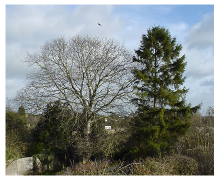
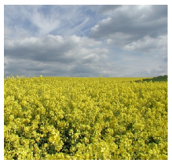
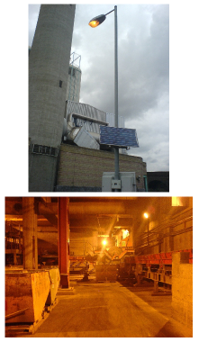

#Solar II

In section \@ref(solar) we listed four solar biomass options:

1.  "Coal substitution."
2.  "Petroleum substitution."
3.  Food for humans or other animals.
4.  Incineration of agricultural by-products.

We'll estimate the maximum plausible contribution of each of these processes in
turn. In practice, many of these methods require so much energy to be put *in*
along the way that they are scarcely net contributors (figure 
\@ref(fig:energy-inputs-to-biofuels)). But in what follows, I'll ignore such 
embodied-energy costs.

Energy crops as a coal substitute
---------------------------------

If we grow in Britain energy crops such as willow, miscanthus, or poplar (which
have an average power of 0.5 W per square metre of land), then shove them in a
40%-efficient power station, the resulting power per unit area is $0.2\space W/m^2$. If
one eighth of Britain ($500\space m^2\space per\space person$) were covered in these plantations,
the resulting power would be 2.5 kWh/d per person.

Petroleum substitution
----------------------

There are several ways to turn plants into liquid fuels. I'll express the
potential of each method in terms of its power per unit area (as in figure
\@ref(fig:power-production-plants)).

### Britain's main biodiesel crop, rape

Typically, rape is sown in September and harvested the following August. 
Currently 450 000 hectares of oil-seed rape are grown in the UK each year.
(That's 2% of the UK.) Fields of rape produce 1200 litres of bio-diesel per
hectare per year; bio-diesel has an energy of 9.8 kWh per litre; So that's a
power per unit area of 0.13 W/m^2^.

If we used 25% of Britain for oil-seed rape, we'd obtain bio-diesel with an
energy content of 3.1 kWh/d per person.

### Sugar beet to ethanol

Sugar beet, in the UK, delivers an impressive yield of 53 t per hectare per
year. And 1 t of sugar beet makes 108 litres of bio-ethanol. Bio-ethanol has an
energy density of 6 kWh per litre, so this process has a power per unit area of
0.4 W/m^2^, not accounting for energy inputs required.

Figure D.1. Two trees.

Figure D.2. Oil-seed rape. If used to create bio-diesel, the power per
unit area of rape is 0.13 W/m^2^. Photo by Tim Dunne.

### Bioethanol from sugar cane

Where sugar cane can be produced (e.g., Brazil) production is 80 tons per
hectare per year, which yields about 17 600 l of ethanol. Bio-ethanol has an
energy density of 6 kWh per litre, so this process has a power per unit area of
1.2 W/m^2^.

### Bioethanol from corn in the USA

The power per unit area of bio-ethanol from corn is astonishingly low. Just for
fun, let's report the numbers first in archaic units. 1 acre produces 122
bushels of corn per year, which makes 122 × 2.6 US gallons of ethanol, which at
84 000 BTU per gallon means a power per unit area of just 0.02 
W/m^2^[^**E**^](http://www.withouthotair.com/Errata.html#284) – and we haven't
taken into account any of the energy losses in processing!

### Cellulosic ethanol from switchgrass

Cellulosic ethanol – the wonderful "next generation" bio-fuel? Schmer et al.
(2008) found that the net energy yield of switchgrass grown over five years on
marginal cropland on 10 farms in the mid-continental US was 60 GJ per hectare
per year, which is 0.2 W/m^2^. "This is a baseline study that represents the
genetic material and agronomic technology available for switchgrass production
in 2000 and 2001, when the fields were planted. Improved genetics and agronomics
may further enhance energy sustain- ability and bio-fuel yield of switchgrass."

### Jatropha also has low power per unit area

Jatropha is an oil-bearing crop that grows best in dry tropical regions (300–
1000 mm rain per year). It likes temperatures 20–28 °C. The projected yield in
hot countries on good land is 1600 litres of bio-diesel per hectare per year.
That's a power per unit area of 0.18 W/m^2^. On wasteland, the yield is 583
litres per hectare per year. That's 0.065 W/m^2^.

If people decided to use 10% of Africa to generate 0.065 W/m^2^, and shared this
power between six billion people, what would we all get? 0.8 kWh/d/p. For
comparison, world oil consumption is 80 million barrels per day, which, shared
between six billion people, is 23 kWh/d/p. So even if *all* of Africa were
covered with jatropha plantations, the power produced would be only one third of
world oil consumption.

### What about algae?

Algae are just plants, so everything I've said so far applies to algae. Slimy
underwater plants are no more efficient at photosynthesis than their terrestrial
cousins. But there is one trick that I haven't discussed, which is standard
practice in the algae-to-biodiesel community: they grow their algae in water
heavily enriched with carbon dioxide, which might be collected from power
stations or other industrial facilities. It takes much less effort for plants to
photosynthesize if the carbon dioxide has already been concentrated for them. In
a sunny spot in America, in ponds fed with concentrated CO~2~ (concentrated to
10%), Ron Putt of Auburn University says that algae can grow at 30 g per square
metre per day, producing 0.01 litres of bio-diesel per square metre per day.
This corresponds to a power per unit pond area of 4 W/m^2^ – similar to the 
Bavaria photo-voltaic farm. If you wanted to drive a typical car (doing 12 km
per litre) a distance of 50 km per day, then you'd need 420 square metres of
algae-ponds just to power your car; for comparison, the area of the UK per
person is 4000 square metres, of which 69 m^2^ is water (images/figure 6.8).
Please don't forget that it's essential to feed these ponds with concentrated
carbon dioxide. So this technology would be limited both by land area – how much
of the UK we could turn into algal ponds – and by the availability of
concentrated CO~2~, the capture of which would have an energy cost (a topic
discussed in Chapters 23 and 31). Let's check the limit imposed by the
concentrated CO~2~. To grow 30 g of algae per m^2^ per day would require at
least 60 g of CO~2~ per m^2^ per day (because the CO~2~ molecule has more mass
per carbon atom than the molecules in algae). If all the CO~2~ from all UK power
stations were captured (roughly 2^1^⁄~2~ tons per year per person), it could
service 230 square metres per 
person[^**E**^](http://www.withouthotair.com/Errata.html#285) of the algal ponds
described above – roughly 6% of the 
country[^**E**^](http://www.withouthotair.com/Errata.html#285). This area would
deliver bio-diesel with a power of 24 kWh per day per person, assuming that the
numbers for sunny America apply here. A plausible vision? Perhaps on one tenth
of that scale? I'll leave it to you to decide.

energy density (kWh/kg)

softwood

 

   – air dried

4.4

   – oven dried

5.5

hardwood

 

   – air dried

3.75

   – oven dried

5.0

white office paper

4.0

glossy paper

4.1

newspaper

4.9

cardboard

4.5

coal

8

straw

4.2

poultry litter

2.4

general indust'l waste

4.4

hospital waste

3.9

municipal solid waste

2.6

refuse-derived waste

5.1

tyres

8.9

Table D.3. Calorific value of wood and similar things. Sources: Yaros
(1997); Ucuncu (1993), Digest of UK Energy Statistics 2005.

### What about algae in the sea?

Remember what I just said: the algae-to-biodiesel posse always feed
their algae concentrated CO~2~. If you're going out to sea, presumably
pumping CO~2~ into it won't be an option. And without the concentrated
CO~2~, the productivity of algae drops 100-fold. For algae in the sea to
make a difference, a country-sized harvesting area in the sea would be
required.

### What about algae that produce hydrogen?

Trying to get slime to produce hydrogen in sunlight is a smart idea because it
cuts out a load of chemical steps normally performed by carbohydrate- producing
plants. Every chemical step reduces efficiency a little. Hydrogen can be
produced directly by the photosynthetic system, right at step one. A research
study from the National Renewable Energy Laboratory in Colorado predicted that a
reactor filled with genetically-modified green algae, covering an area of 11
hectares in the Arizona desert, could produce 300 kg of hydrogen per
day^[Source: Amos (2004).]. Hydrogen contains 39 kWh per kg, so this
algae-to-hydrogen facility would deliver a power per unit area of 4.4 W/m^2^.
Taking into account the estimated electricity required to run the facility, the
net power delivered would be reduced to 3.6 W/m^2^. That strikes me as still
quite a promising number – compare it with the Bavarian solar photo-voltaic
farm, for example (5 W/m^2^).

Food for humans or other animals
--------------------------------

Grain crops such as wheat, oats, barley, and corn have an energy density
of about 4 kWh per kg. In the UK, wheat yields of 7.7 tons per hectare
per year are typical. If the wheat is eaten by an animal, the power per
unit area of this process is 0.34 W/m^2^. If 2800
m^2^[^**E**^](http://www.withouthotair.com/Errata.html#286) of Britain
(that's all agricultural land) were devoted to the growth of crops like
these, the chemical energy generated would be about 24 kWh/d per person.

Incineration of agricultural by-products
----------------------------------------

We found a moment ago that the power per unit area of a biomass power
station burning the best energy crops is 0.2 W/m^2^. If instead we grow
crops for food, and put the left-overs that we don't eat into a power
station – or if we feed the food to chickens and put the left-overs that
come out of the chickens' back ends into a power station – what power
could be delivered per unit area of farmland? Let's make a rough guess,
then take a look at some real data. For a wild guess, let's imagine that
by-products are harvested from half of the area of Britain (2000 m^2^
per person) and trucked to power stations, and that general agricultural
by-products deliver 10% as much power per unit area as the best energy
crops: 0.02 W/m^2^. Multiplying this by 2000 m^2^ we get 1 kWh per day
per person.

Have I been unfair to agricultural garbage in making this wild guess? We can
re-estimate the plausible production from agricultural left-overs by scaling up
the prototype straw-burning power station at Elean^[Source: Government White
Paper (2003). Elean Power Station (36 MW) – the UK's first straw-fired power
plant. *Straw production:* www.biomassenergycentre.org.uk. ] in East Anglia.
Elean's power output is 36 MW, and it uses 200 000 tons per year from land
located within a 50-mile radius. If we assume this density can be replicated
across the whole country, the Elean model offers 0.002 W/m^2^. At 4000 m^2^ per
person, that's 8 W per person, or 0.2 kWh/day per person.

Let's calculate this another way. UK straw production is 10 million tons
per year, or 0.46 kg per day per person. At 4.2 kWh per kg, this straw
has a chemical energy of 2 kWh per day per person. If all the straw were
burned in 30%-efficient power stations – a proposal that wouldn't go
down well with farm animals, who have other uses for straw – the
electricity generated would be 0.6 kWh/d per person.

### Landfill methane gas

At present, much of the methane gas leaking out of rubbish tips comes from
biological materials, especially waste food. So, as long as we keep throwing
away things like food and newspapers, landfill gas^[ Sources: Matthew Chester,
City University, London, personal communication; Meadows (1996), Aitchison
(1996); Alan Rosevear, UK Rep- resentative on Methane to Markets Landfill Gas
Sub-Committee, May 2005 [4hamks].] is a sustainable energy source – plus,
burning that methane might be a good idea from a climate-change perspective,
since methane is a stronger greenhouse-gas than CO~2~. A landfill site receiving
7.5 million tons of household waste per year can generate 50 000 m^3^ per hour
of methane.

In 1994, landfill methane emissions were estimated to be 0.05 m^3^ per
person per day, which has a chemical energy of 0.5 kWh/d per person, and
would generate 0.2 kWh(e)/d per person, if it were all converted to
electricity with 40% efficiency. Landfill gas emissions are declining
because of changes in legislation, and are now roughly 50% lower.

### Burning household waste

SELCHP ("South East London Combined Heat and Power") [www.selchp. com]
is a 35 MW power station that is paid to burn 420 kt per year of black-
bag waste from the London area. They burn the waste as a whole, without
sorting. After burning, ferrous metals are removed for recycling,
hazardous wastes are filtered out and sent to a special landfill site,
and the remaining ash is sent for reprocessing into recycled material
for road building or construction use. The calorific value of the waste
is 2.5 kWh/kg, and the thermal efficiency of the power station is about
21%, so each 1 kg of waste gets turned into 0.5 kWh of electricity. The
carbon emissions are about 1000 g CO~2~ per kWh. Of the 35 MW generated,
about 4 MW is used by the plant itself to run its machinery and
filtering processes.

Scaling this idea up, if every borough had one of these, and if everyone
sent 1 kg per day of waste, then we'd get 0.5 kWh(e) per day per person
from waste incineration.

This is similar to the figure estimated above for methane capture at
landfill sites. And remember, we can't have both. More waste
incineration means less methane gas leaking out of landfill sites. See
figure 27.2, p206, and figure 27.3, p207, for further data on waste
incineration.

Notes and further reading
-------------------------

page no.

283*The power per unit area of using willow, miscanthus, or poplar, for
electricity is 0.2 W/m^2^*. Source: Select Committee on Science and
Technology Minutes of Evidence – Memorandum from the Biotechnology &
Biological Sciences Research Council
[www.publications.parliament.uk/pa/ld200304/
ldselect/ldsctech/126/4032413.htm]. "Typically a sustainable crop of 10
dry t/ha/y of woody biomass can be produced in Northern Europe... . Thus
an area of 1 km^2^ will produce 1000 dry t/y – enough for a power output
150 kWe at low conversion efficiencies or 300 kWe at high conversion
efficiencies." This means 0.15–0.3 W(e)/m^2^. See also Layzell et al.
(2006), [3ap7lc].

Figure D.4. SELCHP – your trash is their business.

283*Oilseed rape.* Sources: Bayer Crop Science (2003), Evans (2007),
www.defra. gov.uk.

–*Sugar beet.* Source: statistics.defra.gov.uk/esg/default.asp

284*Bioethanol from corn.* Source: Shapouri et al. (1995).

–*Bioethanol from cellulose.* See also Mabee et al. (2006).

–*Jatropha.* Sources: Francis et al. (2005), Asselbergs et al. (2006).

285*In America, in ponds fed with concentrated CO~2~, algae can grow at
30 grams per square metre per day, producing 0.01 litres of bio-diesel
per square metre per day.* Source: Putt (2007). This calculation has
ignored the energy cost of running the algae ponds and processing the
algae into bio-diesel. Putt describes the energy balance of a proposed
design for a 100-acre algae farm, powered by methane from an animal
litter digester. The farm described would in fact produce less power
than the methane power input. The 100- acre farm would use 2600 kW of
methane, which corresponds to an input power density of 6.4 W/m^2^. To
recap, the power density of the output, in the form of biodiesel, would
be just 4.2 W/m^2^. All proposals to make biofuels should be approached
with a critical eye!