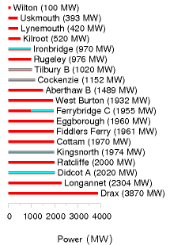
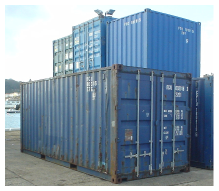
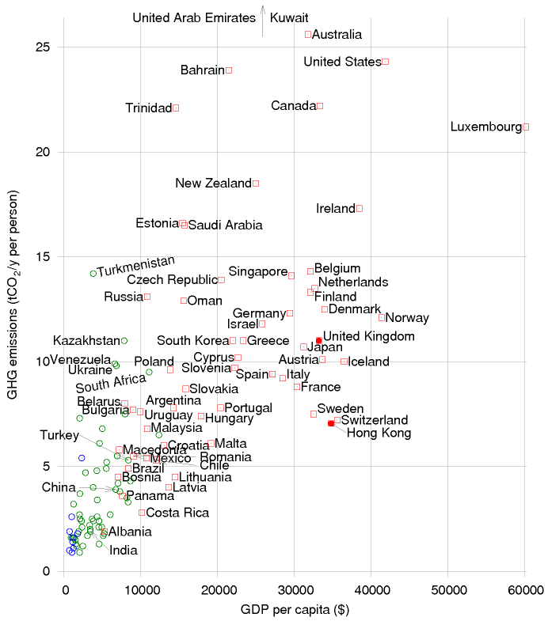
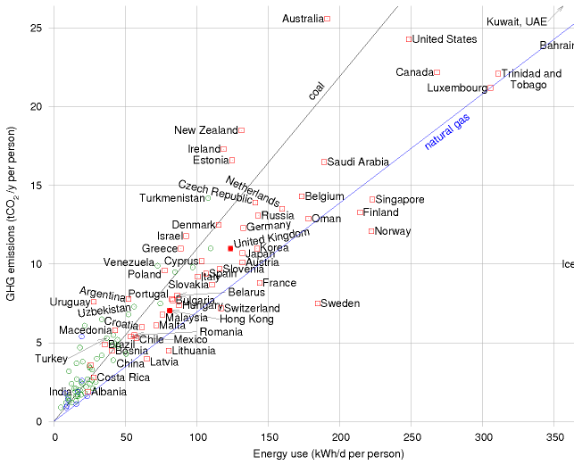

#Quick reference

## SI Units {#reference-si-units}

**The watt**. This SI unit is named after James Watt. As for all SI
units whose names are derived from the proper name of a person, the
first letter of its symbol is uppercase (W). But when an SI unit is
spelled out, it should always be written in lowercase (watt), with the
exception of the "degree Celsius."

from wikipedia

SI stands for Système Internationale. SI units are the ones that all
engineers should use, to avoid losing spacecraft.

SI units

energy

onejoule

1 J

power

one watt

1 W

force

one newton

1 N

length

one metre

1 m

time

one second

1 s

temperature

one kelvin

1 K

prefix

kilo

mega

giga

tera

peta

exa

symbol

k

M

G

T

P

E

factor

10^3^

10^6^

10^9^

10^12^

10^15^

10^18^

 

prefix

centi

milli

micro

nano

pico

femto

symbol

c

m

*μ*

n

p

f

factor

10^-2^

10^-3^

10^-6^

10^-9^

10^-12^

10^-15^

## My preferred units for energy, power, and transport efficiencies {#reference-preferred-units}

My preferred units, expressed in SI

 

energy

one kilowatt-hour

1 kWh

3 600 000 J

power

one kilowatt-hour per day

1 kWh/d

(1000/24) W  ≅  40 W

force

one kilowatt-hour per 100 km

1 kWh/100 km

36 N

time

one hour

1 h

3600 s

 

one day

1 d

24 × 3600 s  ≅  10^5^ s

 

one year

1 y

365.25 × 24 × 3600 s  ≅  *π* × 10^7^ s

force per mass

kilowatt-hour per ton-kilometre

1 kWh/t-km

3.6 m/s^2^ (≅  0.37 *g*)

Table 1.1. SI units and prefixes

  Thing measured   unit name                 symbol         value
  ---------------- ------------------------- -------------- -------------------------------
  humans           person                    p              
  mass             ton                       t              1 t = 1000 kg
                   gigaton                   Gt             1 Gt = 10^9^ × 1000 kg = 1 Pg
  transport        person-kilometre          p-km           
  transport        ton-kilometre             t-km           
  volume           litre                     l              1 l = 0.001 m^3^
  area             square kilometre          sq km, km^2^   1 sq km = 10^6^ m^2^
                   hectare                   ha             1 ha = 10^4^ m^2^
                   Wales                                    1 Wales = 21 000 km^2^
                   London (Greater London)                  1 London = 1580 km^2^
  energy           Dinorwig                                 1 Dinorwig = 9 GWh

##Billions, millions, and other people's prefixes {#reference-prefixes}

Throughout this book "a billion" (1 bn) means a standard American
billion, that is, 10^9^, or a thousand million. A trillion is 10^12^.
The standard prefix meaning "billion" (10^9^) is "giga."

In continental Europe, the abbreviations Mio and Mrd denote a million
and billion respectively. Mrd is short for milliard, which means 10^9^.

The abbreviation m is often used to mean million, but this abbreviation
is incompatible with the SI – think of mg (milligram) for example. So I
don't use m to mean million. Where some people use m, I replace it by M.
For example, I use Mtoe for million tons of oil equivalent, and MtCO~2~
for million tons of CO~2~.

##Annoying units {#reference-annoying-units}

There's a whole bunch of commonly used units that are annoying for
various reasons. I've figured out what some of them mean. I list them
here, to help you translate the media stories you read.

### Homes {#reference-homes}

The "home"" is commonly used when describing the power of renewable facilities.
For example, "The £300 million Whitelee wind farm's 140 turbines will generate
322 MW – enough to power 200 000 homes." The "home" is defined by the
BritishWind Energy Association to be a power of 4700 kWh per year
[www.bwea.com/ukwed/operational.asp]. That's 0.54 kW, or 13 kWh per day. (A few
other organizations use 4000 kWh/y per household.)

The "home" annoys me because I worry that people confuse it with *the total
power consumption of the occupants of a home* – but the latter is actually about
24 times bigger. The "home" covers the average domestic *electricity*
consumption of a household, only. Not the household’s home heating. Nor their
workplace. Nor their transport. Nor all the energy-consuming things that society
does for them.

Incidentally, when they talk of the CO~2~ emissions of a "home," the official
exchange rate appears to be 4 tons CO~2~ per home per year.

### Power stations {#reference-power-stations}

Energy saving ideas are sometimes described in terms of power stations.
For example according to a BBC report on putting new everlasting LED
lightbulbs in traffic lights, "The power savings would be huge – keeping
the UK's traffic lights running requires the equivalent of two medium-
sized power stations." news.bbc.co.uk/1/low/sci/tech/specials/
sheffield\_99/449368.stm

What is a medium-sized power station? 10 MW? 50 MW? 100 MW? 500 MW? I
don't have a clue. A google search indicates that some people think it's
30 MW, some 250 MW, some 500 MW (the most common choice), and some 800
MW. What a useless unit!

Surely it would be clearer for the article about traffic lights to
express what it's saying as a percentage? "Keeping the UK's traffic
lights running requires 11 MW of electricity, which is 0.03% of the UK's
electricity." This would reveal how "huge" the power savings are.

Figure I.2 shows the powers of the UK's 19 coal power stations.

### Cars taken off the road {#reference-cars-off-road}

Some advertisements describe reductions in CO~2~ pollution in terms of
the "equivalent number of cars taken off the road." For example, Richard
Branson says that if Virgin Trains' Voyager fleet switched to 20%
biodiesel – incidentally, don't you feel it's outrageous to call a train
a "green biodiesel- powered train" when it runs on 80% fossil fuels and
just 20% biodiesel? – sorry, I got distracted. Richard Branson says that
*if* Virgin Trains' Voyager fleet switched to 20% biodiesel – I
emphasize the "if" because people like Beardie are always getting media
publicity for announcing that they are *thinking* of doing good things,
but some of these fanfared initiatives are later quietly cancelled, such
as the idea of towing aircraft around airports to make them greener –
sorry, I got distracted again. Richard Branson says that *if* Virgin
Trains' Voyager fleet switched to 20% biodiesel, then there would be a
reduction of 34 500 tons of CO~2~ per year, which is equivalent to "23
000 cars taken off the road." This statement reveals the exchange rate:

"one car taken off the road" ↔ - 1.5 tons per year of CO~2~.

### Calories {#reference-calories}

The calorie is annoying because the diet community call a kilocalorie a
Calorie. 1 such food Calorie = 1000 calories.

2500 kcal = 3 kWh = 10 000 kJ = 10 MJ.

Figure I.2. Powers of Britain's coal power stations. I've highlighted in
blue 8 GW of generating capacity that will close by 2015. 2500 MW,
shared across Britain, is the same as 1 kWh per day per person.

### Barrels {#reference-barrels}

An annoying unit loved by the oil community, along with the ton of oil.
Why can't they stick to one unit? A barrel of oil is 6.1 GJ or 1700 kWh.

Barrels are doubly annoying because there are multiple definitions of
barrels, all having different volumes.

Here's everything you need to know about barrels of oil. One barrel is
42 U.S. gallons, or 159 litres. One barrel of oil is 0.1364 tons of oil.
One barrel of crude oil has an energy of 5.75 GJ. One barrel of oil
weighs 136 kg. One ton of crude oil is 7.33 barrels and 42.1 GJ. The
carbon-pollution rate of crude oil is 400 kg of CO~2~ per barrel.
www.chemlink.com.au/conversions.htm. This means that when the price of
oil is \$100 per barrel, oil energy costs 6¢ per kWh. If there were a
carbon tax of \$250 per ton of CO~2~ on fossil fuels, that tax would
increase the price of a barrel of oil by \$100.

### Gallons {#reference-gallons}

The gallon would be a fine human-friendly unit, except the Yanks messed
it up by defining the gallon differently from everyone else, as they did
the pint and the quart. The US volumes are all roughly five-sixths of
the correct volumes.

1 US gal = 3.785 l = 0.83 imperial gal. 1 imperial gal = 4.545 l.

### Tons {#reference-tons}

Tons are annoying because there are short tons, long tons and metric
tons. They are close enough that I don't bother distinguishing between
them. 1 short ton (2000 lb) = 907 kg; 1 long ton (2240 lb) = 1016 kg; 1
metric ton (or tonne) = 1000 kg.

### BTU and quads {#reference-btu}

British thermal units are annoying because they are neither part of the
*Système Internationale*, nor are they of a useful size. Like the
useless joule, they are too small, so you have to roll out silly
prefixes like "quadrillion" (10^15^) to make practical use of them.

1 kJ is 0.947 BTU. 1 kWh is 3409 BTU.

A "quad" is 1 quadrillion BTU = 293 TWh.

##Funny units {#reference-funny-units}

#### Cups of tea

Is this a way to make solar panels sound good? "Once all the 7 000 pho-
tovoltaic panels are in place, it is expected that the solar panels will
create 180 000 units of renewable electricity each year – enough energy
to make nine million cups of tea." This announcement thus equates 1 kWh
to 50 cups of tea.

As a unit of volume, 1 US cup (half a US pint) is officially 0.24 l; but
a cup of tea or coffee is usually about 0.18 l. To raise 50 cups of
water, at 0.18 l per cup, from 15 °C to 100 °C requires 1 kWh.

So "nine million cups of tea per year" is another way of saying "20 kW."

#### Double-decker buses, Albert Halls and Wembley stadiums

"If everyone in the UK that could, installed cavity wall insulation, we
could cut carbon dioxide emissions by a huge 7 million tons. That's
enough carbon dioxide to fill nearly 40 million double-decker buses or
fill the new Wembley stadium 900 times!"

From which we learn the helpful fact that one Wembley is 44 000 double
decker buses. Actually, Wembley's bowl has a volume of 1 140 000 m^3^.

"If every household installed just one energy saving light bulb, there
would be enough carbon dioxide saved to fill the Royal Albert Hall 1,980
times!" (An Albert Hall is 100 000 m^3^.)

Expressing amounts of CO~2~ by volume rather than mass is a great way to
make them sound big. Should "1 kg of CO~2~ per day" sound too small,
just say "200 000 litres of CO~2~ per year"!

More volumes
------------

A container is 2.4 m wide by 2.6 m high by (6.1 or 12.2) metres long
(for the TEU and FEU respectively).

One TEU is the size of a small 20-foot container – an interior volume of
about 33 m^3^. Most containers you see today are 40-foot containers with
a size of 2 TEU. A 40-foot container weighs 4 tons and can carry 26 tons
of stuff; its volume is 67.5 m^3^.

A swimming pool has a volume of about 3000 m^3^.

One double decker bus has a volume of 100 m^3^.

One hot air balloon is 2500 m^3^.

The great pyramid at Giza has a volume of 2 500 000 cubic metres.

Areas
-----

The area of the earth's surface is 500 × 10^6^ km^2^; the land area is
150 × 10^6^ km^2^.

My typical British 3-bedroom house has a floor area of 88 m^2^. In the
USA, the average size of a single-family house is 2330 square feet (216
m^2^).

Powers
------

If we add the suffix "e" to a power, this means that we're explicitly
talking about electrical power. So, for example, a power station's
output might be 1 GW(e), while it uses chemical power at a rate of 2.5
GW. Similarly the

  mass of CO~2~   ↔   volume
  --------------- --- ------------
  2 kg CO~2~      ↔   1 m^3^
  1 kg CO~2~      ↔   500 litres
  44 g CO~2~      ↔   2 litres
  2 g CO~2~       ↔   1 litre

Table I.3. Volume-to-mass conversion.

Figure I.4. A twenty-foot container (1 TEU).

  ------------- --- ------------
  hectare       =   10^4^ m^2^
  acre          =   4050 m^2^
  square mile   =   2.6 km^2^
  square foot   =   0.093 m^2^
  square yard   =   0.84 m^2^
  ------------- --- ------------

Table I.5. Areas.

  Land use               area per person (m^2^)   percentage
  ---------------------- ------------------------ ------------
  – domestic buildings   30                       1.1
  – domestic gardens     114                      4.3
  – other buildings      18                       0.66
  – roads                60                       2.2
  – railways             3.6                      0.13
  – paths                2.9                      0.11
  – greenspace           2335                     87.5
  – water                69                       2.6
  – other land uses      37                       1.4
  Total                  2670                     100

  -------------------------------------- --- --------- --- ----------
  1000 BTU per hour                      =   0.3 kW    =   7 kWh/d
  1 horse power (1 hp or 1 cv or 1 ps)   =   0.75 kW   =   18 kWh/d
                                             1 kW      =   24 kWh/d
  -------------------------------------- --- --------- --- ----------

  ------------------------------- --- --------------------
  1 therm                         =   29.31 kWh
  1000 Btu                        =   0.2931 kWh
  1 MJ                            =   0.2778 kWh
  1 GJ                            =   277.8 kWh
  1 toe (ton of oil equivalent)   =   11 630 kWh
  1 kcal                          =   1.163 × 10^-3^ kWh
  ------------------------------- --- --------------------

  ------- --- --------- ------ ----- ------------- -------
  1 kWh   =   0.03412   3412   3.6   86 × 10^-6^   859.7
              therms    Btu    MJ    toe           kcal
  ------- --- --------- ------ ----- ------------- -------

suffix "th" may be added to indicate that a quantity of energy is
thermal energy. The same suffixes can be added to amounts of energy. "My
house uses 2 kWh(e) of electricity per day."

If we add a suffix "p" to a power, this indicates that it's a "peak"
power, or capacity. For example, 10 m^2^ of panels might have a power of
1 kWp.

1 kWh/d = 1/24 kW.

1 toe/y = 1.33 kW.

Petrol comes out of a petrol pump at about half a litre per second. So
that's 5 kWh per second, or 18 MW.

The power of a Formula One racing car is 560 kW.

UK electricity consumption is 17 kWh per day per person, or 42.5 GW per
UK.

"One ton" of air-conditioning = 3.5 kW.

Table I.6. Land areas, in England, devoted to different uses. Source:
Generalized Land Use Database Statistics for England 2005. [3b7zdf]

Box I.7. How other energy and power units relate to the kilowatt-hour
and the kilowatt-hour per day.

### World power consumption

World power consumption is 15 TW. World electricity consumption is 2 TW.

### Useful conversion factors

To change TWh per year to GW, divide by 9.

1 kWh/d per person is the same as 2.5 GW per UK, or 22 TWh/y per UK

To change mpg (miles per UK gallon) to km per litre, divide by 3.

At room temperature, 1 *kT* = ^1^⁄~40~eV

At room temperature, 1 *kT* per molecule = 2.5 kJ/mol.

### Meter reading

How to convert your gas-meter reading into kilowatt-hours:

-   If the meter reads **100s of cubic feet**, take the number of units
    used, and multiply by **32.32** to get the number of kWh.
-   If the meter reads **cubic metres**, take the number of units used,
    and multiply by **11.42** to get the number of kWh.

Calorific values of fuels
-------------------------

Crude oil: 37 MJ/l; 10.3 kWh/l. Natural gas: 38 MJ/m^3^. (Methane has a
density of 1.819 kg/m^3^.) 1 ton of coal: 29.3 GJ; 8000 kWh. Fusion
energy of ordinary water: 1800 kWh per litre. See also table 26.14,
p199, and table D.3, p284.

Heat capacities
---------------

The heat capacity of air is 1 kJ/kg/°C, or 29 J/mol/°C. The density of
air is 1.2 kg/m^3^. So the heat capacity of air per unit volume is 1.2
kJ/m^3^/°C.

Latent heat of vaporization of water: 2257.92 kJ/kg. Water vapour's heat
capacity: 1.87 kJ/kg/°C. Water's heat capacity is 4.2 kJ/l/°C.

Steam's density is 0.590 kg/m^3^.

Pressure
--------

Atmospheric pressure: 1 bar ≅ 10^5^ Pa (pascal). Pressure under 1000 m
of water: 100 bar. Pressure under 3000 m of water: 300 bar.

kWh/t-km

inland water

0.083

rail

0.083

truck

0.75

air

2.8

oil pipeline

0.056

gas pipeline

0.47

int'l water container

0.056

int'l water bulk

0.056

int'l water tanker

0.028

Table I.8. Energy intensity of transport modes in the USA. Source: Weber
and Matthews (2008).

Money
-----

I assumed the following exchange rates when discussing money: €1 =
\$1.26; £1 = \$1.85 ; \$1 = \$1.12 Canadian. These exchange rates were
correct in mid-2006.

Greenhouse gas conversion factors
---------------------------------

  ---------------- -----
  France           83
  Sweden           87
  Canada           220
  Austria          250
  Belgium          335
  European Union   353
  Finland          399
  Spain            408
  Japan            483
  Portugal         525
  United Kingdom   580
  Luxembourg       590
  Germany          601
  USA              613
  Netherlands      652
  Italy            667
  Ireland          784
  Greece           864
  Denmark          881
  ---------------- -----

Figure I.9. Carbon intensity of electricity production (g CO~2~ per kWh
of electricity).

  Fuel type        emissions (g CO~2~ per kWh of chemical energy)
  ---------------- ------------------------------------------------
  natural gas      190
  refinery gas     200
  ethane           200
  LPG              210
  jet kerosene     240
  petrol           240
  gas/diesel oil   250
  heavy fuel oil   260
  naptha           260
  coking coal      300
  coal             300
  petroleum coke   340

Figure I.10. Emissions associated with fuel combustion. Source: DEFRA's
Environmental Reporting Guidelines for Company Reporting on Greenhouse
Gas Emissions.

Figure I.11. Greenhouse-gas emissions per capita, versus GDP per capita,
in purchasing-power-parity US dollars. Squares show countries having
"high human development;" circles, "medium" or "low." See also figures
30.1 (p231) and 18.4 (p105). Source: UNDP Human Development Report,
2007. [3av4s9]

Figure I.12. Greenhouse-gas emissions per capita, versus power
consumption per capita. The lines show the emission-intensities of coal
and natural gas. Squares show countries having "high human development;"
circles, "medium" or "low." See also figures 30.1 (p231) and 18.4
(p105). Source: UNDP Human Development Report, 2007.
